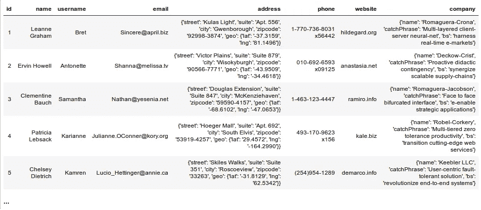
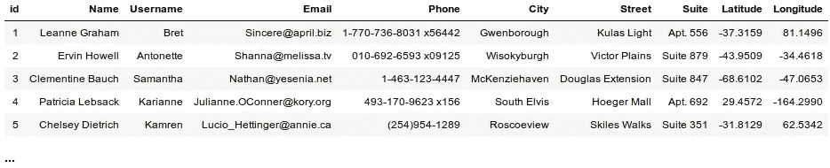
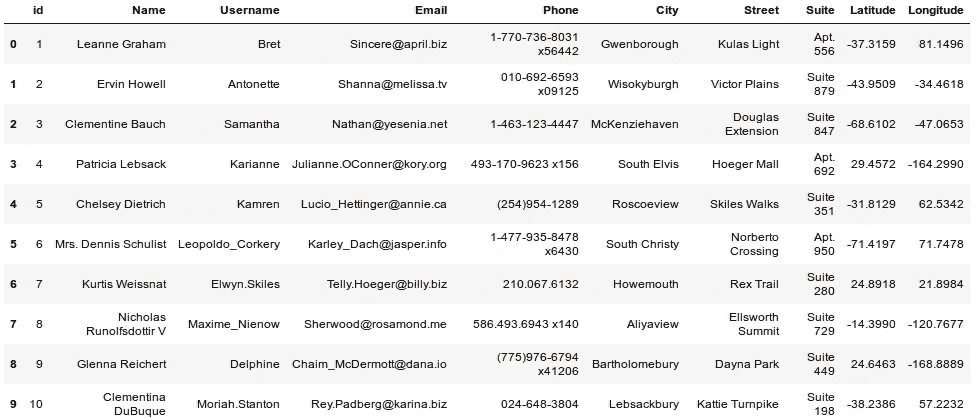
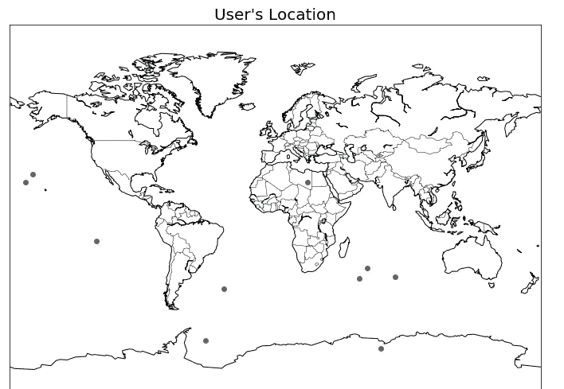

# 使用 Python 的 Petl 进行 ETL

> 原文：<https://medium.datadriveninvestor.com/etl-using-pythons-petl-ac024be391ab?source=collection_archive---------0----------------------->

ETL 代表提取、转换和加载。市场上有很多 ETL 工具，你可以在这里看到。ETL 工具主要用于将数据从一个数据库转移到另一个数据库，或者从一个数据仓库转移到另一个数据仓库，操纵数据使其保持一致等等..换句话说， [ETL](https://en.wikipedia.org/wiki/Extract,_transform,_load) 是将数据从一个或多个源复制到目标系统的一般过程，目标系统以不同于源的方式或在不同于源的上下文中表示数据。

在这篇博客中，我们将构建自己的简单 ETL 工具来消费一些随机的[免费 API 端点](https://jsonplaceholder.typicode.com/users)。python 中用于 ETL 数据管道的库是 [petl](https://petl.readthedocs.io/en/v0.10.1/) 。让我们开始吧…

 [## 成为数据科学家所需的 8 项技能|数据驱动型投资者

### 数字吓不倒你？没有什么比一张漂亮的 excel 表更令人满意的了？你会说几种语言…

www.datadriveninvestor.com](https://www.datadriveninvestor.com/2019/02/07/8-skills-you-need-to-become-a-data-scientist/) 

你可以从克隆/下载我的 github [repo](https://github.com/Ayeeta/etl-pipeline/tree/master) 开始。我们将导入我们不同的库，我们的主要焦点是 petl，pandas 和 plotly。你也可以删除 users.csv 文件，我们稍后会看到它是如何发生的…前提是你是从我的 github repo 下载或克隆的。

我们将从 API 端点加载数据

既然我们现在可以查看这些数据，让我们用**提取**。 [petl](https://petl.readthedocs.io/en/v0.10.1/) 提供了许多方法来提取数据，我们将使用 [**fromdicts()**](https://petl.readthedocs.io/en/v0.10.1/#petl.fromdicts) 来提取到 users_table 变量中

以上是我们的 users_table 变量包含的内容。注意 address 和 company 中嵌套的 dictionary 对象。让我们对地址感兴趣，我们的目标是看看我们的用户来自哪里，但以一种更有组织的方式。

所以我们**转型。** [Petl](https://petl.readthedocs.io/en/v0.10.1/) 提供了许多转换表格数据的方法，但是，我们将使用[**un pack dict()**](https://petl.readthedocs.io/en/v0.10.1/#petl.unpackdict)**—***顾名思义，该方法解包字典对象并将键设置为表中的列/字段名称*、[**cut()**](https://petl.readthedocs.io/en/v0.10.1/#petl.cut)**—***该方法让您选择/指定您感兴趣的列/字段*

结果:

我们现在有了一张好看的桌子。

最后，我们将加载。 [Petl](https://petl.readthedocs.io/en/v0.10.1/) 提供了许多加载数据的方法，但我们将使用[**tocsv()**](https://petl.readthedocs.io/en/v0.10.1/#petl.tocsv)**—***这种方法让我们可以将数据保存为 csv 格式*

因此，如果您检查运行 jupyter-notebook 的目录，您会注意到一个 users.csv 文件。

我们还可以对 csv 文件进行探索性分析。我们的目的是找出我们的用户在哪里

让我们使用每个用户的经度和纬度点在地图上绘图

由于这些数据来自随机的 API，这些位置点是意料之中的，否则看起来我们的大多数用户都是美人鱼:)

感谢您的关注，我非常欢迎您的反馈
*elijate@gmail.com*， [LinkedIn](https://www.linkedin.com/in/elijahayeeta/) ，Twitter- @ElijahAyeeta