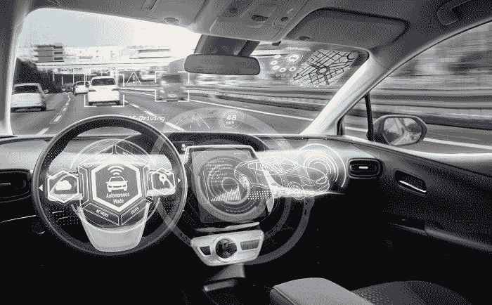

# 欧盟委员会决定 WiFi 车辆标准

> 原文：<https://medium.datadriveninvestor.com/eu-committee-decides-on-wifi-vehicle-standard-3186048a3674?source=collection_archive---------7----------------------->

你听到了吗？无线功能。那可能比自动驾驶汽车还要好！

好吧，也许*勉强*。尽管如此，这仍然令人兴奋。事实上，汽车行业已经涉足了相当多的 WiFi 功能，这使得司机更容易保持连接——以及他们的车辆保持连接——每天，每分钟。这是一个非凡的想法，但并非没有障碍和担忧。

 [## 在自动驾驶汽车发生事故的情况下，谁应该承担法律责任？-数据驱动型投资者

### 我仍然认为自动驾驶汽车是一种奢侈品，而不是必需品…

www.datadriveninvestor.com](https://www.datadriveninvestor.com/2018/11/02/who-is-legally-accountable-in-the-case-of-an-autonomous-vehicle-accident/) 

# 一些人想要更喜欢最新的 5G 技术转变是有原因的

你可能听说过最新的 5G 适配和集成正在进行中，[就像这里的](https://vigyaa.com/@pierre/3-updates-on-5g-mobile-technology-you-have-to-check-out-before-it-f9c30e1c/)。很难反驳。5G 移动技术将真正改变我们使用手机的方式，所以我们只能想象我们驾驶的汽车会发生什么。

这就引出了一个委员会提出的问题:*基于 WiFi 的技术*怎么样？鉴于[物联网](https://vigyaa.com/@pierre/beware-as-the-city-you-live-in-might-get-smarter-than-you-c7d8fe7b/)的出现，以及更新的[卫星连接](https://vigyaa.com/@pierre/amazon-will-be-revolutionizing-the-broadband-internet-market-soon-4e27ac14/)、[无人机测绘](https://vigyaa.com/@pierre/infrastructure-technology-takes-it-to-another-level-with-drone-ma-707de562/)等前景，这种可能性是存在的。现在有很多选择可以考虑，使得市场份额更容易管理。

我的意思是，当然，如果一些汽车制造商和其他公司想坚持 5G，那很好。竞争不会那么激烈。这意味着馅饼的另一部分可能会通过电信运营商和设备制造商进入这种新的基于 WiFi 的技术实施。只需与委员会一起设定每年可能价值数十亿欧元的基准。

# 担心的是安全和数据隐私

虽然我们已经对从自动驾驶到电动汽车的一切都有疑问，但最大的问题是[在线安全](https://vigyaa.com/@pierre/3-tales-of-cyber-terrorism-that-prove-technology-has-your-back-863507f4/)。*有 WiFi 功能的汽车在路上会安全吗？5G 肯定会感觉更“安全”，但这也不一定。*

有一点是肯定的:委员会通过 ITS-G5 选择这种基于 WiFi 的技术将使大众和雷诺这样的欧洲品牌相对于那些更喜欢戴姆勒、福特和 PSA 集团的 **5G 标准 C-V2X** 的品牌有些许竞争优势。不过，各有各的。

都是市场份额的问题。然而，这可能会根据客户反馈、这些车辆的评级和排名以及卓越水平而改变。毫无疑问，这种 WiFi 技术将会做出调整，修改以兼容稍微过时的系统。

# 预计欧洲议会将很快就该委员会的提议做出决定

一个月之内。他们将查看特定的条款，以确定先前的技术兼容性修改要求，然后以多数票赞成或反对。然而，欧洲*理事会*(不是议会)*对此也有发言权和“投票权”,然而这需要大多数欧盟国家的参与，这可能会破坏提案。*

*你有什么想法？你在挖掘一辆有 WiFi 功能的汽车的前景吗？还是只想要标准的 5G 移动？还是你在乎？ [**注册一个 VIGYAA 账户，现在就开始发表你的观点**](https://vigyaa.com/accounts/login/) 还有 [**查看数据驱动投资者了解更多技术见解**](http://datadriveninvestor.com) **！***