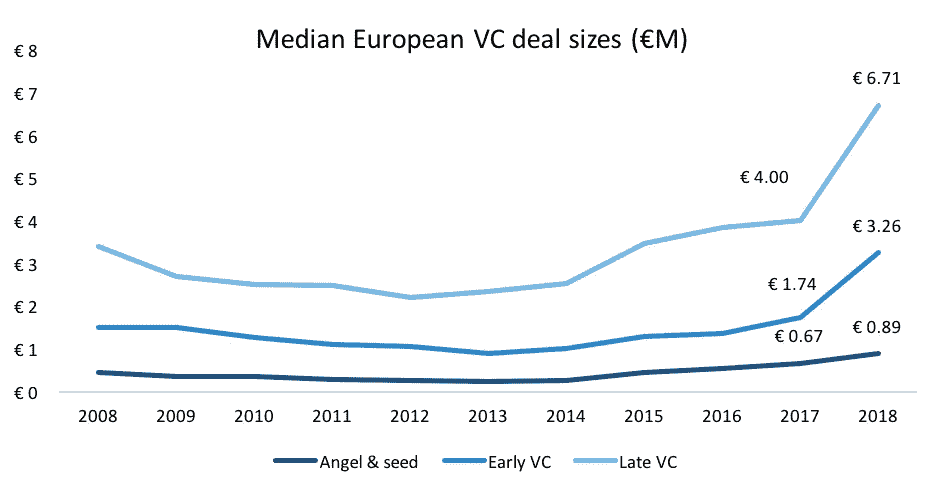
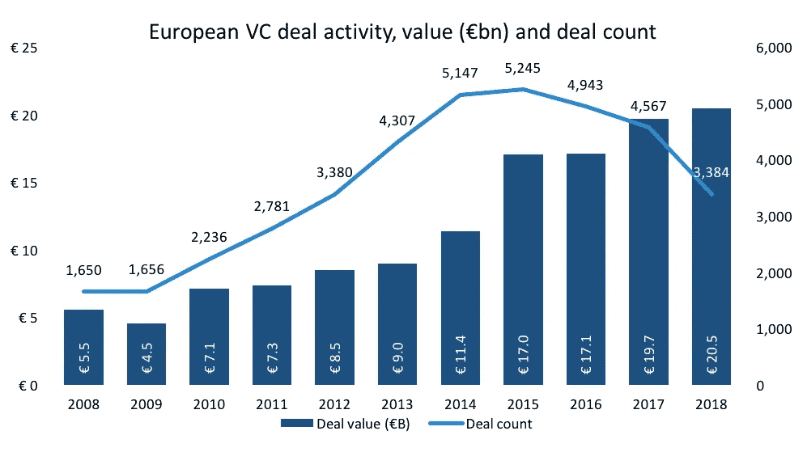
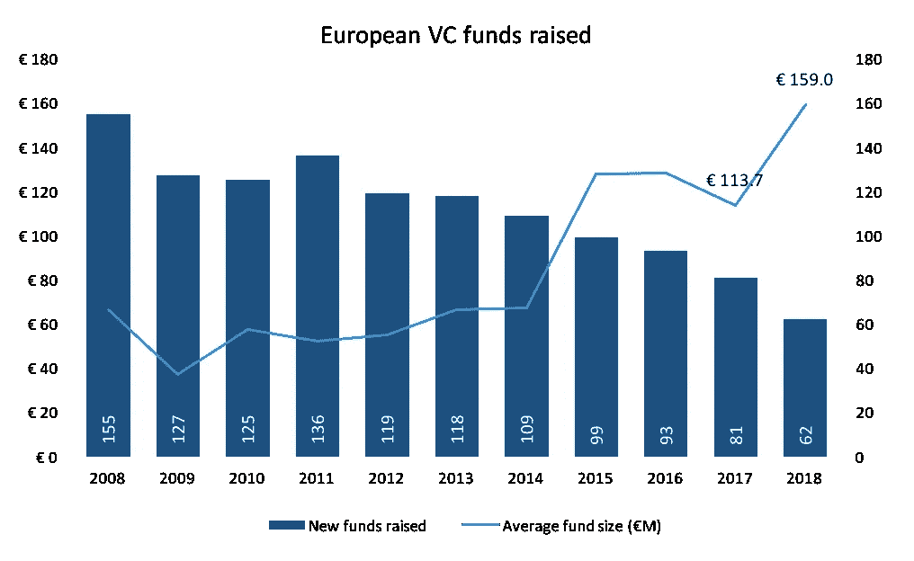

# 欧盟风险投资:我们是走向成熟还是两极分化？

> 原文：<https://medium.datadriveninvestor.com/eu-venture-funding-are-we-reaching-maturity-or-polarisation-5d15b6ad1c5f?source=collection_archive---------3----------------------->

欧洲的风险投资市场正在发生变化。在英国呆了几个月后，认识到这些变化变得容易多了。首先，我们看到欧洲二级市场的活动激增，分析师预计 2019 年的融资活动将增加 4 倍。然后，我们看到 [Checkout](https://www.ft.com/content/4066a79c-6cfe-11e9-80c7-60ee53e6681d) 以令人瞠目的 20 亿美元估值(根据 CrunchBase 的数据，是其预计收入的 26 倍)筹集了 2.3 亿美元的首轮融资。上周在 Startup Grind 的欧洲会议上，两位备受尊敬的风险投资家 Jan Hammer (Index Ventures)和 Simon Cook (Draper Esprit)上台发言，就好像他们刚刚从老式的投资方法中吸取了经验一样:如果你有一个想法，而投资者认为他们可以在可接受的风险下获得可观的回报，他们就会支持你。

2016 年，Draper Esprit 通过[在 AIM 和 ESM](https://techcrunch.com/2016/06/14/why-would-a-vc-firm-ipo-simon-cook-of-draper-esprit-explains/) 上市，摆脱了传统的有限合伙人投资模式。西蒙解释说，如果你看看我们这个时代的伟大投资者，如沃伦·巴菲特或乔治·索罗斯，他们在任何阶段都支持公司，如果他们认为风险和回报的平衡是有利的，没有理由为什么风险资本投资者应该有所不同。他继续解释说，Draper Esprit 转向资产负债表投资，为他们提供了一个常青的资本来源，这意味着他们现在可以灵活地继续支持下一个有远见的企业家，同时也能够购买 Transferwise 等成熟业务的下一阶段。

这种方法的演变，从传统的风险投资模式中脱离出来，意味着欧洲的风险投资不再像过去那样受到限制。这对企业家来说是个好消息！当我还是一名投资者时，我记得曾与风投们讨论过他们如何定义融资窗口，他们通常在这两个窗口之间达成交易。相比之下，Index 最近向医疗保健初创公司 Adam 投资了 4000 万美元，10 个月前又投资了 2300 万美元。这在几年前是闻所未闻的。但正如 Jan 解释的那样，如果愿景足够远大，就像 Adam 的情况一样，Index 会努力支持你，这意味着他们会摆脱构成 A/B/C 融资轮字母汤的旧约束。

这一观点得到了 Atomico 的 Ben Blume 和 Irina Haivas 的呼应，他们对深度技术(他们将其描述为以科学或工程创新为核心的业务)的关注，在这种情况下，企业需要内在的 R&D 要求和更大的前期投资才能将产品推向市场，这需要一种不同于我们习惯的字母融资窗口的方法。

这对企业家来说是令人耳目一新的。但是数据支持这种更成熟的思维方式吗？

根据 CrunchBase 的数据，自 2017 年以来，英国 A 轮融资的规模增长了 18.1%，2019 年在 Q1 完成的 47 笔交易的平均支票金额为 637 万英镑。这一情况在整个欧洲都得到了复制，PitchBook 的 2018 年欧洲风险投资报告显示，在市场的每个阶段，融资规模都在快速增长，如下图所示。

Source: PitchBook, European Venture Report 2018

欧洲风险投资领域的这种新兴成熟也吸引了海外的兴趣，毫无疑问，Intercom、UI Path 和 Hut Group 等独角兽公司的出现为这种兴趣提供了支持。我们现在已经看到，硅谷风投公司向欧洲初创企业投入的资金比历史上任何时候都多。根据 PitchBook 的数据，2018 年，美国风投参与了 20.9%的欧洲交易，几乎是几年前的两倍。

在多年哀叹欧洲企业家资金短缺之后，情况开始慢慢发生变化。讽刺的是，这也让风投的日子更难过了！对交易的更大竞争和对创始人的更好教育，正让企业家手中拥有更多的权力，坊间证据表明，以前被大多数风投视为事实的交易条款有所放松。随着我们开始看到经验丰富的初创企业经营者重新进入就业市场，准备推动下一代公司的发展，生态系统的质量只会越来越好。

然而，尽管流入欧洲创业公司的资金总额继续同比增长，在 2018 年首次突破 200 亿欧元大关，但完成的交易数量却大幅下降，自 2015 年以来的 3 年间下降了 35%，如下图所示。

Source: PitchBook, European Venture Report 2018

筹资活动也反映了这一情况，新筹集的风险投资基金数量逐年增加，而且越来越集中，而它们可支配的资本总额也从未如此之高。如果欧洲的退出市场继续保持低迷，2018 年下降 30.5%，就有强有力的理由表明这一趋势将继续下去。

Source: PitchBook, European Venture Report 2018

这对刚刚起步的创业者来说，呈现出一幅越来越两极化的画面:一方面，你有资金采取更灵活的方式进行投资，拥有更多可支配的资本，但另一方面，在欧洲可供选择的资金却更少了。看起来，如果你的眼光足够远大，你可以说服风投，你有办法成为一个类别的领导者，那么他们推动你成长的能力的枷锁现在已经解除了。索引处的简在等你的电话！他们还准备给你更多的资本，帮助你在早期阶段摆脱风险。

但对其他所有人来说，如果目前的趋势持续下去，获得风险投资可能会变得更具挑战性。根据 PitchBook 的数据，过去 5 年欧洲风险投资的平均退出额仅为 5000 万欧元(如果你对 2018 年进行贴现，则为 3500 万欧元)，因此，一家雄心勃勃要在这一范围内实现退出的企业不会令人兴奋，这似乎有悖直觉。但风险投资的失败率如此之高，以至于投资者不得不追求更高的目标，并一直在寻找能够返还资金的公司。Frog Capital 的合伙人 Shirin Dehghan 写了一篇很棒的[文章，进一步探讨了这个问题。](https://www.linkedin.com/pulse/unicorn-new-name-dotcom-shirin-dehghan/)

那么有哪些选择呢？

对于英国的创始人来说，值得考虑一下风险投资信托(VCT)市场，以寻求潜在的解脱，特别是如果你能证明你的核心业务有客户和收入，而且运转良好的话。大约有 10-15 家风投公司通常投资 200 万至 1000 万英镑，通常在早期阶段只寻求 5 倍的回报；与其风投兄弟的两位数回报率相去甚远。近几年来，由于能接触到常青资本，自愿信托基金非常活跃。但是，随着回报预期的降低，通过简单的经济学，风险偏好也随之降低，即他们的投资组合中有更大比例的投资需要成功，因此你必须努力改变你的故事，或者接受改变投资的交易条款。

不管你倾向于哪种融资方式，现在比以往任何时候都更重要的是关注每个投资者都会寻找的基本面:

1.  **吸引最优秀的人才**——现在有一代人才已经经历了创建风险企业所需的一切，这些经营者可以在引导你应对未来挑战方面发挥重要作用。
2.  **关注你的衡量标准**——知道你的证据是什么，以及最终实现你的愿景的连续验证阶段。你的指标从不说谎，投资者本质上是高度分析性的。
3.  **了解你的单位经济**——当情况变得艰难时，重要的是你能规划出一条盈亏平衡的道路。你的单位经济学在决定你的企业是否能在没有额外资本的情况下生存的过程中起着至关重要的作用。理解这一点可以在建立增长平台的同时保护低迷时期的业务。

***关于我的一点点:*** *我是一名创业投资人，后来变成了经营者，喜欢帮助创始人实现他们的愿景。这些年来，我收集了大量可能与其他企业经营者相关的知识，所以我希望你喜欢我的文章。如果你想聊聊你的生意，请随意。*