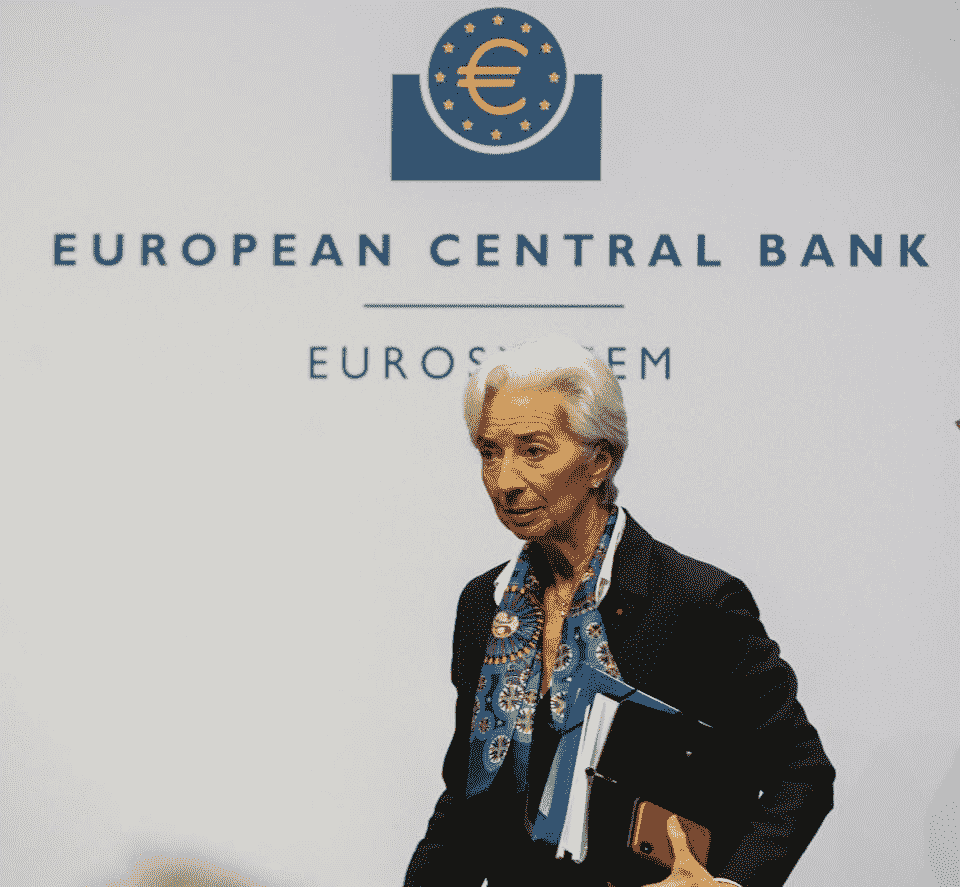

# 欧洲央行宣布新的 DLT 概念验证，名为 EUROchain

> 原文：<https://medium.datadriveninvestor.com/european-central-bank-announces-new-dlt-proof-of-concept-called-eurochain-bb5125a7d1f9?source=collection_archive---------19----------------------->

12 December 2019, Hessen, Frankfurt/Main: The new President of the European Central Bank (ECB), Christine Lagarde, will leave the panel after her first press conference after the Governing Council meeting. (Source: Getty Images)

12 月 17 日，欧洲央行公布了一项名为 EUROchain 的新概念验证项目。发布在欧洲央行网站上的报告称，“概念证明拥有几个由 ESCB 欧洲链研究网络(在埃森哲和 R3 的支持下)使用分布式账本技术(DLT)开发的新颖功能。”该项目基于 R3 的 Corda 平台，研究如何平衡隐私与反洗钱规则等合规程序，同时 DLT 有助于降低交易成本。

 [## 总部位于瑞士的 ETP 进入加密交易市场|数据驱动的投资者

### 虽然金融市场几乎没有沉闷的时刻，特别是在引入…

www.datadriveninvestor.com](https://www.datadriveninvestor.com/2019/03/10/swiss-based-etp-enters-the-crypto-trading-market/) 

EUROchain 用例基于一种设计，如报告所述，它依赖于能够访问央行账户的中介，并可以利用央行持有的储备余额向用户提供央行数字货币。中介将代表他们的客户处理交易。这是中央银行如何在更大范围内整合 DLT 的一个例子。虽然，报告提到，这是一个典型的概念证明的简化案例。报告结论中的部分经验教训指出，“例如，没有分析原型的可伸缩性。”

这项研究不同于其他稳定硬币的使用案例，如脸书的天秤座或公用事业结算硬币。EUROchain 似乎并不研究个人消费者的使用案例，而是更关注企业区块链创新的银行整合。

今年还宣布了其他央行的类似项目，如 FedNow service 和 Payments Canada，专注于更快的支付服务，但不一定使用 DLT 的设计。在这种情况下，FedNow 可能有利于个人和企业。提到的项目处于不同的发展阶段，但表明各国央行需要付出更多努力来完善全球支付服务。

我报告了银行和企业公开采用加密货币、抵押代币和稳定硬币的情况。我的报道包括区块链和分布式分类帐

*最初发表于*[*【https://www.forbes.com】*](https://www.forbes.com/sites/robertanzalone/2019/12/25/european-central-bank-announces-new-dlt-proof-of-concept-called-eurochain/)*。*