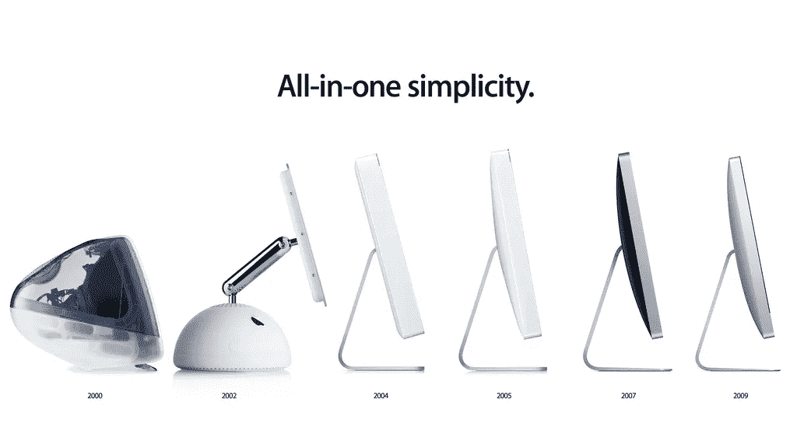
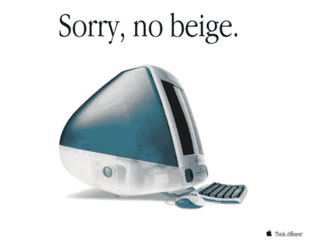
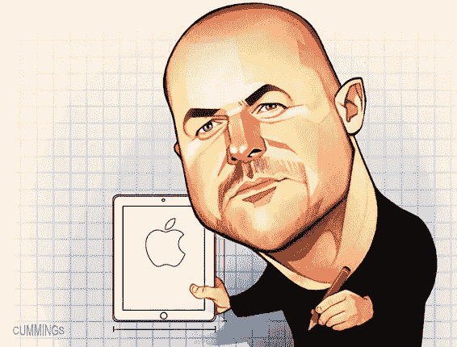
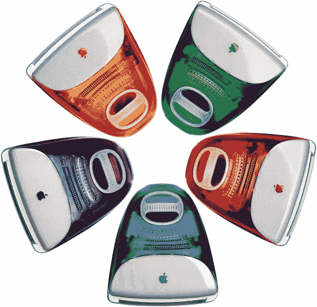

# 欧洲企业家，第二集:设计师撤退

> 原文：<https://medium.datadriveninvestor.com/europreneurs-episode-2-the-designer-draws-back-55b76cc92259?source=collection_archive---------4----------------------->

早在休·劳里成为人人都指望能解决无法解决的问题的人之前，他就已经出现了。早在里奇·格威斯在美国声名狼藉之前……**他就在那里了**。演员或漫画也不能像这位老兄那样给我们带来新鲜和创新的东西。

我们将谈论一个在美国成名却无人知晓的英国人。是啊，有可能。来认识一下**乔纳森·伊夫**，苹果公司轰动科技的幕后智囊。

有人说，他过去常常穿着怪异的服装向公司推销想法。有一次他甚至戴了一个红鼻子。他遭到了嘲笑，被告知他的提议绝大多数都“过于昂贵”。

**几年后，他是苹果公司现任首席设计师(CDO)，也是“另一个天才”的策划者**。乔布斯是他的粉丝。你可能知道，乔布斯并不是所有人的情人

我们可以把乔纳森·伊夫总结为美学和功能性的先驱之一，在这个行业里，只有尺寸和内存才是最重要的。

 [## 在创业之旅中，拥抱学习|数据驱动的投资者

### 好像建立一个数百万美元的公司还不够困难，企业家必须额外照顾他们的…

www.datadriveninvestor.com](https://www.datadriveninvestor.com/2018/10/16/on-the-entrepreneurial-trek-embrace-the-learning/) 

我们感谢他 iMac G3 漂亮而性感的外观，从那以后，这位英国人用更性感的技术产品最大限度地“美化”了他的产品组合，这些产品现在对很多人来说都很好看，很容易识别，也很有用。

抢笔:MacBook Pro，iPod，iPhone 或者 iPad。

那些了解艾夫的人——不是很多，因为他是一个私人个体，不喜欢浮华的采访或花哨的 TED 演讲——认为他是一个谦逊的人，自从他 1992 年第一次进入他的苹果办公室以来，这一点在他的职业生涯中得到了回报。

伊夫说过，与其说他是一名“设计师”，不如说他是一名“物品制造者”。也有人说，他的绘画技能是遗传自他的父亲迈克尔，他的父亲是一名银匠，后来成为伦敦米德尔塞克斯大学的工艺、设计和技术教师。人们可以想象年轻的乔纳森几乎画下了他能看到的所有东西，从每件家具到收音机和大熊猫。等等……只有家具和收音机。他很有才华，不是一个疯子！

我喜欢创造东西。**就像史蒂夫·乔布斯**(抱着你的熊猫，我们很快就到了！)

乔纳森·保罗·伊夫，1967 年生于清福德，毕业于诺森比亚大学，后来就读于罗德岛设计学院。他的第一次职业冒险是在一家英国小公司——我可以这么说吗？！我可以在这一点上拒绝说 startup 而不被封杀吗？超赞的酱！ —叫橘子，1989 年。他制作微波炉和牙科用品，客户不理解他的草稿和想法，让他感到厌烦。

除了橘子的一个客户，名叫苹果(是的，**这是香蕉，我们不能编造这个！**)。

苹果一点也不无聊。事实上，伊夫**非常喜欢这些家伙，他成了他们的顾问**。事实上，他非常敬畏他们的创新努力，以至于几年后他…加入了他们。你觉得他们怎么样 _ _ _ _ _ _ _ _ _！(不好意思，总得有人吧？).

在库比蒂诺的头几年并没有我想象的那么棒。尽管这家公司违反了一些标准，但我们谈论的是苹果公司。每个人都知道苹果公司打“一个史蒂夫”这张牌是不对的。这一切在 1996 年即将改变。乔布斯回来了，创意奇点终于发生了。

**乔布斯如此信任伊夫，以至于给他最具挑战性的任务**:**F5 公司最顶尖的产品，并让它们流行起来**。这一切都始于 1998 年的 iMac。200 万台的销量归功于令人震惊和难忘的**设计才华**。

伊夫的贡献是让苹果重新走上“做不同的事情”道路的关键。那是圆角、前卫和简单的小玩意的黄金时代。iPod、iPhone 和 iPad 是一个完美父亲的后代。谁想出了“我”这个词？美国人肯·西格尔。公开了乔布斯**第一次听到**就很讨厌！

乔纳森的在设计阶段被粉碎，但在他个人方面，他总是保持低调。他娶了英国作家希瑟·佩格，生了一对双胞胎，他住在太平洋高地，**挨着一个不会拉屎的人:尼古拉斯·凯奇**(顺便说一句，一个不会演戏的人)。也许他身上唯一闪光的地方？豪华汽车。他拥有几辆阿斯顿·马丁斯。一些宾利。几辆路虎。几个招数。好吧。他保持中等身材…脚踏实地:

> “我们被设计拙劣的物品包围着。你不得不认为处理这些物品的人不关心设计它们的人。没有先生。我们已经证明了物品的确很重要，这就是为什么我们出售许多漂亮且制作精良的商品。

Ive 的一些商标可以用一些词来概括，如**优雅、紧凑、圆角、尽可能少的按钮、铝和花式玻璃**。

因此**乔布斯和我正在经历梦之队的冒险**。不幸的是，乔布斯于 2011 年去世，苹果面临着一个巨大的问号。又来了。伊夫崩溃了，有传言说他随时可能离开公司。直到今天，我**仍称乔布斯为“他当时最好的朋友”，他不喜欢细说那些深厚友谊和外星人式创造力的光辉岁月。**

乔尼哀悼了一下，振作了一下，然后说“苹果的好日子还在后头”。他仍然有这种能力。他仍然很饿。

乔纳森·伊夫——KBE 自 2012 年以来，所以乔纳森·伊夫爵士，请！—是一个非典型的企业家，讨厌闪亮的灯光，喜欢说出自己真正有天赋的想法。**除了对你口袋里、办公室里以及几乎任何我们能看到苹果标志的地方的一切美好事物的热情之外，他和乔布斯还有一些共同之处。**