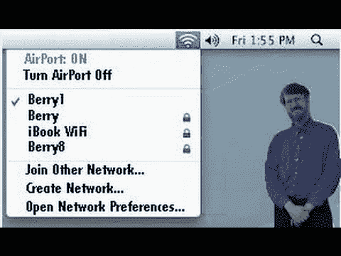

# 欧洲企业家，第三集:为无线女士让路

> 原文：<https://medium.datadriveninvestor.com/europreneurs-episode-3-make-way-for-the-wi-fi-lady-d3a07c40d043?source=collection_archive---------3----------------------->

“I want to be a … very simple, complicated person!” — actress/inventor Hedy Lamarr (1969)

"一个女人想出这样的发明是不可能的！"，对吧？！你这个性别歧视的猪。**原来是一个女人想出了这样一个发明，她还向你伸出了手指**。而且她还在你不相信地走出门的时候放了个屁。

 [## 在创业之旅中，拥抱学习|数据驱动的投资者

### 好像建立一个数百万美元的公司还不够困难，企业家必须额外照顾他们的…

www.datadriveninvestor.com](https://www.datadriveninvestor.com/2018/10/16/on-the-entrepreneurial-trek-embrace-the-learning/) 

**让我来介绍一下这个膨胀而富有创造力的人**:她的名字叫海迪·拉马尔，你可以通过这部纪录片更多地了解这个迷人的人

(if you’re still distraught that a woman invented a tech thing you might google someone like Ada Lovelace, I dunno)

有人说我应该写维克·海耶斯，但我更喜欢专注于真正的技术而不是文书工作…

所以 Wi-Fi 有一个快乐的童年:父亲是海斯先生，母亲是奥地利出生的拉玛尔小姐。良好的基因也是因为拉马尔也被吹捧为电影中出现过的最美丽的女人。Imdb 可以在这一点上支持我。

你可能会问**为什么**因为你还是以前那个性别歧视的猪——女性可以投票，可以管理公司，你知道吗？是的，**自从耶稣和他的 12 个跟班**——答案是… **她是一名演员**以来，已经有很长时间了。20 世纪三四十年代的好莱坞大牌女演员。

作为那个时代的人，你可能会认为这不是詹妮弗·劳伦斯要求数百万美元拍摄《x 战警》续集，并承诺“在欧洲拍摄”。事实上，**海蒂**——本名海德薇·伊娃·玛利亚·基斯勒——**——拒绝出演*卡萨布兰卡*** (1942)，但出演了《阿尔及尔的加比》 (1938)、*热带女郎* (1939)、*白色货物* (1942)或塞西尔·B·戴米尔的*萨姆森和黛利拉*

拉马尔在维也纳长大，接受了“某种初入社交界的教育”。**她的父亲**、**、**一位银行董事，**对科学技术情有独钟，带着她在城市各处参观，指出是什么让东西工作。**

她对机械、工程和设计如此着迷，以至于她后来在 1933 年嫁给了一个为德国和意大利军方工作的富有的军火商也就不足为奇了。**对欧洲和世界来说绝对不是好年景**。

或者，这可能有点令人惊讶，这样一个感兴趣和有趣的想法最终会在满是将军和海军将领的房间里为性越轨行为或前线确认的杀戮而斗鸡。

出于好奇和高瞻远瞩，她倾听着。海蒂倾听，海蒂吸收，增加了她的技能。**作为一名奥地利人也意味着她站在了二战棋盘游戏**最糟糕的一边:她的国家用鱼雷彻底摧毁了英国海军。我们谈论的是满载儿童的船只，这些儿童被从英国送往加拿大，以逃避纳粹的轰炸。必须把拉马尔小姐带走。做吧，施内尔！

她当时在美国，她没有浪费时间想出一个能够经受时间考验的解决方案，作为无线保真通信的基础:**在美国作曲家乔治·安太尔的帮助下，拉马尔设计了一个系统，使用成卷的穿孔纸**——就像钢琴上看到的那种**来快速切换频率，使敌人更难干扰无线电制导武器上的信号**。

“他们想出了一种方法，在飞机上安装一个卷轴，就像一个微型钢琴卷，在鱼雷上安装一个同样定时的卷轴，它可以将频率从一个点翻转到另一个点，卷轴上有小孔，就像钢琴卷上的孔一样。真他妈的聪明”(**这最后一部分是我加的**？我可能有过，对此我并不感到抱歉。

**拉马尔和安泰尔在 1942 年获得了专利，但这个想法被军方抢走了，发明者从未被告知其应用**，它在 20 年内开始使用**，它现在被认为是使蓝牙、CDMA 和 Wi-Fi 跳舞的材料**。

没有人付给他们一分钱。海蒂的故事从此变得不那么有趣，更“好莱坞式”:失败的婚姻，整形手术，没有关于她的创造性努力的性交，与好莱坞演员分享或写在工程教科书上。

拉马尔的无线技术——我遇到的术语实际上是“**跳频**”——一直没有实际应用，直到 20 世纪 80 年代末，国家收银机公司(NCR)开始寻找一种将收银机无线连接到中央计算机的解决方案。这在 12 月份尤其重要，因为百货公司需要额外的收银机来应对假日购物高峰。

**进行了概念验证，并向一个充斥着不信任 WLAN 解决方案的 WTF 面孔的市场推出了一款产品**。一个基于标准的产品，其数据速率可与有线局域网**媲美，应该会更令人愉快**。

**那是爸爸 Wi-Fi 客串的地方**:维克·海斯被选为 IEEE 802.11 小组的主席**，该小组在 1997 年最终确定了无线电无线标准**，该标准将在联邦通信委员会于 1985 年开放的免执照频谱中运行。

史蒂夫·乔布斯让文书工作变得很酷，也很全球化:1999 年，所有苹果的新 iBook 电脑都增加了无线上网功能，Wi-Fi 正式面向大众。

你想投诉任何连接问题吗？小心…这位女士是个天才和了不起的屁精。**不是和你翻脸的最佳组合**。

海迪·拉马尔于 2000 年去世。她的屁真的很壮观。**但她的想象力和解决问题的能力是惊人的，令人难忘的**此外，如果你认为在这个时代，从你的智能手机到你闺蜜的烤面包机，一切都是互联的。

谢谢你，拉玛小姐。