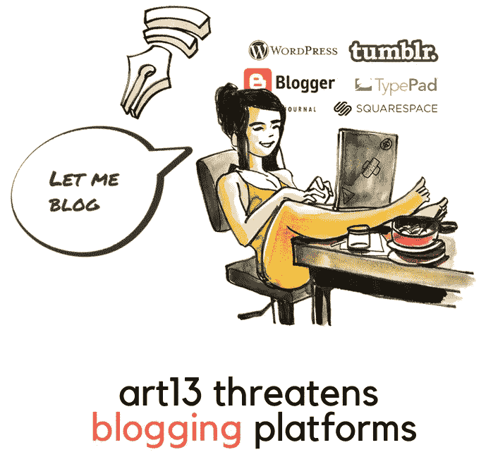

# 欧盟的第 13 条，以及它如何影响作为创造者的“你”。

> 原文：<https://medium.datadriveninvestor.com/eus-article-13-and-how-it-affects-you-as-a-creator-2cea49bd2c6b?source=collection_archive---------3----------------------->

版权法不仅仅是关于“模因控制”。

**Image Credits:** [**François Grimonprez**](https://www.saveyourinternet.eu/resources/) **from** [**Quidos**](http://www.quidos.net/)**.**

让我们以一种我们都能理解的方式来解开这个主题，因为我确信我们不都是律师和版权专家；*我们是创造者。*

因此，我将保持语言的简单性——并尽我所能围绕欧盟提议的版权管理法案表达我的想法，

> 欧盟的版权管理计划(第 13 条)是什么，
> 
> &
> 
> 它如何影响平台(媒介)和创作者(作家)。

## 欧盟提出的版权监管计划，又称第 13 条是什么？

首先，第 13 条的完整定义就是 ***“欧盟关于数字单一市场版权的指令”。***

简而言之，拟议中的版权监管计划延伸至不断发展的互联网文化和创作者发布作品的平台。

理论上，作为一个创作者——对于过去被称为*、*的“艺术自由”或“创作余地”，例子有恶搞、讽刺、音乐翻唱、取样、分享其他来源或创作者的链接、引用其他平台或出版商的例子等等。

它将责任直接放在“ ***平台*** ”而不是“ ***创作者*** ”上，这意味着理论上——**媒体**和平台如 **YouTube** 和 **Twitter** 可以对我们可能发布的侵犯版权的文章承担经济和法律责任。

让我给你一个实际的例子，我在我的文章中使用其他创作者的视频来给出背景或提供一个可视化的例子，有时我甚至提供音乐链接供读者在浏览我的作品时欣赏。

很简单，但是——如果作品是其他创作者或出版商的，**媒体**或任何其他平台，如 **YouTube** 、 **Twitter** 和**脸书**，将承担侵犯版权的经济责任，并因此被强制或完全阻止访问该文章。

因此，引导“***”****平台执行严格的规定，删除任何和所有可能侵犯另一个创作者的版权的材料，即使是出于非货币目的；例如*“非合作伙伴计划或解锁故事”。**

*这意味着，该法案将阻止个人未经“*创作者*”的明确许可与其他人分享作品——从新闻链接到互联网模因。*

*我们来看看下面的文章，*

* [## 喜剧的阴暗面。

### 总是做“有趣”的人并不有趣。

medium.com](https://medium.com/@nabeelt/the-dark-side-of-comedy-df08accfaf5a) 

这是我写的，我承认如果没有视觉参考，它是不完整的；但是根据**第 13 条**它直接违反了拟议的第 13 条，因此“*”可以对“ ***创作者*** ”的行为进行经济处罚，除非他们完全为欧盟内部的观众删除该文章。*

> *这是不是意味着我所有的工作都会被取消？**号***

*灰色地带是，如果我的作品在欧盟内部被访问，我的作品根本无法发表或被浏览。*

*向前看，假设你发现了一篇新闻文章或一张很棒的照片，并希望在你的文章中引用它作为先例或例子；你觉得有必要的。根据第 13 条，未经 ***创作者*** 及其 ***发布者*** 的许可，不能这样做。*

*也就是说，你需要得到“*许可*”**(可能会被拒绝，也可能需要几个月才能获得批准)**才能引用另一家出版社的文章。*

*这种行为有好的一面吗？*

*作为 Medium 上的“*创作者*”，你的作品未经许可也不能被分享。*

***作为交换条件，**如果有人在 Medium 上找到你的文章，并认为它*“值得分享”*；没有你的明确许可，他们不能在推特、脸书或其他他们选择的平台上发布。*

> *这是好事吗？我认为不会。*

*原因如下:我在 **Twitter** 上分享文章，很大程度上是因为*一个*人发现了它，觉得它很有趣，并分享了它，这导致了我的作品吸引了更多的观众。*

*这就是我们彼此分享工作、新闻和信息的方式。*

*因此，从理论上讲，我确实从人们分享我的作品中受益。*

*根据**第 13** 条， **Twitter** 将承担经济责任，如果用户决定“ *Tweet* ”一个链接到我的文章。*

*限制个人对它的访问，并将其完全从视野中移除。** 

**为什么 ***YouTube*** 有反应，什么是***“# SavetheInternet”。*****

**根据**第 13 条**，我可能无法分享下面的链接，但由于我无法简单地比 YouTube 苏珊·沃西基首席执行官**更好地解释它，我将简单地链接她的关于下面第 13 条的声明。****

** [## 第 13 条潜在的意外后果

### 这篇专栏文章最初发表在《金融时报》上。创造力长期以来一直是我生活中的一种指导力量，这就是…

youtube-creators.googleblog.com](https://youtube-creators.googleblog.com/2018/11/i-support-goals-of-article-13-i-also.html)** 

**那“ ***观众*** ”和“ ***观众*** ”呢？**

**好吧，进入事情的要点；让我们继续使用例子，因为我发现在这个特定的场景中，它们比文字描述更能说明问题。**

**让我们以 YouTube 上我最喜欢的娱乐频道之一为例，根据欧盟第 13 条版权法，该频道将被关闭。**

****Credits: Nerdwriter / Youtube.****

**我喜欢电影，我喜欢视频散文，它们是我最喜欢的娱乐和教育作品之一。**

**在我看来，没有其他人会发布像[**nerd writer**](https://www.youtube.com/user/Nerdwriter1)**这样的视频散文。****

**现在想象一下看同一个剪辑，除了视频被完全删除，只留下了作者的叙述。**

**这就好像一个人在听评论员描述一头大象。**

**退一步说，这根本没有意义——它还会剥夺书呆子作家的艺术自由，让他能够发表他的非凡的电影分析和视频文章；对我来说是娱乐和灵感的源泉。**

> **这也将切断欧洲观众接触他或我们作品的渠道。**

> **第 13 条仅适用于欧盟内部吗？**是(也不是)。****

**虽然内容将被撤销，欧洲观众无法访问，但侵犯版权的罢工仍将受到监管；这意味着，尽管欧洲观众肯定会失去对违反**第 13 条**的内容的访问权，但他们仍将在*平台* **(Medium、YouTube、Twitter、脸书、Reddit……不胜枚举)上承担财务责任。****

**这意味着平台的严格财务损失只会使监管或发布内容在财务上不可持续。**

**它还将取消“*观众的*”访问内容的权利，规范他们可以访问的信息，以一种权威的方式“**限制**”居住在欧盟内部的个人访问信息的能力。**

**因此，建立了一个更广泛的控制，对于生活在欧盟的个人来说，什么是可访问的，什么是不可访问的。**

**作为一个创作者、艺人、读者、艺术家，或者仅仅是一个内容消费者，我恳求我们认真对待第 13 条第 1 款，以及它对我们 T2 言论自由和 T4 平台的威胁。**

** [## EUR-Lex - 52016PC0593 - EN - EUR-Lex

### 这一提议符合现有的欧盟版权法律框架。本提案基于……

欧洲法律](https://eur-lex.europa.eu/legal-content/EN/TXT/?uri=CELEX%3A52016PC0593)** 

****我们能帮上什么忙，****

> **签署请愿书，**

** [## 拯救互联网

### 互联网正处于巨大的危险之中。我们是一个组织谁的目标是通知和阻止欧盟从他们最大的…

www.savetheinternet.info](https://www.savetheinternet.info/) 

> 传播意识，

 [## #SaveYourInternet -停止#审查机器

### 欧洲议会的所有成员都必须成为目标。他们承受着来自…的巨大压力

saveyourinternet.eu](https://saveyourinternet.eu/) 

**感谢您的阅读。:)**

原来[发表在这里。](https://www.datadriveninvestor.com/2018/11/16/eus-article-13-and-how-it-affects-you-as-a-creator/)**