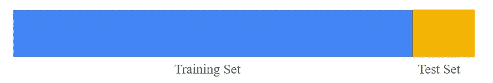
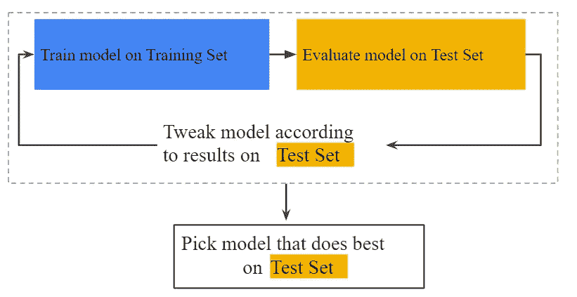
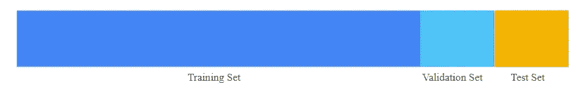
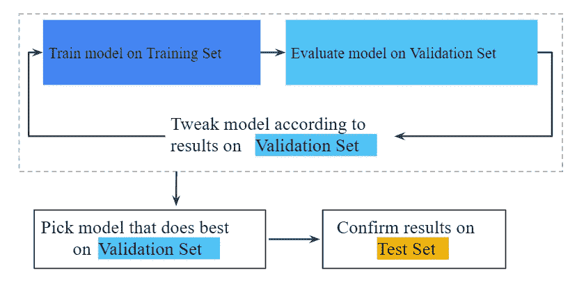
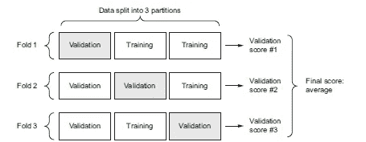
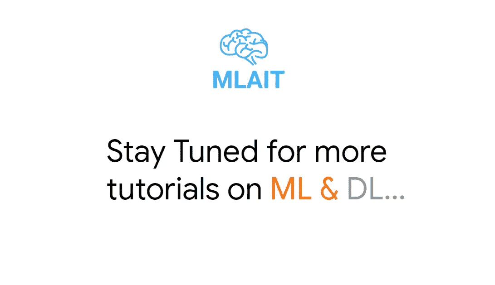

# 评估机器学习模型

> 原文：<https://medium.datadriveninvestor.com/evaluating-machine-learning-models-8e2193c2b237?source=collection_archive---------3----------------------->


# 你会学到什么？

*   模型评估简介
*   培训、验证和测试集
*   三种经典评估配方
*   选择评估协议时需要记住的事项

# 模型评估简介

在机器学习中，我们的目标是实现一个机器学习模型，*在新的看不见的数据或未知的数据上很好地推广*。在训练你的机器学习模型时，总是有一个过度拟合的问题，这是一个需要解决的主要障碍。虽然你们中的一些人可能有一个小数据集，在小数据集上训练神经网络不能很好地概括，并开始过度拟合。测量你的模型的泛化能力是非常重要的，这样它就可以很好地执行它所训练的内容，以避免过度拟合的情况。我们将研究一些减少过度拟合和最大化泛化的策略。让我们开始吧。

# 培训、验证和测试集

在评估模型时，我们总是将数据分成三组:训练集、验证集和测试集。您根据训练数据训练您的模型，并评估验证数据，一旦您的模型准备就绪，您就可以根据测试数据对其进行最后一次测试。

## 为什么不只是训练和测试集，为什么还要验证？

我们可以在训练集上训练，在测试集上评估，模型就准备好了，那为什么还要验证集呢？

## 没有验证集的工作流

我们将数据集分为两部分:



然后我们遵循这个过程:



我们在训练集上训练一个模型，然后在测试集上评估它，根据结果我们调整我们的模型参数，然后在调整模型的不同迭代过程之后，我们挑选一个在测试集上表现最好的模型。

[](https://www.datadriveninvestor.com/2019/03/03/editors-pick-5-machine-learning-books/) [## DDI 编辑推荐:5 本让你从新手变成专家的机器学习书籍|数据驱动…

### 机器学习行业的蓬勃发展重新引起了人们对人工智能的兴趣

www.datadriveninvestor.com](https://www.datadriveninvestor.com/2019/03/03/editors-pick-5-machine-learning-books/) 

为什么是验证集？

## 带有验证集的工作流

为了减少过度拟合，我们引入了一个称为验证集的新集合，在这种方法中，我们将数据集分为三个集合:训练集、测试集和验证集。



然后我们遵循这个过程:



我们在训练集上训练我们的模型，这次我们在验证集上评估我们的模型，并根据验证损失和准确性调整模型的参数，我们重复这个过程，直到我们得到最适合验证集的模型。在选择最佳模型后，我们在测试集上测试或确认我们的结果，以获得正确的准确性或我们的模型概括得有多好。

在开发模型时，我们调整模型的参数，无论是超参数还是网络的权重。我们通过接收验证数据上的模型性能的反馈信号来进行这种调整。调整是一种学习形式，当我们一次又一次地在验证集的基础上调整模型时，它开始泄露信息，一天结束时，你会得到一个在验证数据上人工表现良好的模型，这就是你优化它的目的。现在，我们在称为测试数据的全新数据上测量您的模型的性能，测试数据告诉我们我们的模型概括得有多好。

将数据分割成训练集、验证集和测试集看起来似乎很简单，但是当数据很少时，您可以使用一些高级方法。让我们看看技术。

# 三种经典评估配方

*   简单的拒绝验证
*   k 倍验证
*   迭代 K 倍验证

## 简单的拒绝验证

将您的数据分为训练集和测试集，在测试集上评估您的模型，并在训练集上训练它。为了防止信息泄露，我们不应该基于测试集来调优我们的模型，因此您需要保留验证集来调优您的模型。


```
num_validation_samples = 10000np.random.shuffle(data)validation_data = data[:num_validation_samples]data = data[num_validation_samples:]training_data = data[:]model = get_model()model.train(training_data)validation_score = model.evaluate(validation_data)# At this point you can tune your model,# retrain it, evaluate it, tune it again...model = get_model()model.train(np.concatenate([training_data,validation_data]))test_score = model.evaluate(test_data)
```

这是您可以使用的简单方法，但是这有一个缺陷，如果我们只有很少的可用数据，那么我们的验证和测试集将包含很少的样本来统计地代表手头的数据。基本上，您的验证和测试集太小，无法调整和评估模型。这很容易识别:如果在分割之前不同的随机洗牌轮数据最终产生非常不同的模型性能度量，那么您就有这个问题。

K-Fold 和迭代 K-Fold 将帮助我们克服这个问题。

## k 倍验证



在这种方法中，我们将数据分成大小相等的 K 个分区。对于每个分区 I，在剩余的 K-1 个分区上训练一个模型，并在分区 I 上对其进行评估。然后，我们的最终得分将是所获得的 K 个得分的平均值。当您的模型的性能根据您的训练测试分割显示出显著差异时，此方法很有用。像保留验证一样，这种方法并不能免除您使用不同的验证集来进行模型校准。

```
k = 4num_validation_samples = len(data) // knp.random.shuffle(data)validation_scores = []for fold in range(k): validation_data = data[num_validation_samples * fold: num_validation_samples * (fold + 1)] training_data = data[:num_validation_samples * fold] + data[num_validation_samples * (fold + 1):] model = get_model() model.train(training_data) validation_score = model.evaluate(validation_data) validation_scores.append(validation_score)validation_score = np.average(validation_scores)model = get_model()model.train(data)test_score = model.evaluate(test_data)
```

## 带洗牌的迭代 K 倍验证

这种方法适用于可用数据相对较少，并且需要尽可能精确地评估模型的情况。它包括多次应用 K-fold 验证，在将数据分成 K 份之前，每次都对数据进行洗牌。最终分数是每次 K 倍验证所得分数的平均值。请注意，您最终要训练和评估 P × K 模型(其中 P 是您使用的迭代次数)，这可能非常昂贵。

# 要记住的事情

## 确保您的测试集满足以下两个条件:

*   大到足以产生有统计意义的结果。
*   代表整个数据集。换句话说，不要挑选与训练集特征不同的测试集。

## 时间之箭

如果您试图根据过去预测未来(例如，明天的天气、股票走势等)，您不应该在拆分数据之前随机打乱数据，因为这样做会造成时间泄漏:您的模型将有效地根据未来的数据进行训练。在这种情况下，您应该始终确保测试集中的所有数据都在定型集中的数据之后。

## 数据中的冗余

如果数据中的某些数据点出现了两次(这在现实世界的数据中很常见)，那么将数据混洗并将其分成训练集和验证集将导致训练集和验证集之间的冗余。实际上，您将对您的部分训练数据进行测试，这是您所能做的最糟糕的事情！确保您的训练集和验证集不相交。

我通过理解和从 ML 的各种资源中获取帮助来为你创造这些内容。像 MLCC 课程，Francois Chollet 的深度学习书籍和许多其他图像和所有网站。

[](https://medium.com/mlait/how-to-become-a-pro-in-machine-learning-and-deep-learning-concepts-7850ff141b7f) [## 如何成为机器学习和深度学习概念的专业人士？？

### 这是成为解决机器学习问题专家的学习之路，

medium.com](https://medium.com/mlait/how-to-become-a-pro-in-machine-learning-and-deep-learning-concepts-7850ff141b7f) [](https://medium.com/mlait/getting-started-with-neural-networks-ff506e445f45) [## 神经网络入门

### 深度学习是借助神经网络完成的。它们的工作原理和人脑一样。

medium.com](https://medium.com/mlait/getting-started-with-neural-networks-ff506e445f45) 

# 谢谢大家！

# 敬请关注并与#MLAIT 保持联系

# 关注我们获得更多关于人工智能、人工智能和云的教程，并加入 [MLAIT](https://t.me/mlait) 的电报组