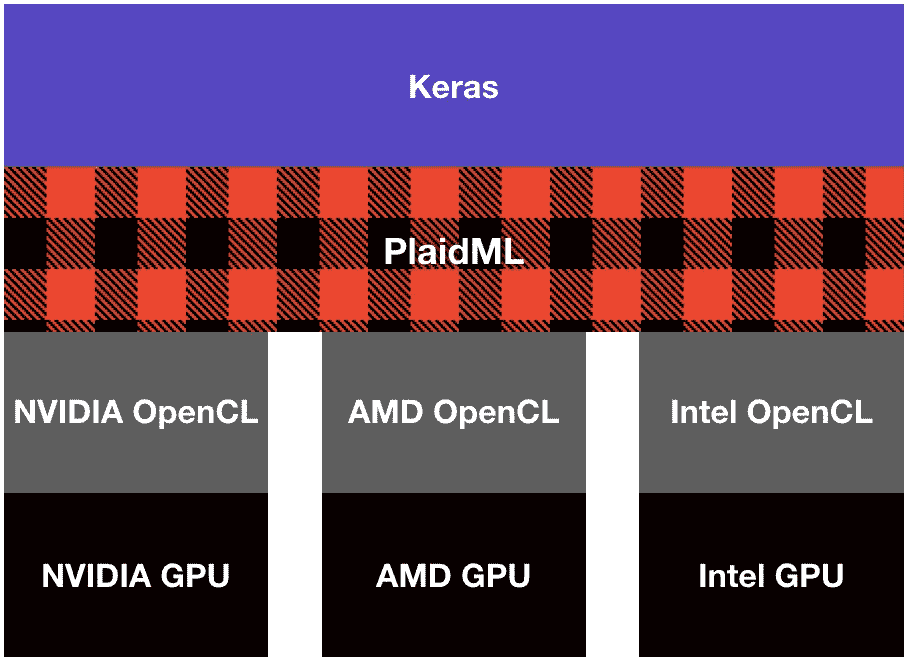
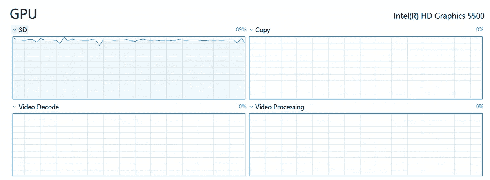
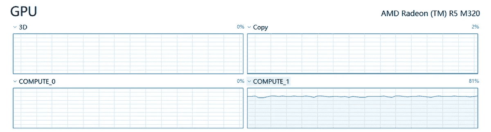

# 在 Windows 10 笔记本上评估 PlaidML 和 GPU 对深度学习的支持

> 原文：<https://medium.datadriveninvestor.com/evaluating-plaidml-and-gpu-support-for-deep-learning-on-a-windows-10-notebook-13401c4ee617?source=collection_archive---------0----------------------->

**Figure 1\.** [**PlaidML Logo.**](https://github.com/plaidml/plaidml)

**Figure 2\.** [**A software/hardware hierarchy of PlaidML.**](http://vertex.ai/blog/announcing-plaidml)

[**PlaidML**](https://github.com/plaidml/plaidml) 是一个深度学习软件平台，支持来自不同硬件厂商的 GPU。PlaidML 的一个主要场景如图 2 所示，其中 PlaidML 使用 [**OpenCL**](https://en.wikipedia.org/wiki/OpenCL) 来访问 NVIDIA、AMD 或 Intel 制造的 GPU，并作为[**Keras**](https://keras.io/)**的后端来支持深度学习程序。根据 PlaidML，这个场景可以在 Windows、Linux 和 MacOS 上运行。**

**让我用我的 Windows 10 笔记本的配置来进一步说明这个场景。我的华硕 2015 年生产的 Windows 10 笔记本有如下设置:**

*   **英特尔酷睿 i5–5200 u CPU**
*   **2 个内置 GPU:英特尔高清显卡 5500 和 AMD 镭龙 R5 M320**

**我用这个笔记本潜入深度学习进行计算机视觉，比如[特征提取](https://medium.com/@franky07724_57962/using-keras-pre-trained-models-for-feature-extraction-in-image-clustering-a142c6cdf5b1)、[多标签分类](https://towardsdatascience.com/multi-label-classification-and-class-activation-map-on-fashion-mnist-1454f09f5925)、[视觉问答](https://towardsdatascience.com/deep-learning-and-visual-question-answering-c8c8093941bc)等。，主要在 Tensorflow 上的 Keras 下或 Theano 上的 Keras 下。不过据我所知，Tensorflow 和 Theano 都只支持 NVIDIA 的 GPU，不支持其他硬件厂商的 GPU。结果我之前所有的研究都是在 CPU 上进行的，而不是在 GPU 上。但是，PlaidML 提供了一个可以在我的 Windows 10 笔记本上使用内置 GPU 的环境，以提高我的深度学习程序的性能。请注意，在 PlaidML 上的 **Keras 的配置下，我可以利用内置的 GPU，而不涉及专门针对英伟达 GPU 的 Tensorflow、Theano 和 CUDA/cnDNN。****

**这篇文章简要描述了 PlaidML 的安装和配置，然后在 CIFAR-10 数据集上使用一个简单的卷积神经网络，将 Keras 在 GPU 上的性能与 Keras 在 Tensorflow 上的性能进行了对比。**

# **1.安装和配置**

**安装 PlaidML 非常简单:按照 github 上的指令或者 pip[pypi](https://pypi.org/search/?q=plaidml)中的 whl 文件。安装后，运行 plaidml-setup 将引导您选择目标 GPU 设备。图 3 简要介绍了设置过程。**

****Figure 3\. Using the plaidml-setup command to select the default device.****

**下一步是定义 PlaidML 作为 Keras 的后端，如下所示。**

> *****设置" KERAS _ back end = plaidml . KERAS . back end "*****

**现在，我们准备运行我们的深度学习程序。没有必要改变我们的代码！**

# **2.实验和评估**

**这里我使用 github 上 keras-team 的 [cifar10_cnn.py](https://github.com/keras-team/keras/blob/master/examples/cifar10_cnn.py) (只有 10 个历元，没有数据扩充)进行测试。图 4 显示了这个程序在三个后端的性能:**

*   **CPU 上的张量流**
*   **英特尔高清显卡 5500 上的 PlaidML**
*   **AMD 镭龙 R5 M320 上的 PlaidML**

**在 10 个时期之后，准确度大致相同，即分别为 67%、69%和 68%。但是**PlaidML 在 Intel GPU 上的训练时间**比 Tensorflow 在 CPU 上快 4 倍左右(16969/4314 = 3.93)**PlaidML 在 AMD GPU 上的训练时间**比 Tensorflow 在 CPU 上快 9 倍左右(16969/1841 = 9.21)。**

****Figure 4\. Performance comparison on three backends.****

**Windows 10 上的任务管理器允许我们检查 GPU 的使用情况，如图 5 和图 6 所示。然而，标签的含义在这里可能有些混乱。**

****

****Figure 5\. GPU usage on Intel HD Graphics 5500.****

****

****Figure 6\. GPU usage on AMD Radeon R5 M320.****

# **3.软件/硬件上的问题？！**

**我在使用 PlaidML 0.3.5 时遇到了两个问题:**

**(1)在英特尔高清显卡 5500 上，小型神经网络(如 cifar10_cnn.py)或大型神经网络(如 MobileNet)都可能会遇到访问冲突问题。[ [参考号](https://github.com/plaidml/plaidml/issues/167)**

**(2)在 AMD 镭龙 R5 M320 上，大型神经网络(如 VGG、Inception、ResNet 等。)会遇到内存分配问题。[ [参考](https://github.com/plaidml/plaidml/issues/67)**

# **4.结论**

**虽然我的笔记本在 Intel GPU 和 AMD GPU 上运行 PlaidML 都有一些问题。我仍然很高兴看到这个深度学习的解决方案，并希望它背后的团队在未来进一步改进该系统。**

**最后一点:英特尔收购了创造 PlaidML ( [Vertex)的公司。AI](http://vertex.ai/))2018 年 8 月。**

# **来自 DDI 的相关帖子:**

** [## 用 7 个步骤解释深度学习——数据驱动投资者

### 在深度学习的帮助下，自动驾驶汽车、Alexa、医学成像-小工具正在我们周围变得超级智能…

www.datadriveninvestor.com](https://www.datadriveninvestor.com/2019/01/23/deep-learning-explained-in-7-steps/)  [## 数据科学和软件工程哪个更有前途？-数据驱动型投资者

### 大约一个月前，当我坐在咖啡馆里为一个客户开发网站时，我发现了这个女人…

www.datadriveninvestor.com](https://www.datadriveninvestor.com/2019/01/23/which-is-more-promising-data-science-or-software-engineering/)**