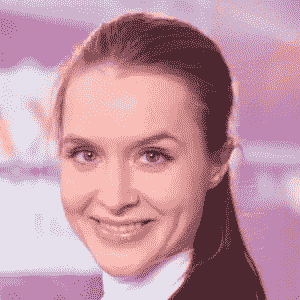

# evelina Lavrova-2017 年十大加密女性，Waves 平台的营销和公关回答了几个问题

> 原文：<https://medium.datadriveninvestor.com/evelina-lavrova-top-10-female-in-crypto-for-2017-marketing-pr-for-waves-platform-answers-a-few-1a77f01eb166?source=collection_archive---------4----------------------->

Evelina Lavrova 很友好地回答了我一些问题。希望你们和我一样喜欢它。

*   你能告诉我一些关于你自己的情况吗？

我从 2004 年开始进入科技行业。我开始在一家软件公司担任销售经理，但后来进入了市场营销领域，并在快速消费品和房地产领域工作了几年。当我在 2012 年加入 Gett(【https://gett.com/juno/】)时，我又回到了技术领域。我喜欢科技公司的活力和创新理念。在我的职业生涯中，我很幸运能和一些伟大的人一起工作，无论是在我所在的公司还是在他们之外，我都从他们身上学到了很多。我甚至被评为 2017 年 Crypto 十大女性之一！

*   *是什么让你加入了区块链和加密公司？*

我和区块链的故事始于 2016 年初，当时我在俄罗斯的 Square 公司 Pay-Me([https://www.pay-me.ru/](https://www.pay-me.ru/))担任营销和公关主管。Pay-Me 的创始人 Vladimir Kanin 和 Block 公证人的联合创始人 Igor Barinov 决定通过在区块链的视频采访为 Pay-Me 的客户提供 KYC 解决方案。那是 Vladimir 向我解释区块链技术的时候。后来我加入了 Waves 平台，对这项技术有了更多的了解。

*   *你是怎么涉足海浪的？(不久前我投资了 Waves】*

真的吗？太好了！

这很容易。我看到 Waves 的创始人兼首席执行官萨沙·伊万诺夫(Sasha Ivanov)在脸书上发帖称，他正在寻找一名营销和公关专家，于是我给他写了信。我们相遇，并在 2016 年 9 月加入了这个团队。当时，Waves 莫斯科办公室只有 10 个人，还有几个人远程工作。我是队里唯一的女性。我有许多不同的责任，但这就像是第二个家庭。

*   *Waves 的长期目标是什么？*

我们希望成为世界上最重要的区块链定制标志。令牌化显然将是区块链的一个主要用例，目前企业对此有大量需求。我们希望开发一套工具和服务，将区块链技术的好处带给尽可能多的人。

Waves 正在以不同于其他项目的方式实现这一愿景，通过创建一个完整的互联服务生态系统——以区块链科技为核心，但也包括合规服务和影响者、菲亚特和加密网关、众筹专家和营销、研发等。我们还希望为企业开发私有区块链解决方案，因为这将是未来感兴趣的主要领域。

*   我还没有使用 Waves Dex，你能解释一下它的好处吗？

DEX 是一个分散的交易所，所以你的资金非常安全，交易所永远不会被黑客攻击或关闭。不像普通的交易所，当你使用它时，你不会放弃对你的密码的控制。所有订单都在区块链上结算，点对点。尽管如此，它的速度非常快，因为它使用集中撮合器来配对交易，所以你可以两全其美。我们在界面上下了很大功夫，所以用户界面就像传统的交易所一样！

*   *我看到 Waves 帮助哈萨克斯坦监管加密货币。那个过程是什么样的？*

哈萨克当局对区块链的态度是复杂而成熟的。它基于对数字技术在全球经济中所占份额快速增长的深刻理解。哈萨克斯坦将该国变成“区块链的新加坡”的计划是基于客观现实的，我们很高兴能够合作。今年早些时候，Waves Platform 与 AIFC 签署了战略合作伙伴关系。该合作伙伴关系的目标是利用最新的区块链科技为金融技术创建一个先进的生态系统。

*   *你想建立什么规章制度？*

我们相信，我们的合作伙伴关系将为哈萨克斯坦带来区块链技术领域最先进的实践，并将使 IFCA 成为世界上最重要的工业发展中心之一。由于我们在合作过程中积累的经验，我们也将能够在其他地方复制正确的解决方案，这将对独联体内整个区块链生态系统的发展产生积极影响。合作的目的之一是支持创业公司使用新的金融和区块链技术，为他们提供 Waves 区块链解决方案。Waves 还将帮助吸引外国初创公司加入 IFC 加速项目，并开展培训活动。

*   Waves 与德勤合作开发了一个法律框架。建立了什么框架？

Waves 与德勤的合作旨在为客户提供全面的初始硬币发行(ICO)服务和定制的区块链解决方案，以满足特定的商业任务。此外，我们正在建立一个自我监管机构，为 ico 和区块链行业提供报告、法律、税务和会计、KYC 和商业尽职调查标准。这个自律机构将与 ICO 治理基金会(IGF)和其他专业基金会合作，协调跨平台 ICO 披露协议。

*   *用 Waves 推出了多少代币？*

我相信已经有超过 25，000 个代币被投放到 Waves 上。不过，或许更有意义的衡量指标是 DEX 的交易量。我们经常看到 200-300 万美元，最近我们所有代币的日交易量达到了 500 万美元。这个数字一直在上升。

*   你有什么样的法规或政府支持？就在最近，怀俄明州通过了一项法律，将虚拟货币定义为法定货币。他们通过了其他几项帮助加密的法案。他们率先这样做，其他几个州也在效仿。如果你想听的话，这里有一个链接。[*https://above crypto . com/news/crypto-now-a-legal-currency-in-Wyoming/*](https://abovecrypto.com/news/crypto-now-a-legal-currency-in-wyoming/)

很明显，为了让 crypto 被完全采用，我们需要某种监管。如果不知道他们在什么样的框架下运作，企业是不会使用它的，尤其是大公司。但这种监管需要适度和适当，以避免扼杀创新和阻止这些新技术的进一步发展。我认为，许多司法管辖区正采取一种相当常识性的方法，采取正确的路线。如果它看起来像钱，它应该被当作钱。如果它看起来像证券，就应该像证券一样对待，以此类推。

*   从长期和短期来看，你对加密技术的未来有什么看法？

短期来看，这是去年年底加密市场明显泡沫的后果。这不可避免地导致公众暂时失去信心，而主流新闻对此没有帮助。不过，从中期来看，情况看起来非常好。人们对此很感兴趣，这是有充分理由的，一些非常强大的用例正在幕后开发，而且业务和机构的兴趣一直在增长。简而言之，这不是一项即将消失的技术。

*   你认为我们怎样才能更快地采用它？

通过开发和发布有用的应用程序，通过继续建设交易所和服务的基础设施——事实上，这正是我们正在做的事情。

*   要让它成为主流，最大的障碍是什么？

流行的看法和正常的市场周期目前没有帮助，但基本面在那里，所以它会及时整理出来。目前，缺乏监管意味着我们没有广泛采用的必要清晰度。一旦这一点到位，一个主要的障碍将会消失。

*   *你最喜欢的货币有哪些？*

我相信俄罗斯的科技企业家，所以我最喜欢的货币是 Waves，Ethereum，Ergo (https://ergoplatform.org/)等等。但我也饶有兴趣地观察其他硬币，如恒星，NEM，EOS 等。了解更广泛的密码世界正在发生什么，正在开发什么技术，以及它们旨在解决什么问题，这总是好的。我们可以相互学习很多东西——例如，Waves-NG 就改编自比特币-NG 提案。

*   关于这个行业，你希望每个人都知道或了解什么？

这不仅仅是钱的问题。如果你看到关于加密的新闻报道，你会认为这一切都是为了钱，但事实远不止如此。区块链代表了一种可能的社会转变，使现有的企业和服务去中介化，并有助于建立一个更公平、更以人为本的经济。

再次感谢你这么做。

米切尔

