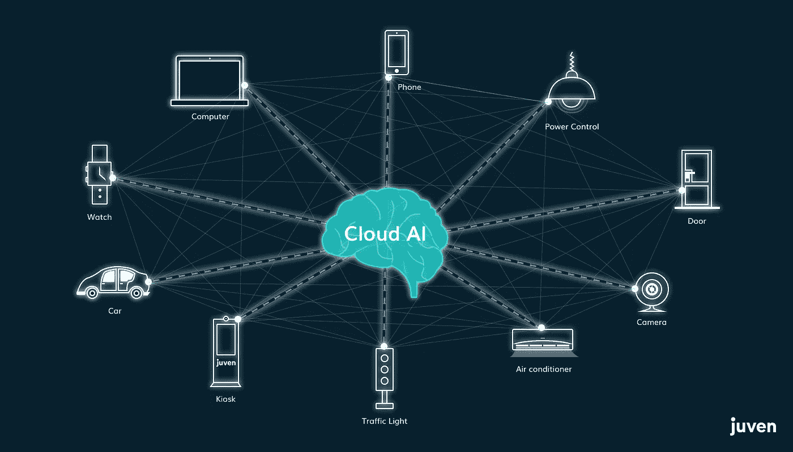
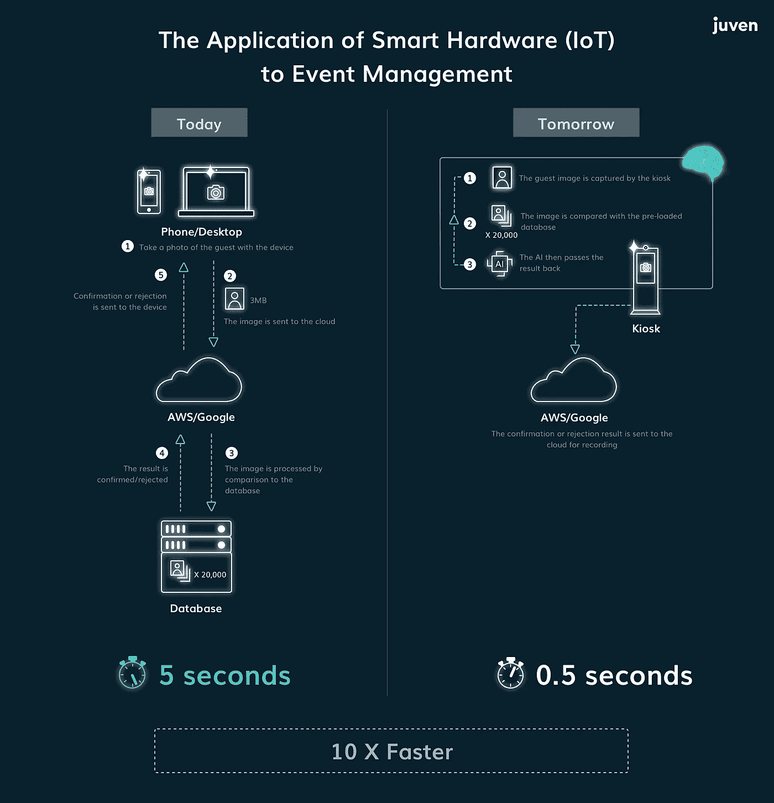

# 事件管理 3.0 —人工智能愿景

> 原文：<https://medium.datadriveninvestor.com/event-management-3-0-ai-vision-ab3fd34b9d42?source=collection_archive---------38----------------------->

## 面部识别可实现快速顺畅的登机手续办理

By [Franck V.](https://unsplash.com/@franckinjapan?utm_source=medium&utm_medium=referral) on [Unsplash](https://unsplash.com?utm_source=medium&utm_medium=referral)

## 介绍

Juven 的使命是增强组织的会员生态系统，并将它们连接起来，以创造新的价值。由于活动管理是组织的关键影响领域之一，Juven 已经接受了提供端到端解决方案的挑战，以将活动管理(从而将整个组织的参与度)提升到一个新的水平。

在这一系列文章中，Juven 将阐述人工智能面部识别技术、i [ts 在活动管理市场](https://medium.com/@juven/ai-vision-state-of-the-market-9c03715386be)的使用现状、我们的产品和优势以及我们的发展路线图。

## 面部识别签到

面部识别技术不再局限于科幻小说的领域，也不再仅仅是一个行业展品。现在就在这里——[从机场](https://www.scmp.com/tech/enterprises/article/2168681/shanghai-airport-first-launch-automated-clearance-system-using) [到酒店](https://www.hotelmanagement.net/tech/facial-recognition-check-rolled-out-at-50-hotels-china)，再到工作场所，面部识别技术正被用来以一种流畅高效的方式为旅客、客人和员工办理登机手续。

显然，这项技术在活动管理方面有很大的吸引力，因为它有巨大的商业潜力。难怪提供人工智能视觉开发的尖端科技初创公司，如[旷视科技 Face++和](http://www.megvii.us/) [SenseTime](https://www.sensetime.com/) 已经筹集了数亿美元。但到目前为止，尽管在商业领域有现成的消费级产品，但还没有现成的。考虑到这已经不再是最前沿的技术，这就显得特别奇怪了。

使用面部识别办理登机手续有很多理由。首先，它真的很快。一家活动机构称其比传统的登记速度快 50 %。这非常安全，因为使用人工智能-机器学习的面部识别技术的进步意味着他们非常擅长识别面部，并且不太可能在客人入住时出错。最后，使用面部识别技术为客人办理入住手续的最大原因是令人惊叹的因素。

还有其他原因，如果你想知道更多细节，请查看 eventsb 关于面部识别技术在活动中的使用的白皮书[。](https://www.eventmanagerblog.com/facial-recognition-guide-2018)

鉴于这些有希望的原因和在活动空间部署这种技术的潜力，许多活动管理公司已经表示有兴趣开发和部署它。

两项技术发展对用于登机手续的人工智能视觉的发展至关重要——物联网(IoT)和云计算。

物联网是指嵌入了处理能力和互联网连接的物理对象的网络。思科系统公司估计，智能硬件与人的比率已经从 2003 年的 0.08 上升到 2010 年的 1.84。这个数字只是增加了。随着数字小型化的继续，这些设备变得越来越智能。

借助云计算，从物联网接收的数据可以在云中集中和远程收集和处理。允许深度学习人工智能算法访问大量数据对于训练它们做事是必要的。在 AI-vision 的情况下，它是训练它们识别物体，如椅子，并区分图像中的人脸。

通过将两者结合在一起，人们可以拥有一个用于各种服务的云计算人工智能，尽管在这篇文章中，我们感兴趣的是人工智能视觉。

## 基于云的人工智能视觉:让我们揭开它的神秘面纱

**第一步:**编写一个可以拍照并存储照片的应用程序。

**第二步:**在进行图像处理，即面部识别之前，图像被发送并存储到具有人工智能能力的云平台上，例如 [AWS](https://aws.amazon.com/) 或[谷歌云](https://cloud.google.com/)

**步骤 3:** 用户(通常是系统管理员或现场助手)将在应用程序上捕获的面部图像发送到云平台进行比较，一次一张或批量发送，请求运行某个面部识别任务。

**步骤 4:** 云平台(不是 app)将运行算法来确定请求的结果。它可以是一个是/否的回答，或者从许多图像中选择一个。结果发送回应用程序。

**第五步:**app 将结果显示给系统管理员。

需要注意的关键点是，人工智能处理发生在云上，除了数据连接之外，与正在使用的应用程序无关。

一般来说，由于将图像发送到云所需的时间和带宽，处理时间可能很短，但数据传输时间可能很长，这取决于服务器位置和网络速度。

Cloud-based versus Edge-based use case

## 边缘计算/ Juven 方法

到目前为止，您可能已经熟悉了物联网。随着设备变得越来越智能，在设备中嵌入某种程度的人工智能视觉处理能力成为可能。这使我们能够在物联网中利用分布式人工智能愿景进行事件管理。

也就是说，这种方法显然需要对硬件、软件及其集成进行更多的工程设计。这增加了硬件成本，但大大降低了人工成本，并且效率更高。

**它是如何工作的**

**第一步:**将以下硬件项目放在一起:工业级摄像头、处理单元(又名计算机)、人工智能芯片(离线运行算法)、屏幕(用于系统控制和用户交互)、路由器(连接互联网)和展台/展台。

**第二步:**将面部识别算法写入人工智能芯片

**第三步:**将 AI 芯片与摄像头和处理单元集成

**步骤 4:** 编写一个可以在处理单元上运行的应用程序

**步骤 5:** 运行硬件集，实时检测人脸，无需任何管理员操作。

**第 6 步:**面部识别过程发生在硬件内部，而不是云端。在识别过程中，不需要向云发送任何数据。结果立即直接显示在屏幕上，非图像，通常是二进制响应(数据量小)被发送回基于云的软件(例如 Juven 的参与平台)进行数据集成或进一步处理。

这些新的发展非常令人兴奋，Juven 很自豪地致力于提供最先进的人工智能视觉登机流程，不仅适用于大公司，也适用于消费者。敬请关注关于该主题的[未来帖子](https://medium.com/@juven/ai-vision-state-of-the-market-9c03715386be)。

链接:

 [## 面部识别和事件:综合指南(2018)

### 面部识别是一项强大的技术，可用于以多种方式改善活动，从加快办理登机手续…

www.eventmanagerblog.com](https://www.eventmanagerblog.com/facial-recognition-guide-2018)  [## 上海机场率先推出使用面部识别技术的自动化通关系统

### 上海两大机场之一的上海虹桥国际机场于周一推出了中国首个…

www.scmp.com](https://www.scmp.com/tech/enterprises/article/2168681/shanghai-airport-first-launch-automated-clearance-system-using) 

> [Juven](https://juven.co/) 开发集成的组织软件，使各种慈善机构、公司、协会和俱乐部能够建立、参与和发展社区。我们认为，组织应该能够使用美观、直观和可靠的工具来创造更大的影响力。