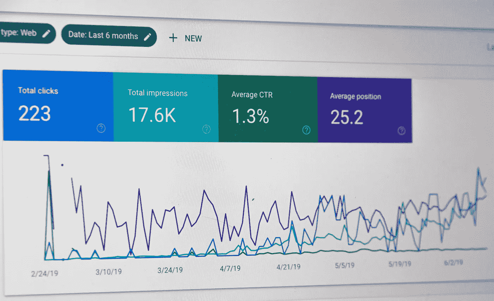

# 中小企业的常青 SEO 策略

> 原文：<https://medium.datadriveninvestor.com/evergreen-seo-strategies-for-smes-4293383bb15e?source=collection_archive---------14----------------------->

不断变化的数字营销趋势要求在线企业主和营销人员提出常青 SEO 策略，以确保他们的网站继续在 SERPs(搜索引擎结果页面)中占据主导地位。争夺在线知名度的竞争日益激烈。

在拥有动态数字营销格局的市场中，如新加坡和美国，最成功的企业依赖于竞争对手忽视的常青 SEO 策略。今天，我们将看看你可以依靠的提高网站排名和性能的最佳 SEO 实践。

版权:Unsplash |许可:首席运营官公共领域

# 1#网站组织工作

潜在客户首先注意到的是网站组织。简而言之，网站必须直观明了，为访问者提供足够的信息，并鼓励他们在网站上停留更长时间。

网站组织依赖于导航。例如，如果你运营一个中小企业网站，潜在客户会希望在登陆网站后立即查看你的客户名单和投资组合。在这种情况下，[垂直导航](https://www.webdesignerdepot.com/2017/06/10-sites-doing-vertical-navigation-right/)将帮助你给他们留下深刻印象，并降低跳出率。

 [## 2019 年最值得学习的编码语言|数据驱动的投资者

### 在我读大学的那几年，我跳过了很多次夜游去学习 Java，希望有一天它能帮助我在…

www.datadriveninvestor.com](https://www.datadriveninvestor.com/2019/02/21/best-coding-languages-to-learn-in-2019/) 

大多数网站都有专门的客户评价和列表部分，而其他网站则把它们放在主页上。如果你选择第一个选项，建议你确保在主页上放置一个链接，将潜在客户引向推荐。

更重要的是，你的商业网站的每一页都应该有一个功能齐全的搜索栏，它和主页按钮一样显眼。这里有一篇尼尔·帕特尔关于[网站简洁的好处的文章的链接。](https://neilpatel.com/blog/simplify-your-website-with-the-kiss-rule/)

# 2#在博客上发表相关文章

你在网站的博客部分发布的 SEO 优化文章将帮助你更好地与目标受众联系。博客文章应该与他们的需求和期望产生共鸣。他们也应该为你想要排名的关键词进行优化，以增加你网站的在线可见性。

作为一个数字营销者或在线企业主，内容是你吸引网站访问者并将他们转化为你的固定观众的最大的现场盟友。你在博客上发布的内容应该与你提供的产品或服务相关。

如今，网站正试图通过发布娱乐内容来提高转化率。这个策略很神奇，尤其是如果你想出了一个独特且[有趣的关于我们的页面](https://www.searchenginejournal.com/about-us-page-examples/250967/)。然而，这种方法并不适用于所有企业。精明的互联网用户和谷歌更喜欢真实的内容，所以成为一个小丑可能不适合你的品牌。

内容需要与你的定位相关，并且基于对数字营销领域当前趋势的研究。人脑处理视觉效果的速度比处理文本块的速度快，所以一定要用高质量的图像和视频来丰富你的博客文章。

# 3#关键词研究和分发

直接影响 SEO 排名的主要因素之一是站内和站外内容中关键词的使用。理想情况下，你在网站内容中包含的与你的行业相关的和流行的关键词越多，它在网上的可见性就越高。

与过去不同的是，当 [Google Keyword Planner](https://ads.google.com/home/tools/keyword-planner/) 是唯一的关键字研究工具时，现在有很多工具可以用来进行关键字研究和分发。现代工具允许你根据你的业务类型和位置来搜索关键词。

你的关键词研究的主要目标应该是确定高价值的关键词，这将有助于你的在线业务脱颖而出。请注意，今天流行的关键词可能会在未来几个月内过时。所以内容上的关键词研究和实现应该是一个持续的过程，而不是一个一次性的项目。

# 4#利用长尾关键词和长格式内容

研究表明，谷歌对长篇文章的支持和奖励优于流行的短篇文章。如今，1000 到 5000 字的文章更容易排名，因为这些文章比短文更能为读者提供价值。

也建议在文章中包含[长尾关键词](https://searchengineland.com/use-long-tail-keywords-build-short-tail-rankings-284887)，因为大多数人使用长短语在搜索引擎如谷歌和必应中搜索内容。他们将帮助你创造一个强大的数字足迹，增加你的网站的有机流量。

目前，搜索引擎依赖人工智能和其他高级工具来创建存储搜索查询的最新数据库。全面的关键字研究将帮助您识别这些搜索查询的目的是搜索引擎优化。

因此，如果你遵守关于内容长度和关键词的新规则，你的企业将从更多的销售线索中获益。

# 5#鼓励访客互动

用户参与度被视为搜索引擎用来对网站进行排名的因素之一。当访问者表现出主动性时，这是你的网站与目标受众相关的标志之一。请注意，互动指的是他们与你的网站和其他访问者的互动。

你可以通过让用户在你的博客文章下面写评论来刺激用户参与度。这些评论不仅会给你关于你的品牌和它所提供的东西的反馈，还会给你下一篇博客文章的灵感。

偶尔会得到负面评价。不要急于删除它，而是专注于了解问题的根本原因，并友好地解决它。回应负面的批评将向其他访问者展示你的品牌是以顾客为导向的，并致力于确保他们获得最大的价值。

# 6#美化你的网站

我们已经讨论了确保你的网站组织良好和导航无缝的重要性[。用视觉效果和其他元素美化你的网站](https://neilpatel.com/blog/web-design-conversions/),抓住访问者的注意力，提高可用性。视觉效果将鼓励访问者在网站上花更多的时间，从而提供更多的机会将他们转化为购买客户。

版权:Unsplash |许可:首席运营官公共领域

# 7#利用行动号召(CTA)

[行动号召](https://mediaonemarketing.com.sg/best-call-action-cta-wordpress-plugins-singapore-website/)告知潜在客户在阅读文章或浏览登录页面后应该采取的下一步行动。确保 CTA 是显眼的和战略性的，以获得最好的结果。使用颜色对比使其从页面上的周围元素中突出出来。

# 结束语

这七个常青树搜索引擎优化策略已经过测试，证明可以有效地帮助中小企业增加客户群。你也可以雇佣一个内部的搜索引擎优化专家或者将工作外包给一个被认可的搜索引擎优化代理来避免昂贵的错误。