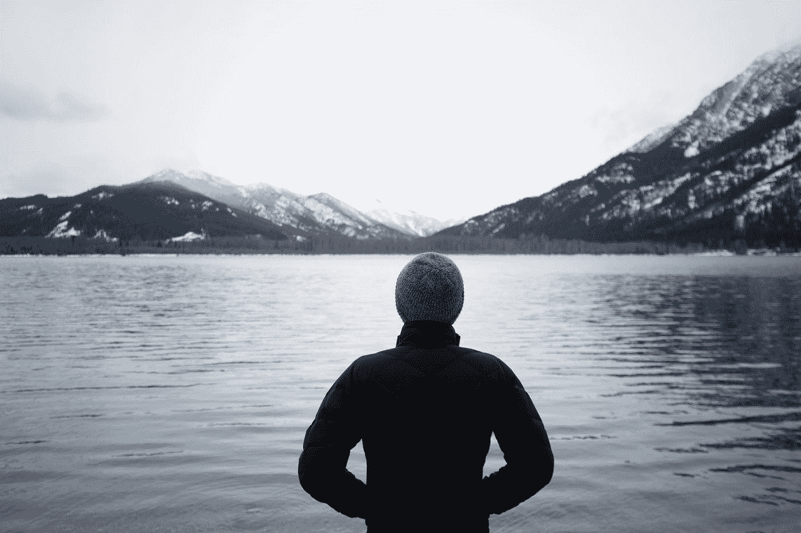

# 9 打破精神健康的神话！

> 原文：<https://medium.datadriveninvestor.com/everyday-spiritual-well-being-179fdada6547?source=collection_archive---------8----------------------->

Photo by [Nitish Meena](https://unsplash.com/@nitishm?utm_source=medium&utm_medium=referral) on [Unsplash](https://unsplash.com?utm_source=medium&utm_medium=referral)

在这个纷繁复杂的世界里，人们越来越渴望内心的平静和有意义的生活。神话是，要感受涅槃，一个人必须消失到静修处和森林中，以连接到内心的平静。另一方面，当你回来时，日常生活接管了你的工作，你可能会失去在休息时获得的平静和清晰。

> “有一个简单的方法可以检验佛陀教诲的真实性。找到最舒服的姿势，保持这个姿势三十分钟。最舒服的姿势很快就变成最不舒服的了。一切都是无常的，包括世界上最舒服的姿势。”海明·苏尼姆

 [## 成功人生的 25 种自我提升方式|数据驱动的投资者

### “我活得越久，学到的就越多。学的越多，体会的越多，知道的越少。”―米切尔·莱格兰德时间到…

www.datadriveninvestor.com](https://www.datadriveninvestor.com/2019/03/12/25-self-improvement-ways-for-a-successful-life/) 

十月是一个充满国际日的月份，#心理健康日#阿育吠陀，是人类争取和平和幸福的最重要的日子。翻阅我多年的笔记和日记，我发现在我的大多数互动中，都有一种与“精神健康”的联系。我对这些相互作用的分析揭示了九个领域，它们都存在于我们日常生活的意识中。

**1。正念，专注于当下可以让事情变得清晰，减少“情绪行李”的积累，这些行李会阻碍你在情绪上为当前的优先事项做出贡献。**

**2*。宽恕，抓住怨恨不放会产生“我是受害者”综合症，我们会被困在不再存在的环境中。宽恕而不忘记也可能适得其反。宽恕有助于创造“情感自由”和意识的放松。宽恕始于宽恕个人特质，这引发了对他人的宽恕情绪。***

***3。外界环境和我们的反应会改变我们情绪的平衡，利弊的难题就会出现。这种持续的杂耍制造了不安，从而生活在“情绪动荡”的状态中。正念和冥想有助于创造一种平衡，生活中的挑战可以用信心和勇气来应对。***

> “生活中平凡的时刻比不平凡的时刻多得多。我们在超市排队等候。我们花数小时通勤上班。我们给植物浇水，给宠物喂食。幸福就是在那些平凡的时光里找到快乐的一刻。”海明·苏尼姆

4.*欣赏研究表明，感恩的心态会增加生活中的“感觉良好因素”。平静培养欣赏，从而滋润有目的生活的态度。有目标地生活的人会更加满足，不太需要竞争和比较。*

*5. ***回馈社会，*** 分享我们的天赋有助于积极的心理健康。"把你想从这个世界得到的给予这个世界，因为那是你将得到的。"加里·祖卡夫*

*6.*同理心犯罪和社会动荡的增加是社会结构中同理心下降的证据。更好地理解“他人的感受”，可以缓解我们互动和关系中的冲突和紧张。同理心需要时间和“实时”倾听。情商是共情的关键。当然，了解自我会增进我们对他人的了解。同理心不同于同情，同理心超越了善良的奉献和行动，它是想象和设身处地为他人着想，理解他们的痛苦。**

**7.*同情，是一种积极的情感，与体贴和得体有关。捐助慈善机构和志愿者有助于创造这种积极的情绪。富有同情心的工作场所是许多组织的一个目标，这不仅是一个项目，也是一种形式；许多员工参与计划和网络旨在影响组织文化，使其对员工更加友好。***

***8. ***社会事业，*** 热爱事业为生活注入激情。2019 年下半年，抗议活动有所增加，最近学童的气候变化抗议活动引发了一场不可忘记的浪潮，并提高了对这一严重问题的认识。为一项事业而共同努力提醒我们，我们是相互联系的，我们的思想和行动影响着我们生活和工作的社区。***

> **“我的人生目标是为更大的利益服务。无论这种真正的召唤带我去哪里，我都愿意去。”奥普拉·温弗瑞**

**9. ***接受，*** 精神健康旅程的开始是从接受内在和外在的能量和情绪开始的。抵抗造成冲突和动荡。韧性能让人接受，这让我们朝着满足与平静的生活前进。**

> **“那些明白他们内心的意识与所有存在的意识是一样的智者会获得平静。”卡塔奥义书**