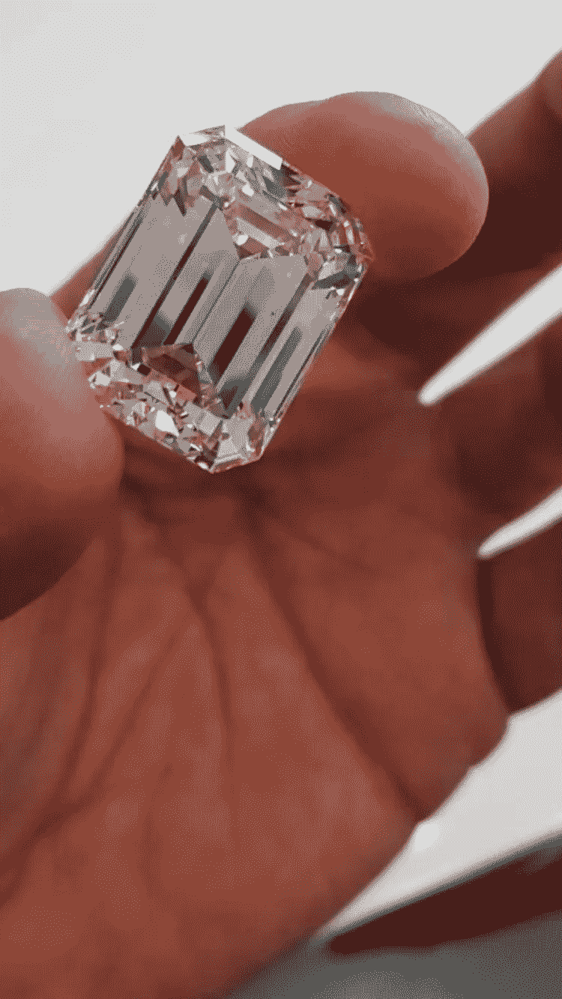

# 付出双倍却得到更少

> 原文：<https://medium.datadriveninvestor.com/everyone-enjoys-a-spot-of-play-acting-and-in-the-interests-of-informing-and-hopefully-entertaining-1cb6ef0ad8ae?source=collection_archive---------15----------------------->

## 不要理会那些由大型珠宝品牌买单的令人向往的营销宣传。

每个人都喜欢一点戏剧表演，我亲爱的读者，为了给你提供信息并希望能让你开心，我们最近沉迷于其中。

你是一个精明的人，有一系列的投资。也许你已经意识到了某些钻石在 2019 年的普遍好处——也许是它们的便携性，或者是它们对不稳定的银行和货币的保护，这并不重要——我们只能说，在当前的气候下，你对在金库或床下藏一些钻石的想法很感兴趣。

现在，假设你的伴侣暗示他们会在生日时**喜欢**一些漂亮的钻石耳环。他们希望耳环看起来惊艳，给每个看到它们的人留下深刻印象，所以你需要顶级钻石。你知道这比通常足够的购书券或加油站鲜花更贵，但是到底贵多少呢？

耳钉的铂金底座并不昂贵，对于熟练的工匠来说也不是特别难制作。其实挺便宜的。所需铂金的成本约为 300 英镑，再加上人工费和一些利润，就变成了 500 英镑。让这个数字翻倍吧，这样我们就能给伦敦最昂贵、最高档的珠宝商一个公平的机会，让他们在我们小小的“实验”中表现出竞争力。

因此，我们假设将两颗钻石镶嵌在铂金上的成本为 1000 英镑——事实并非如此，但让我们继续假装下去，好吗？

我打电话给伦敦 5 家最知名、最受尊敬的珠宝商和钻石商，他们每年花费数百万美元宣传自己的“排他性”，假装成一个尽职尽责的丈夫，想为他心爱的妻子买些耳环。然而，她是一个挑剔的女士。每对耳钉都必须是 **1ct** 圆形明亮式切割， **E** 颜色， **VS1** 净度，并附有 GIA 证书以示保证。

值得一提的是，GIA 是钻石行业中最值得信赖的评级实验室。我看到一些新的评级实验室冒出来，你最好让当地的双层玻璃销售员给你写一份评估报告。

在我打电话之前，我查了一下从一家新型定制珠宝商那里买同样的宝石要花多少钱(稍后会有更多介绍)。

请记住，我们将在宝石价格上增加虚构的 1，000 英镑，以支付铂金底座的费用。

答案是每颗钻石 6000 到 8000**不等。请记住，这些都是 GIA 认证的宝石，来自奢侈品专卖店和世界著名珠宝品牌用来采购钻石的同一家供应商和经销商，所以如果你从这篇文章中得出一个结论，那就是:**

邦德街上的大牌商店以及迪拜、日内瓦和香港的精品店出售的钻石与你能买到的一样，但价格要低得多——如果你知道去哪里找的话。

希望你能从这篇文章中得到更多，而不仅仅是这个事实，但是如果一个事实是极限的话，请让它成为极限:)

在我致电的 5 家伦敦钻石公司中，有 4 家能给我当天的价格，但只能提供部分符合神秘女士规格的耳环。在所有情况下，他们都无法提供质量相当好的钻石，但这肯定会反映在较低的价格上？也许吧。

一位世界知名的珠宝商无法说出他库存的耳环的价格，因为“这是如此私人的东西，电话是如此没有人情味”，然后补充说“公司的政策是不在电话中给出任何价格”。我想知道为什么？也许是因为他们的价格是 ***所以*** 热衷，他们不想让我震惊？也许他们只是真的很兴奋能在邦德街上他们“奇妙且非常舒适”的展厅见到我本人？也许吧。

现在，回到给我报价的 4 家公司。所有人都非常高效、友好和迷人，这无疑是一个优势。

最便宜的报价是**19500**，最贵的是**32900**。但是，较低的报价是针对质量远低于我们指定的宝石，例如，它们是 **SI1** 净度，而不是 **VS1** ，这是一个巨大的差异，就像将法拉利与福特进行比较一样。

这让我们有了其他选择，报价分别为 **25，500** 和 **32，900** 。这些报价是针对更接近所需规格的宝石，但有趣的是，即使他们也只能提供等级稍低的宝石，例如， **F** 颜色而不是 **E** ，以及 **VS2** 而不是 **VS1** 。差异不大，但仍然很显著。

因此，假设从这种新型的伦敦定制珠宝商那里购买钻石的价格是:两颗 1ct、GIA 认证、 **E** 颜色、 **VS1** 净度的圆形钻石的价格是 14000 英镑。让我们也说一下，设置它们的成本是 1000，还是那句话，远不如这个，但是我们继续装下去吧。

总共花费 15，000 英镑为你打造完美的礼物。不便宜，但你永远不会付出巨大的利润，它们甚至可能在几年后慢慢升值。

那么，为什么世界著名的珠宝商对质量较差的宝石收取双倍的价格呢？

还有一个办法。

点击[这里](https://londondiamonds.com)

