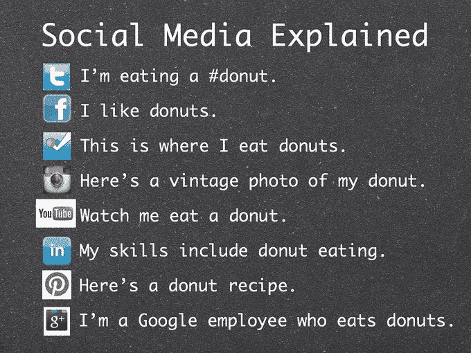

# 每个人都想被听到

> 原文：<https://medium.datadriveninvestor.com/everyone-just-wants-to-be-heard-a1c82c56dc4c?source=collection_archive---------19----------------------->

## 双向对话有助于沟通和建立友谊

人与人之间的双向对话是很自然的。如果不是面对面，特别是通过交谈和倾听，友谊会在网上形成。

企业家面临不同的挑战——或者至少他们认为自己面临不同的挑战。他们必须破解企业对企业和企业对消费者的沟通难题。

[布莱恩·克莱默](https://twitter.com/bryankramer/)认为品牌所有者想得太多，而不是自然地行动。主题演讲人和“教练的教练”在他的畅销书《*中阐述了他的信念，没有 B2B 或 B2C:这是人对人的*作为 H2H 公司的首席执行官，他支持这一观点，该公司专门从事辅导和研讨会。

克雷默与数字营销专家 Madalyn Sklar 谈论了 H2H 原则以及如何成为一名优秀的社交听众。

 [## 我们屏蔽了社交媒体，这引起了公愤。数据驱动的投资者

### 上瘾，我们看不出来。在最近的一项研究中，基于以前的研究成果，我们想…

www.datadriveninvestor.com](https://www.datadriveninvestor.com/2018/12/01/we-blocked-access-to-social-media-it-caused-an-outrage/) 

对于双向对话，克莱默建议品牌所有者应该使用各种方式来集中他们的沟通:

*   确定你的受众。一旦你知道谁是你的观众，你需要知道他们在哪里。一个常见的误解是，每个人都在同一个社交网络上闲逛。
*   制定倾听策略。一旦你知道哪些社交网络与你的受众相关，确定他们在对话中可能会用什么词。创建关键字列表。
*   选择你的技术。有如此多的桌面和移动社交媒体监控工具。
*   指定一个精明的社交媒体经理做你的指定听众。这是一项重要的工作。大公司创建团队来完成这个角色。您还需要为监控创建一个每日计划和定期时间表。
*   制定应对策略。对于不同类型的评论，什么是可接受的回答？列个清单。理想情况下，您指定的听众有权做出回应，这样您就不会在审核和批准过程中浪费时间。
*   要负责任。确保高管们知道社交媒体上发生了什么。是的，给他们一份报告，但也要就公司可能需要如何适应提出建议。社交网络中的事情可能会迅速失控。

品牌所有者应该在人们“生活”的社交网络上寻找顾客。

克莱默说:“乐队不应该说出他们喜欢的网络。“总是去顾客经常光顾的地方。最大的挑战是你要对你所在的网络说话。每一个都不一样。”

# 知道该问什么

成功的社交倾听策略始于提问。

“最好的听众会问最好的问题，”克莱默说。“不要只对你的观众说话。听着。注意了。如果你不知道他们在说什么，你怎么能有效地与他们交流呢？

他说:“要知道什么能引起你的观众的共鸣，就要设身处地地为他们着想。”“他们世界的背景是什么？如果你是他们，你想听什么？这些信息必须能引起他们的共鸣——不一定是你的共鸣——才能被听到。”

 [## 给没有被提及的企业家的建议

### 良好的沟通能增进工作内外的关系

medium.com](https://medium.com/datadriveninvestor/tips-for-entrepreneurs-not-spoken-for-9de87df8653) 

不要犹豫，开门见山。

“无论你是作为一个品牌还是一个人来阅读这篇文章，只要抓住要点就行了，”克莱默说。“我们都很忙。我们关心很多东西。少说话，多听。这适用于信息、内容、对话和关系。”

许多社交媒体监测工具将帮助品牌了解市场情绪，尽管克莱默认为这并不重要。

“我不像关心参与那样关心情绪，”他说。“订婚意味着他们在乎。有了参与，你的品牌世界就打开了。在创造终身客户价值方面，点击量和浏览量排名靠后。

“感情让我们看到他们的社交肢体语言，”克莱默说。“这很有帮助。工具很重要，但不如你如何利用数据更好地参与进来重要。一切都应该导致更好的参与。”

一个好的社交听众有一些特殊的特征。品牌所有者可能会想让这样的指定听众加入他们的团队。

“我们最喜欢的品牌和产品的简单性让我们爱上了它们，因为它们会倾听，”克莱默说。“要让如此复杂的事情看起来如此简单，需要付出很多努力。有人称之为才华，但也许我们应该称之为做人。

“每个人都想被听到，”他说。“体现同样的在线互动哲学会让你更人性化。做一个积极而被动的倾听者，让你的品牌免于被摧毁。用同理心向前迈进，超越数字时代。”

# 生产性参与

创业者花在思考如何回复上的时间就是浪费的时间。

“在你的回答中，首先向顾客反映他们所说的，以确保你理解，”克莱默说。“社会背景是关键。也就是说，立即开始参与。

“通过及时、相关的方式做出回应，你会看到你的联系开始扩大，粉丝会因为知道他们的重要性而向你靠拢，”他说。“通过积极倾听，你会创造出值得与更多人一次又一次分享的经历——远远超过可怕的沉默。”

 [## 如果你想看到成长，就和别人交往吧

### 建立在线和面对面的关系

medium.com](https://medium.com/datadriveninvestor/engage-with-others-if-you-want-to-see-growth-c7e114b4a03d) 

社交媒体上的事情可能会很快失控。品牌需要选择一个参与度并坚持下去，而不是把自己降低到诋毁者的水平。

“在你的办公室里，围着一张桌子坐下来，大声练习各种场景，”克莱默说。“如果你能处理好这一点，你就能处理好一切。”

不要把自己描绘成专家。其他人可能更适合这个角色。

“并不是每个人都天生擅长社交，”克莱默说。“确保你安排了合适的人，他们能够处理可能出现的情况。

“不是每个人都是社交领域的超级明星，”他说。“向你的员工传授与他人联系这一人类核心需求的好处至关重要。这为那些以防万一的时刻树立了他们的信心。”

**关于作者**

吉姆·卡扎曼是[拉戈金融服务公司](http://largofinancialservices.com/?source=post_page---------------------------)的经理，曾在空军和联邦政府的公共事务部门工作。你可以在[推特](https://twitter.com/JKatzaman?source=post_page---------------------------)、[脸书](https://www.facebook.com/jim.katzaman?source=post_page---------------------------)和 [LinkedIn](https://www.linkedin.com/in/jim-katzaman-33641b21/?source=post_page---------------------------) 上和他联系。

*原载于 2019 年 8 月 12 日*[*https://www.datadriveninvestor.com*](https://www.datadriveninvestor.com/2019/08/12/everyone-just-wants-to-be-heard/)*。*