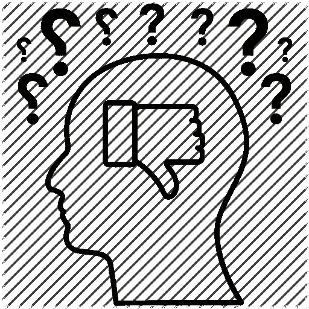

# 每个人都不擅长编程，克服它。

> 原文：<https://medium.datadriveninvestor.com/everyone-sucks-at-programming-get-over-it-2bdf0a468d73?source=collection_archive---------5----------------------->

最近在查看我的电子邮件时，我注意到我的媒体每日文摘中的一篇建议文章，标题是“[你在编程方面将会失败的 10 个迹象”。](https://blog.usejournal.com/10-signs-you-will-suck-at-programming-5497a6a52c5c)“这篇文章是一个看似庞大的文献的追随者，它讨论了可能使你成为一个糟糕的程序员的品质和经历。

通过这篇文章，我希望解释这些文章对新程序员或那些可能考虑开始美好旅程的人的不利影响。我希望这也能温和地提醒我们那些势利的精英朋友，他们也曾经不擅长编程。事实上，如果说每个人都不擅长编程，而你的经历、性格类型或品质与此无关，这并不是非常牵强。这完全取决于努力工作和学习的意愿。

Education and help makes better programmers, not demoralization and debilitation of confidence. [Image Source](https://icodeschool.com/wp-content/uploads/2019/02/Screen-Shot-2019-02-12-at-8.26.00-AM-1030x682.png)

这类文章的主要缺点是它们可能会**极度打击人的积极性。**人类天生懒惰，我们讨厌工作，更不用说开始新的事情了，作为一名大学生，我可以担保开始一项新任务需要多少动力。最重要的是，学习编写代码可能会令人沮丧，它需要长时间的纯粹意志力来自信地编写代码。

 [## 2019 年最值得学习的编码语言|数据驱动的投资者

### 在我读大学的那几年，我跳过了很多次夜游去学习 Java，希望有一天它能帮助我在…

www.datadriveninvestor.com](https://www.datadriveninvestor.com/2019/02/21/best-coding-languages-to-learn-in-2019/) 

如果在这场斗争中，有人读到一篇文章，定义了一个糟糕的程序员的素质，那么怎样才能防止这个人完全放弃这个想法，认为他们注定不会编程呢？

我发现自己被这篇文章影响的一个很大的方式是通过引导思考。我们似乎倾向于将自己局限于看似熟悉的事物，因此，当作者使用模糊的度量标准来衡量读者将会是多么可悲的程序员时，我发现自己在思考那些我更符合那些度量标准的例子。也许有些人有相反的想法，或者有些人甚至不这样想，但关键是，如果有 10 个人试图适应这些指标，为什么要打击他们的积极性呢？俗话说，如果你没有什么好的话要说，为什么要说呢？

[Image Source](https://cdn0.iconfinder.com/data/icons/project-management-1-15/65/53-512.png)

此外，每个人都有自己独特的生活经历，这些经历构成了他们性格的一大部分。由于每个人都是独一无二的，**不管任务是什么，我们都按照自己的节奏学习。确定这一点后，让我们来看看本文中提供的一个指标。第八个标准是“僵化、狭隘和/或无组织的思维”，其解释是“如果你的思维僵化，你很难保持代码的组织性——推而广之，你的思维有组织、有重点，你永远不会在编程方面取得成功。”**

我对这篇文章的问题在于短语“**你永远不会在编程**上成功，”在每一个度量标准之后，这个短语在整篇文章中被大量使用。正如我们所意识到的，每个人都以自己的速度学习，当然，那些思维更有条理的人(首先是一个非常主观的指标)可能比其他人更容易获得成功。但是说你永远不会成为一个成功的程序员是不正确的。

学习编程的全部意义在于学习组织一个人的思想，进而学习编写代码。因此，随着你的不断学习和成长，这项技能会变得更加完善，随着它变得更加完善，你将成为一名更加成功的程序员。这里的问题是告诉某人他们永远不会在某件事上成功，而不是解释这是一个成长和教育的过程，只要你再试一次，失败也没关系。这是人们对一个自称是老师的人最起码的期望。

此外，这个故事似乎对所有的论点都是一样的，这些都是值得拥有的技能，但是一些程序员在成功的道路上发展。将这些作为编程成功的条件，就相当于赞美一种特定的人格类型，这种人格类型没有勾选这些框中的大部分(如果不是全部的话)，这对世界上的其他人来说似乎很不公平，尤其是那些刚刚起步的人。

最后，那些可能在一个指标上打勾的人可能不会在另一个指标上打勾。毕竟，没有人生来就是伟大的程序员，也没有人生来就是伟大的，这都是努力工作的结果。伟大的程序员和真正糟糕的程序员之间的区别不是他们的个性或习惯，而是伟大的程序员总是通过努力学习和工作来识别和修复他们的缺陷，而糟糕的程序员则忙于定义其他人在编程方面糟糕的标准。

[Image Source](https://res.cloudinary.com/teepublic/image/private/s--YYTESsXQ--/t_Resized%20Artwork/c_fit,g_north_west,h_954,w_954/co_fffffe,e_outline:48/co_fffffe,e_outline:inner_fill:48/co_ffffff,e_outline:48/co_ffffff,e_outline:inner_fill:48/co_bbbbbb,e_outline:3:1000/c_mpad,g_center,h_1260,w_1260/b_rgb:eeeeee/c_limit,f_jpg,h_630,q_90,w_630/v1503430065/production/designs/1843730_1.jpg). Maybe more stickers don’t make a better programmer, but here’s one everyone should have

编程的美妙之处在于任何人都可以做，社区不在乎种族、种姓、性别、宗教等等。编程是为每个人准备的，通过像这样的文章，人们往往会士气低落，有些人试图破坏这种美。所以，我的作家同事们，在你写下一个“点击诱饵”标题之前，请考虑一下你的文章的后果。

谢谢你

***
注:文章，如果你想看，第一段有链接。欢迎在下面分享你的回答和想法。

**