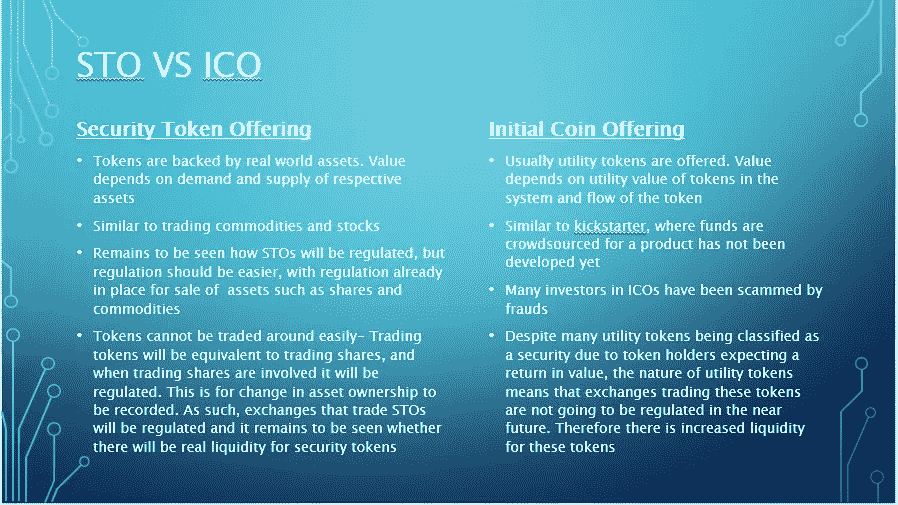

# 散户投资者今天需要知道的关于 s to 的一切

> 原文：<https://medium.datadriveninvestor.com/everything-the-retail-investor-needs-to-know-about-stos-today-e98c59972d41?source=collection_archive---------17----------------------->

Terms You Hear In Any Market

在任何市场中，必然会有两样东西——贪婪和恐惧。即使在加密货币市场也是如此。在去年加密货币价格和 ico 爆炸之后，随着现实的到来，现在市场上有很多担忧。许多国际投资公司不能像过去那样纯粹通过国际投资公司筹集资金，而是通过发行股票来筹集资金。越来越多的投资者对 ICO 项目越来越持怀疑态度，我认为这实际上对整个行业都有好处。

许多人开始意识到的一件事是，ico 中提供的实用工具令牌通常没有支持它们的资产。随之而来的是 sto(安全令牌产品)的出现。什么是 sto，我们能从它们身上期待什么，它们是未来吗？将在这篇文章中分享我的想法。

# 什么是安全令牌？

Sell Your House With Security Tokens

如果我让你列举几个世界上的资产，你会怎么说？你可能会说黄金、股票、债券、房地产以及任何你认为有价值的东西。简单地说，安全令牌是代表这些资产所有权的令牌。

这实际上是如何做到的？首先，这些资产被数字化。例如，房地产地契可以放在区块链上，通过人工智能(AI)确认其有效性。接下来，铸造一定数量的令牌来表示资产。代币的所有者将拥有资产的一部分，这取决于他们实际拥有多少代币。

通过 sto 有什么潜力？如果用一个词来概括主要好处，那就是“流动性”。我不是房地产专家，但我可以肯定，如果你想出售一套公寓，这套公寓的所有权将只转让给一方。然而，通过 STOs，公寓的所有权可以分散，你不必等待高净值个人支付整个公寓。这使得清算你拥有的任何资产变得容易得多。

# **斯托斯 vs ICOs**

由于 sto 的例子很少，而且 sto 的执行方式还不完全清楚，我将分享我个人对主要差异的看法。

Differences between STOs and ICOs

请注意，加密空间仍然相对较新，甚至 ico 在未来也可能会发生重大变化。然而，根据我现在看到的，这些是 sto 和 ico 之间的区别。

# **斯托斯的现状**

Polymath’s Homepage

我将关注的一家公司是博学者。他们打算创建一个平台，让公司可以创建自己的安全令牌，并得到监管机构的认可。为了实现这一点，**法律代表、公司、投资者和 KYC 供应商**都被带到平台上。Polymath 计划将投资者与 KYC 供应商联系起来，进行 KYC，法律代表将与公司合作。我喜欢的是 Polymath 对待监管机构批准的态度，这使得这看起来像是一个可行的计划。

如果你想了解更多，这篇[文章](https://medium.com/faast/is-polymath-poly-your-ticket-to-the-10-trillion-security-token-revolution-ddab56926874)很好地总结了博学者的工作。

# STOs 是下一个加密浪潮吗？

我认为在加密领域有太多的人总是在炒作区块链的未来，而没有看到目前需要做的工作。在主流社会中，ico 对许多人来说仍然是一个相对较新的术语，即使对于 ico，我们也没有明确的监管方向。

因此，我不认为 STOs 会很快成为一件大事。为了保证证券的流动性，需要有大规模的采用。STOs 是一个开始在加密领域出现的术语，虽然还处于早期，但肯定是我会关注的事情，你也应该关注！

# 给你的一篇文章

为了实现大规模采用，区块链内容需要被分解，并以大众理解的术语传达给他们。这也是我写这样的观点文章的原因——让大众更好地了解区块链技术和加密货币。

喜欢你读的吗？如果你是一家寻求内容营销支持的区块链公司，让我为你写更好的文章！

[立即提升您的营销水平](http://blockconstellation.com/contact/)

**联系我**
**网站**:[http://blockconstellation.com/](http://blockconstellation.com/)
**邮箱**:jiayung@blockconstellation.com
**领英:**[https://www.linkedin.com/in/jia-yung/](https://www.linkedin.com/in/jia-yung/)