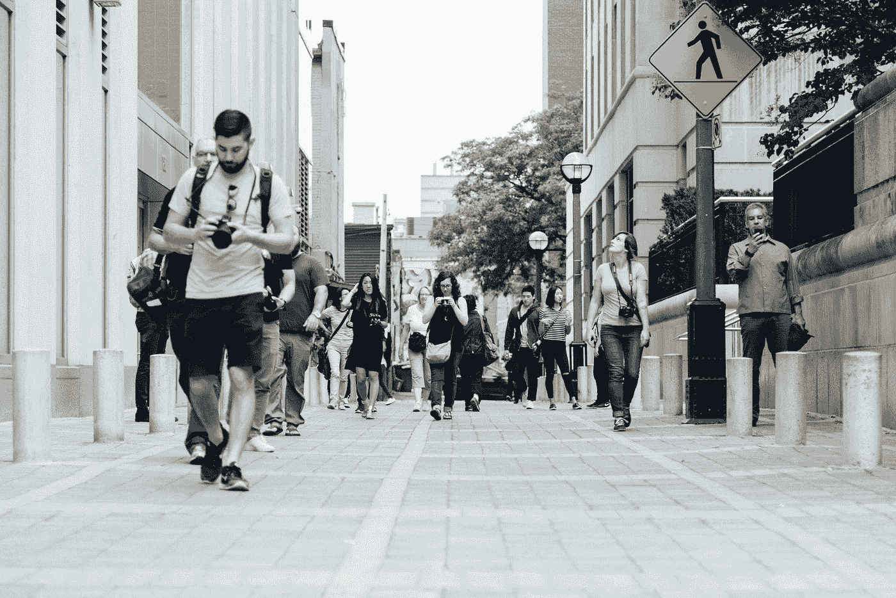

# 你能做的一切来简化你的生活

> 原文：<https://medium.datadriveninvestor.com/everything-you-can-do-to-simplify-your-life-dd9699a8c3b6?source=collection_archive---------6----------------------->

“A diverse group of pedestrians walks down a sidewalk in Toronto” by [Matt Quinn](https://unsplash.com/@matt_quinn?utm_source=medium&utm_medium=referral) on [Unsplash](https://unsplash.com?utm_source=medium&utm_medium=referral)

随着我们生活的进展，它只会随着时间的流逝而变得复杂。无论是你的工作还是个人生活的复杂性，问题都会增加。日益增加的复杂性剥夺了你的快乐，也让你很难获得成功。

> 但是复杂度是怎么增加的呢？随着时间的推移，各种事情的积累增加了我们生活的复杂性，使我们很难简化生活。让我用简单的经济学术语给你解释一下这个概念。

在经济学中，有一个术语叫做持有成本。持有成本基本上是你持有存货、设备、折旧和员工需要承担的总成本。如果你不处理掉多余的库存，持有成本只会随着时间的推移而增加。

随着时间的推移，成本会成倍增加，并让你背上巨大的产品债务。因此，你可以明显地理解，摆脱增加的过剩库存总是明智的。

嗯，这也发生在我们的个人生活中。无论是产品还是关系，任何需要定期投入时间、金钱以及注意力，却不能给你的生活带来任何积极影响的事情，基本上都类似于库存过剩。

然而，在商业中，你可以控制库存、产品负债和创建一个适当的时间管理系统。它将降低运输成本，简化您的业务。

## 但是如何简化你自己的生活呢？你会怎样处理掉你不需要的东西？

> 好吧，在我继续向你解释你可以用来去除生活中不必要的东西的技巧之前；让我来告诉你，为了简化生活，你可以从生活中剔除一些东西。那么，让我们来看看:

# 1.人员:

我们人类是群居动物。我们喜欢住在别人的附近。我们通过互动与周围的人建立联系和关系。因此，没有理由怀疑这样一个事实:没有人在我们的生活中，我们就无法正常生活。

但这并不意味着你需要继续每一段关系。为了让你的生活简单快乐，有一些人你可以很容易地排除掉。

你可能已经经历过，很少有关系，很少有人需要你投入大量的时间、金钱和精力。

然而，这些人并不那么亲近你，也没有给你的生活增加任何有价值的东西。他们所做的只是让你的一切变得更复杂。

> 如果是这样的话，摆脱他们总是明智的。你可以不回复他们的短信，也可以不跟他们见面。换句话说，你避开他们，慢慢和他们拉开距离。从我个人的经验来看，我可以向你保证，这将有助于简化你的生活。

在我的一生中，我见过很多人。尽管如此，我还是能够通过巧妙地远离那些增加我生活复杂性的人来保持我的生活简单。

# 2.信用卡债务:

当你没有足够的钱买东西时，用信用卡买东西非常方便。但是如果我告诉你，信用卡是你的生活变得日益复杂的主要原因之一呢？尽管你没有意识到，但这是完全真实的。

信用卡鼓励你不加思索地购买产品。当你有信用卡并且有能力偿还信用卡债务时，你不会考虑你所购买的产品的重要性。

结果，你最终创造了一堆你实际上并不需要的东西。但你仍然继续支付信用卡债务。这就是为什么最好扔掉你的信用卡。

> 去你的银行注销你所有的每一张信用卡。它会防止你购买不必要的产品和花不必要的钱。因此，它最终会让你的生活变得更加简单和容易。

# 3.好事过多:

在我看来，过简单生活的最好诀窍就是拥有一种普通的生活方式。如果你继续变得非凡，那么你永远不能期望你的生活简单。假设，你每天晚上都在最豪华的餐厅用餐，或者经常进行昂贵的度假。

如果是这样的话，你就不能指望你的生活会简单。你通过只享受美好事物来追求幸福，这将成为你问题的根源。嗯，俗话说“好事太多，从来都不是好事”；好像完全是真的。

# 如何消除事物来简化你的生活？

好吧，现在，让我告诉你一些方法，你可以消除生活中不需要的东西，从而简化生活。

# 1.帕累托原则:

帕累托原则是一个简单的技巧，我用它来区分我生活中真正重要的事情和可扩展的事情。

## 那么，你会如何在生活中应用呢？嗯，这真的很简单，我在我的个人生活中以及在做商业决策时已经多次使用过这种技巧。

所以，你需要做的是列出你生活中需要的东西。重复几次这个简单的练习后，你会列出对你来说最重要的人和事。没有列在你清单上的事情都不重要。所以，你可以轻松摆脱他们。

# 2.扪心自问:

不如把这一步看成是上一步的延续。它会帮助你再次确认你的决定，消除那些对你的生活不必要的东西。

再次检查准备好的清单，想想你是否遗漏了任何产品。此外，你还需要问问自己，你添加到清单上的东西是否真的有必要。

> 一旦你在质疑自己之后完全正确地确认了你的决定，你将真正能够消除事情，让你的生活变得简单。

## 生活中的简单可以通过减去不必要的东西来实现。让我们自己被我们不需要的东西包围只会让你效率更低，并在你周围制造一种令人窒息的氛围。所以，消除那些你不需要的东西，通过让你的生活变得简单来获得快乐