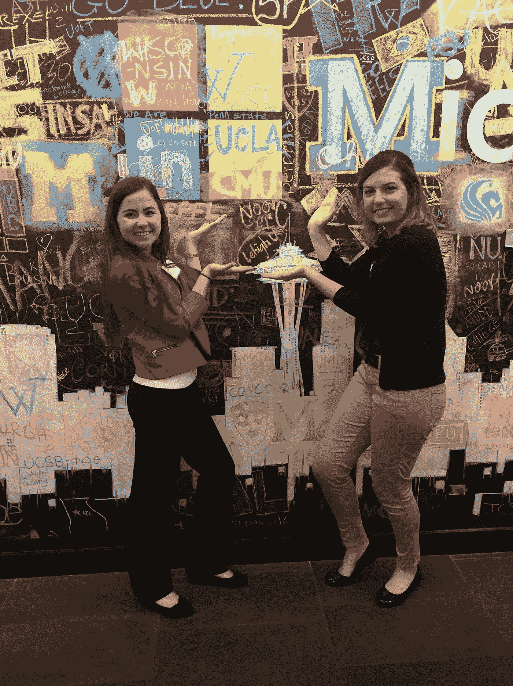

# 关于微软探索者面试你需要知道的一切

> 原文：<https://medium.datadriveninvestor.com/everything-you-need-to-know-about-interviewing-for-microsoft-explorer-3bf9ff6dc2e?source=collection_archive---------2----------------------->

大家好！在过去的几年里，我收到了许多来自陌生人和朋友的信息，询问我关于微软浏览器面试的经历，以及我是否有什么建议。我写下了我的经历，并向许多人传达了同样的信息，现在我决定公开分享它，这样每个参加微软探索者计划面试的人都可以获得它！:)

my friend Caroline and I after our Explorer interviews

2015 年 11 月，我完成了大一新生微软探索者的第一轮面试，没有进入最后几轮。然而，我的招聘人员向我解释说，他们仍然看到了我的潜力，一旦我有了更多的经验，他们会在我大二的时候给我最后一轮面试。我在 2016 年 10 月进行了最后一轮面试，并在接下来的周一收到了我的录用通知。

一些免责声明:这篇文章是关于我面试微软探索者项目的个人经历。这不是一个正式的职位，面试经历因人而异。然而，我希望这篇文章能让参加面试的学生有所了解，尤其是因为对你们中的许多人来说，这将是你们的第一次技术面试！

**初筛**

微软探索者项目面试的第一步是初步筛选。一般来说，在最初的筛选过程中(通过电话或在你的大学校园里进行)，微软希望了解你这个人，以及你是否有能力成为一名优秀的团队成员。一般来说，他们会问一些软技能问题(例如:告诉我们你不得不与一个难相处的队友一起工作的时候，你是如何处理这种情况的)，关于你简历的问题(我建议练习大声地向某人谈论你简历上的项目/经历，因为一切对面试官来说都是公平的问题)，他们可能会问一个项目经理问题(例如:如果你是一个为盲人建造厨房项目的项目经理，你开始这个项目的第一步是什么？).他们通常在最初的筛选中寻找热情、激情和动力。

**最后一轮**

如果你通过了初步筛选，微软将邀请你去雷德蒙校园参加最后一轮面试。对于探险家面试，你通常有三次 45 分钟的面试。这些访谈可以是技术性的(白板编码)，也可以是预防性维护(通常他们会问产品设计之类的问题)。我知道有些人参加过所有的技术面试和所有的项目经理面试，所以这是随机的，你应该为这两种类型的面试做好准备。

对于技术编码面试，他们通常会通用破解编码面试风格的问题。总的来说，他们倾向于问探险者更简单的问题。我面试的时候有两次技术面试。第一位面试官问了我一个字符串问题，并谈论了二叉查找树和哈希表之间的区别。第二个面试官让我写一个合并两个排序链表的函数。我想我的问题对于探险者来说是比较容易回答的。例如，我有一个朋友，他必须写一些遍历二分搜索法树的函数，这有点难。一旦掌握了技术知识，就要确保练习白板编码，因为在白板上编写和解释代码与在电脑上键入代码有很大不同(我和一些朋友每周都会在宿舍休息室见面几次，并在面试前练习白板编码)。

对于 PM 面试，他们可能会问你关于设计的问题。我没有为这些面试做非常彻底的准备，但我认为他们寻求的是你考虑到客户的需求，并为客户提供最佳解决方案。他们也可能会问你类似“你最喜欢的微软产品是什么，你想对它做些什么改变？”在我的采访中，我实际上问了我的面试官为什么他用 iPhone 而不是 Windows Phone，我们进入了一个关于 Windows Phone 为什么表现不佳的整个讨论，他问我“如果你负责 Windows Phone 产品，你会做些什么来增加 Windows Phone 用户的数量？”

最后，确保你想出一些你想问面试官的问题，因为通常在面试结束时你会有一些时间，如果你没有什么可以问他们的话，会有点尴尬。我的首要问题通常是:

*   你为什么选择微软而不是其他公司？
*   你为什么在微软呆了这么久？你想过换一家公司试试吗？
*   你最喜欢你工作中的哪一点？
*   在你的团队中，工作与生活的平衡是怎样的？

这里有一些额外的资源可以帮助你找到一份大三学生的实习工作:

*   [得到一份工作](https://github.com/cassidoo/getting-a-gig)
*   [科技实习大一新生指南](http://callacarter.com/csfrosh/)