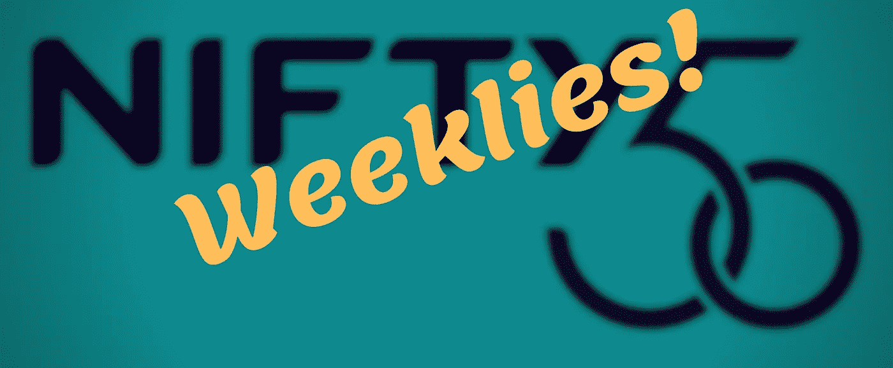
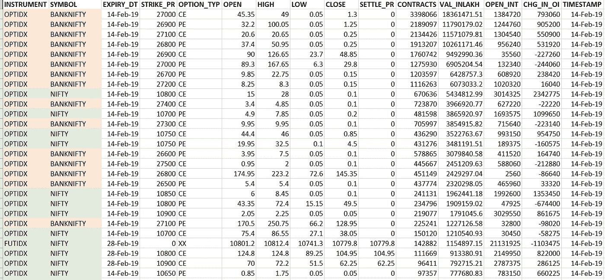
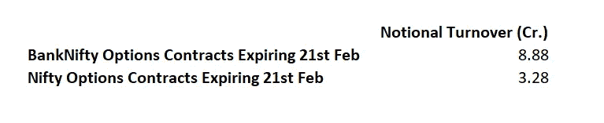
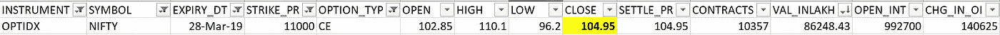
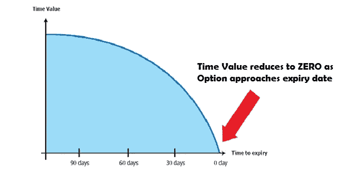

# 你需要知道的关于新的每周合同的一切(第 1/2 部分)

> 原文：<https://medium.datadriveninvestor.com/everything-you-need-to-know-about-the-new-nifty-weekly-contract-part-1-2-6b7bbbdcbbe8?source=collection_archive---------2----------------------->

Nifty Weekly Options Were Launched by the National Stock Exchange

你可能还没有意识到，但你很快就会意识到。

当然，我们指的是印度国家证券交易所最近宣布推出基准 Nifty 50 指数的每周 Nifty 期权合约。在这个由两部分组成的系列中，我们将详细探索这个新生的产品。本文(第 1 部分)向您介绍了该产品，它是如何定价的，以及如何从整体的角度考虑它。第 2 部分将深入研究定价模式，探索什么样的交易策略可以专门用于交易漂亮的周线。

> [DDI 编辑推荐——使用技术分析开始交易股票！](http://go.datadriveninvestor.com/stocktradingTA1/matf)

# 细节(产品细节)

一些重要的细节包括:

1.  合约在每周四收盘时到期；如果这是一个假日，则选择假日之前的交易日作为到期日
2.  在任何时间点都有七份每周合约，*不包括每月到期的那一周*
3.  周刊和月刊之间的罢工间隔相同
4.  实时交易于 2019 年 2 月 11 日开始

交易所推出产品可能很难操作，但不应该完全避免。作为一个量化交易者，用保守的头寸规模策略谨慎地探索新市场是一个好主意，但同时，利用市场的低效并发现新的想法。在这个由两部分组成的系列中，我们将试图预测漂亮的每周期权产品介绍的未来成功，并根据我们目前所知道的来推测交易策略。

# 周期权合约与月期权合约:它们有何不同

让我们快速看一下 2019 年 2 月 14 日所有 FnO 活动的 NSE Bhavcopy 文件，这是有史以来第一个每周到期日。(Bhavcopy 是指由 NSE 发布的文件，其中包括 NSE 上市证券的真实价格/交易量数据)。

这些合约按照交易量降序排列，银行 Nifty 合约以红色突出显示，Nifty 合约以绿色突出显示。

可以证明的是，将于 2 月 14 日到期的 BankNifty 周刊主导了交易活动。然而，漂亮的周刊并没有被忽视；如果有什么不同的话，参与者积极地涉足其中。以下是当日期权交易在 BankNifty 和 Nifty 之间的成交情况:

BankNifty and Nifty Options Weekly Contracts Expiring on 14th Feb 2019

这是一个很好的迹象，表明每周漂亮的期权正受到市场参与者的信任。随着时间的推移，随着认知度的提高，新产品的营业额只会增加，这是合理的。如下图所示，2019 年 2 月 21 日的数字令人鼓舞，因为 Nifty 周刊在第二周完成的成交量占 Nifty 和 BankNifty 期权合约总成交量的百分比高于第一周。

BankNifty and Nifty Options Weekly Contracts Expiring on 21st Feb 2019

# 期权定价概述

为了理解 Nifty 周期权与 Nifty 月期权的定价有何不同，让我们先快速复习一下期权定价。

> 思考期权的最佳方式是，从字面上把每一笔交易想象成这样一种情况:你支付少量费用，以便拥有以某一价格购买产品的选择权。
> 
> 例如，当你购买一个**看涨期权**时，你就有了 ***期权*** 来购买该产品
> 
> a.a .指定价格*(称为执行价格)* b .固定的一次性费用*(溢价，您可以将其视为“赌注”)* c .在预先指定的日期和时间之前的任何时间*(到期)*

让我们假设 Nifty 目前的交易价格是 10800，今天的日期是 2019 年 2 月 22 日。

你看好印度经济，预计到 3 月底，Nifty 将升至 12000 点。事实上，你是如此的自信，以至于你愿意赌 Rs。100，到 2019 年 3 月 28 日，Nifty 将至少达到 11000。

换句话说，你愿意支付卢比。100，以便在 3 月 28 日之前的任何时候拥有以 11000 的价格购买 Nifty 的*期权*。记住，你认为 Nifty 会一直涨到 12000 点，Nifty 目前在 10800 点。

这是一个好的赌注吗？

在你眼里，是的！你很乐意付卢比。100 美元，以便在 11000 美元时购买期权。事实上，这基本上就是 2019 年 3 月 28 日 Nifty 11000 看涨期权的当前溢价。

在你看来，这是一个很好的赌注，原因很简单:

1.  这是一个小赌注(Rs。100)
2.  上升空间无限。如果 Nifty 涨到 12000，你就赚了 12000-11000 卢比。从交易中获得 1000。算上 Rs 的“投注费”后。100，你的总利润是卢比。900.

既然我们已经介绍了什么是看涨期权，让我们快速介绍一下看跌期权。看跌期权与看涨期权的工作方式完全相同，不同之处在于合同的买方有权以预定的价格卖出。想象一下同样的情形，除了你预计 Nifty 的价格会下跌。你仍然希望有卖出的选择权，而不是义务，这样你就可以从大幅下跌中获利，但将损失控制在固定的范围内。在这种情况下，你只需购买看跌期权。

让我们回到那个年代。以看涨期权为例下注 100。记住，你愿意付卢比。100 美元，以便在 3 月 28 日之前的任何时候以 11000 美元的价格购买 Nifty。假设今天是 2 月 22 日。因此，还有 34 天到期。

让我们在这一点上问自己一个问题:这个特定交易的*卖方*承担了什么风险？

与你不同，赌注的卖方没有选择权。无论 Nifty 发生什么情况，他都有义务以 11000 点的价格卖出(T2)。那是一个危险的地方！如果俏皮一路攀升到 13000 呢？为了获得承担这一风险的补偿，卖方需要预先支付一笔费用，而你也很乐意支付这笔费用。

在这种情况下，卖方获得卢比。100.卖家希望 Nifty 不会做你认为它将要做的事情。他不希望 Nifty 涨价！

与卖方押注相关的风险是巨大的，主要是因为在**五**周内可能会发生很多事情。如果我们把这个时间从五个星期改成，比如说，两个星期。风险状况如何变化？

好吧，如果我们假设 Nifty 目前处于 10800 点，并且卖方只有在 Nifty 升至 11000 点以上时才有义务付款，那么 Nifty 越过 200 点的可能性随着到期时间的减少而下降。因此，卖方承担的风险肯定会在到期前两周**比五周**低。

那么，比如说，在到期前一个小时呢？如果同样的条件成立——即 Nifty 在 10800，Strike 在 11000——那么卖家几乎没有承担风险，不是吗？在这种情况下，溢价，也就是买方实质上支付给卖方的，也将相应地几乎不存在——可能只有一两个卢比。

这就是期权定价的工作原理。溢价的价格以如下方式衰减到 0。

The Time Value of the Premium reduces to 0 as Expiry Approaches

如果你想知道什么是“时间价值”，请记住，溢价由两部分组成:内在价值和时间价值。在我们的例子中，内在价值在所有情况下都是 0，因为期权不在钱里。如果期权存在于货币中，那么(Nifty-Strike)差额(基本上，卖方应支付给买方的金额)就是内在价值，这是一个正数，是溢价的组成部分之一。

# 从定价的角度来看，时尚周刊和时尚月刊有什么不同？

新的周合同和传统的漂亮的月合同之间的唯一区别是周合同每周到期。比如说，你现在可以选择用一周内到期的相同产品来交换溢价，而不是五周内到期的产品。因为我们知道，随着到期时间变为零，溢价也变为零，所以我们知道周线交易的溢价将比月线交易的溢价低得多。

但是增加多少呢？

事实证明，溢价相差很大，周刊提供了惊人的高时间价值，如果利用正确的风险管理技术进行优化，可以为愿意涉足新产品的精明期权卖方提供丰厚的回报。因为每个月有四个星期，你每个月有四个完整的交易周期可以利用。我们将在本系列的第 2 部分探讨其中的一些机会。

*[*作者*](https://www.linkedin.com/in/raghukumarrksv) *是人工智能驱动的基金管理公司*[*RAIN Technologies*](https://rainfund.ai/)*的联合创始人。**