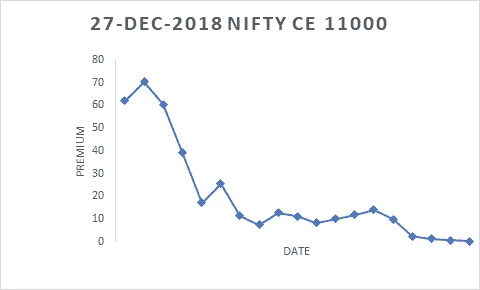
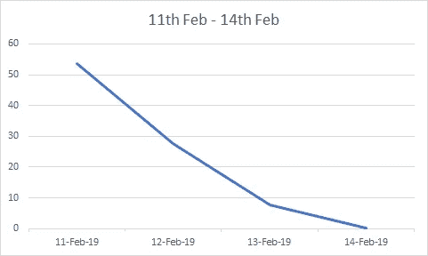
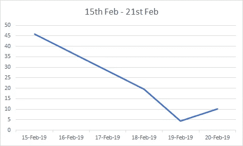
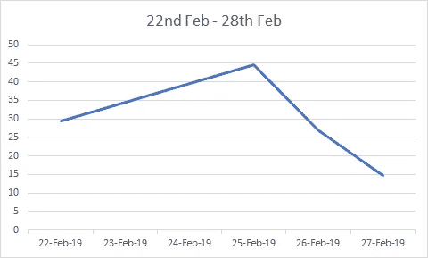
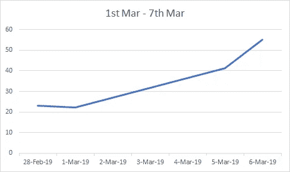

# 你需要知道的关于新的每周合同的一切(第 2/2 部分)

> 原文：<https://medium.datadriveninvestor.com/everything-you-need-to-know-about-the-new-nifty-weekly-contract-part-2-2-d6e136ec52b4?source=collection_archive---------1----------------------->

NSE Weekly Nifties are a Huge Hit!

[在上一篇文章](https://medium.com/datadriveninvestor/everything-you-need-to-know-about-the-new-nifty-weekly-contract-part-1-2-6b7bbbdcbbe8)中，我们介绍了 NSE Weekly Nifties 产品。正如大多数印度商人所知，NSE Nifty F & O 产品通常有每月的到期周期。每个月都会推出一系列新的期货和期权。随着周刊的出现，每周都有新的合约发布。因此，合同的期限从 4 周缩短到 1 周。

 [## 股票市场投资的机器学习——数据驱动的投资者

### 当你的一个朋友在脸书上传你的新海滩照，平台建议给你的脸加上标签，这是…

www.datadriveninvestor.com](https://www.datadriveninvestor.com/2019/01/30/machine-learning-for-stock-market-investing/) 

从定价的角度来看，这如何改变事情？

这是一个漂亮的 2018 年 12 月看涨期权，价格为 11000 点，时间跨度为一整个月——11 月 30 日至 12 月 27 日。这实际上是 OTM 第一次大罢工

The December 2018 12000 Call Option Spanning the Trading Month

虽然保费将到期为零，但它不会在整个生命周期中以相同的速度衰减。保费由两部分组成:内在价值和时间价值。在这种情况下，由于期权显然是 OTM，因此没有内在价值。选项的时间值是 60，衰减到 0。衰变率不是线性的；相反，期权开始时衰减缓慢，接近月底时衰减更快(假设其他变量保持不变)。

这是从 2 月 14 日到期到 3 月 7 日到期的四个漂亮的每周合约，使用的是第一个主要的 OTM 合约。

Week Number One

Week Number Two

Week Number Three

Week Number Four

请记住，由于克什米尔日益紧张的局势，过去两周的漂亮交易一直非常波动(虽然我们不会在本文中详细讨论期权定价模型，但你应该记住，随着总体波动性的增加，期权“在钱里”的可能性增加；因此，溢价飙升)

粗略地看一下每周的 Nifty 期权合约价格，似乎表明价格以不同于常规月度序列的行为曲线衰减。这似乎也表明，许多类型的合约间套利应该是可能的，假设这种水平的流动性保持不变，交易者继续利用周线提供的独特交易机会。

我们将继续探索交易策略，包括期货文章中新的漂亮的周合约。敬请期待！

*作者是人工智能驱动的基金管理公司*[*RAIN Technologies*](https://rainfund.ai/)*的联合创始人。*