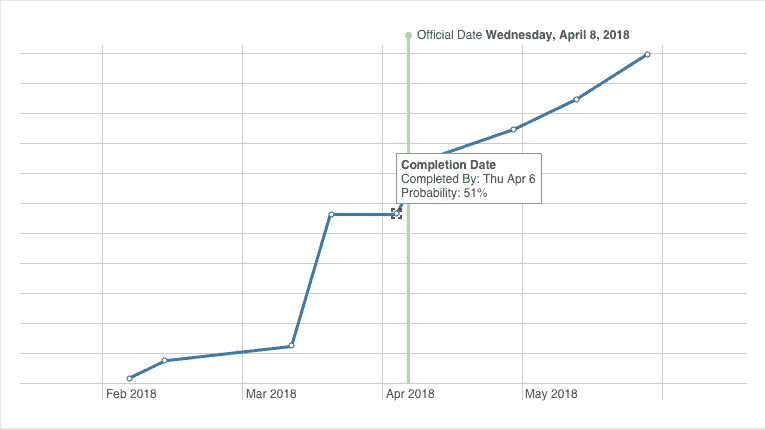

# 基于证据的调度

> 原文：<https://medium.datadriveninvestor.com/evidence-based-scheduling-c6e028efe94d?source=collection_archive---------15----------------------->

[基于证据的计划(EBS)](https://en.wikipedia.org/wiki/Evidence-based_scheduling) 是今天[项目管理软件](https://www.fogbugz.com/try-fogbugz.html)最具革命性和令人兴奋的特性之一。EBS 的发明者乔尔·斯波尔斯基(Joel Spolsky)对此做了最佳描述:

“软件开发人员不太喜欢制定时间表。通常情况下，他们会试图逃脱。该做的时候会做的！”他们说，期待这样一个勇敢、有趣的笑话会让他们的老板大笑，然后在随后的欢乐中，时间表会被忘记。

你看到的大部分时间表都是半心半意的尝试。它们存储在某个地方的文件共享中，然后就被完全遗忘了。当这些团队在两年后发货时，办公室里那个带着文件柜的古怪家伙把旧的打印出来的东西带来进行事后分析，每个人都开怀大笑。嘿快看！我们给了两周的时间用 Ruby 从头开始重写。"

乔尔指出，有必要弄清楚一个项目会带来多少回报，为了计算这一点，你需要首先[算出](https://www.fogbugz.com/try-fogbugz.html)你需要投入多少时间才能获得回报。

“为什么开发商不会制定时间表？两个原因。一:是屁股疼。第二:没有人相信这个时间表是现实的。如果事情不顺利，为什么还要大费周章地制定一个时间表呢？”

多年来，FogBugz 开发了一个非常简单的系统，即使是最暴躁的开发人员也在使用它。这被称为[循证计划或 EBS](https://help.manuscript.com/7676/evidence-based-scheduling-ebs) 。您主要从反馈到日程中的历史时间表数据中收集证据。

Smart Scheduling

你得到的不仅仅是一个发货日期:你得到一个置信分布曲线，显示你在任何给定日期发货的概率。

[**你可以这样做:**](https://www.fogbugz.com/project-management-software.html)

1.  分解它们:EBS 相信将每个设计分解成步骤，每个步骤的最大时间余量是 16 小时。
2.  跟踪耗时:EBS 鼓励你做时间表，这样你就可以[跟踪](https://www.fogbugz.com/try-fogbugz.html)你在每项任务上花了多长时间。然后，您可以返回并查看相对于估计，事情实际花费了多长时间。您可以为每个开发人员这样做。
3.  模拟未来:不要仅仅通过累加估计值来得到一个发货日期，而是使用蒙特卡罗方法来模拟许多可能的未来。在蒙特卡洛模拟中，你可以为未来创造 100 种可能的情景。这些可能的期货都有 1%的概率，所以你可以做一个图表，显示你在任何给定日期出货的概率。

EBS 是[项目管理](https://www.fogbugz.com/try-fogbugz.html)的未来，然而少数开发人员知道这个隐藏的宝石。我们的目标是通过为开发人员提供一个智能工具来帮助他们完成繁重的工作，从而节省时间并提高项目的准确性。

**EBS 上的一些反馈:**

[杰夫·阿特伍德](http://www.codinghorror.com/blog/archives/000981.html)@编码恐怖:“这是乔尔·斯波尔斯基的巨大荣誉，他让这个关键的功能成为了 [FogBugz](https://www.fogbugz.com/index.html) 的核心。我不知道有任何其他软件生命周期工具能如此竭尽全力地帮助您产生良好的评估。”

Rafe Colburn @RC3.org:“我们在工作中推出了 FogBugz 6.0，我发现我实际上喜欢时间跟踪。首先，它是一个集中注意力的工具。当你启动一项任务的计时器时，你不会想跳来跳去地做多项任务，因为那样只会打乱计时器。计时器功能本身非常容易使用。”

[斯科特·罗森伯格](http://www.wordyard.com/2007/10/11/evidence-based-scheduling/)@ wordyard . com:“FogBugz 最有趣的是斯波尔斯基和他的团队所说的‘基于证据的调度……’”[雷格·布莱斯维特](http://weblog.raganwald.com/2007/10/shipping-news.html) @Raganwald.com:“我建造了一个原型，它做了 FogBugz 很久以前正在做的事情。然而，原型并不是出货产品。FogBugz 是一个运输产品。我的原型不是。这一点至关重要。”

*最初发表:*[*https://www.fogbugz.com/blog/evidence-based-scheduling/*](https://www.fogbugz.com/blog/evidence-based-scheduling/)