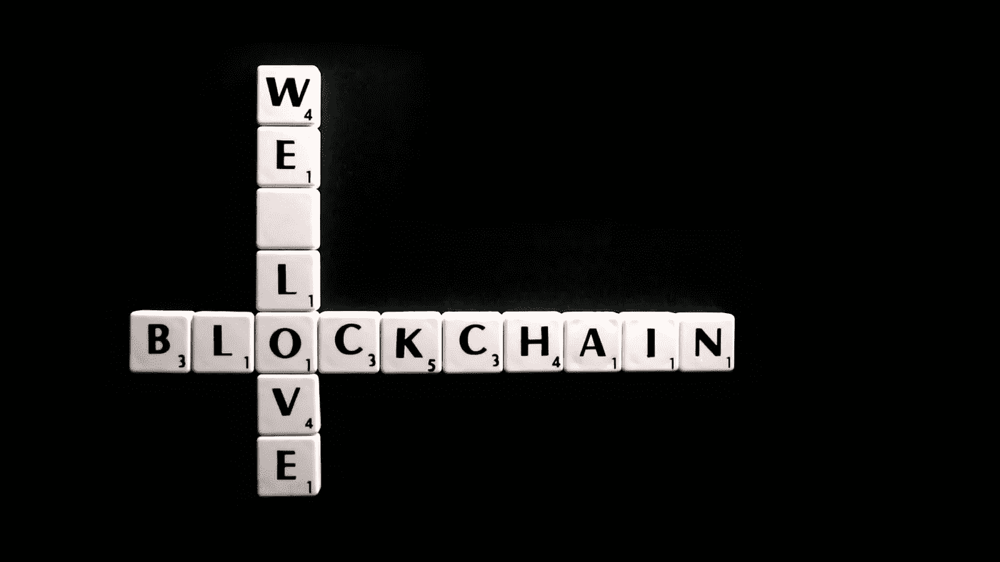
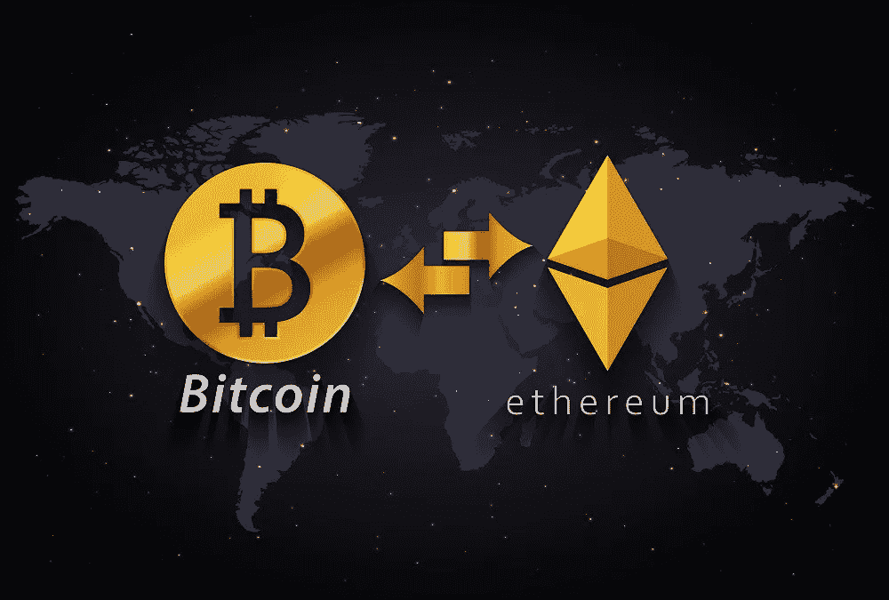
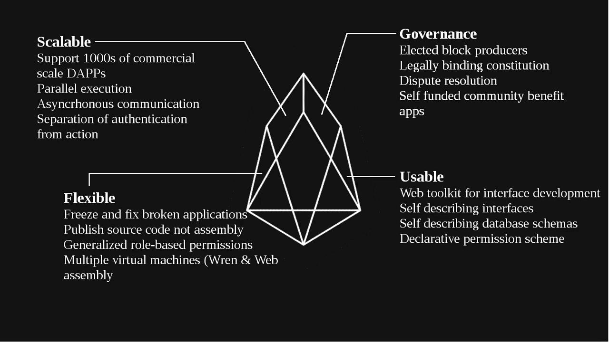
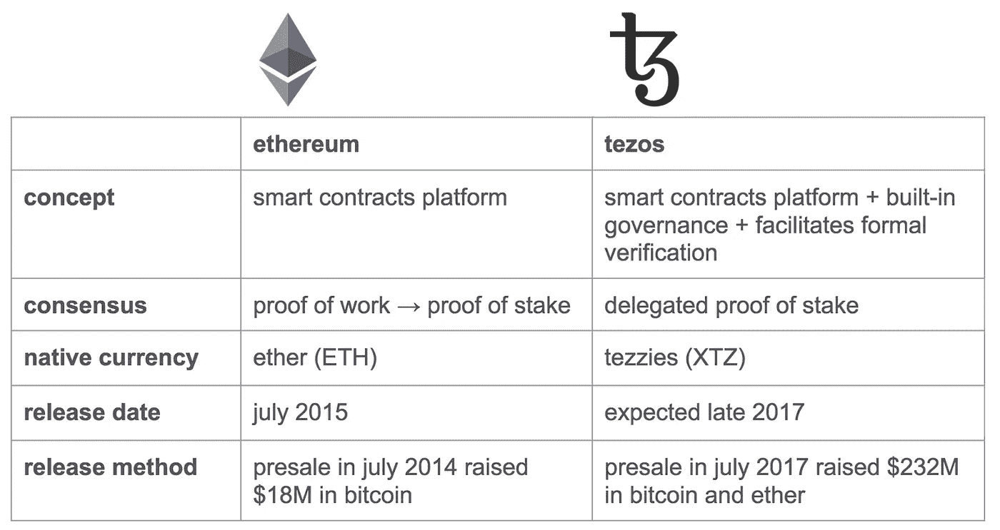

# 进化中的区块链和一段关系的不同步骤:复杂

> 原文：<https://medium.datadriveninvestor.com/evolving-blockchains-and-different-steps-of-a-relationship-complex-a0fa12825365?source=collection_archive---------6----------------------->

正如达尔文所说并证明的那样，进化是世界“有生命的部分”一贯坚持的基础。如果我们考虑过去十年“进化”的速度和比例，显然，区块链是人们可能观察和研究过的“最有活力”的有机体。

相对而言，只有上帝或人类的“活着的创造物”才应该与另一个相比较，这是我个人的观点。显然，人们总是可以自由表达自己的观点。我也认为“关系”是有生命的，因为即使是它们也会进化。在几个显著而巨大的例子中，它们比区块链进化得更快。很神奇，不是吗？

对一些人来说，将这种关系与区块链相提并论可能会很奇怪。对我来说也是，如果我对区块链一无所知的话。然而，让我们从区块链和“爱情关系”、“逐帧”和“点对点”惊人相似的旅程开始。

因此，这一切都始于一个“分散的”和“对所有人可见的”系统，其中不需要或“授权”任何“中央控制机构”来指导做什么和如何做。在比特币区块链中，这是最受欢迎的现象，甚至在“恋爱关系”的早期阶段，这也是整个概念中最受欢迎和赞赏的特征。没有人在身边，没有人向他报告，没有人向他索取权限，也没有人制定规章制度。这一切在开始时感觉如此神圣。不是吗？

现在，就像比特币区块链一样，这种“去中心化”、“不受监管”和“不受任何中央机构控制”的“革命性概念”会“慢慢”产生肾上腺素激增。虽然，就像比特币区块链和它面临的来自世界各地的类似抗议一样，在“关系”的情况下，“内部”，而它认为“社会”的“保守”的银行系统，这不会允许它，并否认接受，“存在”和“蓬勃发展”的新概念可能。尽管如此，与比特币区块链类似，最终人们(两种情况都是如此)会明白，这并没有什么错，它可能是一个对所有人都有益的提议。验收的水平和质量开始慢慢提高。

在区块链或关系中，一旦接受度增加，新的情感、计划、价值和亲密关系开始增加。区块链开始变得广阔和繁荣。去中心化的特性，帮助它变得更加包容和广泛。

然后是 Vitalik 的“以太坊白皮书”,在这种关系中，朋友的贡献似乎第一次成为至关重要的一部分，就像“以太坊”的“初始硬币供应”一样。这些朋友积极参与并尽他们所能改善关系。一个全新的概念“首次发行硬币”已经推出。关系的另一个阶段开始了。

情感、参与和亲密关系很快开始成倍增长，随着 ERC20 标准的引入，一个多维宇宙开始成形，以开发以太坊区块链，但并不明显。关系中引入了“定义”和“参数”。事情开始变得单调，并在一个预期的，预先感知的轨道上。“单身区块链”的“分散”兴奋和肾上腺素激增在某个地方消失了。

这种关系变成了一个“公共账本”，任何人都可以按照既定的模式，自己开创一个“新区块链”。这些建议和忠告已经开始受到“关系”的欢迎。现在就像区块链一样，“专注”节点是属于“祝福者信条”的人，他们真诚地希望区块链或关系蓬勃发展。然而，准确地说，“攻击者”是“嫉妒者”或“分手设计师”。在一段关系中，一旦“攻击者”变得占主导地位，并且“数量超过”专用者，出于“卑鄙”动机的“51%攻击”就成功了。如果区块链或关系周围有真正的专用节点，反击攻击并确保“攻击”被击退，“许多伤害”得到避免，区块链或关系变得比以前更强大。

区块链，作为一种“非常活跃”的关系，不能就此停止“进化”。“可编辑分类账”的概念出现了，这种关系由“相关方”在他们希望的任何时候根据他们个人和自愿的“同意和意愿”来定义，而无需讨论和相互理解。没有人介意，这被认为是关系“进化”的另一个发展。在“空间和自由”的名义下，这种关系开始变得“自愿”，而不是像早期的区块链原则那样“平均分配”。

然后是“建议改革”和“可发展治理”的能力，在这种能力下，可以提出建议并得到双方同意的注意，已经决定改革是否是要采取的理想步骤，以及是否要进行有益的改变。一段关系，有这么多的谈论，关于如何去处理“关系”本身，证明现在一切都变得“不真实”。

现在，我经历了区块链的时间线，也经历了一段感情的时间线。有不同的阶段，曲折，然后有不同的方式建立和扩大或发展。在时间轴上，每次一个新的特性或者一种新的“类型”的开发增加时，世界都会改变。每个人都开始跟随，并以各自的方式感受。

如果是关于个人偏好，我会说如果我有能力在某个地方停止时间线，我可以在第一步，比特币区块链，以及关系的第一阶段就做对了。对双方来说，没有什么比这更令人兴奋和满意的了。