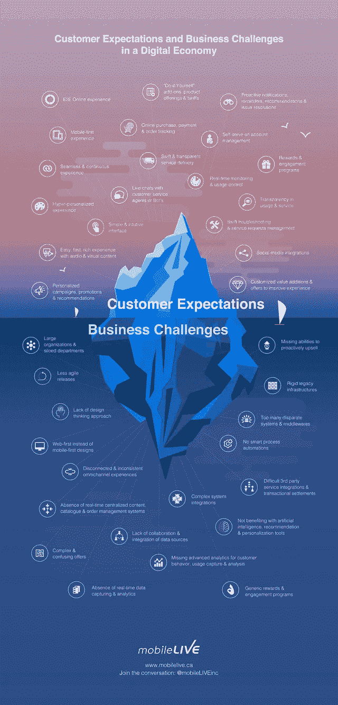

# 不断变化的客户行为和期望

> 原文：<https://medium.datadriveninvestor.com/evolving-customer-behaviours-and-expectations-73acd586ad30?source=collection_archive---------13----------------------->

对最佳客户体验的追求正在推动所有行业的数字化转型计划，因为技术让客户能够直接控制他们与我们的互动。从多渠道数字连接的便捷性到服务的即时性，客户期望无摩擦和[超个性化的体验](https://perspectives.mobilelive.ca/blog/how-can-we-ensure-success-in-personalized-experiences)，体现简单性、自助性和社会性。亚马逊、苹果、谷歌和脸书等公司也没有通过设定客户期望每个企业都能达到的标准来让事情变得更容易。

毫无疑问，[客户体验](https://perspectives.mobilelive.ca/blog/future-proofing-customer-experience-for-steadfast-growth)的重要性已经变得与提供的产品和服务同等重要。专注于通过描绘不断变化的客户行为和偏好、应用以人为本的方法、协作创新和敏捷执行来改善客户体验的品牌，很容易脱颖而出，走上更大的成功之路。

 [## 准备在 2019 年改变世界的技术-数据驱动的投资者

### 很难想象一项技术会像去年的区块链一样受到如此多的关注，但是……

www.datadriveninvestor.com](https://www.datadriveninvestor.com/2019/01/17/the-technologies-poised-to-change-the-world-in-2019/) 

但是我们要明确一点，客户体验不属于任何一个部门。事实上，它需要整个组织的紧密协作。为了客户的利益，每个人都“一起”朝着一个共同的目标努力，而客户只认为我们是一个整体。从客户的角度来看，它主要涉及[面向客户的功能和接触点](https://perspectives.mobilelive.ca/blog/customer-experience-in-the-digital-economy)，然而，我们需要应对无数的业务挑战，以努力实现理想的体验。

下面是一张信息图，展示了数字经济中客户的期望和商业挑战。

从组织结构(人员、文化、流程)到所涉及的[颠覆性技术](https://perspectives.mobilelive.ca/blog/top-10-tmt-predictions-for-2018)(人工智能、机器学习、AR/VR、物联网、对话式商务)，我们需要与不断发展的客户行为保持同步，并提供超出他们预期的服务。这并不简单，但为了在这个不断增长的数字经济中吸引、赢得和留住客户，我们必须做到这一点。

原发表[此处。](https://perspectives.mobilelive.ca/blog/evolving-customer-behaviours-and-expectations)