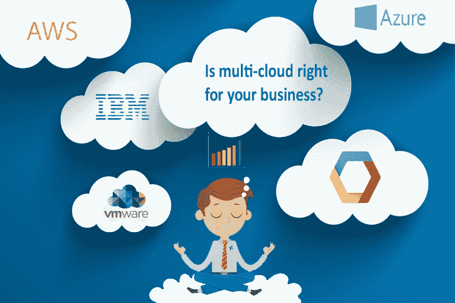
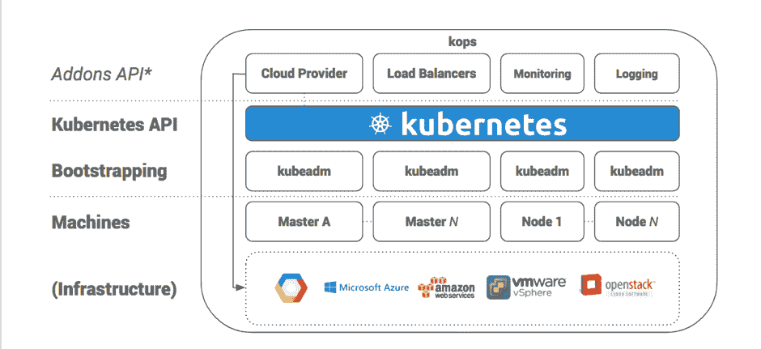

# 不断发展的云计算解决方案和战略

> 原文：<https://medium.datadriveninvestor.com/evolving-multi-could-solutions-strategies-7560ea3993bd?source=collection_archive---------6----------------------->

在当今不断发展的 IT 系统世界中，云和大数据不再是热门词汇，它们推动着战略和更大的预算讨论。随着大型组织准备加大对云战略的投资，跟随者群体也做好了准备，许多趋势正在浮现，这让首席信息官们非常头疼，尤其是在银行。公共云的采用仍然没有像之前预期的那样强劲。监管机构已经介入，并增加了另一层非技术利益相关者，他们解释了计划、风险和策略。

与此同时，随着越来越多的云服务提供商进入这一领域，这些战略也在不断发展变化，从而使部署单一云解决方案的整体战略变得更加复杂。AWS 是无可争议的领导者，但对前五名中接下来 4 个席位的争夺正在进行着一场激烈的比赛。微软 Azure 是在采用 Office 365 的伪装下出现的。

谷歌采取了一种非常有趣的方法。谷歌知道他们在这场游戏中处于劣势，所以无论他们联系哪个组织，他们都已经有了云战略，包括 AWS、甲骨文、微软。因此，他们采取了创新的措施，在开发人员社区中引入了他们自己的工具，比如 Kubernetes。Kubernetes 是做什么的？它协调容器，甚至来自多云端的数据和应用程序。这解决了他们的云销售团队面临的主要障碍，如“哦！！我们已经有一家云服务提供商入围了”。

谷歌打破了大门，但为 GCP 生态系统引入免费培训。AWS 或 AWS 附属培训合作伙伴向每位候选人收取最低 2000 美元的培训费用，由谷歌附属培训提供商免费提供。这使得一群没有个人资金的人去申请 AWS 证书，因为他们的组织因为预算有限，只想培训少数人，而不是所有人。现在，随着谷歌为开发者提供无障碍的入职服务，实际上意味着在未来两年内，GCP 的采用将变得最可行。

有了像 Kubernetes 这样的流程编排工具，解决了只有一个供应商的单一云 PaaS 或 IaaS 的巨大风险因素的问题，谷歌的多云战略将使第二名的竞争向谷歌倾斜。

有趣的是，在谷歌内部，他们自己将离开 Kubernetes 的内部使用和采用，因为谷歌不想让相同的技术运行内部基础设施，并在市场上提供解决方案。这有助于避免利用用户域中发现的系统漏洞来遏制 Google 内部的任何数据泄露。

总而言之，多云战略将进一步发展。一些有机增长可能会导致数据云从应用云中分离出来。计算功能可能会与数据存储和数据加入流程分离。甲骨文的解决方案可能有强大的数据可扩展性，AWS 可能有更好的调度程序，Kubernates 的原生兼容性可能会给谷歌云带来优势。所有的解决方案都会带来一些独特的东西。有趣的是，对于企业架构师来说，设计一个整体系统架构来解决他们所在组织的用例，而不仅仅是跟随最著名的云解决方案的趋势，这变得非常独特。

这篇文章最初发表于[www.agilityexchange.com](http://agilityexchange.com/evolving-multi-could-solutions-strategies/)

**SHAILENDRA MALIK**

Shailendra Malik 拥有 15 年的行业经验，致力于将纸面上的战略解决方案交付给现实生活，并将 PoC 计划交付给客户的实时生产系统。以发现阻碍突破性进展的真正问题而闻名。他在新加坡的一家咨询公司工作，在新加坡市场已经工作了 8 年多，作为他的客户与多家银行合作。