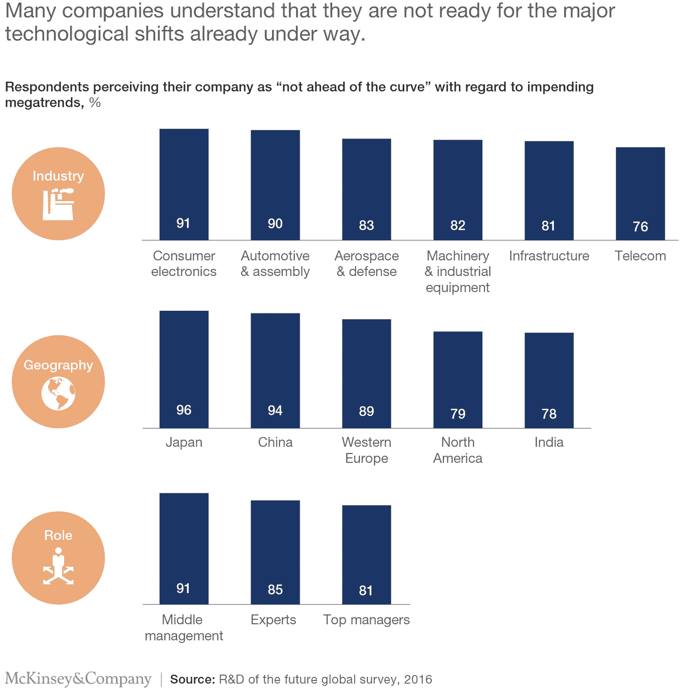
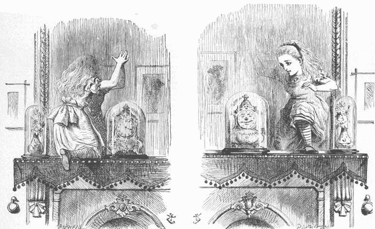

# 发展首席技术官的角色

> 原文：<https://medium.datadriveninvestor.com/evolving-the-cto-role-ddfaa440df5c?source=collection_archive---------16----------------------->

首席技术官(CTO)是一个相当新的角色，随着时间的推移和行业的变化而变化。传统上，CTO 跟踪对开发或改进公司产品和服务至关重要的外部 IT 趋势、政策和程序。任何基于产品或服务的大型公司都必须有 CXO 级别的人员直接负责解释新技术将如何影响其客户以及他们对公司产品/服务的期望。

随着数字化转型成为各行各业追捧的变革，首席技术官现在往往要负责公司很大一部分人力资源和预算，用于执行公司的转型战略(这遵循了我在以前的一篇文章中概述的内容:[吸收/适应/收购/攻击](https://www.linkedin.com/pulse/guiding-clients-through-digital-transformation-shankha-s-dey/))。因此，首席技术官现在不仅负责内部工具和技术开发，还负责创造新的商业模式和数字化产品。这意味着成为首席执行官的强有力的合作伙伴，根据数字冰球的位置和发展方向，帮助制定和执行公司的战略。

# 首席技术官必须成为战略变革的驱动力

首席技术官现在是首席变革官，这种转变要求他们超越监控技术性能、确保可靠性和管理精益运营的任务。他们需要保持这些技能，同时在一些新领域发展肌肉，这将有助于公司的顶线和底线。那些成功实现这一转变的人将为自己创造机会，成为组织战略变革的设计师。

# 影响商业战略

你的技术战略和执行与公司的战略目标一致吗？首席技术官就像透过镜子窥视的爱丽丝。他们与供应商的互动以及对技术发展的理解使他们在预测未来会发生什么以及影响公司整体战略方面处于有利地位。他们可以看到新进入者带来的威胁，以及长期趋势的成熟，他们可以预见新技术的应用来创造新的价值。这使他们处于一个独特的位置，在许多重要问题上引领高管层的思维。这包括为业务创建一个稳健的路线图并应对挑战，例如何时推迟采用区块链等新技术以提高投资回报率，以及何时投资人工智能等技术以开发核心差异化能力和新的收入来源。在数字和媒体公司，首席技术官已经扮演了这个角色。

# 成为客户的代言人

您的技术投资是否侧重于创造客户价值，而不仅仅是节约成本？对于任何想要保持相关性和盈利性的公司来说，首要任务必须是确保良好的客户体验。首席技术官管理着大约 4 万亿美元的资本，这些支出必须集中在为公司客户创造独特的价值主张上。将客户投诉归咎于感知很容易，但感知是绩效的代名词。首席技术官需要参与整个公司，以确定重要的问题，并找到正确的解决方案。这包括进行投资，以确保来自外部世界的数据可以方便地获得并输入到正确的渠道(如营销、销售、支持)，正确地进行分析，并对结果迅速采取行动。需要有适当的系统和流程来正确诊断问题的根本原因，并通过跨职能部门的工作部署正确的解决方案。IT 团队和供应商需要通过跟踪以关键客户成果为中心的指标来衡量，这使得根据客户需求分配责任变得容易。

# 整合，不要只是建造

您是否通过主动参与技术生态系统来支持对新资源和功能的访问？从历史上看，首席技术官们管理着与主要硬件和软件供应商，有时还有系统集成商的简单合作关系。目标是建立内部技术资产，以保持业务在几个项目中运行，其中一些项目规模巨大。现在，技术接触点的数量、性质和层次都在增加。[它们变得越来越复杂，越来越融入企业的整体业绩](https://www.mckinsey.com/business-functions/digital-mckinsey/our-insights/adopting-an-ecosystem-view-of-business-technology)。有许多不同类型的软件和交付模型，以及大量的“即服务”产品。因此，首席技术官需要改变他们的思维模式，从构建资产转向利用技术生态系统。这需要广泛的战略和商业敏锐性，以便在整个企业中发展伙伴关系和执行决策。

# 创建有效的运营模式

运营模式是否消除了复杂性并实现了以客户为中心的指标？高效的运营模式是指导团队、提供环境和支持实现技术战略并经得起时间考验的行为的关键。是战略(为什么)和运营(如何)之间的链接(什么)。首席技术官需要建立运营模型，以满足内部客户的需求，协调职能和员工，减少基础设施和运营的碎片化，并确定关键决策、互动、角色和责任。创建有效的运营模式对于有效驾驭复杂的组织和实现战略至关重要。如果没有一个明确的模型，就会面临运营效率低下、责任不明、跨部门和跨职能整合度低以及运营风险增加/持续等组织挑战。稳健的运营模式是一个明显的竞争优势，定义一个运营模式是首席技术官需要应对的一个重大挑战。

**之前发布在 LinkedIn 上。