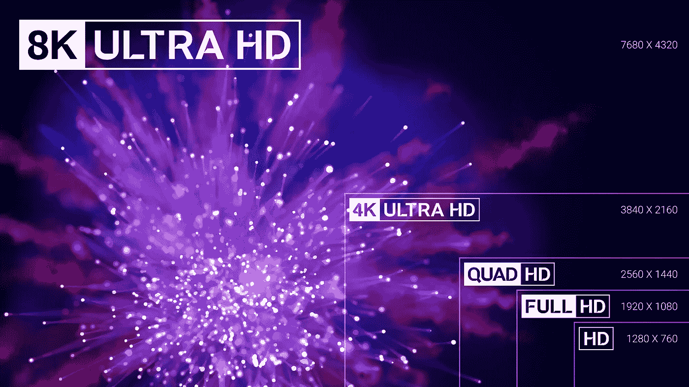
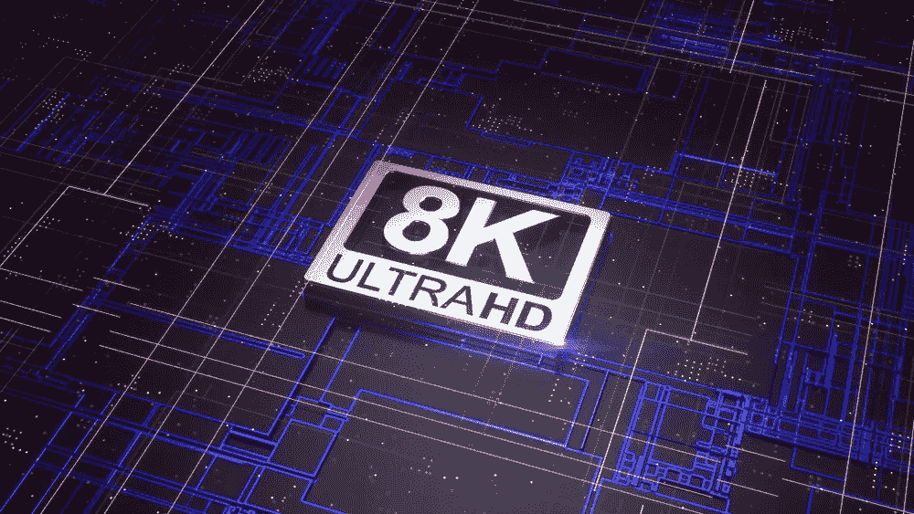

# 向新的高分辨率生态系统发展

> 原文：<https://medium.datadriveninvestor.com/evolving-toward-a-new-high-resolution-ecosystem-42a9ee234704?source=collection_archive---------17----------------------->

在整个 2018 年的各种消费电子展上，大多数主要的消费电子制造商都展示了 8K 显示器，有些甚至已经开始出货初始产品。虽然推动 8K 格式似乎是新的，但它实际上自 2012 年以来一直是超高清格式的一部分，至少是由国际电信联盟(“ITU”)建议 ITU-R BT.2020 定义的。在这些规范中，术语 8K 指的是每帧 7680 x 4320 像素的分辨率。超过 3300 万像素。与 4K 相比，这代表了四倍的增长，与高清相比，这代表了 16 倍的分辨率增长。

8K 的引入，无论是从显示方面还是广播方面，显然都是一项令人印象深刻的技术成就。然而，如果 8K 要迅速被全球消费者接受，还有许多工作要做。从 4K 的推出中可以吸取许多教训，其中最重要的一点是，确保整个生态系统(内容创建、分发和展示)的发展，以促进有意义地采用新的消费模式，这一点至关重要。在这种背景下，有必要了解这项新技术的起源。

在很大程度上，日本政府希望成为 4K 和 8K 的先驱，并以 8K 格式转播 2020 年东京奥运会，这一直是 8K 的驱动力。因此，日本公共广播公司 NHK 多年来一直在为 8K 制作和分发系统制定必要的标准；并于 2018 年 12 月 1 日推出全球首个 8K 服务，简称“超高清”。想要接收这种信号的消费者不仅需要 8K 显示器，还需要专用的卫星天线和更新的接收设备。

随着第一批 8K 显示器进入世界各地消费者的客厅，看看内容和分发格局有助于了解构建 8K 生态系统需要什么，这有助于推动消费者大规模采用。

从生产角度来看，能够支持 8K 分辨率的专业相机已经存在。类似地，许多胶片扫描仪支持 8K 分辨率(以及更高的分辨率)。抛开 8K 拍摄的实际现实和潜在创意影响不谈，将 8K 内容带到显示器上的最大挑战是与 8K 分辨率相关的数据速率以及这种数据要求对制作工作流程的影响。由于 8K 未压缩文件至少比 HD 未压缩文件大 16 倍，在某些情况下，由于更高的位深度要求，甚至更大，这给数据管理带来了挑战。

这不仅仅是储存的问题。更确切地说，是在生产环境中移动如此大的文件所需的时间，以及视觉效果所需的冗长渲染时间，这些都要慢得多。这些问题并不是全新的。它们是在引进 4K 的过程中遇到的，并且仍然是 4K 生产中最大的挑战之一。同样，直播内容制作继续在从高清到 4K 的迁移中挣扎。

将 8K 引入实际生产环境将使这些过程更加复杂。也就是说，一些大型现场活动将采用 8K 制作。一些已经生产出来，包括 2018 年奥运会的部分比赛和一些国际足联世界杯比赛，这些都是 2020 年东京奥运会前实地测试的一部分。

随着一些 8K 内容进入生产阶段，为这些内容开发分发系统变得至关重要。虽然 NHK 正在使用卫星分配他们的“超高清晰度”格式，其他分配方法似乎更远。目前没有支持 8K 分辨率的光盘格式，由于带宽要求和限制，高质量的戏剧和情节电视内容流将是一个挑战。很可能需要新的压缩系统来以有意义的方式支持 8K 发行版，并达到消费者无疑会期望的质量水平。随着大多数广播公司努力有效地分发 4K 内容，更新有线设备以大规模支持 8K 将需要一些时间。在这样的背景下，让我们从消费者的角度来仔细看看这一切意味着什么。

虽然从 SDTV 到 HDTV 分辨率转换期间的质量改进对消费者来说非常明显，但人类视觉系统能够感知的细节和分辨率是有限的，尤其是在典型的观看距离下。根据 ITU 建议 ITU-R bt. 2246–6，消费者的典型观看距离是距离电视机 7 英尺(2.1 米)。从黑白到彩色，从 SDTV 到高清电视，这一点一直保持相对稳定。不指望这种情况会随着 8K 的推出而改变。这意味着，在 7 英尺的典型观看距离下，消费者将需要 200 英寸的电视来欣赏额外的分辨率。换句话说，要清楚地看到 8K 图像提供的细节，要么需要非常大的显示器，要么消费者坐得离显示器非常近。

更令人鼓舞的是，在从高清电视向超高清电视(4K)过渡的过程中，行业认识到仅仅提高分辨率不足以推动消费者的采用。作为对这一教训的回应，许多领先的消费电子产品制造商、电影和电视工作室、内容分销商和技术公司发起了 UHD 联盟，以定义为消费者提供优质和真正差异化体验的参数。增强的分辨率(4K 甚至 8K)是这些参数之一。然而，其他增强功能，如高动态范围、宽色谱、位深度和身临其境的音频，已被证明对消费者体验同样重要，在某些情况下甚至更重要。在过去的几年里，HDR，加上宽色谱，已被证明是一个真正的差异化因素，越来越多的 4K 显示器不仅包括 HDR，但强调它在他们的通信给消费者。在 8K 显示器从一开始就包括 HDR 的情况下，消费者可以享受 HDR 为家庭体验带来的显著好处，同时行业为 8K 制作工作流程开发解决方案，并改善分销渠道以适应 8K 内容。

随着“Super Hi-Vision”服务的成功推出，NHK 成为第一家通过自己的卫星系统向小宇宙最终用户提供 8K 分辨率内容的公司。多家电子产品制造商已经在排队用显示解决方案支持这一努力，有些已经开始向消费者运送产品。这些努力无疑将继续在行业方面获得动力，然而，为了享受与消费者类似的动力，并使这成为一个有意义的大众市场产品，生态系统的其余部分必须继续发展。