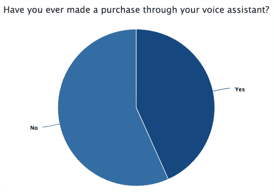
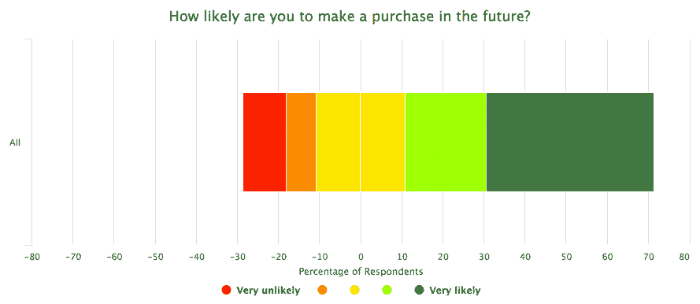
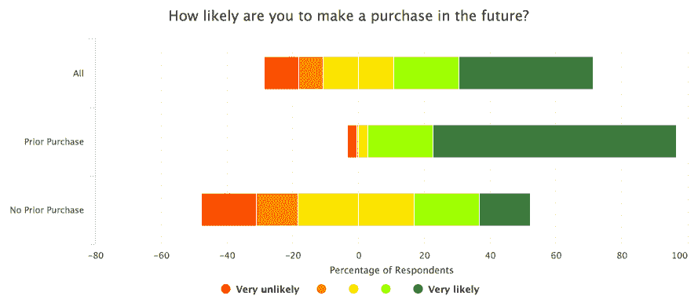
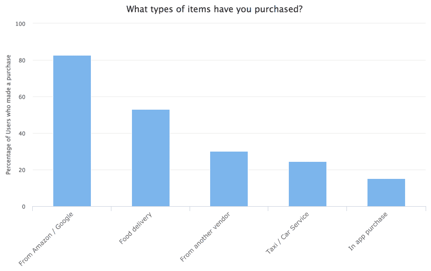
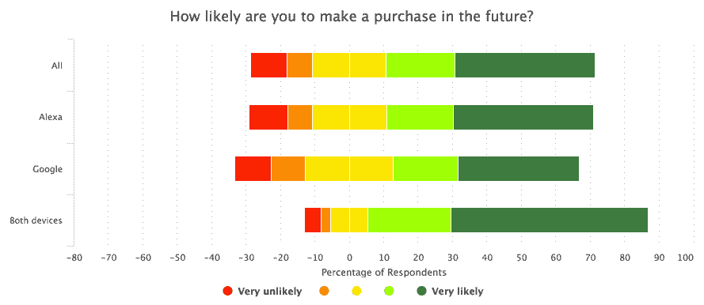
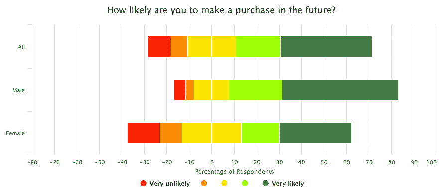

# 通过 Alexa 和 Google Home 考察消费者购买行为。

> 原文：<https://medium.datadriveninvestor.com/examining-consumer-purchasing-behavior-through-alexa-and-google-home-c0d97e2e54d0?source=collection_archive---------7----------------------->

在 [Dashbot](https://www.amerritt.com/dashbot/) ，我们最近对 Alexa 和 Google Home 用户进行了一项[调查。](https://artemerritt.medium.com/how-consumers-really-use-alexa-and-google-home-voice-assistants-dashbot-4d1f3878a9ad)

其中一个有趣的话题是关于商业的。消费者通过他们的设备购物吗？如果是，是谁，他们在购买什么？

# 消费者愿意通过他们的语音设备进行购买

Alexa 和谷歌都允许用户通过账户链接从自己的电子商务平台以及其他零售商和企业进行购买。品牌也可以通过订阅和“应用内”购买来赚钱。

根据我们的调查，43%的受访者通过他们的设备进行过购买。此外，大约 60%的受访者可能会在未来进行购买。

重复购买看起来也很有前景。过去已经购买过的消费者更有可能在未来购买。

# 消费者在购买什么？

通过语音设备进行的最常见的交易是通过设备的基础电子商务平台进行购买，即订购或重新订购商品。Alexa 和谷歌助手都可以通过各自的电子商务平台购物，分别是亚马逊和谷歌快递。比如“Alexa，帮我订纸巾。”

## 点餐

在语音设备上订购食品也是一种受欢迎的交易。近 53%的受访者购买了食品。

在我们自己与餐馆和食品配送服务的讨论中，消费者倾向于每次重新订购相同的食品。这种“重新排序”的情况在语音界面中工作得很好，因为它可以用更短、更简洁的语句来完成，而不是从头开始复杂的菜单排序。

## 其他交易

虽然不太常见，但消费者确实会向其他供应商购买。通过帐户链接，用户可以更容易地完成与第三方的交易，如订购汽车服务。然而，平台内部需要进行改进，以使供应商更容易交易——例如，使供应商的语音应用程序能够直接将产品添加到底层购物车中。厂商在销售一些实体产品时，还需要克服没有可视化界面的挑战。

订阅和应用内购买为品牌和开发者提供了充满希望的赚钱机会。由于目前在这些设备上做广告不太受欢迎，品牌正在寻找其他赚钱的方式。我们看到订阅和应用内购买开始出现在语音游戏中，类似于移动应用的情况。

# 谁在采购？

消费者是否已经或更有可能通过语音设备进行购买，最大的因素之一是什么？

不管他们有没有这两种设备。

事实证明，拥有这两种设备的受访者中，超过 56%的人在过去购买过产品，相比之下，只有 43%的人拥有 Alexa，只有 39%的人拥有 Google Home。在未来的购买方面，同样，57%拥有两者的受访者“非常有可能”在未来购买，相比之下，只有 Alexa 的受访者为 41%，只有 Google Home 的受访者为 35%。

这可能是因为同时拥有这两种设备的消费者往往是早期采用者，因此更有可能尝试通过这种设备进行购买。

类似地，感觉设备极大地改变了他们日常行为的受访者也更有可能进行了购买——他们中有近 78.5%的人。

## 男人 vs 女人

根据我们的调查，男性比女性更有可能进行购买。购物的男性比例几乎是女性的两倍，分别为 58%和 32%。

男性也比女性更有可能在未来进行购买。与 49%的女性相比，大约 75%的男性至少有可能在未来进行购买。

查看关于设备所有权的早期数据，同时拥有 Alexa 和 Google home 的男性往往最有可能在过去或未来进行购买。

## 年龄是一个因素吗？

从受访者的年龄范围来看，以前购买过的比例最高的范围是 35 岁至 44 岁，为 56%。两边的两个年龄组非常相似——50%的 25 至 34 岁的人和 46%的 45 至 54 岁的人也通过他们的设备进行过购物。

# 结论

虽然语音空间仍然是新的，但我们对这些接口的可能性感到兴奋。正如我们在网络和移动的早期所看到的，仍然有很多进步要做，但前景是肯定的。语音是人类互动的自然方式。品牌和开发商正在探索赚钱的机会，消费者也在利用这些机会。我们期待着持续的进步和未来的发展。

# 关于 Dashbot

[Dashbot](https://www.amerritt.com/dashbot) 是一个对话式分析平台，使企业和开发人员能够通过可操作的数据和工具增加参与度、获取量和收益。

除了参与度和保留率等传统分析之外，我们还提供特定于对话的指标，包括 NLP 响应效率、情感分析、对话分析和完整的聊天会话记录。

我们也有对数据采取行动的工具，比如我们的真人接管聊天会话，并推送重新参与的通知。

我们支持 Alexa、Google Home、Facebook Messenger、Slack、Twitter、Kik、SMS、网络聊天和任何其他对话界面。