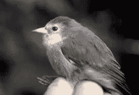
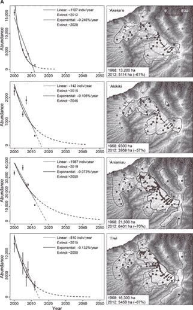
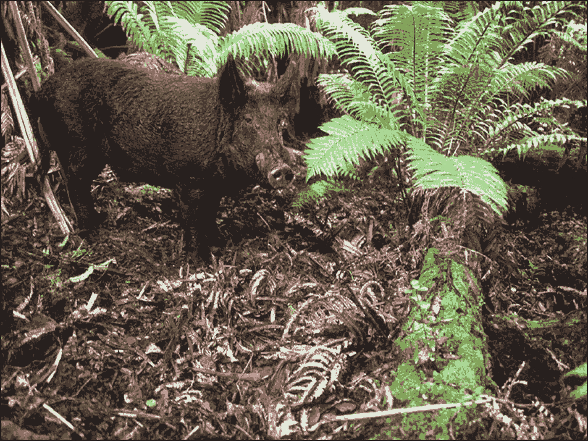
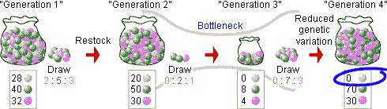
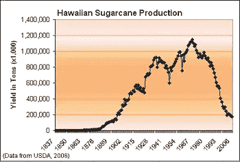

# 检查 Akikiki 和什么是做斗争夏威夷的环境危机，这是严重影响其鸟类物种

> 原文：<https://medium.datadriveninvestor.com/examining-the-akikiki-and-what-is-being-done-to-combat-hawaiis-environmental-crisis-that-s-e303661b8736?source=collection_archive---------9----------------------->

尽管气候变化正以多种方式严重影响着我们的星球，包括它对生物多样性造成的伤害，但它对特有物种的影响比那些没有受到影响的物种更大。特有物种只在世界的某个地方发现，在其他地方找不到，这使得它们更容易受到栖息地、疾病、人类活动或任何随机事件的影响。这正是发生在夏威夷本土鸟类身上的事情，尤其是整个州最濒危的鸟类之一——秋千鸟。直到今天，研究人员仍在努力克服与州政府和公众有关的障碍，他们的行为破坏了物种恢复的进展，要求他们为这些鸟类的生存权利而斗争。

Akikiki，或者更具体地说， *Oreomystis bairdi* ，是一种罕见的蜜雀，是考艾岛的特有物种。由于该物种是一种特有物种，它具有独特的特征，使其能够在其环境中生存，类似于加拉帕戈斯群岛上发现的不同龟和雀物种，它们适应了适合它们各自居住的栖息地类型的特征。秋千鸟属于*门*，纲*鸟*，目*雀形目*，科*雀形目*，属*雀形目*，种*雀形目*。然而，在研究人员 Eric VanderWerf 和 Pauline Roberts 在《威尔逊鸟类学杂志》第 120 卷第 1 期发表的一篇题为“Akikiki 或 Kaua'i 爬山虎的觅食和筑巢( *Oreomystis bairdi* )”的文章中，他们发现，在消失之前，Akikiki 曾经在 Kaua'i 以外的其他地方出现，包括 Alaka'i 和 Koke'e 地区，直到 20 世纪 60 年代。

现在，这个物种只存在于海拔较高的地区，尤其是在阿拉卡伊高原偏远地区的森林中。为了生存，森林必须被浓密的树木覆盖，这些树木支撑着一片树蕨林下植被，使它们能够攀爬树皮和树枝获取食物，并且[海拔范围必须大约为 600 到 1600 米](http://explorer.natureserve.org/servlet/NatureServe?sourceTemplate=tabular_report.wmt&loadTemplate=species_RptComprehensive.wmt&selectedReport=RptComprehensive.wmt&summaryView=tabular_report.wmt&elKey=100733&paging=home&save=true&startIndex=1&nextStartIndex=1&reset=false&offPageSelectedElKey=100733&offPageSelectedElType=species&offPageYesNo=true&post_processes=&radiobutton=radiobutton&selectedIndexes=100733)。至于它的外形描述，秋刀鱼的上半身是灰色的，下半身是白色。更具体地说，这种鸟的头部、背部、两侧和侧腹是深灰色到橄榄色，喉部、胸部、腹部和尾下覆羽是白色到米色。

当谈到识别物种的性别时，[这不能通过观察它的羽毛来完成，因为雄性和雌性都有相同的颜色](http://explorer.natureserve.org/servlet/NatureServe?sourceTemplate=tabular_report.wmt&loadTemplate=species_RptComprehensive.wmt&selectedReport=RptComprehensive.wmt&summaryView=tabular_report.wmt&elKey=100733&paging=home&save=true&startIndex=1&nextStartIndex=1&reset=false&offPageSelectedElKey=100733&offPageSelectedElType=species&offPageYesNo=true&post_processes=&radiobutton=radiobutton&selectedIndexes=100733)。它也有短而略下弯的淡粉色喙，以及强壮的腿和脚，这最终服务于它的觅食习惯。Akikiki 体长 10-12 厘米，重 11-17 克，这使得这种鸟非常小。尽管有飞行的能力，但它更喜欢在地面上寻找食物，同时爬上树皮和树枝，以获得其他资源。有时，如果它们单独攀爬很难够到，它会从一个树枝飞到另一个树枝。

**Source**: Wikipedia.org

根据世界自然保护联盟 2016 年公布的数据，成熟个体的数量估计在 150 至 610 只之间，已知在阿拉卡伊高原地区存在一个亚群。虽然常规种群和亚种群没有任何严重的分裂，但最大种群的个体数量约为 100，因此，随着种群数量的持续下降，它们预计不会比上面提到的更大。每一代持续 5.7 年，表明每个个体的寿命要短得多。不幸的是，没有太多关于个体 Akikiki 预期寿命的数据记录，但科学家们已经能够更好地了解其他蜜雀物种的预期寿命，使他们能够估计每个物种的寿命。

研究人员安德鲁·伯杰在《威尔逊通报》第 2 期*上发表了他的文章《圈养夏威夷蜜雀的寿命》,他能够在圈养条件下饲养不同蜜雀物种的个体，包括考爱岛蜜雀、尼荷阿雀、夏威夷阿马基、考爱岛阿马基、阿帕尼和阿尼瑙。在人工饲养条件下，大多数鸟的寿命为 4 到 5 岁或更短，而其他鸟，如考爱鸟、阿尼瑙鸟和阿帕帕涅鸟，寿命接近 10 年。考虑到它们和秋千鸟一样是蜜雀，可以假设秋千鸟可以活相似的年限，但可能要少得多，因为那些记录在案的不是野生的，表现出圈养的适应性。与此同时，物种面临的威胁导致它们的后代寿命更短。这使得保持足够大的种群数量变得更加重要，这样物种就可以保存更长的时间。毕竟，它是栖息地专家，随着时间的推移，它的栖息地越来越少，这是它生存的一个令人担忧的因素。*

*为了生存，Akikiki 主要以昆虫或其他小型无脊椎动物为食，同时在各自的栖息地爬过树干和较大的树枝，但在极少数情况下，当大量无脊椎动物无法获得时，它们会以开花为食。幸运的是，他们的饮食没有经历任何季节变化，因为他们生活的高海拔地区的气候一年中没有发生重大变化(至少在气候变化影响之前没有)。通常，它们不会努力寻找足够的食物来源，因此该地区有稳定的昆虫和植物供应。其他蜜雀物种往往与生活在该州的大多数生物具有相同的益处。*

*此外，VanderWerf 和 Roberts 发现，以前的研究和野外工作在提供有关鸟巢成功、雏鸟的父母照顾、繁殖率、幼鸟和成年鸟的存活率以及鸟的运动的信息方面是不成功的。尽管很难观察秋筱龟的习性，研究人员还是报告了一些个体的行为发现，这些发现提供了它们如何喂养和照顾幼崽的洞察力。观察到两个人在一棵部分枯死的 olapa 树的树枝上觅食，在树皮上寻找昆虫，同时从树枝中心挖掘腐烂的木头，以寻找昆虫幼虫。另一个观察到的行为模式是巢在树上的位置以及父母照顾后代的方式。雌鸟大部分时间都坐在巢上，只有一次会离开二十分钟，雄鸟会在雌鸟把食物递给其中一只雏鸟之前给雌鸟喂食。*

*树上还有其他鸟类，包括阿帕尼鸟、日本白眼鸟和阿尼瑙鸟，它们有时非常靠近阿基基的鸟巢。令人惊讶的是，这位母亲对其他鸟类没有负面反应，并容忍了他们的存在，这表明其他鸟类对他们的栖息地没有明显的威胁。最后，两位研究人员总结了他们对该物种繁殖生物学的见解，这是一个更模糊的主题，仍需进一步研究。根据该团队在原生地区的观察，雄性和雌性都参与建造巢穴，但据报道雄性在此期间喂养雌性。与此同时，只有雌鸟监督孵化，尽管其他鸟类物种(如前所述)或完全不同的生物体可能会造成干扰，但它们仍坚定不移地履行自己的职责。*

*毫不奇怪，这些行为在其他蜜雀物种中很常见，除了为昆虫幼虫挖掘树枝，这是以前在 Akikiki 从未见过的。此外，还不清楚是否在其他蜜雀物种中发现了与筑巢和照顾幼崽相关的行为，因此这些特征可能使该物种真正独一无二。可悲的是，罗伯茨和范德沃夫描述了森林鸟类调查如何显示在 1970 年至 2000 年期间，分布从 88 平方公里减少到 36 平方公里，估计数量从 6，832 +/- 966 只下降到 1，472 +/- 680 只。由于许多不同的原因，在物种变得更加局限于更高的海拔之前，种群规模曾经要大得多。*

*至于导致秋筱鸟数量下降的因素，一些因素比其他因素起作用的时间更长，但其中一个主要问题是其栖息地的衰退。由于每一代持续长达 5.7 年，栖息地保护已成为夏威夷野生动物组织的主要目标之一，因为人口数量继续迅速减少。研究人员还发现，没有专门针对秋刀鸟的实地研究，人们认为，数量下降的原因是其他夏威夷森林鸟类的典型原因。这些威胁包括非本地蚊子携带的疾病、外来入侵植物物种造成的森林生境退化、野生有蹄类动物的啃食和生根以及非本地啮齿类动物的巢穴捕食。*

**

*Projected distribution of endangered Hawaiian birds in the future with current rates of decline in each species. **Source**: www.advances.sciencemag.org/content/2/9/e1600029*

*由于全球变暖的影响，非本土蚊子在它们的栖息地变得更加普遍，带来了诸如禽疟疾和禽痘等疾病。现在，这种鸟类栖息地的更多地区变得更加温暖，更容易受到这些疾病的影响，导致进一步下降，正如 Desrochers，Reed 等人在他们的文章“通过依赖保护的管理，夏威夷濒危鸟类的长期持续”中指出的那样，该文章发表在第 62 卷和第 10 期的*生物科学*上。有蹄类动物和非本土啮齿类动物造成的影响尤其负面，因为这种鸟在地面上觅食，并且在低垂的树枝上筑巢。啮齿动物是臭名昭著的巢穴掠食者，而野生有蹄类动物会导致栖息地退化，因为它们以植被为食，破坏了更多的栖息地，同时改变了整体景观。*

**

*A non-native feral pig browsing for food. **Source**: https://cms.ctahr.hawaii.edu/littonic/Research/Impact-of-Non-Native-Ungulates*

*由于全球变暖和人类活动的影响，阿拉卡伊高原地区的天气模式已经改变，减少了该物种居住的凉爽高海拔地区的面积。随着这些区域的缩小，种群被迫进一步上升，慢慢地将它们限制在更小的区域，直到它们耗尽合适的栖息地。这导致了暖边收缩，杀死了任何无法在暖边生存的物种，减少了那些幸存下来的物种在冷边生存的数量。这就像一个套索慢慢收紧在一个人的脖子上，当温暖的边缘收缩靠近时使他们窒息。人类的发展已经导致这些高海拔地区遭到越来越多的破坏，这些种群的损失使得这个物种更难有机会恢复。*

*此外，由于全球变暖，蚊子可能会入侵岛上最高、最冷的地区，从而导致疾病的威胁加剧，而这些地方曾经是蚊子远离疾病的地方。更有疑问的是，外来鸟类竞争的负面影响的证据，特别是日本白眼鲛(尽管已经观察到秋筱鸟不会因为与该物种的密切接触而感到威胁)和日本林莺的负面影响还没有得到很好的确立和评估。关于遗传多样性，还没有任何关于这个主题以及它如何影响秋刀鱼生存的著名研究。然而，鉴于特定的夏威夷蜜雀种群在几十年的时间里急剧减少，加上其非常相似的表型特征，种群之间非常相同的可能性更大，这可能是因为瓶颈。*

*由于这种可能性，物种的保护将是一个更难达到的目标，因为有较少的遗传变异，将允许后代以更多有益的特征生存。即使 Akikiki 的数量在保护工作的帮助下大幅反弹，遗传多样性也无法恢复或回到几十年前可能存在的水平，当时这种鸟的栖息地沿着考艾岛延伸得更远。这种瓶颈将减少群体中的等位基因，最终将减少遗传多样性。这意味着，即使物种恢复，自然资源保护者也需要密切关注，因为随机事件仍然会产生重大影响。*

**

*A demonstration of the concept of bottlenecking. **Source**: https://evolution.berkely.edu/evolibrary/article/bottlenecks_01*

*为了帮助缓解数量下降的原因，正在采取的行动之一是减少有蹄类动物在秋千鸟以及包括其他蜜雀在内的其他濒危鸟类栖息地的存在和影响。事实上，根据德斯罗彻斯、里德和其他人的说法，建造大型围栏是为了阻挡哺乳动物，围栏的使用增加可以为鸟类提供足够的栖息地。然而，安装和维护围栏是一项昂贵而困难的工作，但在一些地区，它非常有效，并允许本地植物重新生长。不幸的是，由于社会/政府的压力，该计划在夏威夷的某些地区很难实施，因为社会/政府的压力要求维持娱乐用地，并保持有蹄类动物种群的健康，以便公众能够管理农业活动。*

*另一方面，这些有蹄类动物会吃掉植被，包括构成秋筱龟栖息地的开花植物。管理人员一直在试图建造更多的围栏，使它们远离它们的原生栖息地，并防止进一步的破坏。正在采取的另一项行动是帮助尽可能多地消除入侵植物物种和啮齿动物，以便像 Akikiki 这样的鸟类物种的巢穴能够得到更好的保护，同时种群数量可以随着时间的推移而增加。即使消灭适量的它们，也会对它们的栖息地产生重大影响。*

*尽管在较小的岛屿上通过毒饵和陷阱消灭了大部分啮齿动物，但事实证明在较大的岛屿上更具挑战性，在这些地区完全消灭它们几乎是不可能的。当然，这个问题可能非常令人沮丧，但研究人员已经在消除啮齿动物和尽可能多的入侵植物物种方面取得了进展，这些物种来自像 Kahoolawe 这样的较小岛屿，以便有可用的栖息地来重新安置由于海平面上升而面临危险的濒危鸟类。对于 Akikiki 来说，由于其非常特殊的栖息地要求，这种选择是不可用的，但这并不意味着其他极度濒危物种不能从这种努力中受益。事实上，将现有的保护区向内陆和海拔向上延伸，可以帮助受气候变化和海平面上升影响的鸟类，可以减轻气候变化的影响。*

*这可以在物种被除名之前完成。将这一点与保护区的整体增加相结合，包括增加高海拔地区，继续控制捕食者，建造更多的围栏以阻止有蹄类动物和捕食者进入，可以使这些物种超出其恢复目标。高海拔地区的增加肯定会为 Akikiki 提供急需的救济，以及由于夏威夷制糖业的崩溃而提供的空闲土地。糟糕的是，这些闲置土地已经被用于住房和城市发展，因此环保主义者仍然试图将恢复计划和 CWCS(全面野生动物保护战略)的实施与全州的综合发展联系起来，以确保夏威夷政府和试图拯救本地物种的研究机构之间的合作。*

**

*The decline of the sugarcane industry in Hawaii. **Source**: Wikipedia.org*

*即使付出了巨大的努力来保护 Akikiki 和其他极度濒危的鸟类，结果看起来也不会比今天更糟。该物种完全没有经历任何程度的恢复，而许多其他人几乎没有注意到他们的困境有任何积极的变化，根据 Desrochers，Reed 等人实施的从零到四的恢复程度图表。Akikiki 处于零级，而更多的人处于一级。这意味着该物种已经实现了 0%-25%的恢复目标。唯一有资格被除名的物种是第四级的夏威夷鹰，已经达到该物种 76%-100%的恢复目标。*

*与此同时，政治压力、有限的资金和全面缺乏支持阻碍了研究人员试图实施的许多拯救它们的方法。其他未能满足物种管理需求的例子包括，在美国上诉法院和第九巡回法院做出支持这些需求的裁决后 29 年，拒绝将野生绵羊和山羊从帕利拉的关键栖息地移走(*帕利拉诉夏威夷土地和自然资源部*)。总的来说，未来最大的威胁包括全球变暖的影响增加，外来入侵物种的增加，以及人类活动的增加，这些都将对考艾岛地区以及夏威夷的其他地区产生负面影响。为了准备未来的工作，研究人员建议在保护依赖的背景下除名，这将要求制定一项管理计划，要求持续的管理干预措施与为使物种恢复状态而实施的措施相一致。*

*反过来，这在一些地区可能是一个政治上有利的解决方案，因为它将减少政府对当地物种管理的限制，并将增加当地团体在这些项目中的机会、影响和责任。尽管保护团体和地方政府之间存在争议，但这可能会给极度濒危的秋刀鱼及其同样受到影响的同胞带来希望。这并不排除未来计划取得更多进展的可能性，即建造更多保护性围栏以排除有蹄类动物和其他有害危险，将物种转移到更合适的地区，治疗受入侵物种和捕食者影响的地区，以及治疗受疾病影响或有疾病增加风险的地区。事实上，要保护这种独特的鸟类和遭受同样影响的许多其他鸟类，还需要做更多的工作，但是，随着技术的不断进步以及对这些特有物种的认识的提高，专家们认为它们仍然有希望。*