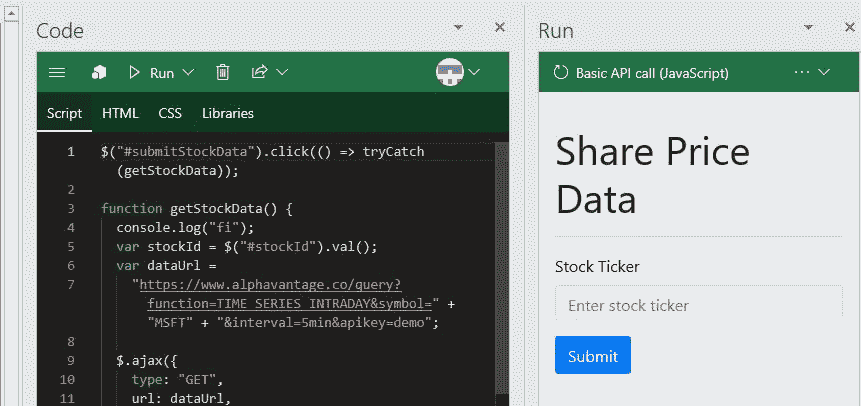
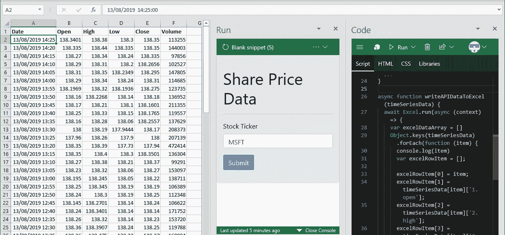

# Excel JavaScript API —股票数据

> 原文：<https://medium.datadriveninvestor.com/excel-javascript-api-stock-data-521ba4f1af7a?source=collection_archive---------0----------------------->

[](http://www.track.datadriveninvestor.com/1B9E)

我写了一篇关于 [Excel JavaScript API](https://medium.com/@phunt6056/excel-javascript-api-49d4d1fbf787) 的简介，并想举例说明如何使用该工具通过免费的 [Alpha Vantage API](https://www.alphavantage.co/documentation/) 将股票数据读入 Excel，而无需安装 Excel 之外的任何东西。

有许多方法可以将一个插件放在 Excel 中，但是我们将从最简单的方法开始，使用微软的脚本实验室工具。Script lab 会在 Excel 中打开一个侧窗口，您可以在其中输入代码，这样就不需要安装代码编辑器，例如 Visual Studio，但是对于较大的项目，建议使用它。



## 先决条件

> 这是一个简短的教程，但如果你以前从未见过 HTML、JavaScript 或 jQuery，一开始可能会有点陌生。如果您有在 Excel 中使用 VBA 的经验，那么代码的模式可能与 VBA 使用对象层次结构的方式相似。微软有一个[很棒的教程](https://docs.microsoft.com/en-us/office/dev/add-ins/tutorials/excel-tutorial)，它提供了更多关于 JavaScript API 的背景知识。

[](https://www.datadriveninvestor.com/2019/02/25/6-alternatives-to-the-yahoo-finance-api/) [## 雅虎财经 API |数据驱动投资者的 6 种替代方案

### 长期以来，雅虎金融 API 一直是许多数据驱动型投资者的可靠工具。许多人依赖于他们的…

www.datadriveninvestor.com](https://www.datadriveninvestor.com/2019/02/25/6-alternatives-to-the-yahoo-finance-api/) 

## 1)添加脚本实验室

在 Excel 中，进入工具栏中的“插入”，点击“加载项”，然后点击“获取加载项”。然后，您会看到一个窗口，您可以在其中搜索“脚本实验室”，然后将其“添加”到 Excel 中。

> Script lab 是一个非常有用的工具，可以快速开始使用 JavaScript API 进行开发，只需要 10 秒钟就可以设置好。

## 2)打开脚本实验室

你现在应该有一个“脚本实验室”标签在 Excel 的顶部，旁边是“数据”，“审查”等。坐下。

当你点击它时，你会看到主脚本工具代码，运行和功能。

*代码:在这里你写出想要执行的脚本*

*运行:在这里你可以执行你在代码窗口*中编写的脚本

*函数:在这里你可以编写你可以在 Excel 中使用的自定义函数*

打开“代码和运行”窗口，使它们在 Excel 中并排显示。为了快速看到工具的运行，并确保一切正常工作，微软为您提供了一些简单的脚本作为模板——打开“基本 API 调用(JavaScript)”。使用这个，您现在应该能够选择一个单元格范围，运行脚本，并查看工作簿更新。

## 3)太好了…但是发生了什么？

在“HTML”选项卡中，显示了用户界面的代码，按钮的 ID 为“Run”。在“脚本”选项卡中,“运行”按钮 ID 上有一个事件监听器，然后调用“运行”功能。该过程获取用户选择的范围并将 fill 属性设置为黄色。我们对工作簿进行了更改，但该工具需要与工作簿同步，因此调用了 context.sync()方法。每次对工作簿进行更改或更改块时，以及在读取属性之前，都会调用 sync 方法—如果您想要读取单元格“A1”中的值，则需要在访问[属性](https://docs.microsoft.com/en-us/office/dev/add-ins/excel/)之前调用 context.sync()

## 4)添加库

使用基于 web 的工具的好处是能够利用大量可用的库。我们将使用的两个工具是:

[引导](https://getbootstrap.com/)——为了让用户界面看起来更专业，我们将添加引导。Bootstrap 是一个 CSS 库，因此它为我们提供了改变应用程序外观的非常简单的方法

jQ [uery](https://jquery.com/) —一个以更简洁的方式编写 JavaScript 函数的流行库，这个库也是在“基本 API 调用(JavaScript)”模板中为我们设置的。

进入“Libraries”选项卡，添加下面的链接，这样我们就可以使用 bootstrap，模板中为我们添加了 jQuery。

[*https://UNP kg . com/bootstrap @ 4 . 1 . 0/dist/CSS/bootstrap . min . CSS*](https://unpkg.com/bootstrap@4.1.0/dist/css/bootstrap.min.css)

## 5)创建前端

删除“HTML”标签中的所有内容，然后粘贴到下面

```
<div class=”jumbotron”>
  <div id=”content-main”>
   <div class=”padding”>
    <h1>Share Price Data</h1>
    <hr />
   <form>
     <div class=”form-group”>
      <label for=”exampleInputEmail1">Stock Ticker</label>
      <input type=”text” class=”form-control” id=”stockId” placeholder=”Enter stock ticker”>
     </div>
       <button id=”submitStockData” type=”submit” class=”btn btn-     primary”>Submit</button>
   </form>
 </div>
 </div>
</div>
```

我们已经添加了一个简单的用户输入，允许用户输入我们正在寻找的股票行情。我们给它一个 id“stock id”和提交按钮“submitStockData”。

**6.a)创建后端**

删除现有的事件侦听器#run，替换为:

```
$("#submitStockData").click(() => tryCatch(getStockData));
```

数据的来源将是 Alpha Vantage，它提供了一个免费且简单易用的 API。注册是免费的，他们提供了一个 API 密钥，我们把它包含在 URL 中，然后允许我们访问他们的数据。

要测试它的工作情况，请输入以下代码—确保将 XXXXX 更新到您的 API 密钥:

```
function getStockData(){ 
   var stockId = $(‘#stockId’).val(); var dataUrl =     ‘https://www.alphavantage.co/query? function=TIME_SERIES_INTRADAY&symbol=' + stockId +  ‘&interval=5min&apikey=**XXXXXXXXXXXXXX**’; console.log(dataUrl); }
```

如果你现在把微软的股票代码(MSFT)输入到我们应用程序的股票代码中，然后点击“提交”，控制台应该会打印出一个 URL。获取 URL 并将其粘贴到浏览器中，这样我们就可以确保我们正在获取数据——您应该会看到数据出现在屏幕上。

**6.b)创建请求**

与上面的方式相同，当我们访问网站时，我们需要我们的应用程序来完成这项工作。我们可以使用 jQuery 中的 AJAX 函数来实现这一点——这个函数会转到我们在 6.a 中创建的 URL，并获取数据。将下面的内容粘贴到我们创建 URL 的“stockId”下。

```
$.ajax({
      type: 'GET',
      url: dataUrl,
      success: function (responseData) {
        var timeSeriesData = responseData['Time Series (5min)'];},
      error: function printError(errorMessage) {
        console.log(errorMessage);
      }
    })
```

Ajax 是 jQuery 提供的一个函数，它代表我们发出请求。如果我们输入 MSFT 作为股票代号，并在控制台中点击“提交”，我们应该会看到输出到控制台的股票数据。

## 6.c)将数据导入 Excel

返回的网站数据是我们设置为“timeSeriresData”变量的 JSON 数据。现在我们需要把这个输入 Excel。为了保持代码的整洁，我们将创建一个新函数“writeAPIDataToExcel ”,它将数据作为参数。

```
async function writeAPIDataToExcel(timeSeriesData) {
 await Excel.run(async (context) => {
 Object.keys(timeSeriesData).forEach(function (item) {
 console.log(item)
 })await context.sync();
 });
}
```

用 MSFT 股票行情自动收录器点击上面的“提交”,你会看到股票数据的日期被打印到控制台上。这些是 API 发送的 JSON 数据的*键*。下一步是使用这些键获取股票数据，并将其转换成 Excel 可以写入工作簿的格式。当您打印到控制台时，您可以看到数据是如何组织的。

```
async function writeAPIDataToExcel(timeSeriesData) {
 await Excel.run(async (context) => {
 var excelDataArray = []
 Object.keys(timeSeriesData).forEach(function (item) {
 console.log(item)
 var excelRowItem = [];excelRowItem[0] = item;
 excelRowItem[1] = timeSeriesData[item][‘1\. open’];
 excelRowItem[2] = timeSeriesData[item][‘2\. high’];
 excelRowItem[3] = timeSeriesData[item][‘3\. low’];
 excelRowItem[4] = timeSeriesData[item][‘4\. close’];
 excelRowItem[5] = timeSeriesData[item][‘5\. volume’];excelDataArray.push(excelRowItem);
 });
 var shareOutputRange = context.workbook.worksheets.getItem(‘Sheet1’).getRange(‘A1’).getResizedRange(excelDataArray.length — 1, excelDataArray[0].length — 1).getOffsetRange(1, 0);
 var shareHeadingRange = context.workbook.worksheets.getItem(‘Sheet1’).getRange(‘A1:F1’);
 shareHeadingRange.values = [[‘Date’, ‘Open’, ‘High’, ‘Low’, ‘Close’, ‘Volume’]];
 shareHeadingRange.format.font.bold = true;
 shareOutputRange.values = excelDataArray;await context.sync();
 });
}
```

通过访问时序数据的对象键，我们能够将数据的日期打印到控制台。此时可以将每一项写入一个单元格，但更容易的是将数据操作为“数组的数组”，[[1，2，3]，[4，5，6]]，因为这是 excel 值的存储方式，以这种方式操作数据将使我们能够简单地将“range.values”设置为等于我们的数据。这样做也快得多。

我们创建一个外部数组“excelDataArray”，然后在“excelRowItem”的每次迭代中填充这个 will。然后，我们使用“getResizedRange”公式和“getOffsetRange”公式在 Excel 中创建一个与我们的数据形状相同的“shareOutputRange ”,这样就可以释放第一行来添加一些标题。

点击“提交”现在允许我们将数据打印到“工作表 1”中。



> 我们现在可以读入股票数据来计算波动性、移动平均线和趋势，而无需复制和粘贴。