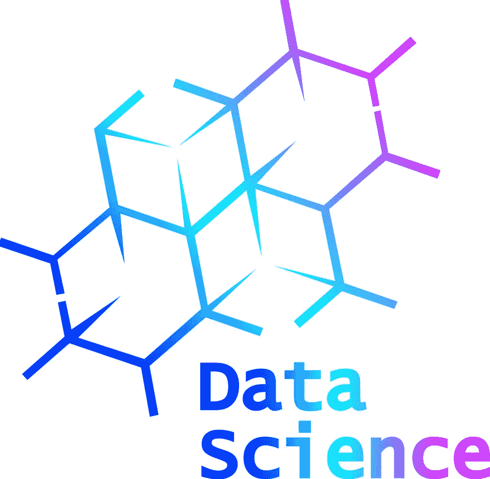
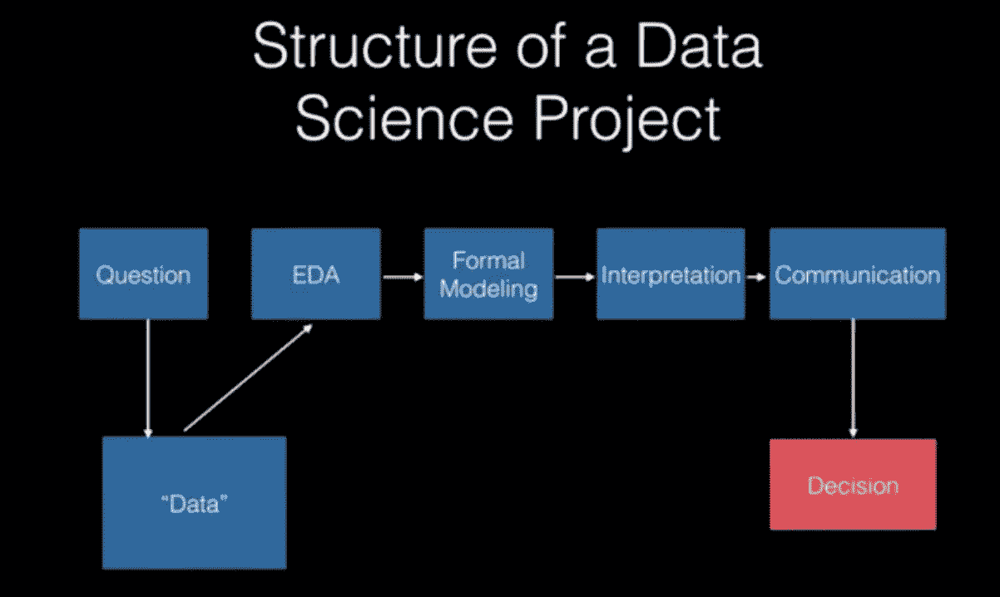

# 高管数据科学专业化:简要概述

> 原文：<https://medium.datadriveninvestor.com/executive-data-science-specialization-a-brief-summary-af89b0f90530?source=collection_archive---------15----------------------->

简要总结一下我从[这门](https://www.coursera.org/specializations/executive-data-science)课程中学到的东西，以及它如何与我在企业和初创公司环境中应用的真实应用相关联。

**该专业的课程列表:**

**1-数据科学速成班
2-建立数据科学团队
3-管理数据分析
4-现实生活中的数据科学
5-顶点项目**

首先，让我们定义一下统计学和数据科学之间的**区别**。

*统计:通过应用系统程序建立清晰的模型。*

*数据科学:使用统计学，可以处理多种模型，不一定要直截了当。*

作为一名数据科学家，你需要对计算机科学、统计学和良好的沟通水平有深刻的理解。

**监督与非监督学习**

*受监督的:依靠现有的标签数据对新数据进行预测(例如，使用机器学习线性回归来确定篮子中的水果，无论是橙子、苹果还是香蕉)*

*无监督:依靠数据学习其结构，而不使用明确提供的标签(例如，使用机器学习聚类算法对所有相似的水果进行分组，尽管它不知道它们是什么:橙子、苹果、香蕉)*

**数据科学项目的结构**

1.  问正确的问题:我们试图解决/证明的假设是什么？
2.  数据:聚合任何可能有意义的相关数据。
3.  探索性数据分析:看看你的数据中可能缺少什么。
4.  正式建模:利用统计学建立一个你认为能解决假设的模型。
5.  解释:与他人进行口头思考。
6.  沟通:与团队合作，达成共识。
7.  决策:根据结果做出决策。

上述方法中值得详述的一个非常重要的方面是探索性数据分析，它包括 **2 个主要目标**:

1-你现有的数据适合回答你提出的问题吗？
这将取决于各种因素，取决于非常基本的信息，如*是否有足够的数据*，是否有*太多的缺失值，*到更基本的因素，如您是否*缺失某些变量*或您是否需要*收集更多数据？*

*2-开始制定解决方案的草图*。
如果数据适合回答你的问题，你可以开始用它来勾画出答案可能是什么，以获得它看起来会是什么样子的感觉(例如:识别模式的基本决策树)。

**数据科学项目的成果**

1.  结果应该是可重复的。
2.  应该完成假设、方法和代码的文档化。
3.  结论应该是精确的，未知因素应该限制在最低限度。

**成功数据科学项目的四个秘密**

1.  新知识被创造出来。
2.  决策或政策是根据实验的结果制定的。
3.  创建具有影响力的报告、演示文稿或应用程序。
4.  据了解，这些数据无法回答向它提出的问题。

**这个项目有真正的影响吗？还是只是为了炒作**

回答以下问题，以确定该项目是关于流行语还是真正的贡献:

1-你想回答什么问题？

2-你有数据来回答你提出的问题吗？

3-如果你能就地回答这些问题，你会用这个答案吗？(例子:网飞奖得主根据他们的喜好预测他们喜欢一部电影的准确率提高了 10%，但是计算能力太强了，所以他们最终没有使用它)

*原载于*[*www.eliematta.com*](http://www.eliematta.com/blog/executive-data-science-specialization)*。*

## 来自 DDI 的相关故事:

 [## 数据科学和软件工程哪个更有前途？-数据驱动型投资者

### 大约一个月前，当我坐在咖啡馆里为一个客户开发网站时，我发现了这个女人…

www.datadriveninvestor.com](https://www.datadriveninvestor.com/2019/01/23/which-is-more-promising-data-science-or-software-engineering/)  [## 成为数据科学家所需的 8 项技能——数据驱动型投资者

### 数字吓不倒你？没有什么比一张漂亮的 excel 表更令人满意的了？你会说几种语言…

www.datadriveninvestor.com](https://www.datadriveninvestor.com/2019/02/07/8-skills-you-need-to-become-a-data-scientist/)