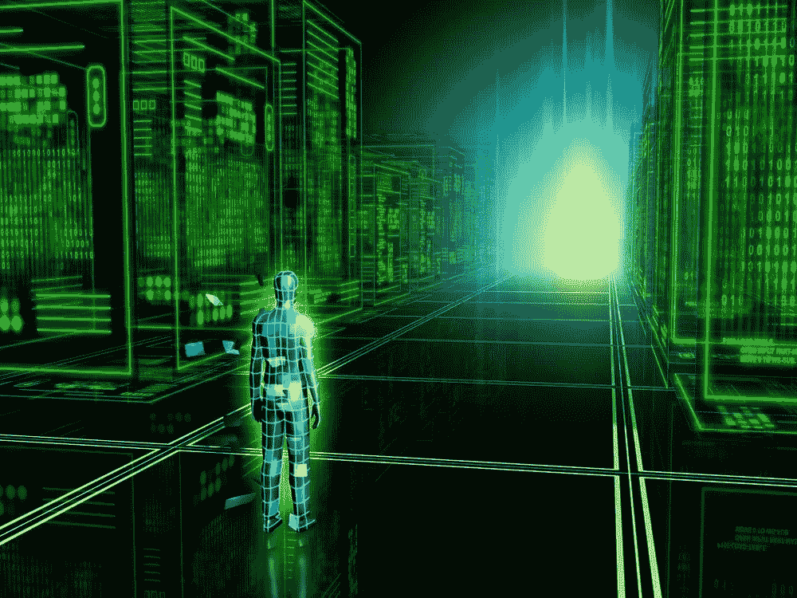
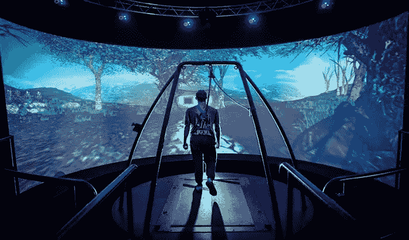

# 生存困境

> 原文：<https://medium.datadriveninvestor.com/existential-dilemma-9714b1d372cc?source=collection_archive---------51----------------------->

问:你怎么知道呆在你身边的人是真实的还是有感觉的？

作为人类，我们似乎以第一人称视角生活，以第二人称视角看待其他人和实体。这就是为什么我们有这种固有的观点，认为自己比外面的任何东西都重要。毕竟，如果没有人看，电影就什么都不是。所以对任何一个人来说，他们都是自己的主角，是自己不断成长的电影的看客。

但是**最基本的问题**是在你的电影中有真实的、有感情的人吗？众所周知，我们观察生活中的其他人，他们的行动，他们的行为，然后根据你认为他们可能做的事情来判断他们可能会做什么。

这里我们必须小心，不要错过我们做的一个隐藏的和必要的**假设**。你假设*其他人和你有同样的基本欲望，和你有同样的想法和信念，和你一样持有这些想法和信念*。这一假设对我们判断另一个人可能会做什么或不会做什么有很大影响。无论我们谈论其他生物的感知或他们的存在，我们都假设他们和你感受到同样的痛苦。

这种假设无处不在，你的大脑每次都这么做。这并不一定说明这个假设是正确的。我们的大脑总是会做出错误的判断，比如对*视错觉、人形、假模式识别、*等等。我们的**直觉分析**总是在我们最需要判断什么是真什么不是的时候失灵。那么，为什么我们不应该假设我们的大脑可能已经在犯错误，而假设坐在你旁边的另一个人的意识和感觉呢？

你看看怎样才能创造一个看起来真实的开放宇宙。要创建一个看似开放的宇宙，看似充满了有意识和有知觉的生物，你只需要在不到一个世纪的时间里创建一个**虚拟现实人工智能游戏**，然后在不知道你创建游戏并在游戏中的情况下玩游戏。为了达到这个目的，你可以抹去你的记忆。

当你玩虚拟现实人工智能游戏时，游戏中的物理世界会感觉非常真实，这在虚拟现实出现时是真正可能的，同时你继续假设你创造的人工智能(NPC——非玩家角色)是真实的人。

我知道这是一个真正人为的和推测性的思想实验，但假设我们在那个宇宙中，与人(实际上是人工智能)在一起，而*创造者的想法*叠加在这些人身上，我们将继续认为这些 NPC(人工智能角色)是真实的，我们将在游戏中继续认为我们是活着的。**根据已知的物理定律，这不是不可能的，也许它已经发生了。**随便说说。
——丹津·詹帕
参考——史蒂芬·平克《思维是如何运作的》