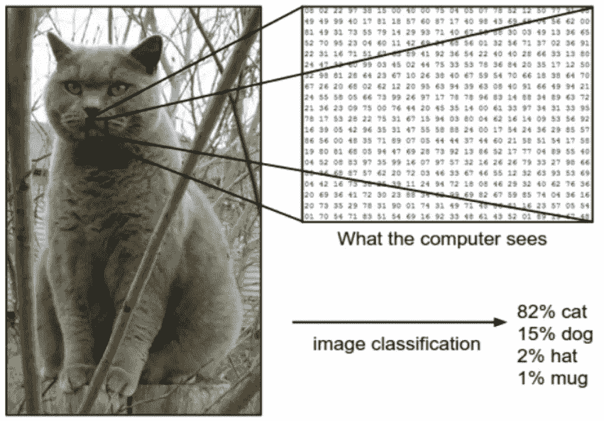

# 存在人工智能吗？

> 原文：<https://medium.datadriveninvestor.com/exists-the-artificial-intelligence-ai-702ed50e2488?source=collection_archive---------27----------------------->

真正的人工智能还不存在。在最近一段时间，营销和组织的转型愿望已经克服了科学和信息技术的真实能力，向利益相关者提供和销售表明他们正在实施人工智能(AI)项目。学术界和科学家有一个共识，即人工智能尚不存在，我们拥有的是机器学习(ML)，这是一套预编程和确定性的算法，即程序员知道计算机将做什么。算法。机器学习已经发展了很多，并在日常活动的自动化和更复杂的过程中表现出非常强大的功能，例如图像、信号、音频、手势和其他元素的识别；但这是可能的，因为该算法被编程和训练了数千次或数百万次，直到它能够构建数学函数，其对每个新观察的估计误差可能更小，但在某种程度上，它遇到了以前没有想到的新情况。，简单地保持空白(不应用直觉，不应用原则和价值观、伦理、道德)来解决。

Roei Ganzarski 表示，真正的人工智能并不存在，它将在至少十年内存在([参见](https://internetofthingsagenda.techtarget.com/blog/IoT-Agenda/Augmented-vs-artificial-intelligence-Whats-the-difference))。在这个[链接](https://futurism.com/human-level-artificial-intelligence-agi)中，我们可以读到项目、公司、政府、实验室、学术中心中有几个参考文献表明人工智能不存在；但是在这个方向上已经有了重要的进步。我同意说人类水平的人工智能何时会存在是不确定的，它可能是在 10 年、20 年、30 年后，或者谁知道。此外，提出了多元智能，如音乐智能、人际智能、自然智能、存在智能等。到底到什么样的智能我们才能说机器会等同或者超过人类？但人类根据他们的世界观或对世界的理解来显示智能的形式，这使人工智能的发展变得复杂，因为它暗示着机器将根据人类自身现实的愿景来编程。但是还有其他形式的更高智能和极少数人，如[精神智能](https://es.wikipedia.org/wiki/Inteligencia_espiritual)，其世界观在无形中运动，在超自然中，暗示着更高的意识。

Jack Krupansky 不喜欢称人工智能为自动化，我认为现在处理这个概念更好，更准确。[柏克莱大学的迈克尔·乔丹](https://medium.com/@mijordan3/artificial-intelligence-the-revolution-hasnt-happened-yet-5e1d5812e1e7)也指出人工智能还没有出现。目前 AI 中最先进的算法，如多层神经网络，通过苛刻的学习过程将数学函数和权重塑造成函数来解决复杂的问题，但它们仍然是确定性的过程。AlphaGo 和 AlphaZero 可能是机器学习(AM)最具代表性的案例，但它们是自动过程，是所有可能场景的搜索算法，需要高计算能力，以便实时分析数百万个场景并做出决策，具有一系列规则作为策略和价值标准，即顺序和结构良好的面向对象编程。这不是 AI，而是大规模的自动化和 AM。这个复杂的算法可以赢得人类专家的围棋比赛，但因为这个游戏有一个有限的场景集，数据库中有大约 3000 万步棋。另一个大规模自动化的例子是 IBM 的 Watson，它通过数据处理、估计、自然语言管理等算法，可以赢得知识竞赛。

下面的猫的图像取自(http://cs 231n . github . io/classification/)，它显示了算法和计算机对图像进行分类的方式，并且正如以前用不同的图像训练算法一样，它为不同类型的动物分配不同的概率，因为计算机通过坐标(X，Y)中的像素来对比一系列向量和矩阵，以与以前经验的一些模式进行比较。如果我们看到这一点，没有什么智能，这是由机器的力量和最常见的算法是卷积神经网络。

正如我已经指出的，科学和学术界有几种方式来解决人工智能的研究，有些是通过算法和机器学习的方式。其他人更多地押注于在同一生物体内适应硬件和软件，并获得更高级的生物，即所谓的[电子人](https://www.infobae.com/tendencias/innovacion/2017/04/29/cyborgs-como-viven-los-sorprendentes-humanos-del-futuro/)。也就是说，如果你可以利用大脑并将其能力扩展到几乎无限，为什么还要重演大脑是如何工作的呢？[美国西北大学教授 Paul Reber](https://www.scientificamerican.com/article/what-is-the-memory-capacity/) 估计，人脑可以存储 2.5 的信息，相当于 300 年的电视连续播放，因此在极少数人脑中就有可能存储所有重量的互联网内容，不可思议！。

这些人工智能的话题是广泛的，它是从 1 到 10，我每天在 1。而且所谓的奇点(当机器等于并超过人类)很可能会在 10 到 20 年后出现。它很可能不会通过算法和硅来实现，或者也许是的，没有人知道，因为有不同的方式来解决它。重要的是，当它被给予时，它肯定会成为我们今天所知的人类的一个转变者。我想写这篇有记录的文章，去揭开我们已经处于人工智能时代中期的神秘面纱，因此社会，组织和政府可以安心地睡觉，这是一个警告。嗯，当人工智能真正以它的一种基本形式出现时，它将改变一切。因此，政府投资这些技术为未来做准备很重要，因为经济模型会移动，如果机器实现了人工智能和独立，我不知道他们是否愿意与我们分享这个世界。