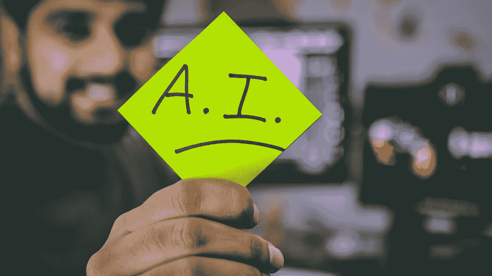
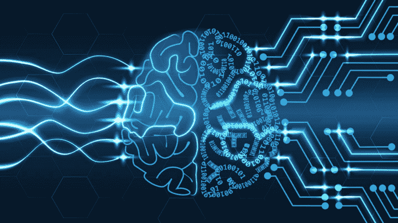
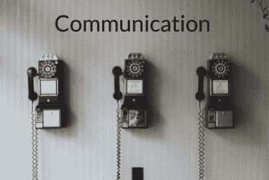
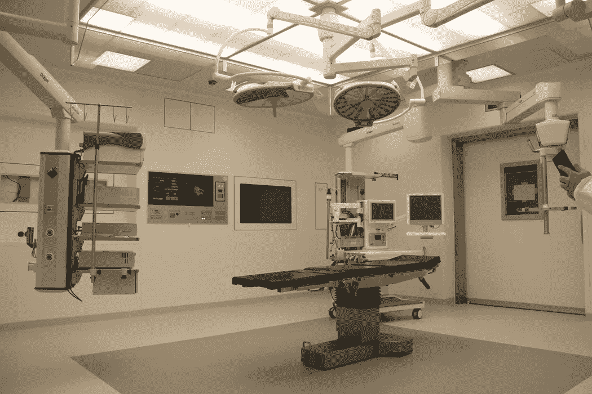

# 通过新的经历拓展你的潜力

> 原文：<https://medium.datadriveninvestor.com/expanding-your-potential-through-new-experiences-b7b0e1b0c194?source=collection_archive---------7----------------------->

我们总是被告知应该尝试新事物。随着时间的推移，这句话变得如此陈词滥调，我们可能会觉得它不再有任何意义。我们可能会忘记为什么继续参与新体验很重要。

## 跳出我的舒适区改变了我的生活轨迹

最近，我决定开始一项新的冒险，学习如何编写一个使用人工智能(AI)的项目(要了解人工智能的基础知识，请查看我的另一篇文章[这里](https://medium.com/datadriveninvestor/a-crash-course-on-modern-tech-aaa1793c59f))。我对人工智能产生了兴趣，我想通过尝试获得构建自己的项目所需的技术技能来进一步追求这种兴趣。这加强了我对人工智能的热情，现在，我期待着从事一项涉及人工智能的职业。如果我没有决定继续这个新的冒险，这一系列可能的职业道路不会向我敞开。**我从这个项目中最大的收获是敢于学习，失败对人生的成功至关重要。**请继续阅读，跟随我创建这个项目的旅程…

 [## 人工智能与创造力:梦想成真——数据驱动的投资者

### 人工智能总是让我着迷。不仅作为一套有用的工具，不断发展，而且作为一个…

www.datadriveninvestor.com](https://www.datadriveninvestor.com/2019/01/28/ai-creativity-deep-dream-comes-true/) 

在过去的几个月里，我一直在研究神经网络和人工智能可以很好地执行的所有不同活动。我了解到卷积神经网络在图像分类方面非常出色(查看我的另一篇关于卷积神经网络的[文章](https://medium.com/datadriveninvestor/computers-can-see-2ba2d0713240))。

## 创建手势检测神经网络

基于这些信息，我决定创建一个手势检测神经网络。该算法的目标是检测我坐的位置，并向我展示与该位置对应的我自己的预上传图像。我说的位置是指我是双手不放在摄像机的视野中，还是举起左手，还是举起右手。我使用[处理](https://processing.org/)和[处理器](http://www.wekinator.org/)创建了这个项目。该项目使用我笔记本电脑上的网络摄像头接收我的图像，并对其进行分类。用我在所有三个位置的示例图像来训练神经网络，并且在示例中使用的数据被标记。我使用监督机器学习来训练神经网络。**最后，在神经网络完成其分类过程之后，它在相同的位置显示预先上传的我的图像。**点击[此处](https://github.com/Ramandeep-Saini/Gesture-Detection-Neural-Network)查看项目代码！

## 手势检测神经网络的应用

在构建我的项目时，我开始考虑它在现实世界中的众多应用。**我想到的应用之一是创建一个手势检测神经网络，能够将手语翻译成口头语言！**这个应用程序可能会非常有用，因为根据[聋人通信服务](https://www.csd.org/about/statistics/)的说法，世界上有很大一部分人口**确切地说是 7000 万**使用手语。这个项目将能够缩小使用手语的人和不使用手语的人之间的交流差距。但这不是唯一的应用…

**另一个非常酷的应用是将手势和增强现实(AR)结合起来用于机器人手术。外科手术需要非常稳定的双手，对于人类外科医生来说，这并不总是可能的。最近，我读了一篇解释如何做到这一点的论文。AR 可用于显示术前和术中阶段的数据。手势可以用来指导机器人进行手术，也可以与 AR 平台进行交互。根据我从我的项目中学到的，我相信人工智能也可以加入到这个系统中。人工智能可以对手势进行分类，因此机器人知道它们的意思，以及它的下一步应该是什么。**

总而言之，我很高兴我决定从事涉及人工智能的编码项目。这些项目让我发现了我可能感兴趣的新职业。我将继续使用人工智能制作项目，并尝试用它们解决巨大的问题，例如我如何用我的手势检测神经网络来帮助解决手语和非手语用户之间的交流鸿沟。展望未来，我将继续寻找新的激情，尝试新事物，我鼓励你也这样做！