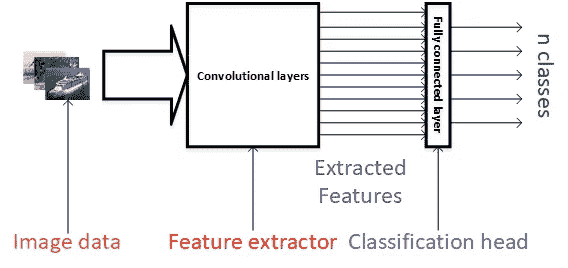
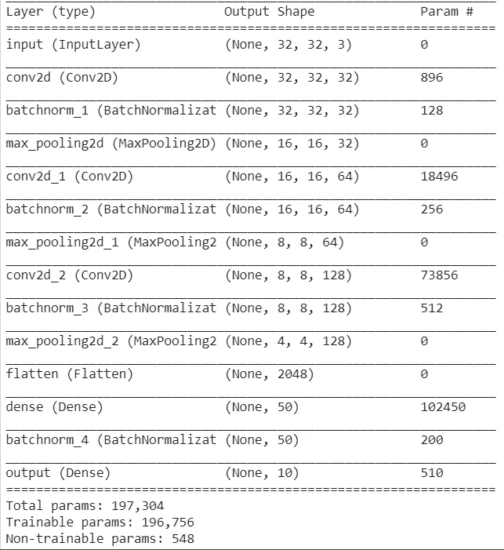
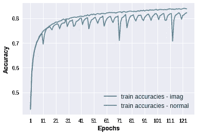
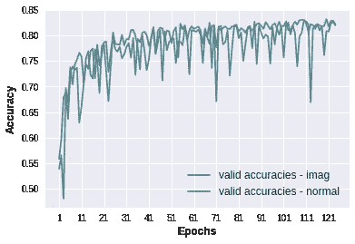
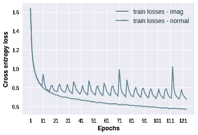
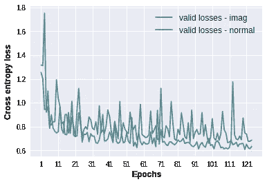

# 尝试一种疯狂的新方法来训练深度神经网络(第二部分)

> 原文：<https://medium.datadriveninvestor.com/experimenting-with-a-crazy-new-way-to-train-deep-neural-networks-part-ii-caf369af1e8e?source=collection_archive---------12----------------------->

在我之前的 [**帖子**](https://medium.com/@sibyjackgrove/experimenting-with-a-crazy-way-to-train-deep-neural-networks-475cd78fbb19) 中，我展示了一些我开发的训练技巧的结果。我比较了在 CIFAR 10 上训练的 mobilenet 模型(V1 和 V2)。我将把它称为“imag”训练计划。

## 什么是“imag”培训计划？

我们很多人可能已经注意到，蹒跚学步的孩子玩假装游戏是成长的一部分。的确，他们的想象力可能给我们带来了不少欢笑。我侄女最喜欢的是用塑料器皿玩厨房。不知何故，她可以利用自己的想象力(在脑海中)将一个玩具塑料盘子变成一个上面有煎饼的实际盘子，并作为游戏的一部分提供给成年人。尽管我的侄女知道盘子和煎饼的区别特征。在假装游戏的过程中，我的侄女在脑海中把不存在的东西归类到存在的东西中。

那么，为什么不在训练神经网络对图像进行分类时应用相同的原理呢？简而言之，与其不断地告诉网络，鹿的图像总是“鹿”，船的图像总是“船”(正常训练的一个时期)，为什么不定期地告诉网络将鹿的图像分类为“猫”，或者将船的图像分类为“卡车”，反之亦然。

是的，我同意这是一个相当疯狂的想法，我既没有确凿的经验证据，也没有任何核心的数学公式来证明它的工作。然而，与普通培训相比,“imag”培训在我应用的 3 个模型(Mobilenet V1、Mobilenet V2 和 custom CNN without dropout)的验证和培训准确性方面确实给出了明显更好的结果。

它没有为第四个模型提供更好的准确性(具有 dropout 的定制 CNN)，其中训练和验证准确性比正常训练稍差(在 1%以内)。请注意，如果有人感兴趣，最后一节给出了定制 CNN 模型的结果。

从我得到的结果来看，我有理由希望这不完全是徒劳的。

## 我如何实施“imag”培训

下图说明了我对 CNN 工作原理的理解，这将有助于解释我是如何实现该算法的。请注意末尾的全连接(FC)层，我将其称为分类头。它接收卷积层提取的特征，我假设 FC 层可以以任何方式组合这些特征，以便将图像分类为属于特定类别。
在“imag”训练插曲期间，我临时用新初始化的 FC 层替换已经在正确的类上训练的 FC 层(即，将鹿的图像分类为“鹿”)，并用想象的类训练它(即，将鹿的图像分类为“船”)。在以这种方式训练了固定数量的时期之后，我丢弃了想象的头部，用“正常的”头部来代替它，并且训练另一个固定数量的时期。这个过程重复进行。注意,“图像”时期和“正常”时期都包括在总时期计数中。

**How I imagine the CNN to work**

显然，上面的解释是我如何实现它的简化版本。如果读者感兴趣，我可以分享更多的细节。请注意，使用 Keras functional API 可以轻松实现“imag”培训。

## **定制 CNN 模型的实验细节:**

我对一个定制的 CNN 模型重复了相同的实验，以确保观察到的行为不是 mobilenet 模型的产物。训练参数(批量大小、学习率等)与之前[帖子](https://medium.com/p/475cd78fbb19#f21f)中给出的参数相同，除了时期数为 124。自定义 CNN 的架构如下所示:

Summary of the model generated using Keras summary

可以注意到，与 mobilenet 模型相比，定制 CNN 模型的参数数量要少得多(197 K)。

## 定制 CNN 模型的训练和验证配置文件

如前所述，这里的*‘正常’*指的是标准训练计划，而*‘图像’*指的是实验训练计划。

Training and validation accuracies

Training and validation losses

124 个时期的图像训练有效精度:0.8222
124 个时期的正常训练精度:0.8379
124 个时期的图像训练有效精度:0.8202
124 个时期的正常有效精度:0.8219