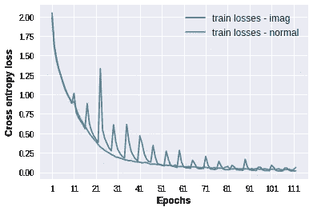
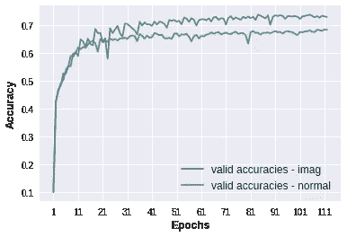
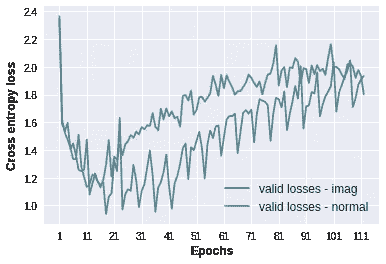
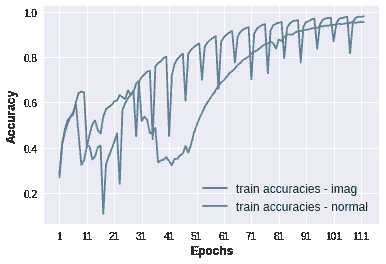
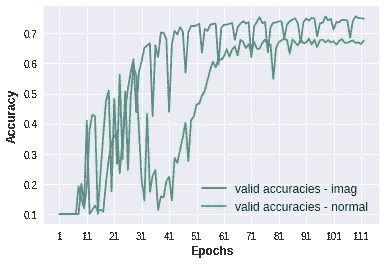
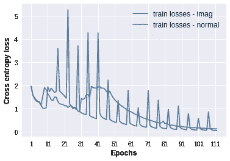
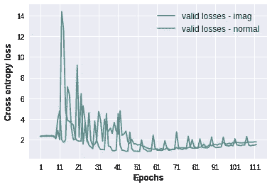

# 尝试一种疯狂的新方法来训练深度神经网络

> 原文：<https://medium.datadriveninvestor.com/experimenting-with-a-crazy-way-to-train-deep-neural-networks-475cd78fbb19?source=collection_archive---------4----------------------->

深度学习的历史充满了大胆而简单的想法。有时他们是像甘那样的成功典范，或者像深度信仰网络那样逐渐淡出时尚。

我尝试了自己的反直觉但简单的想法，这个想法是受孩子们玩想象游戏的启发。我有一些有趣但不确定的结果，想和大家分享。

## **实验详情:**

*DL 工具:* ***TensorFlow 1.11 带 Keras API*** *环境:****Google Collaboratory 实例带 GPU 加速器*** *数据集:* ***CIFAR10 (32*32*3 图片；10 节课；5 万个训练样本；万个验证样本)*** *训练批量* ***: 100，*** *学习率* ***: 0.001，*** *历元****:112*** *损失函数:* ***分类交叉熵
1.84 M 参数)、MobileNet V2(α= 0.75；*1.39M 参数)**

请注意，这两种模型都不使用预先训练的重量。

## 培训和验证概况

这里的'*'指的是标准训练计划，而' *imag* '指的是我提议的训练计划。*

## *V1 移动网络*

***

**Training and validation accuracy*** ***

**Training and validation losses*** 

*最终训练准确率:99.4 %，最终验证准确率:73.1 %*

## *V2 移动网络*

***

**Training and validation accuracy*** ***

**Training and validation losses*** 

# ***外卖***

*对于前 10 个时期,“imag”训练计划与正常计划相同。可以观察到，与正常训练相比，使用' *imag* '训练的模型最终对 V1 移动网和 V2 移动网都具有更高的验证准确性(大约高 5%)。训练精度也稍微高一点(尽管不是很高)。两种模型完成 112 个历元的时间也大致相同，每个历元的平均时间为 30 秒。*

*我将在下一篇文章中解释我的' *imag* '算法是如何工作的。但在此之前，我想知道我所展示的结果是否有潜力。*