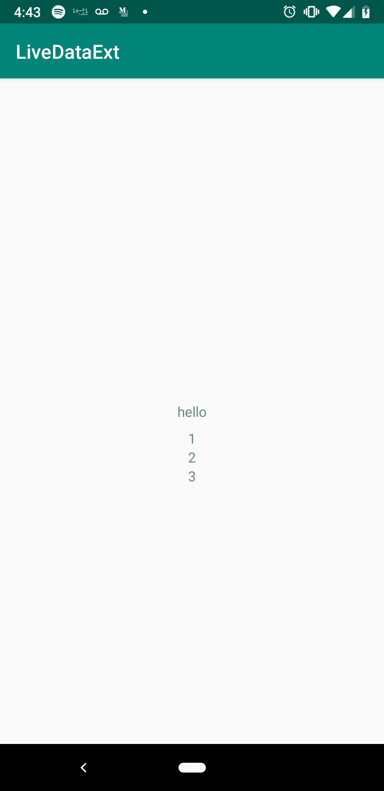

# 生命周期扩展实验——壮举。科特林

> 原文：<https://medium.datadriveninvestor.com/experiments-in-lifecycle-extensions-feat-kotlin-4dcc43ecc926?source=collection_archive---------0----------------------->

[](http://www.track.datadriveninvestor.com/1B9E)

今天，我们将了解如何扩展 Android 架构组件。Android 架构组件库是一套类，使开发人员能够以反应式风格连接用户界面。具体来说，该库中有一个名为 LiveData 的组件和一小组操作符，使您能够做到这一点。LiveData 操作符集很小是有原因的:它仅用于将数据绑定到 UI 的特定目的。尽管可以像使用 Rx 一样构建扩展来完成更复杂的操作，但不推荐这样做。首先，LiveData 不太支持背压。另一个原因是:LiveData 是有状态的，因此用作事件总线可能会导致事件丢失，或者触发重复事件。

但是，这并不意味着我们不能构建至少一些扩展来剔除常见的样板文件。此外，如果不是为了利用这种能力，我们为什么还要使用 Kotlin？我喜欢构建扩展，这样我的应用程序就有一个连贯的架构，与我特定的编码风格配合得很好，并且允许我快速迭代而不出错。在组项目中，您可以通过使用基类和扩展来建立一些通用的实践。

[](https://www.datadriveninvestor.com/2019/01/15/the-path-of-mobile-app-development-in-2019/) [## 2019 年移动应用开发之路——数据驱动投资者

### 任何在移动应用程序开发行业工作的人，无论他们是专注于在伦敦开发 iOS 应用程序还是…

www.datadriveninvestor.com](https://www.datadriveninvestor.com/2019/01/15/the-path-of-mobile-app-development-in-2019/) 

我们将在这里这样做:尝试构建一个方便但足够通用的架构来支持构建反应式 ui。所以我要做的第一件事是在 Android Studio 中启动一个启用了 AndroidX 的新项目(在创建新项目时，您会看到启用它的选项)。然后，我将启用数据绑定:

```
// build.gradle (app)dataBinding {
  enabled true
}
```

并包括一些依赖关系:

```
apply plugin: 'kotlin-kapt'dependencies {
    implementation fileTree(dir: 'libs', include: ['*.jar'])
    implementation"org.jetbrains.kotlin:kotlin-stdlib-jdk7:$kotlin_version"
    implementation 'androidx.appcompat:appcompat:1.0.2'
    implementation 'androidx.core:core-ktx:1.0.2'
    implementation 'androidx.constraintlayout:constraintlayout:1.1.3'

    def lifecycle_version = "2.0.0"

    // ViewModel and LiveData
    implementation "androidx.lifecycle:lifecycle-extensions:$lifecycle_version"
    kapt "androidx.lifecycle:lifecycle-compiler:$lifecycle_version"
    implementation "androidx.lifecycle:lifecycle-reactivestreams:$lifecycle_version"
}
```

# 设计基础活动

让我们试着思考一下，在创建任何带有数据绑定的布局时，我们需要哪些基本工具。我们可以创建一个基础活动，它将使用这些工具按照我们想要的方式自动配置自己。一些想法:

1.  布局—启用了数据绑定的一些布局。所以它必须有一个外部的<layout>标签，一个 XML 组，可能还有一个<data>标签。</data></layout>
2.  视图模型——我几乎总是将视图模型作为<data>中的一个变量。它将保存具有自动生命周期意识的视图的支持数据。</data>

每次我们想要将一个活动与一个视图模型和一个绑定相关联时，我们都会调用架构提供的效用函数。为了获得 ViewModel，我们将调用:

```
ViewModelProviders.of(this).get(SomeVM::class.java).*apply* **{** *lifecycle*.addObserver(this)
**}**
```

代码不多，但是既然我们的 BaseActivity 总会有一个视图模型，为什么不提取它作为一个假设呢？此外，为了绑定布局，我们将调用:

```
DataBindingUtil.setContentView<MyBinding>(this, R.layout.my_layout).*apply* **{
    viewModel = myViewModel**
    *lifecycleOwner* = this@MyActivity
**}**
```

让我们也将这段代码提取到一个基类中。下面是 BaseActivity 的签名:

```
// our base view model always a lifecycle observer
open class BaseViewModel: ViewModel(), LifecycleObserveropen class BaseActivity<T: BaseViewModel, C: ViewDataBinding>(private val viewModelClass: Class<T>): AppCompatActivity() { // todo: methods
}
```

两个泛型类型参数:ViewModel 类和 Binding 类。还要将 ViewModel 类显式传递给构造函数。通过这种设置，我们可以在基类中编写一个内部函数 obtainViewModel:

```
open class BaseActivity<T: BaseViewModel, C: ViewDataBinding>(private val viewModelClass: Class<T>): AppCompatActivity() {lateinit var viewModel: T

private fun <T: BaseViewModel>obtainViewModel() =
        ViewModelProviders.of(this).get(viewModelClass).*apply* **{** *lifecycle*.addObserver(this)
        **}**
}
```

和 onCreate():

```
override fun onCreate(savedInstanceState: Bundle?) {
    super.onCreate(savedInstanceState)
    viewModel = obtainViewModel<T>()
}
```

装订呢？我们需要选择一个要使用的布局，所以让我们为此公开一个 val:

```
open val layout: Int = -1
```

并编写用于初始化绑定的内部便利函数:

```
private fun<C: ViewDataBinding>bind(layout: Int) =
    DataBindingUtil.setContentView<C>(this, layout).*apply* **{** this.setVariable(BR.*viewModel*, viewModel)
        *lifecycleOwner* = this@BaseActivity
    **}**
```

在不知道具体绑定类的情况下，我们仍然可以使用 setVariable()初始化 viewModel 变量。我想再添加一个方法来完成 ViewModel 的数据初始化:

```
open val initializeViewModel: T.() -> Unit = **{}**
```

我们将在 onCreate 中调用这三个方法。所以最后一个类看起来像:

```
open class BaseActivity<T: BaseViewModel, C: ViewDataBinding>(private val viewModelClass: Class<T>): AppCompatActivity() {
    lateinit var viewModel: T
    open val layout: Int = -1
    open val initializeViewModel: T.() -> Unit = **{}** private fun <T: BaseViewModel>obtainViewModel() =
            ViewModelProviders.of(this).get(viewModelClass).*apply* **{** *lifecycle*.addObserver(this)
            **}** private fun<C: ViewDataBinding>bind(layout: Int) =
        DataBindingUtil.setContentView<C>(this, layout).*apply* **{** this.setVariable(BR.*viewModel*, viewModel)
            *lifecycleOwner* = this@BaseActivity
        **}** 
    override fun onCreate(savedInstanceState: Bundle?) {
        super.onCreate(savedInstanceState)
        viewModel = obtainViewModel<T>()
        bind<C>(layout)
        initializeViewModel(viewModel)    
    }
}
```

# 初始视图模型实现

让我们从快速定义一个基本的视图模型和布局开始，然后我们将准备实现 BaseActivity:

```
class MainViewModel: BaseViewModel() {
  fun setData(items: List<Int>) = this.items.postValue(items)
  private val items = MutableLiveData<List<Int>>()
}
```

你会注意到可变数据是私有的。通过这样做，我可以控制项目的可空性。这里我们不允许项目为空。

这篇文章的重点是生命周期扩展，对吗？因此，让我从一些基本的转换开始，然后我们可以继续工作和改进:

```
// MainViewModelprivate val first = Transformations.map**{ it**.*getOrNull*(0) ?: 0 **}** private val last = Transformations.*map* **{ it**.*getOrNull*(**it**.*lastIndex*) ?: 0 **}**private val sum = object: MediatorLiveData<Int>() {
    var f: Int = 0
    var l: Int = 0

    fun update() = postValue(f + l)

}.*apply* **{** addSource(first) **{
        it**?.*let* **{** f = **it
        }** update()
    **}** addSource(last) **{
        it**?.*let* **{** l = **it
        }** update()
    **}
}**val displayFirst = Transformations.map(first)**{
    it**.toString() ?: ""
**}** val displayLast = Transformations.map(last)**{
    it**.toString() ?: ""
**}** val displaySum = Transformations.*map(sum)* **{
    it**.toString() ?: ""
**}**
```

我们从一个整数列表开始，所以 first 只是第一个整数或零，last 是最后一个整数或零，sum 是 first 和 last 的值的和，display[X]只是将数字映射到字符串，这样我们就可以在布局中显示它们。

你可能认为这看起来很好，确实如此，但是让我们努力改进。

那么中介活动数据和上述求和的运算呢？这实际上是一个非常常见的操作。这个概念基本上就是你有一些上游来源，livedata 的当前值应该反映所有上游来源的当前值。这是我发现 LiveData 的真正力量的时候，我看到它们如何以复杂和级联的方式连接起来，从一些初始的原始数据开始，并沿着状态树一路转换。

实际上 Transformations.map 只是一个 MediatorLiveData，但是只有一个源。所以我想，为什么不用两种来源来建造同样的东西呢？让我向您展示我的实现，然后我们可以讨论它:

```
// LivedataExtensions.kt
class Mediator2<A,B,C>(sourceA: LiveData<A>, sourceB: LiveData<B>, getNext: (a: A, b: B) -> C): MediatorLiveData<C>() {
    private var lastA: A? = null
    private var lastB: B? = null

    init {
        addSource(sourceA) **{** lastA = **it** lastA?.*let* **{** a **->** lastB?.*let* **{** b **->** postValue(getNext(a, b))
                **}
            }
        }** addSource(sourceB) **{** lastB = **it** lastA?.*let* **{** a **->** lastB?.*let* **{** b **->** postValue(getNext(a, b))
                **}
            }
        }** }
}
```

非常简单:只需附加到上游的 Livedata 源，并提供获取下游价值的方法。您还会注意到，我添加了值不能为空的要求。所以我们已经不需要考虑处理空的情况了，因为它永远不会发生。

我们现在可以将上面的“sum”重构为一行:

```
private val sumRefactor = Mediator2(first, last) **{** f, l **->** f + l **}**
```

在我看来，那看起来相当不错。我们还能做什么？为什么不添加一个不可空的映射器，这样我们就可以忽略处理常规转换中的空情况了？我是这样做的:

```
// LivedataExtensions.kt
class Mediator1<A,B>(sourceA: LiveData<A>, getNext: (a: A) -> B): MediatorLiveData<B>() {

    init {
        addSource(sourceA) **{
            it**?.*let* **{** postValue(getNext(**it**))
            **}
        }** }
}fun <A, B> LiveData<A>.map(getNext: (a: A) -> B?): LiveData<B> = Mediator1(this, getNext)
```

最后是那些显示函数:我们可以用一个简单的扩展来包装它们:

```
fun <A: Any> LiveData<A>.mapToString() = Mediator1(this) **{ it**.toString() **}**
```

最终视图模型类:

```
class MainViewModel: BaseViewModel() {
    fun setData(items: List<Int>) = this.items.postValue(items)
    private val items = MutableLiveData<List<Int>>()

    private val first = items.*map* **{ it**.*getOrNull*(0) **}** private val last = items.*map* **{ it**.*getOrNull*(**it**.*lastIndex*) **}** private val sum = Mediator2(first, last) **{** f, l **->** f + l **}** val displayFirst = first.*mapToString*()
    val displayLast = last.*mapToString*()
    val displaySum = sumRefactor.*mapToString*()
}
```

# 将它们连接在一起(主活动)

```
class MainActivity : BaseActivity<MainViewModel, ActivityMainBinding>(MainViewModel::class.*java*) {
    override val layout = R.layout.*activity_main* override val initializeViewModel: MainViewModel.() -> Unit
    = **{** setData(*listOf*(1, 2))
    **}** }
```

R.layout.activity_main:

```
<?xml version="1.0" encoding="utf-8"?>
<layout xmlns:android="http://schemas.android.com/apk/res/android" xmlns:app="http://schemas.android.com/apk/res-auto"
        xmlns:tools="http://schemas.android.com/tools">
    <data>
        <variable name="viewModel" type="tylerwalker.io.livedataext.MainViewModel"/>
    </data>

    <androidx.constraintlayout.widget.ConstraintLayout
            android:layout_width="match_parent"
            android:layout_height="match_parent"
            tools:context=".MainActivity">

        <TextView
                android:layout_width="wrap_content"
                android:layout_height="wrap_content"
                android:text="hello"
                app:layout_constraintBottom_toBottomOf="parent"
                app:layout_constraintLeft_toLeftOf="parent"
                app:layout_constraintRight_toRightOf="parent"
                app:layout_constraintTop_toTopOf="parent" android:id="@+id/textView3"/>
        <TextView
                android:text="@{viewModel.displayFirst}"
                android:layout_width="wrap_content"
                android:layout_height="wrap_content"
                android:id="@+id/textView" android:layout_marginTop="8dp"
                app:layout_constraintTop_toBottomOf="@+id/textView3" app:layout_constraintStart_toStartOf="parent"
                android:layout_marginStart="8dp" app:layout_constraintEnd_toEndOf="parent"
                android:layout_marginEnd="8dp"/>
        <TextView
                android:text="@{viewModel.displayLast}"
                android:layout_width="wrap_content"
                android:layout_height="wrap_content"
                android:id="@+id/textView4"
                app:layout_constraintTop_toBottomOf="@+id/textView" app:layout_constraintStart_toStartOf="parent"
                android:layout_marginStart="8dp" app:layout_constraintEnd_toEndOf="parent"
                android:layout_marginEnd="8dp"/>
        <TextView
                android:text="@{viewModel.displaySum}"
                android:layout_width="wrap_content"
                android:layout_height="wrap_content"
                android:id="@+id/textView5" app:layout_constraintStart_toStartOf="parent"
                android:layout_marginStart="8dp" app:layout_constraintEnd_toEndOf="parent"
                android:layout_marginEnd="8dp" app:layout_constraintTop_toBottomOf="@+id/textView4"/>
    </androidx.constraintlayout.widget.ConstraintLayout>
</layout>
```



因此，这是使用 LiveData extensions 创建定制架构套件的初步尝试。我们当然减少了每个新活动需要编写的代码量。现在只需指定类型参数，选择一个布局，就大功告成了。这种方式减少了出错的空间，因为一切都是上下文化和自动化的。但是您可能会发现这种方法限制太多。

我觉得这是相当长的，所以现在切断。主要的一点是尝试扩展一点架构组件库。也许还展示了这个库中反应式编码风格的一些很酷的东西。让我知道你在下面的想法。下次见。