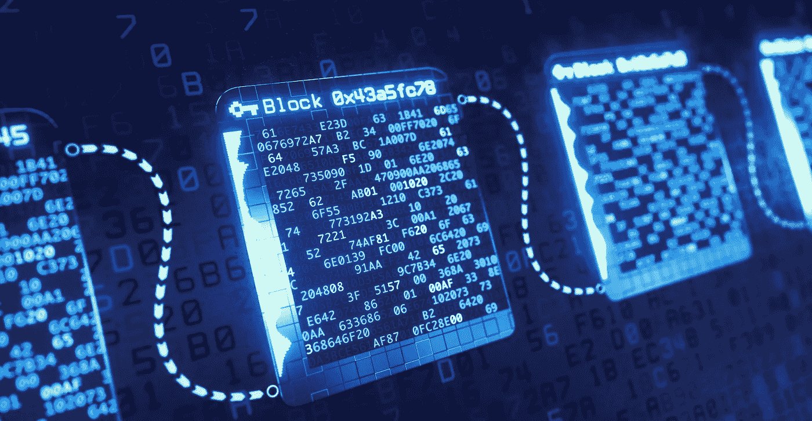
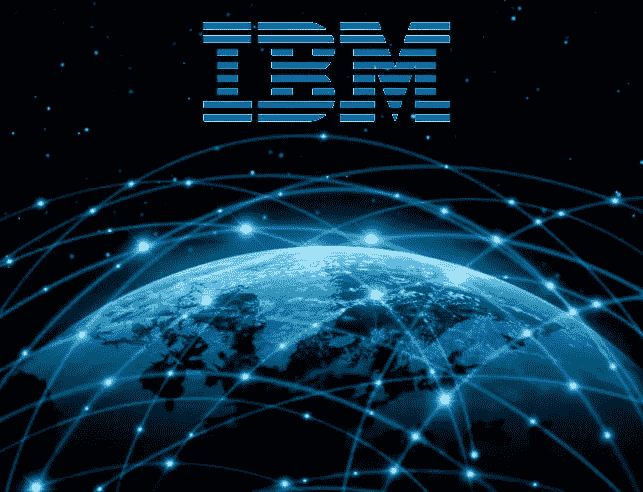

# 解释:如何区块链可以杀死讨厌的垃圾电话

> 原文：<https://medium.datadriveninvestor.com/explained-how-blockchain-can-kill-pesky-spam-calls-12ad8704fd6?source=collection_archive---------6----------------------->

区块链或分布式账本是一种创新，它迎合了经济增长的需求，提供了一个安全且所有人都可以访问的系统。如果你一直在关注我们的博客，你可能已经对此有所了解(如果没有，请关注此[链接](https://medium.com/datadriveninvestor/will-blockchain-transform-india-f121438d0c1c))。

重申一下，区块链运行在一个分散的平台上，在达成共识后实现对等互动，从而协同工作。它可以通过建立一个框架来满足安全需求，从而使行业受益。

印度几乎所有的电信公司都在积极寻找各种方式和方法来为各种用例部署区块链。我们乐观地认为，处于数字复兴中心的电信公司将成为让区块链渗透到整个世界的主要推动者，而区块链可能会给印度带来巨大的好处。电信行业目前正在经历巨大的变革，电信运营商需要将自己重塑为数字服务提供商和推动者，以保持相关性。

**区块链在电信业务中的实际应用**

印度电信监管机构(TRAI)在 2018 年希望确保只有注册的电话销售人员才能访问电话数据库，并明确记录用户同意接收此类通信。监管机构要求他们使用分布式账本技术来控制其网络上的商业通信流。

TRAI 还发布了一份关于如何建立电话销售人员注册系统和完善投诉机制的通知。“这是 TRAI 朝着正确的方向迈出的一步。区块链可以有效地创建资产的签名或哈希，而不是传输整个数字资产，在这种情况下，电话号码，您只能将哈希放在注册电话销售人员可以访问的数据库中。它就像是数字资产虚拟标志。区块链可以保护这个数据库，但在这种情况下，在数据的来源点和存储在分类账之前也需要安全，即确保在生成号码的电信服务提供商端没有泄漏，”印度互联网和移动协会区块链和加密货币委员会的前负责人 Ajeet Khurana 说。

**与 IBM 合作的电信公司**

TRAI 此举的目标是遏制不请自来的电话和短信，他们希望彻底结束垃圾邮件和收集用户数据(以及违反它)。然而，DLT 是安全的，而且数据管理得很好。国际商业机器公司(IBM)正计划与印度电信公司合作，提供可在移动号码可移植性(MNP)和不呼叫(DNC)注册处工作的区块链解决方案。

MNP 允许您保留您的号码，即使您换了另一家运营商。另一方面，DNC 允许您限制销售人员的营销和促销电话。Raghavan 证实，最新的区块链电信应用程序将使公司能够在客户同意的情况下，在私人分发的账本上积累 MNP 和 DNC。这将最终帮助政府机构更好地监控网络，并迅速发现任何公职人员的任何不当行为。

IBM 研究副总裁 Sriram Raghavan 表示:“我们已经与所有主要的电信提供商和 TRAI 在这一领域完成了概念验证和试点。“我们预计，进入新的一年，我们将开始看到区块链解决方案的推出。”尽管他没有提到电信公司。IBM 和 TRAI 一直致力于解决多方以及 w.r.t. DNC 注册管理机构和 MNP 之间的协调问题。一切都要记录为条目。

这将有利于 TRAI 抓住渎职行为，并通过其升级的监测技术提供更好的控制。DNC 注册中心将率先向 DLT 迁移，而 MNP 至少有两家电信公司参与，也能从这项技术中受益。我们还可以期待移动数据记录和移动网络系统的一些改进，从而使终端消费者和电信公司本身受益。

信息验证的分布式账本方法，或区块链，是一个很难理解的复杂概念，尤其是因为整个方法不是有形的。然而，用例是非常真实的，并将对印度十亿移动用户产生巨大影响。在不久的将来，垃圾电话将成为遥远的记忆。当那发生时，你将为此感谢区块链。

## 来自 DDI 的相关故事:

 [## 为什么数据会改变投资管理

### 有人称之为“新石油”虽然它与黑金没有什么相似之处，但它的不断商品化…

medium.com](https://medium.com/datadriveninvestor/why-data-will-transform-investment-management-4a60966c1c81)