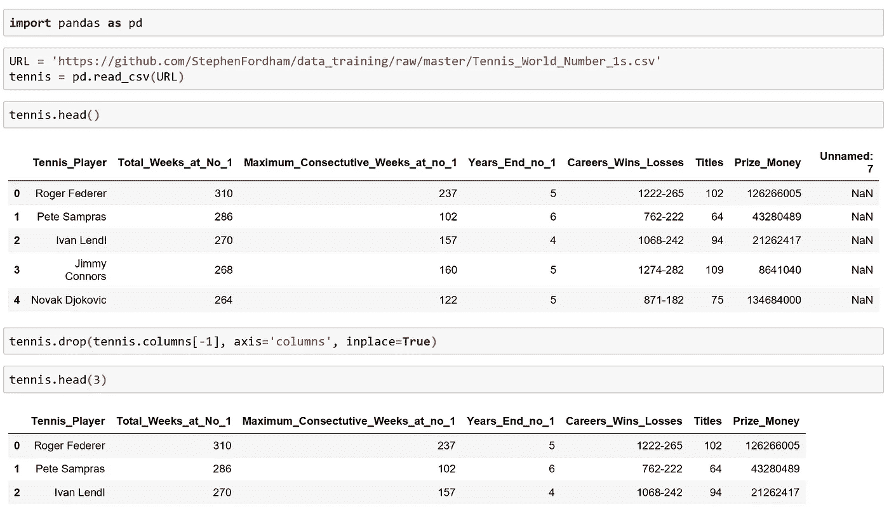
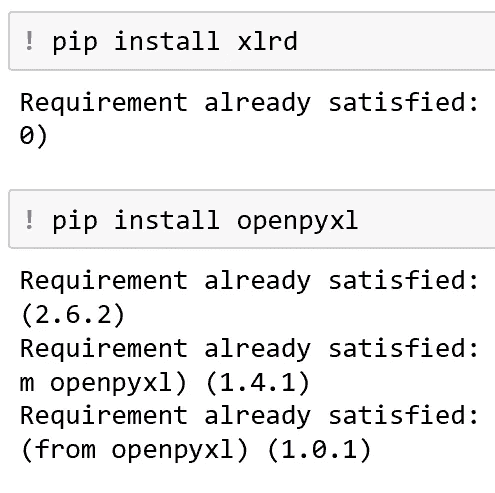
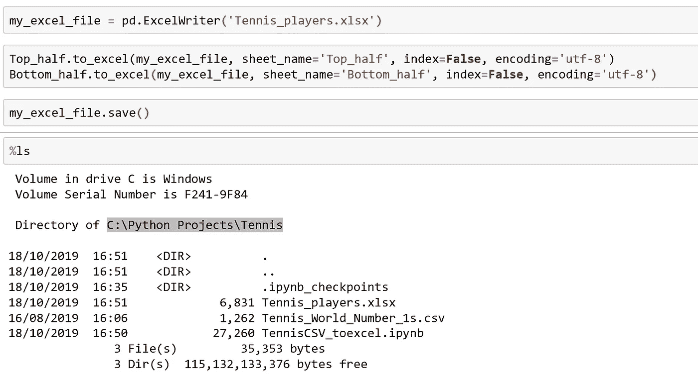
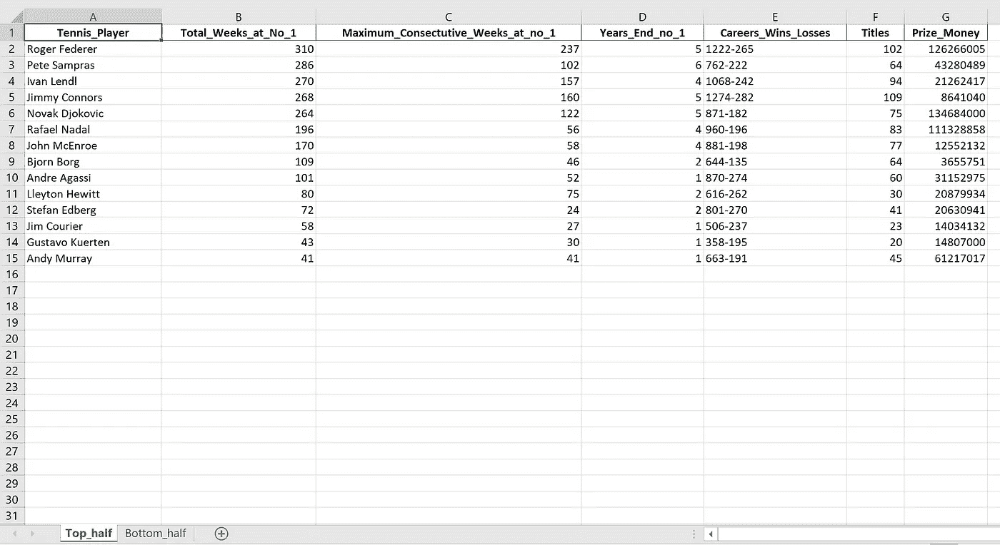
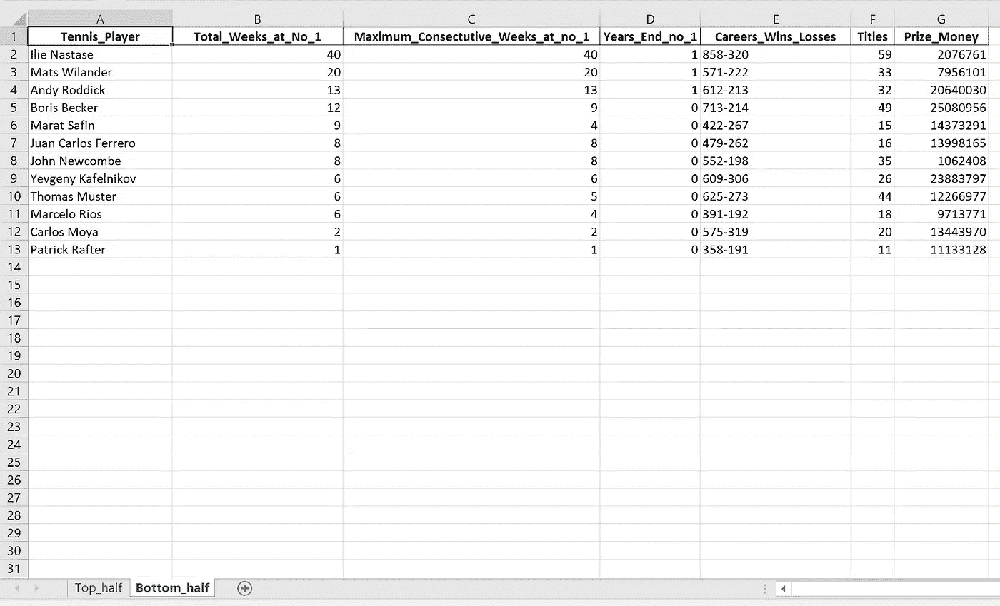

# 解释:用熊猫写 CSV 文件到 Excel

> 原文：<https://medium.datadriveninvestor.com/explained-writing-csv-files-to-excel-with-pandas-8d9fd4c4993e?source=collection_archive---------0----------------------->

## 用熊猫轻松处理文件

## 在线 CSV 到 Excel 文件

Excel 仍然是最流行的电子表格应用程序之一。幸运的是，Python Pandas 库可以与 Excel 一起工作，允许轻松导入和导出表格数据。

本教程将使用一个小的网球 csv 文件，我从过去 20 年前世界排名第一的 ATP 巡回赛网页上刮下来的。

 [## 数据科学和软件工程哪个更有前途？数据驱动的投资者

### 大约一个月前，当我坐在咖啡馆里为一个客户开发网站时，我发现了这个女人…

www.datadriveninvestor.com](https://www.datadriveninvestor.com/2019/01/23/which-is-more-promising-data-science-or-software-engineering/) 

## 从在线来源读取 CSV 文件

为了让事情更有趣一点，我想用一个例子来开始本教程，熊猫 read_csv 方法并不局限于只在我们的本地工作目录中获取一个 csv 文件。相反，可以将 url 指定给 read_csv 方法，只要它指向 csv 文件。

在这种情况下，任何人都愿意跟随这个教程，我的小型网球数据框架的链接可以在我的 github 页面[这里](https://github.com/StephenFordham/data_training/blob/master/Tennis_World_Number_1s.csv)找到。

我只是把这个 url 作为字符串赋给变量 URL。然后，我将它传递给 read_csv 方法，并使用 head 方法查看我的 Dataframe 的前 5 行。我给这个数据帧赋值，变量名，tennis。我采取的步骤描述如下。

为了清理刮掉的数据，我使用 drop 方法从我的 Dataframe 中删除不相关的‘Unnamed:7’列。为了使这种改变永久化，除了为轴参数提供字符串参数“columns”之外，我还需要为 inplace 参数指定 True 参数。

## Read_csv 和编码参数

此外，如果您尝试下载的 csv 文件包含特殊字符，例如德国字母字符，如元音字母和“”, read_csv 方法还有一个额外的编码参数，可以接受字符串参数“uft-8”。通过将该参数提供给 enconding 参数，read_csv 方法通常可以解析这些字符，并防止引发错误。

read_csv can take a url link as an argument and download to the data into a Dataframe.

## 必需的库

*-还有一个奖励提示*

作为先决条件，为了使用 Pandas 将 Dataframe 对象写入 Excel，必须安装 2 个库。这两个库分别是 xlrd 和 openpyxl。为了方便起见，这些库可以在 Jupyter 笔记本上轻松安装，只需在命令前面加上！签名后进行 pip 安装。当这个单元被执行时，输出将是“需求已经满足”或者安装将自动进行。

In order to import and export excel files with Pandas, the xlrd and the openpyxl libraries are required, and can be downloaded using Python’s Package Manager, Pip.

## 创建 2 个数据框架以导出到 Excel

为了展示 Pandas 输出数据帧的能力，我决定将网球数据帧分成两个更小的数据帧。

第一个数据框架，叫做 Top_half，是那些花了超过 40 周时间成为世界第一的球员。第二个数据框，名为下半部分，是世界排名第一的网球运动员中剩下的少于或等于 40 周的人。

为此，我简单地从原始网球数据帧中提取了“Total_Weeks_at_No_1”序列，并使用比较运算符生成一个布尔序列，该序列指示运动员是否处于世界第一的位置超过、少于或等于 40 周。然后，我将这些布尔序列传递给原始的网球数据帧进行提取，并将它们保存到适当命名的变量中，例如 Top_half 和 Bottom_half，如下面 Jupyter 笔记本中所示。

## 从熊猫数据框架到超越 3 步

1.  要开始将 Pandas 数据帧导出到 excel，需要创建一个 ExcelWriter 对象。这是通过使用直接在 pandas 库上调用的 ExcelWriter 方法实现的。在这个方法中，我指定了 Excel 文件的名称(在这里，我选择了' Tennis_players ')并包含了。xlsx 扩展名。这一步创建中心工作簿，然后我们可以将数据帧写入其中。
2.  接下来，我调用。to_excel 方法在我之前创建的 2 个数据帧上。在 to_excel 方法中，要指定的第一个参数是 ExcelWriter 对象，后跟一个“可选”sheetname 参数。我还选择通过将 index 参数从缺省值 True 设置为 False 来排除索引，并为 encoding 参数提供“utf-8”参数来处理任何特殊字符。我分别对 Top_half 和 Bottom_half 数据帧执行这些步骤。
3.  最后，现在我的数据帧已经排队等待导出，我调用 ExcelWriter 对象上的 save 方法，我已经将它赋给了变量' my_excel_file '。

正如我们在 Jupyter 笔记本中一样，我喜欢使用的一个技巧是单元格魔术%ls。这个命令列出了我的工作目录中的文件。如图所示，“Tennis_players.xlsx”现在出现了。

## 在 Excel 中查看

为了确认导出工作正常，让我们在 Excel 中打开该文件，并查看工作表名称或选项卡。一切都如预期的那样。在‘Tennis _ players . xlsx’文件中，世界排名第一超过 40 周的网球运动员位于上半部分，而世界排名第一少于或等于 40 周的网球运动员位于下半部分。

方便的是，Pandas 还自动加粗列标题，这给导出的数据帧一个漂亮的结尾。

Sheetname shown: ‘Top_half’ (this corresponds to the Top_half Pandas Dataframe)

Sheetname shown: ‘Bottom_half’ (this corresponds to the Bottom_half Pandas Dataframe)

## 摘要

我使用 url 下载的原始 CSV 文件作为 Dataframe 对象读入 Pandas。随后，该数据帧被分割成 2 个数据帧并导出到 Excel，文件名为 Tennis_players，扩展名为。xlsx，2 个数据帧分配给不同的选项卡。