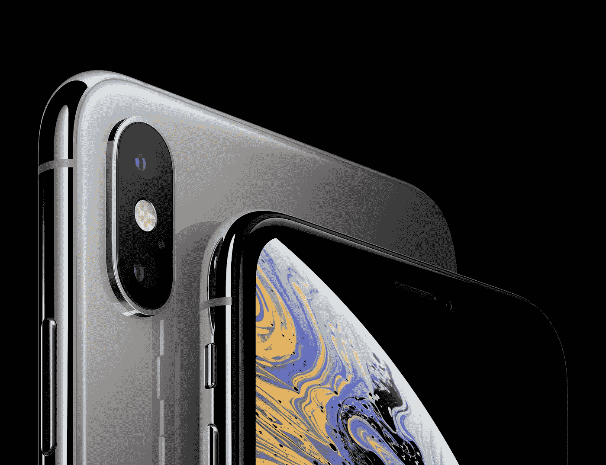

# 解释为什么 iPhone XS 有意义

> 原文：<https://medium.datadriveninvestor.com/explaining-why-the-iphone-xs-makes-sense-fbfb95438781?source=collection_archive---------6----------------------->

你有没有想过为什么苹果把它最新的 iPhone 设计成有一个凹槽？你有没有想过为什么他们把 iOS 做成今天这个样子？在这篇文章中，我们将从软件、硬件和日常实际使用的高度来尝试和研究苹果如何设计他们的产品，特别是 iPhone XS。

> “在继续阅读之前，请不要在本文中将 Android 与 iOS 进行比较。这篇文章只是试图弄清楚为什么当前的 iPhone 是这样的，以及有哪些我们经常不认为重要或无聊的功能或我们根本没有看到的功能。”

# **缺口有意义**

你可能会说*“什么？！开什么玩笑？”*当你读这篇文章的时候，没错，它是有意义的。这是有道理的，因为苹果希望尽可能多地使用屏幕。但是，要实现这一点有一个障碍。因为前置摄像头和深度传感器还不能放在屏幕后面，他们需要一个地方来放置它们。

 [## 苹果会成为新的网飞吗？数据驱动的投资者

### 有可能。然而，该公司肯定会与大公司竞争。许多人不得不看到这一天的到来…

www.datadriveninvestor.com](https://www.datadriveninvestor.com/2019/02/15/will-apple-be-the-new-netflix/) 

*“但是简……许多其他手机制造商，比如 Vivo，正在努力解决这个缺口问题，让相机模块在你需要的时候可以电动化。”*

我不和你争论这个方法有道理。看起来比有缺口干净多了。通过实施这种方法，屏幕现在可以占据屏幕的整个部分，而不必真的用凹口来解决，因为相机模块不会再碍事了。但是，你知道什么东西最容易坏掉吗？我认为苹果也看到了这种设计，但决定采用 notch，因为他们想让自己的产品真正经得起日常磨损，而不会在手机的生命周期内真正损坏相机模块。**在我的使用中，我对凹槽**没有任何问题。人们倾向于首先咆哮，而不是尝试一下，看看它是否真的对用户体验造成那么大的困扰。

# **iOS 有道理**

苹果将 iPhone 描述为包装在漂亮盒子里的软件。

许多评论家批评苹果的 iOS 平台缺乏创新。大多数时候，我也是他们中的一员。但是我们不应该被愚弄。你看不到变化并不意味着变化没有发生。

以下是我们每天都会用到的一些非常实用的功能:

## **升起唤醒**

iPhone 的唤醒功能很容易被忽略，但在我看来，这是迄今为止 iPhone 上使用最多的功能之一。它像魔法一样有效。当你带着你的 iPhone 使用时，屏幕会自动打开，有了 Face ID，你的手机会立即识别你，让你几乎立即进入。

## 点击以唤醒

当你的 iPhone 在休息时，当你想看看你是否有任何重要的通知，而不必真的拿起你的 iPhone。你只需点击屏幕，它就会打开屏幕，让你在锁定屏幕上阅读你的通知。

## Face ID

我相信苹果拥有当今世界上最好的硬件工程团队之一，并且知道这一点，我们可以有把握地假设他们真的考虑过将触控 ID 放在屏幕后面或手机后面，或者放在其他可以放置指纹传感器的地方。如果他们已经有了一个安全模块，为什么还要创建一个全新的安全模块呢？触控 ID 快速、可靠、准确，它带来的用户体验非常直观，因为我们总是按下 Home 键，这是安装它的最佳位置。

但现在不同了。触摸屏界面现在大多占据了手机的正面。你想想，最重要的是你如何安全地进入你的手机，对吗？只要有效、安全且不费力，如何做并不重要。毫不费力意味着你真的不必担心或考虑它。我想这就是他们决定创造 Face ID 的原因。

这不仅仅是硬件或工程问题。**这是关于可用性的问题。**这是在问*“我们怎样才能在 iPhone 上获得比以往更无缝的体验？”在问“我们可以使用什么技术或工程来实现这一愿景？”*

此外，Face ID 比触控 ID 安全得多。破解 Face ID 的可能性是百万分之一，而触控 ID 是五万分之一。

## APFS(苹果文件系统)

苹果现在使用 APFS(苹果文件系统)。他们早在 2017 年 3 月就推出了这种新的文件系统。*“APFS 是什么？”*，你可能会说。你可能是第一次听到这个。基本上，它是苹果公司读写数据到存储器的新方法。这是什么意思？这意味着当你在 Spotlight 中搜索某样东西时，它可以在存储器中查询可能的结果，并尽可能快速高效地向你显示信息。这意味着存储在您设备上的数据是加密的、安全的和高效存储的。这意味着用于读取和写入手机存储数据的软件在效率和可靠性方面对硬件进行了优化。但是正常人不会真的注意，因为他们在视觉上看不到任何变化。他们不知道的是，iOS 是最安全的软件平台之一，如果不是今天提供的最安全的移动设备软件的话。

## 多任务处理

iOS 做了很多我们用户看不到的事情，因为它是无缝的体验。你知道你不必清除后台应用程序吗？iOS 已经知道在哪里分配资源，因为它知道如何进行电源管理。如果根本不需要运行任务，iOS 会暂停任务，以节省电池寿命和资源。此外，你有没有注意到你没有看到一个后台服务的列表，以及它们消耗了多少 RAM 或 CPU 功率，不像 Android？

为什么？因为你不需要！为什么普通消费者需要？他们为什么要关心一个进程消耗了多少内存呢？这只有开发者知道，终端用户不知道。

软件应该尽可能给用户带来无缝的体验。

## 应用商店

苹果的应用商店是当今最大的应用商店。它还提供独家应用和游戏。应用程序开发人员喜欢在苹果的 iOS 平台上开发，因为推广和维护他们的应用程序非常方便。他们不必考虑他们的应用程序是否能在旧设备上运行那么久。与安卓相比，你需要担心你的应用程序是否适用于三星手机、摩托罗拉手机、LG 手机、小米手机等。

## LTS(长期支持)

苹果很好地照顾了他们的设备和用户。他们所做的每一次重大更新，几乎 70%到 80%的用户都可以在他们的手机上下载更新。因为没有一个软件是没有漏洞和漏洞的，所以持续的长期更新对于保持 iPhones 平稳运行和防止漏洞的发生是非常重要的。

# 硬件有意义

## 苹果 A12 仿生

我相信苹果是设计微处理器最好的公司之一。年复一年，他们使它比去年的型号更快、更小、更强大。现在他们有了苹果 A12 仿生芯片。它功能如此强大，又如此高效，可以在设备上进行机器学习。他们使用这种新芯片在 Face ID 上进行机器学习，这样当你戴上眼镜、长出或剃掉小胡子或胡须时，设备就会知道你还是你。

## 有机发光二极管显示器

此外，现在他们的 iPhone 也从 IPS 显示器转向了有机发光二极管显示器。这是有意义的，因为有机发光二极管现在已经成为业界领先的技术，用于提供明亮，清晰，准确的显示，而且它也是节能的。

## 存储大小

iPhone 的最小存储容量是 64GB，最大可达 512GB。而且不能扩大。有没有想过为什么 iPhones 不能扩展？因为只有技术人员才会费心去寻找那个特性。一般人都懒得去找。也许在不久的将来，如果苹果决定制造一个“iPhone Pro”系列。

## IP68 防水等级

iPhone XS 现在更防水了。坏消息是，就像任何其他防水手机一样，如果你的手机被水损坏，它不在保修范围内。好消息是，它是防水的，这意味着当你不小心把手机掉进水里时，只要你尽快捡起来，你的手机很可能会没事。总之，它应该比以往任何时候都更耐用，因为手机现在可以在环境中保持更多的耐力。

# 摘要

iPhone XS 是手机行业的革命性产品。这看起来很简单，但是如果你真的试着去想，想出一个简单的东西是非常困难的。如果你还没有使用过 iPhone，也没有任何理由阻止你使用 iPhone，那么我建议你至少试用一个星期，如果你已经有一部 iPhone，我希望这篇文章有助于欣赏该产品的技术和投入的努力。