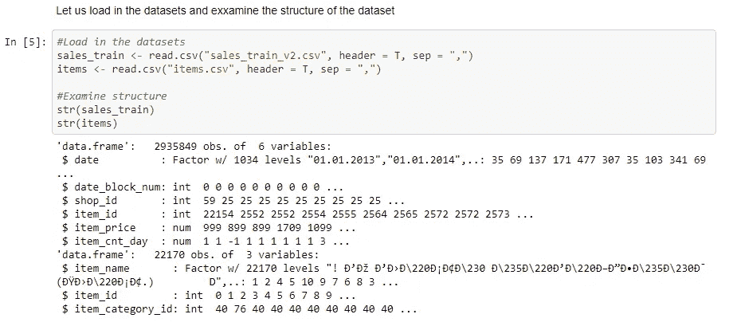
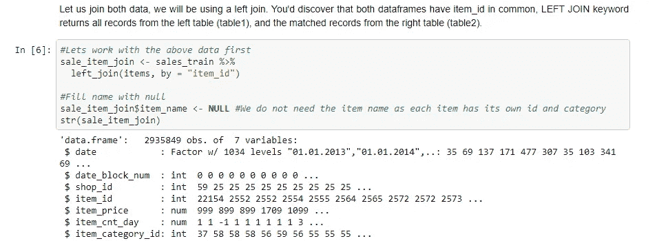
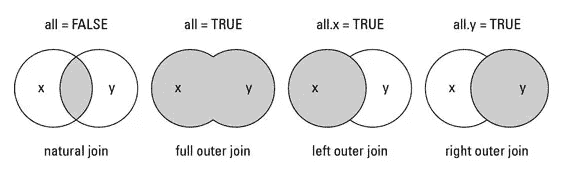
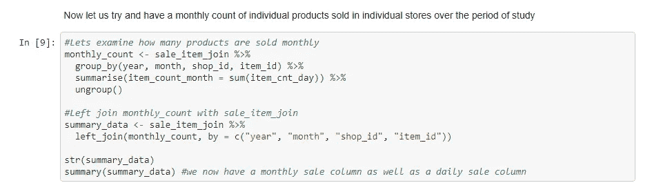
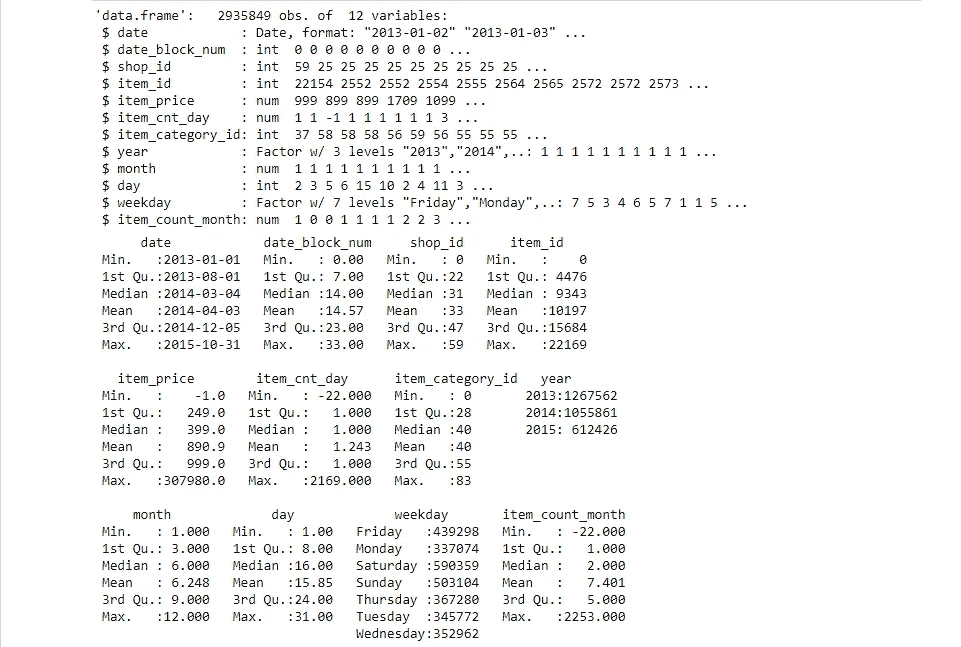
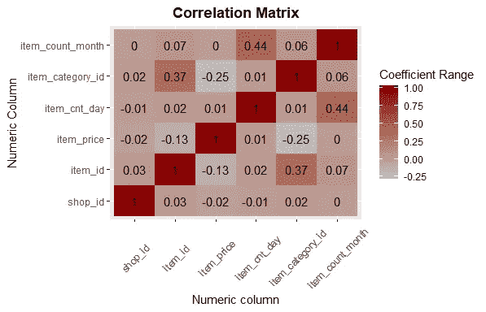
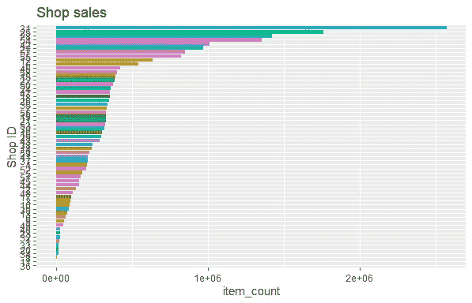
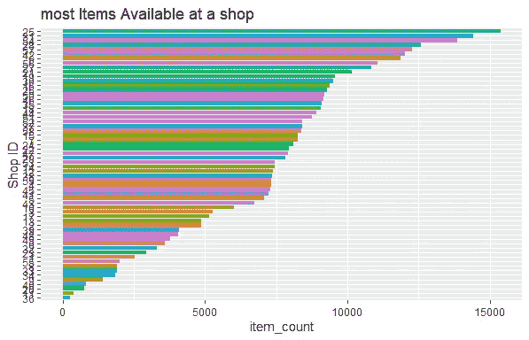
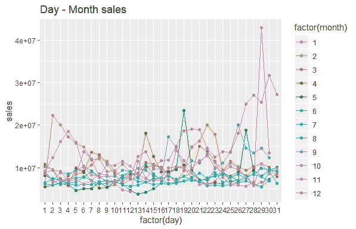
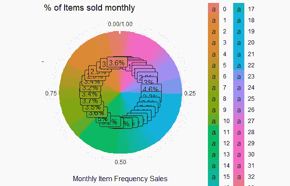

# 探索性数据分析—演练

> 原文：<https://medium.datadriveninvestor.com/exploratory-data-analysis-a-walk-through-f0dc0f333d3?source=collection_archive---------1----------------------->

了解您的数据


Source: Pixabay

EDA 是每个数据分析师/科学家都应该具备的关键和核心技能。它涉及对数据集中捕获的可能性进行批判性的深入检查。

> 探索性数据分析“是一种态度，一种灵活的状态，一种寻找我们认为不存在的东西以及我们认为存在的东西的意愿。约翰·w·图基

EDA 涉及应用统计和可视化技术来理解和洞察数据。只要有数据，就有探索的必要。值得注意的是，EDA 没有标准或明确的方法，它需要一个循序渐进的过程，这就是本教程旨在向您展示的内容。

[](https://www.datadriveninvestor.com/2019/02/07/8-skills-you-need-to-become-a-data-scientist/) [## 成为数据科学家所需的 8 项技能|数据驱动型投资者

### 数字吓不倒你？没有什么比一张漂亮的 excel 表更令人满意的了？你会说几种语言…

www.datadriveninvestor.com](https://www.datadriveninvestor.com/2019/02/07/8-skills-you-need-to-become-a-data-scientist/) 

对于本教程，我将使用一个销售数据集，可在此处下载 [***。***](https://github.com/simmieyungie/EDA/blob/master/Sales.rar)

该数据由一家软件公司提供的每日销售数据组成。在进行 EDA 之前，确保数据整洁非常重要，根据 Hadley Wickham 的说法，数据结构整洁:

*   每个变量都是一列
*   每个观察值都是一行
*   每种类型的观察单位都是一张表

作为这个练习，我们加载要使用的包。获取 J [upyter 笔记本](https://gist.github.com/simmieyungie/a62eca3ecd787c6463c79a2dcfd908c7)

Packages used

现在我们加载数据并检查数据的结构



Loaded data and structure

我们将尝试连接两个已加载的数据框，因为它们具有相同的 item_id



Source: [http://www.datasciencemadesimple.com/](http://www.datasciencemadesimple.com/)

我们通过为一周的不同时段创建单独的功能来探索更多选项

```
*#Remove the other datasets no longer needed* 
*rm("items", "sales_train")* 
*#convert date column to date class* *#use dmy from lubridate data* sale_item_join$date <- dmy(sale_item_join$date)#Lets apply lubridate functions to create year day and month columns
sale_item_join$year <- year(sale_item_join$date)
sale_item_join$month <- month(sale_item_join$date)
sale_item_join$day <- day(sale_item_join$date)
sale_item_join$weekday <- weekdays(sale_item_join$date)#lets convert year and weekday to factor
sale_item_join$year <- as.factor(sale_item_join$year)
sale_item_join$weekday <- as.factor(sale_item_join$weekday)
```



从上面的代码中，我们试图通过汇总每日销售数据来获得每种商品多年来的月销售额。检查该结构，我们得到以下结果:



# 探索性数据分析

如前所述，在 EDA 中没有放之四海而皆准的程序，它为令人兴奋的创造力和改进提供了空间，因此，请花时间从最简单的概念到最复杂的概念进行探索。

```
#Exploratory data analysis
#correlation of matrix
cor_data <- summary_data %>% 
  select(3:7, 12)melt(cor(cor_data)) %>% 
  ggplot(., aes(Var1, Var2, fill = value)) +
  geom_tile() +
  scale_fill_gradient(low = "grey", high = "darkred") +
  geom_text(aes(Var1, Var2, label = round(value,2)), size = 4) +
  labs(title = "Correlation Matrix", x = "Numeric column", y = "Numeric Column",
       fill = "Coefficient Range") +
  theme(axis.text.x = element_text(vjust = 0.5, angle = 45),
        plot.title = element_text(face = "bold", hjust = 0.5))
```



```
#Examine the most popular shops and total sales of the shop
summary_data %>% 
  group_by(shop_id) %>% 
  summarise(item_count = sum(item_count_month)) %>% 
  ggplot(., aes(reorder(as.factor(shop_id), item_count), item_count, fill = as.factor(shop_id))) +
  geom_bar(stat = "identity", show.legend = F) +
  coord_flip() + 
  labs(title = "Shop sales", x = "Shop ID", ylab = "Item Count")
```



```
*#Which shop has the most item in their shop*
summary_data %>% 
  group_by(shop_id) %>% 
  summarise(item_count = n_distinct(item_id)) %>% 
  ggplot(.,aes(reorder(as.factor(shop_id), item_count), item_count, fill = as.factor(shop_id))) +
  geom_bar(stat = "identity", show.legend = F) +
  coord_flip() + 
  labs(title = "most Items Available at a shop", x = "Shop ID", ylab = "Item Count")
```



```
*#What are the day and month wise sales*
summary_data %>% 
  group_by(month, day) %>% 
  summarise(sales = sum(item_cnt_day*item_price)) %>% 
  ungroup() %>% 
  ggplot(.,aes(factor(day), sales, col = factor(month))) +
  geom_line(aes(group = month)) + geom_point() +
  labs(title = "Day - Month sales", fill = "Month")
```



```
*#What percentage of items is sold per month*
*#get daily pricing* 
summary_data$price <- summary_data$item_price*summary_data$item_cnt_day
*#total number of items sold*
items_sold <- sum(summary_data$item_cnt_day)
item_revenue <- sum(summary_data$price)

*#Percentage of items sold daily*
summary_data %>% 
  group_by(date_block_num) %>% 
  summarise(monthly_sales_freq = round(sum(item_cnt_day)/items_sold, 3)) %>% 
  ungroup() %>% 
  ggplot(.,aes(x = "", y = monthly_sales_freq, fill = factor(date_block_num))) +
  geom_bar(width = 1, stat = "identity") +
  coord_polar(theta = "y", start = 0) +
  geom_col(position = "fill") + 
  geom_label(aes(label = paste0(monthly_sales_freq *100, "%")), position = 
               position_fill(vjust = 0.5)) +
  labs(x = "", y = "Monthly Item Frequency Sales", fill =  "Months",
       title = "% of Items sold monthly")
```



## 结论

我们已经尝试了 EDA 的实践，如果你要大幅度提高，你将需要在各种数据上进行实践。Kaggle 是一个获取数据的好地方，帮助我取得巨大进步的方法之一是复制内核，并尝试适应不同专家的鞋子。这有助于您探索相同数据的不同视角，您也可以尝试用其他语言复制内核。要获得完整的扩展脚本，请单击此处的。