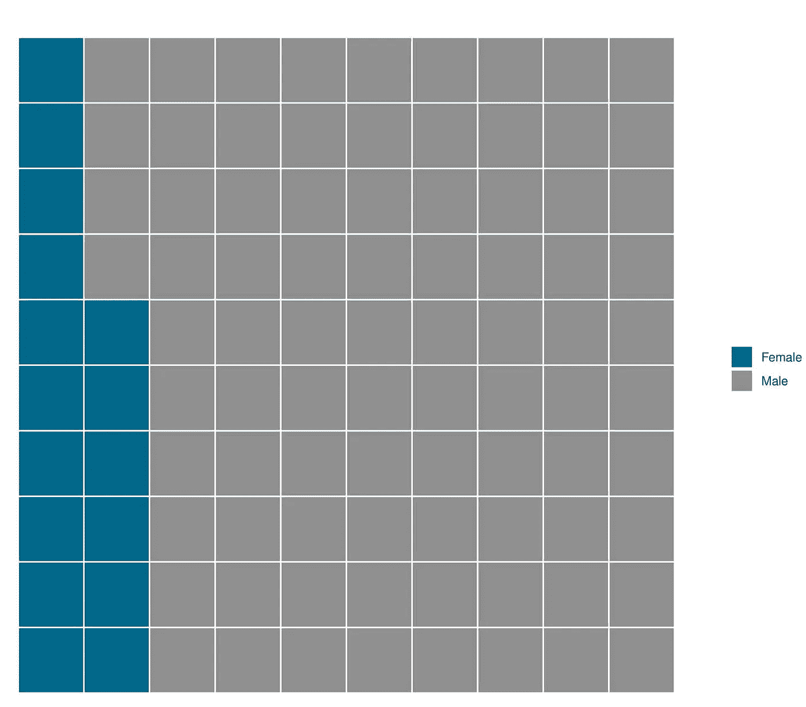
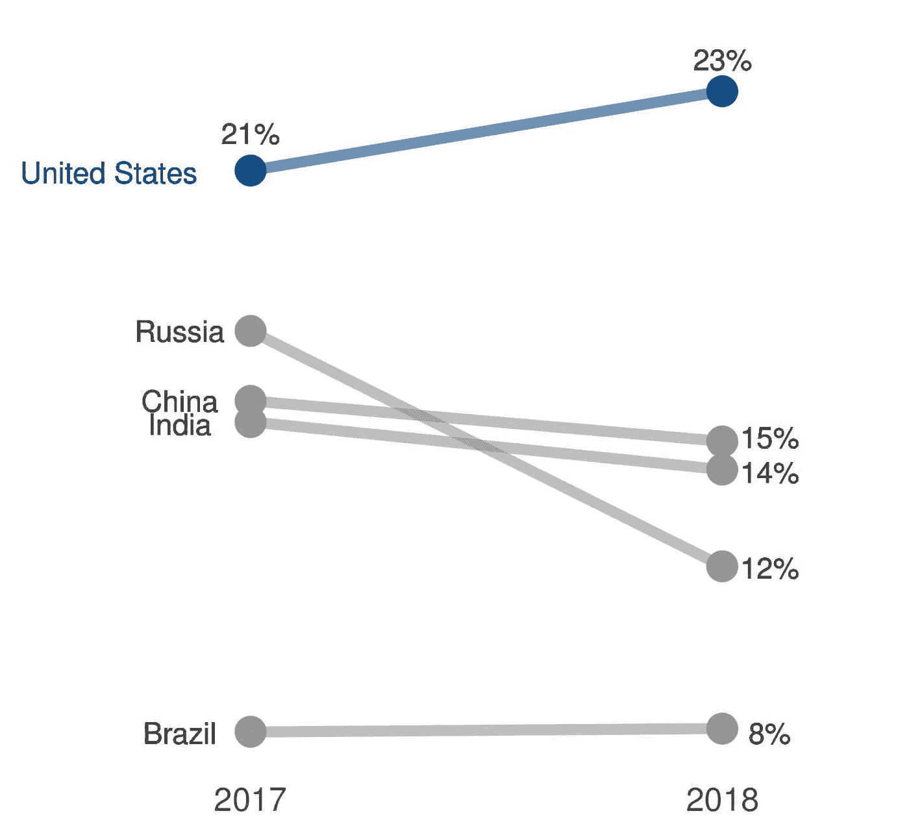
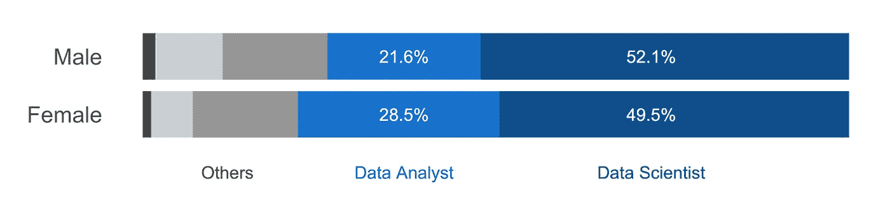
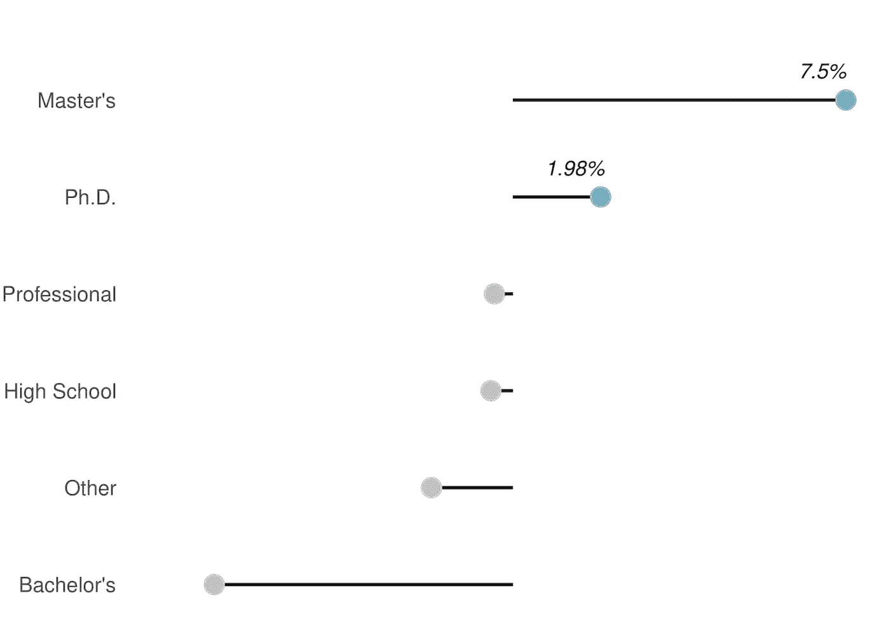
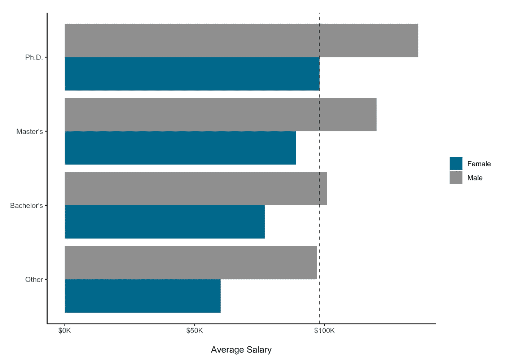
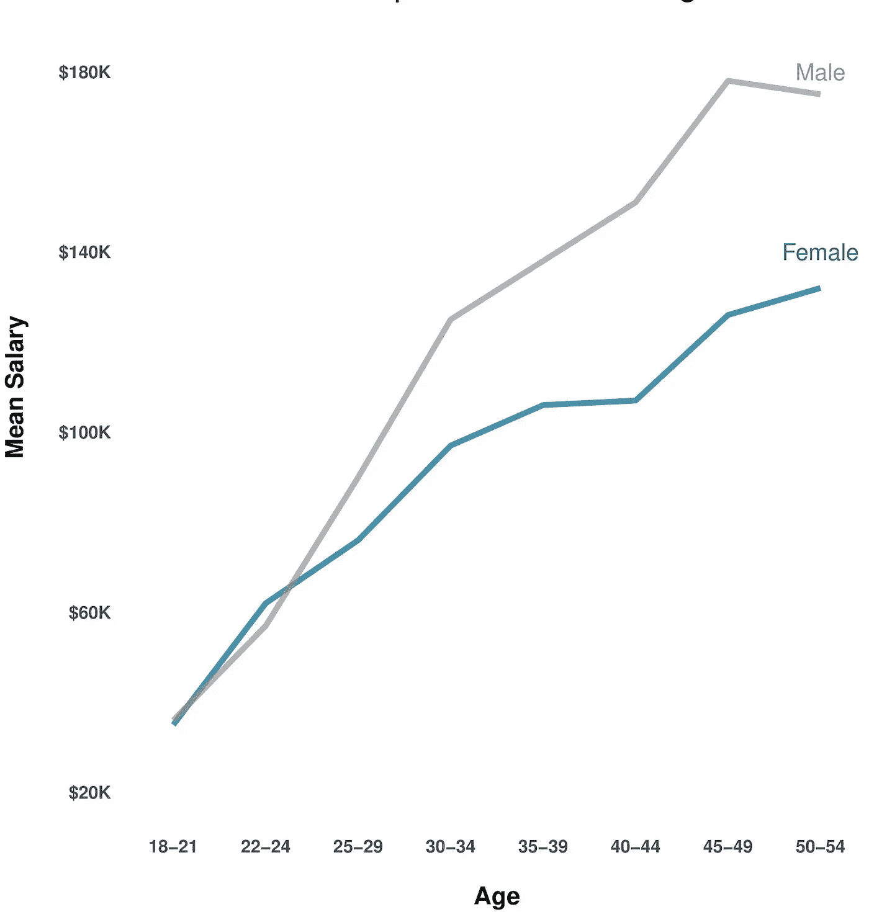

# 探索性数据分析(EDA) —了解数据科学角色中的性别差异

> 原文：<https://medium.datadriveninvestor.com/exploratory-data-analysis-eda-understanding-the-gender-divide-in-data-science-roles-9faa5da44f5b?source=collection_archive---------2----------------------->

同 [Shreejaya Bharathan](https://medium.com/u/3574e9a9e5c1?source=post_page-----9faa5da44f5b--------------------------------) 关于 2018 Kaggle ML & DS 调查数据

女性在科学、技术、工程和数学领域的代表性历来不足，在工作场所面临歧视。根据 2018 年进行的一项研究，“在 63%的情况下，女性在同一家公司的同一份工作中获得的薪酬低于男性。''

数据科学行业是否继承了其他传统行业的这些偏见？

## 资料组

我们选择了 2018 年 Kaggle ML & DS 调查来分析数据科学中的性别鸿沟。该调查包含与我们的研究相关的教育、技能、年龄、收入和角色等信息。

 [## 2018 年 Kaggle ML & DS 调查

### 下载数千个项目的开放数据集+在一个平台上共享项目。探索热门话题，如政府…

www.kaggle.com](https://www.kaggle.com/kaggle/kaggle-survey-2018) 

我们还使用了 2017 年版的调查进行对比分析。

 [## 2017 年 Kaggle 机器学习和数据科学调查

### 下载数千个项目的开放数据集+在一个平台上共享项目。探索热门话题，如政府…

www.kaggle.com](https://www.kaggle.com/kaggle/kaggle-survey-2017) 

由于大多数数据科学家使用 Kaggle 来获取数据集、协作或参与数据挑战，并且该调查有超过 2.3 万份回复，我们认为它很好地代表了整个社区。

## EDA 和可视化

我们通过删除所有不到 5 分钟完成的回答来预处理数据，因为大约有 50 个问题，真正的回答需要超过 5 分钟。接下来，因为我们在做男性和女性的比较，我们删除了所有其他性别和缺失的值。所有数据操作都是使用 pandas 完成的，而绘图是使用 ggplot2 创建的。

点击此处查看我们的代码:

 [## 电子设计自动化(Electronic Design Automation)

### 数据科学中的性别差异-使用 jovian.ml 共享](https://jovian.ml/aakanksha-ns/gender-divide) 

## 只有 16%的受访者是女性

% Respondents 2018 — Female vs Male

看到社区中如此小的一部分是由妇女组成的，真是令人震惊。

## 美国从事数据科学的女性比例最高

% Women by countries — 2017 vs 2018

然后，我们比较了 5 个国家中拥有最多受访者的女性比例，以及这一比例从 2017 年到 2018 年的变化。我们发现，在美国，几乎 1/4 的数据科学社区是女性，在性别比例方面，它比其他国家做得好得多。对于俄罗斯来说，女性的比例实际上似乎在下降！

## 女性和男性的角色分配相似

很高兴看到男性和女性的角色分配大致相同。大约一半的受访者是数据科学家，20–30%是数据分析师，其余是研究科学家、数据工程师或 DBA/数据库工程师。

 [## 数据科学和软件工程哪个更有前途？数据驱动的投资者

### 大约一个月前，当我坐在咖啡馆里为一个客户开发网站时，我发现了这个女人…

www.datadriveninvestor.com](https://www.datadriveninvestor.com/2019/01/23/which-is-more-promising-data-science-or-software-engineering/) 

## 女性比男性拥有更多的高等学位

女性拥有硕士或博士等高等学位的受访者比例更高。

## 同等教育水平的女性比男性挣得少

看到女性(博士)的最高平均工资实际上比任何教育水平的男性的平均工资都低，真是令人难过。在任何给定的教育水平下，女性的收入都比男性低 20-25 %!

## 收入差距随着年龄的增长而增大

女性和男性开始时的工资往往相似，但随着年龄的增长，工资差距越来越大。这表明考虑晋升和担任更高职位的妇女比例较低。

## 摘要

Kaggle DS 和 ML 调查让我们对数据科学中女性的状况有了发人深省的见解。作为一个相当新的领域，我们确保数据科学社区包容并欢迎每个人还为时不晚。