# Python 中的探索性数据分析

> 原文：<https://medium.datadriveninvestor.com/exploratory-data-analysis-in-python-a3b53fadb421?source=collection_archive---------0----------------------->

[](http://www.track.datadriveninvestor.com/1B9E)

***在本文中，我们将学习使用 python 来探索数据。这将帮助我们更好地理解数据，根据特征的重要性识别对预测最有帮助的特征。***


***探索性数据分析的意图是什么？***

*   **理解数据及其不同的数据元素，获得对数据的关键见解**。这些见解将有助于机器学习算法的特征选择。
*   **使用直观和统计方法总结数据的主要特征。**

[](https://www.datadriveninvestor.com/2019/01/23/which-is-more-promising-data-science-or-software-engineering/) [## 数据科学和软件工程哪个更有前途？数据驱动的投资者

### 大约一个月前，当我坐在咖啡馆里为一个客户开发网站时，我发现了这个女人…

www.datadriveninvestor.com](https://www.datadriveninvestor.com/2019/01/23/which-is-more-promising-data-science-or-software-engineering/) 

***我们如何进行数据分析？***

以下是可以用来深入了解数据的步骤。

## 基本数据理解

*   理解数据中存在的数据元素。我们可以找出存在哪些列，查看几行并理解它们的数据类型
*   查找数据元素的类型，比如变量是分类的还是数字的
*   将数据转换为适当的类型，如将字符串转换为日期时间或将对象转换为浮点或字符串
*   对数据进行基本统计，以了解计数、最小值、最大值和平均值。这将进一步帮助理解我们是否需要根据数据集的不同特征中存在的值的范围来规范化数据

让我们开始对[数据源](https://archive.ics.uci.edu/ml/datasets/Adult)进行探索性数据分析。在这个数据源中，我们预测一个人的年收入是否超过 5 万英镑。

我已经下载了成人普查数据. csv 文件中的数据集

**导入所需的库**

```
import numpy as np
import pandas as pd
import matplotlib.pyplot as plt
import seaborn as sns
%matplotlib inline
```

**从 csv 文件中读取数据到数据帧中**

```
dataset= pd.read_csv(“c:\\data\\adult_census_data.csv”)
```

**数据集中出现的列**

```
dataset.columns 
```

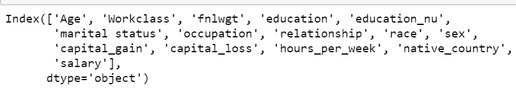

Columns present in the DataFrame

**数据出现在顶部几行和底部几行**

```
dataset.head(2)
```

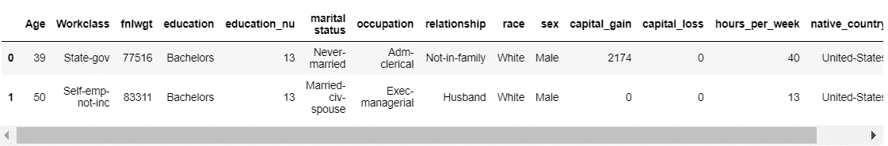

top 2 rows using data set head(2)

```
dataset.tail(2) 
```

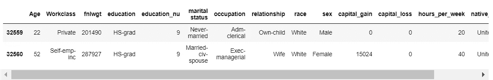

bottom 2 rows using dataset tail(2)

**汇总数据帧，以了解变量类型、数据类型和空值的存在**

这将为我们提供有关数据帧的信息，包括索引数据类型和列数据类型、非空值和内存使用情况。

```
dataset.info()
```

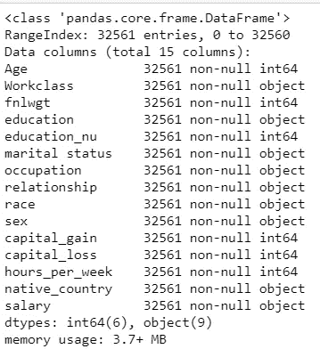

Columns, data type and non null values

工作阶级、教育、婚姻状况、职业、关系、种族、性别、祖国和薪水是分类变量。工资是我们的目标变量。

年龄、fnlwgt、教育 _nu、资本收益、资本损失、每周小时数是数字变量。

所有列都不是空列。我们不需要处理空值，因为所有列都不是空值

我们也不会转换数据类型，但我们可能需要为其他数据集执行数据转换步骤

**将列转换为正确的数据类型**

以下是一些将列转换为数字和日期时间的示例

```
dataset[‘Age’] =pd.to_numeric(dataset[‘Age’])
```

我们的数据集中没有日期时间，但如果我们必须转换为日期时间，我们将使用熊猫库使用 to_datetime

```
dataset_1[‘Month_Year’] = **pd.to_datetime**(dataset_1[‘Month_Year’])
```

**数据集的基本统计**

```
dataset.describe(include=’all’)
```

这是描述性统计，用于总结数据集分布的集中趋势、分散和形状，不包括`NaN`值。


Analyzes both numeric and categorical data

对于数字特征，我们可以查看平均值、最小值、最大值、标准偏差和数据的分布。对于分类特征，我们可以找出特征存在多少唯一值以及最频繁的值

## 处理空值

*   检查是否存在空值。制定处理空变量的策略。

```
#Check for presence of null values in the DataFrame
null_columns=dataset.columns[dataset.isnull().any()]
null_columns
```

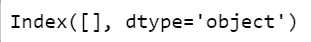

No null values present in the dataset

**处理空值的几种策略**

*   将空值转换为零
*   对于数值列，用整列的平均值替换空值
*   如果要素属于分类类型，则使用最常见的值替换空值
*   删除具有空值的行或基于特定阈值删除具有空值的行。例如，如果行中不超过 50%的列具有空值，则删除该行

## **识别和处理异常值**

*   异常值是位于 3 个标准偏差之外的任何值
*   我们也可以使用四分位间距(IQR)来识别异常值。你可以在这里获得更多关于离群值识别的细节

我们可以删除离群值，因为它们会扭曲数据，或者决定保留它们，因为它们会提供一些非常重要的信息，如数据异常。

*在市场衰退或经济繁荣时，房价可能会出现异常值。这些事件提供了对房价何时会正向或负向变化的洞察。*

如果数据超出 3 个标准偏差，下面的函数检测异常值。

```
**def detect_outlier(data_1):**

    threshold=3
    mean_1 = np.mean(data_1)
    std_1 =np.std(data_1)

    for y in data_1:
        z_score= (y - mean_1)/std_1 
        if np.abs(z_score) > threshold:
            outliers.append(y)

    return outliers
```

我们现在遍历所有的数字列，并使用*箱线图*绘制异常值

```
# iterate through each column and see if there are outliers
# you can change the columns where you want to check for outliers
# plots the outliers
fig=plt.figure()for i  in range(0,len(dataset.columns)):
    outliers=[]

    **if dataset[dataset.columns[i]].dtypes== np.int64 or dataset[dataset.columns[i]].dtypes== np.int64**  :

        **outliers=detect_outlier(dataset.iloc[:,i])**
        if len(outliers)>0:

            ax = plt.subplot(1,1,1)

            ax.boxplot(dataset[list(dataset.columns)[i]])
            plt.title(list(dataset.columns)[i] + " outlier plot")
            plt.show()
```

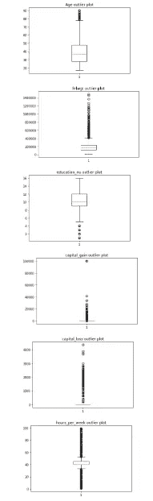

Boxplot for outliers

在这种情况下，我们不会删除任何异常值，但是我们可以识别异常值行并删除这些行

## **数据可视化**

*   对数据运行不同的数据可视化

**可视化有助于**

*   轻松理解数据
*   识别不同数据元素之间的关系和模式
*   检查数据中出现的趋势
*   从数据中创建一个故事，并传达给利益相关者

关于使用 seaborn 和 matplotlib 进行数据可视化的更多细节，请点击[查看](https://medium.com/datadriveninvestor/data-visualization-5b1dc260c91a)

## 特征选择

**T22 什么是特征选择？**

**特征选择提供了对数据和生成数据的基础过程的更好理解。**

***我们如何进行特征选择？***

*   识别低方差的特征。这些是具有恒定值或没有太多可变性的特征。这些功能可能对预测任务没有帮助，因此可以放弃

**方差阈值技术用于识别低方差特征**。这是一种简单的基线方法，可移除方差未达到特定阈值的所有要素。默认情况下，它会移除所有零方差要素，例如所有样本中具有相同值的要素。

*   识别输入变量之间的多重共线性。当两个或更多输入特征彼此高度相关时，存在多重共线性。多重共线特征的存在增大了标准误差

使用**方差膨胀因子(VIF)识别多重共线性。**

VIF 测量因多重共线性而膨胀的系数估计值的标准误差

*   确定对预测更重要的特征及其与目标变量的关系。为此，我们可以使用几种技术，这将在下一节中讨论

在下面的函数中，我们计算方差膨胀因子(VIF)并确定具有低方差的要素

```
from statsmodels.stats.outliers_influence import variance_inflation_factor**def calculate_vif**_(X, thresh=5.0):
    variables = list(range(X.shape[1]))
    dropped = True
    while dropped:
        dropped = False
        vif = [variance_inflation_factor(X.iloc[:, variables].values, ix)
               for ix in range(X.iloc[:, variables].shape[1])]maxloc = vif.index(max(vif))
        if max(vif) > thresh:
            print('dropping \'' + X.iloc[:, variables].columns[maxloc] +
                  '\' at index: ' + str(maxloc))
            del variables[maxloc]
            dropped = Trueprint('Remaining variables:')
    print(X.columns[variables])
    return X.iloc[:, variables]
```

在数据集上检查低方差的数字要素

```
dataset_clean=dataset[[‘Age’,’fnlwgt’,’education_nu’, ‘capital_gain’, ‘capital_loss’, ‘hours_per_week’]]clean_data = calculate_vif_(dataset_clean)
```

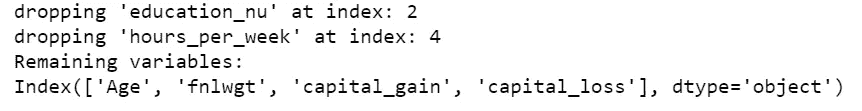

dropping features with low variance

## 规范化数据集中的数字数据

我们可以看到，我们的数字特征是在不同的规模，所以我们需要规范化的数据。标准化数据使您能够更容易地比较不同地方的数据，因为不同的数字特征将在 0 和 1 之间的标准化范围内。通过这种方式，各种功能现在更加一致。

当我们规范化数据时，数据集中的异常值会丢失。

标准化重新调整数据，使平均值(μ)为 0，标准差(σ)为 1(单位方差)

***标准化*** 将一个特征缩放为 0 到 1 之间的值，而 ***标准化*** 将数据转换为 0 的[平均值](https://www.statisticshowto.datasciencecentral.com/mean/)和 1 的[标准偏差](https://www.statisticshowto.datasciencecentral.com/probability-and-statistics/standard-deviation/)。这种标准化被称为 **z 分数。**

我们使用 MinMaxScaler 来规范化数字数据。我们使用 0 到 1 之间的默认归一化值范围。我们还可以使用 StandardScaler，它通过移除平均值并缩放至单位方差来标准化要素。

```
# Applying the MinMax Scaler

from sklearn.preprocessing import MinMaxScalersc_minmax= MinMaxScaler()dataset_sc_minmax= dataset[[‘Age’,’fnlwgt’,’education_nu’, ‘capital_gain’, ‘capital_loss’, ‘hours_per_week’]]dataset_sc_minmax= pd.DataFrame(sc_minmax.fit_transform(dataset_sc_minmax))
dataset_sc_minmax.columns=[‘Age’,’fnlwgt’,’education_nu’, ‘capital_gain’, ‘capital_loss’, ‘hours_per_week’]
```

## 编码分类变量

分类变量必须转换成机器学习算法能够理解的形式。我们的目标是拥有没有任何优先顺序的分类标签。这些被称为名义特征

我们首先使用标签编码器将分类数据转换成数字。标签编码器用 0 和 n_classes-1 之间值对标签进行编码。使特征有序。

如果我们有一个名为“种族”的特征，有着非洲人、美国人和亚洲人的价值观。应用标签编码器后，我们将得到如下所示的数值

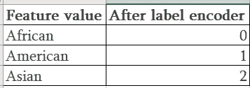

种族不一定要有顺序，所以我们需要使用 OneHotEncoder 将特征转换为名义特征。OneHotEncoder 将分类整数特性编码为一个独热数值数组。这是一个将分类变量转换为数值的过程，其中不存在这种顺序关系

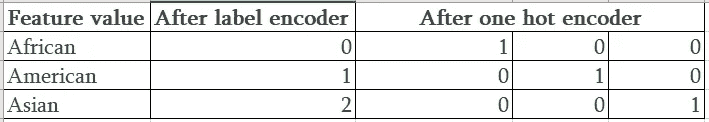

标签编码器和一个热编码器用于将分类数据或文本数据转换为数字，以便建立更好的预测模型。

上述示例的代码片段，其中我们使用 LabelEncoder 将 race 特性转换为序数值

```
le= LabelEncoder()
le.fit([“African”, “American”, “Asian”])
le.classes_
```

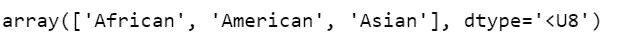

```
X=le.transform(["American", "Asian", "African"])
```


Race feature in now transformed using LabelEncoder

使用 inverse_transform 转换回原始数据

```
le.inverse_transform([1, 2, 0])
```

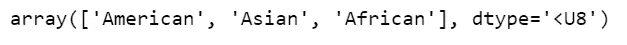

我们现在使用 OneHotEncoder 将分类数据转换为名义数据

```
oe= OneHotEncoder(categories=’auto’)X= np.array(X)
X= X.reshape(-1,1)
X= oe.fit_transform(X)
X.toarray()
```

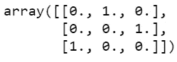

在我们的示例中，我们首先使用标签编码器转换分类特征，然后应用 OneHotEncoder

```
**from sklearn.preprocessing import LabelEncoder****dataset_input= dataset[[‘Workclass’,’education’,’marital status’, ‘occupation’, ‘relationship’, ‘race’,’sex’]].values****dataset_target = dataset[[‘salary’]].values****# Applying Label encoder to Input variable**labelencoder_X=LabelEncoder()
dataset_input[:,0] = labelencoder_X.fit_transform(dataset_input[:,0])
dataset_input[:,1] = labelencoder_X.fit_transform(dataset_input[:,1])
dataset_input[:,2] = labelencoder_X.fit_transform(dataset_input[:,2])
dataset_input[:,3] = labelencoder_X.fit_transform(dataset_input[:,3])
dataset_input[:,4] = labelencoder_X.fit_transform(dataset_input[:,4])
dataset_input[:,5] = labelencoder_X.fit_transform(dataset_input[:,5])
dataset_input[:,6] = labelencoder_X.fit_transform(dataset_input[:,6])**# Applying Label encoder to Binary Target variable**
dataset_target[:,0]=labelencoder_X.fit_transform(dataset_target[:,0])
```

将顺序数据存储到数据帧中

```
dataset_input = pd.DataFrame(dataset_input)dataset_input.columns=['Workclass','education','marital status', 'occupation', 'relationship', 'race','sex']dataset_input.head(5)
```

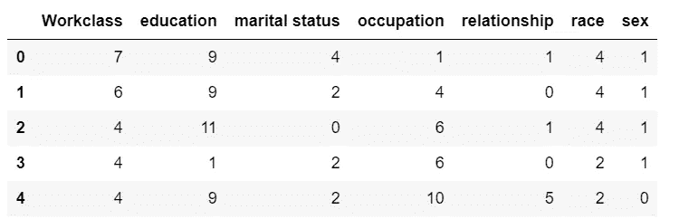

Categorical data after applying LabelEncoder

应用 OneHotEncoder 将分类数据转换为名义数据

```
from sklearn.preprocessing import OneHotEncoder
oneHotEncoder= OneHotEncoder(categories=’auto’)
dataset_input=oneHotEncoder.fit_transform(dataset_input).toarray()
dataset_input = pd.DataFrame(dataset_input)
dataset_input.head(2)
```

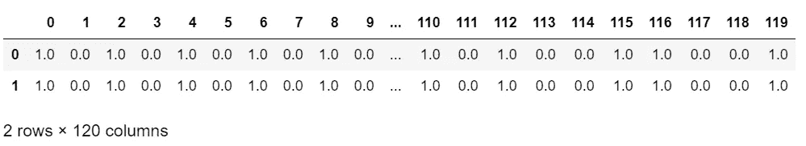

One Hot Encoded data

因为我们的目标变量是二进制的，所以我们没有对它应用 OneHotEncoder

```
dataset_target = pd.DataFrame(dataset_target)
dataset_target.columns=['Salary Range']
dataset_target.head(2)
```

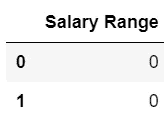

使用分类变量的数字数据和一个热编码数据创建数据集作为输入要素集

```
dataset_input=pd.DataFrame(dataset_input)
final_df= pd.concat([dataset_input, dataset_sc_minmax], axis=1)
final_df= pd.DataFrame(final_df)
final_df.head(2)
```

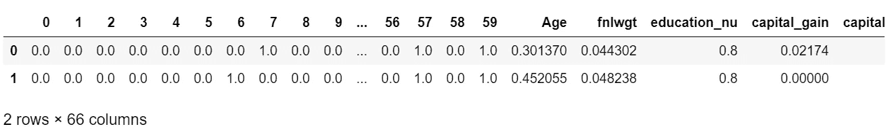

## 特征重要性

特征重要性传达了哪些特征可能对预测具有更高程度的影响。不太重要的特征以及包含在模型中的特征会对预测产生负面影响

识别最重要的特征是数据分析的关键步骤。它有助于更好地解释模型，并理解如何更好地控制预测功能。

***特征重要性有什么帮助？***

*   特征重要性提高了模型的预测性能。由于选择了正确的特征，它提高了模型的准确性
*   降低模型的复杂性，使其更容易解释，从而减少过度拟合
*   提供更快和更具成本效益的预测器，从而使训练更快

我们如何识别重要的特征？

特征重要性的不同技术

*   输入特征与目标变量的相关性
*   [随机森林回归器或分类器](https://medium.com/datadriveninvestor/decision-tree-and-random-forest-e174686dd9eb) —特征重要性内置于随机森林中。特征重要性导出了树决策中每个变量的重要性。
*   额外的树回归器或分类器——类似随机森林的集成技术。随机森林和额外树的区别在于额外树没有引导带，样品没有替换
*   递归要素消除(RFE)-RFE 递归选择要素时会考虑越来越小的要素集。首先，在初始特征集上训练估计器，并且通过 coef_ attribute 或通过 feature_importance_ attribute 获得每个特征的重要性

我们的数据集是一个分类问题。

我使用了 RandomForestRegressor 来识别重要的特性。我没有将数据集分为训练数据集和测试数据集，因为我想使用完整的数据集来识别重要的特征。

```
from sklearn.ensemble import RandomForestRegressorregressor = RandomForestRegressor(n_estimators=1000, random_state=0, n_jobs=-1)# Train the classifier
regressor.fit(final_df, dataset_target.values)names=['Workclass_1','Workclass_2','Workclass_3','Workclass_4','Workclass_5','Workclass_6','Workclass_7','Workclass_81','Workclass_9',
       'education_1','education_2','education_3','education_4','education_5','education_6','education_7','education_8','education_9','education_10','education_11','education_12','education_13','education_14','education_15','education_16',
       'marital status_1', 'marital status_2', 'marital status_3', 'marital status_4', 'marital status_5', 'marital status_6', 'marital status_7', 'marital status_8', 'marital status_9', 
       'occupation_1','occupation_2', 'occupation_3','occupation_4','occupation_5','occupation_6','occupation_7','occupation_8','occupation_9','occupation_10','occupation_11','occupation_12','occupation_13','occupation_14','occupation_15',
       'relationship_1', 'relationship_2','relationship_3','relationship_4','relationship_5','relationship_6',
       'race_1','race_2','race_3','race_4','race_5',
       'sex_male','sex_female',
       'Age','fnlwgt','education_nu', 'capital_gain', 'capital_loss', 'hours_per_week'] print( "Features sorted by their score:")
print( sorted(zip(map(lambda x: round(x, 4), regressor.feature_importances_), names), 
             reverse=True))importances = regressor.feature_importances_indices = np.argsort(importances)fig, ax = plt.subplots(figsize=(10,30))
plt.title('Feature Importances using Random Forest')
plt.barh(range(len(indices)), importances[indices], color='g', align='center')
plt.yticks(range(len(indices)), [names[i] for i in indices])
plt.xlabel('Relative Importance')
```

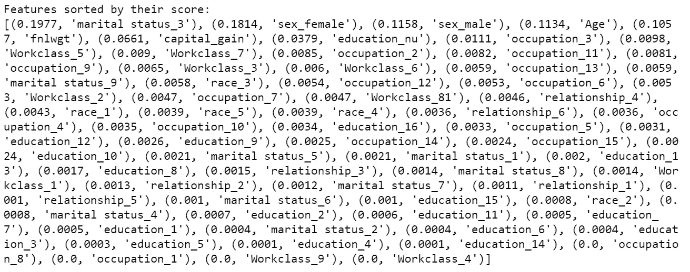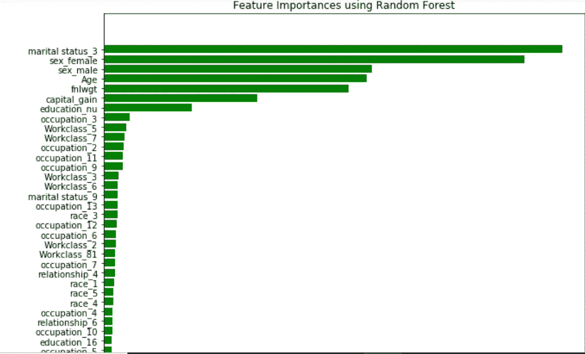

我们现在可以玩不同的功能，并提高您的模型的性能

源代码可从 [github](https://github.com/arshren/Exploratory-Data-Analysis) 获得