# 巴黎 Airbnb 房产的探索性数据分析

> 原文：<https://medium.datadriveninvestor.com/exploratory-data-analysis-on-airbnb-properties-in-paris-bce61bd680c8?source=collection_archive---------3----------------------->

当我去欧洲旅行并预订 Airbnb 租赁物业度假时，我会尽量减少住宿费用，以便能够负担得起美食和旅游。特别是对于巴黎，我发现靠近市中心的选择，即靠近艾菲尔铁塔、香榭丽舍大街等顶级景点的选择价格更高，而且大多数酒店也不可用，所以我最终住在离市中心更远的地方，当我这样做时，我总是担心我可能预订了离市中心太远的酒店，或者远离地铁站——因为实际位置直到你预订后才提供，或者除非你联系主人并询问。到车站的距离是相对的，取决于一个人愿意走多远，但对我来说，超过半英里的步行到车站被认为是远的，因为我觉得我必须节省所有的精力，在巴黎周围悠闲地散步。

**本 EDA 的目的是探索和回答以下问题:**

1.  位置如何影响房产租赁价格？

*   预算不到 100 美元就能住在中心附近的选择有哪些？
*   airbnb 租赁物业的价格还受到哪些其他因素的影响？
    即价格与位置、价格与顶级景点的距离等。

2.什么特征会影响 Airbnb 房产的可用性？

3.根据特定标准推荐 Airbnb 酒店，为旅行者提供更明智的决策:

*   步行即可到达顶级景点之一(2 英里以内)
*   步行即可到达地铁站(1 英里以内)
*   评级> = 9
*   其他用户定义的标准，即(床位、卧室数量、价格等。)

# EDA 流程:

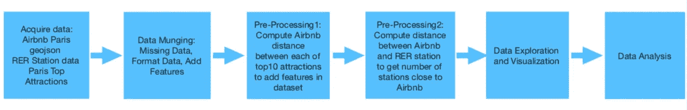

# 数据集:

Airbnb 数据集是从下面的 OpenDataSoft 网站下载的。对数据进行过滤，仅提取和下载与法国巴黎 Airbnb 租赁物业相关的数据。

[Airbnb 巴黎数据集](https://public.opendatasoft.com/explore/dataset/airbnb-listings/table/?disjunctive.host_verifications&disjunctive.amenities&disjunctive.features&refine.city=Paris&dataChart=eyJxdWVyaWVzIjpbeyJjaGFydHMiOlt7InR5cGUiOiJjb2x1bW4iLCJmdW5jIjoiQ09VTlQiLCJ5QXhpcyI6Imhvc3RfbGlzdGluZ3NfY291bnQiLCJzY2llbnRpZmljRGlzcGxheSI6dHJ1ZSwiY29sb3IiOiJyYW5nZS1jdXN0b20ifV0sInhBeGlzIjoiY2l0eSIsIm1heHBvaW50cyI6IiIsInRpbWVzY2FsZSI6IiIsInNvcnQiOiIiLCJzZXJpZXNCcmVha2Rvd24iOiJyb29tX3R5cGUiLCJjb25maWciOnsiZGF0YXNldCI6ImFpcmJuYi1saXN0aW5ncyIsIm9wdGlvbnMiOnsiZGlzanVuY3RpdmUuaG9zdF92ZXJpZmljYXRpb25zIjp0cnVlLCJkaXNqdW5jdGl2ZS5hbWVuaXRpZXMiOnRydWUsImRpc2p1bmN0aXZlLmZlYXR1cmVzIjp0cnVlfX19XSwidGltZXNjYWxlIjoiIiwiZGlzcGxheUxlZ2VuZCI6dHJ1ZX0%3D)
巴黎 RER/地铁数据集从以下网站下载，将用于进一步探索:

[地铁车站无障碍](https://data.ratp.fr/explore/?sort=modified)

# 局限性:

*   OpenDataSoft 的 Airbnb 数据最后一次更新是在 2017 年，可用性信息将基于最后一次更新中捕获的信息。
*   物业价格和可用性的历史数据不可用，因此我们无法检查不同季节/时间的价格和可用性的可变性。
*   为了计算距离，使用了哈弗辛公式，这对于计算两点之间的距离是一个很好的估计，但是这个距离可能不同于实际的步行距离。

# 清理数据:

geojson 文件格式被读取并用于此分析。原始下载文件具有八十六(86)个列，这些列不是分析所需要的，即 calendar_last_scraped、calendar_updated、listing_url 等。被删除以最小化列，并专注于对该 EDA 有用的数据的清理和分析。

“城市”一栏也被从文件中删除，因为所有下载的记录都是与法国巴黎的 Airbnb 租赁物业相关的。

对邮政编码做了进一步的研究，发现邮政编码 75001–75020 对应于巴黎的 1 到 20 区。由于分析将集中于巴黎市中心的房产，邮政编码在此范围之外的记录将被删除。

*在维基百科上有更多关于巴黎行政区的信息:【https://en.wikipedia.org/wiki/Arrondissements_of_Paris 

# 缺少值:

使用以下规则估算床和卧室中的缺失值:

*   如果“床”缺少值，而“卧室”有有效值，则“床”设置为“卧室”的值。
*   如果“卧室”和“床”都缺失，则这两个字段都被设置为 1，这是床和卧室的平均数量，并且可以安全地假设，如果在 Airbnb 中出租了一处房产，则至少有一张床，并且我们将把它算作一间卧室，而不管该房产是否是一室公寓，其中房间之间没有心理分区。

还有几个记录缺少“分数”值，创建了一个新列“rating_ind”来标记评级= 1 的记录，而不是未评级= 0 的记录，因此可以在这两个群体之间进行进一步的分析。如果所有分数值都已填充，则记录标记为已评级，如果至少有一个分数值尚未填充，则记录设置为未评级。

# 数据转换和特征工程:

以下字段已派生并添加到数据集中:

1)行政区-这是从邮政编码的最后两位数字得出的

2)arrond _ name-填充了行政区名称，并与在 neighbourhood _ cleansed 字段中填充的值进行了比较。发现了一些差异，因为没有关于如何导出 neighborhood _ cleaned 字段的信息，为了与按区分类保持一致，将使用 arrond_name 而不是 neighborhood _ cleaned 字段进行分析。

3)还使用[哈佛论坛](https://community.esri.com/groups/coordinate-reference-systems/blog/2017/10/05/haversine-formula)导出了 Airbnb 房产与 2018 年[巴黎十大景点](https://www.tripadvisor.com/Attractions-g187147-Activities-Paris_Ile_de_France.html#ATTRACTION_SORT_WRAPPER)之间的每个距离的列，这些特征用于分析和确定与租赁房产价格的关系。

["奥赛博物馆"、"圣小教堂"、"巴黎歌剧院"、"巴黎圣母院"、"奥兰治博物馆"、"卢森堡公园"、"卢浮宫"、"艾菲尔"、"亚历山大三世桥"、"玛莱"]

4)靠近景点—如果酒店距离十大景点之一不到 2 英里，这是一个指标。

5)最近的景点——这将包含最接近 Airbnb 酒店的景点的名称。

6)attraction _ dist—Airbnb 酒店和最近景点之间的距离。

7)site _ count-Airbnb 酒店 1 英里范围内的景点数量。

# 探索数据:

绘制 Airbnb 租赁物业价格图显示，巴黎 Airbnb 租赁物业的价格呈右偏单峰分布。从下图中我们可以看到，大部分出租的房产价格低于 200 美元，平均价格低于 100 美元，为 93.72 美元，中位数仅为 75 美元。我们可以看到有一些异常值——超过 400 美元的房产，导致平均价格和中间价格之间的巨大差异，并且分布是右偏的。

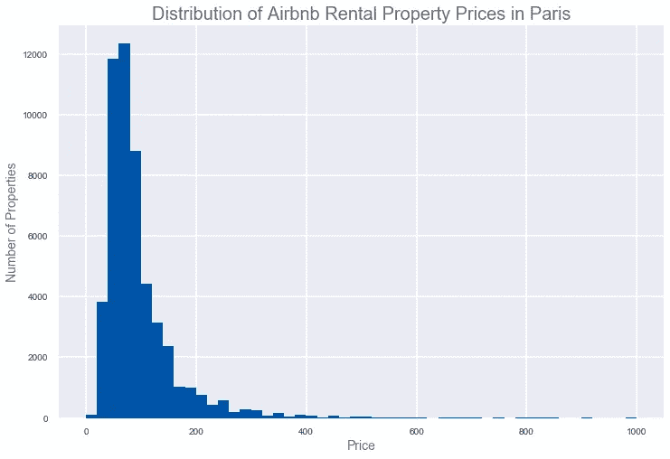

## Airbnb 租赁物业的价格由哪些特征决定？

下图显示了其他特征与 Airbnb 租赁物业价格的相关性:

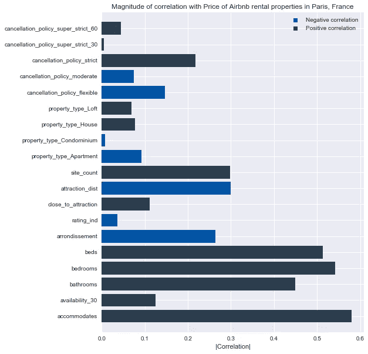

## 取消 _ 政策

*   我们可以看到，具有“严格”取消政策的物业与价格正相关，而具有“适度”和“灵活”取消政策的物业与价格负相关。但是，取消政策推动了价格吗？或者一些其他属性，如位置或评论数量，可能会影响这种关系——距离顶级景点较远的酒店价格较低，因为它们的位置不佳，主机将有不太严格的取消政策，以吸引更多的 Airbnb
    客户。让我们进一步探讨这个问题:

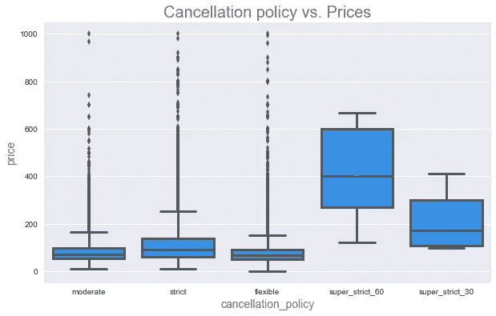

*   *取消政策与 Airbnb 酒店 1 英里范围内的站点数量*

下图显示，50%具有“严格”取消政策的酒店在酒店一英里范围内有一个以上的热门景点，而具有“适度”和“灵活”取消政策的酒店在 Airbnb 酒店一英里范围内有零到一个热门景点。

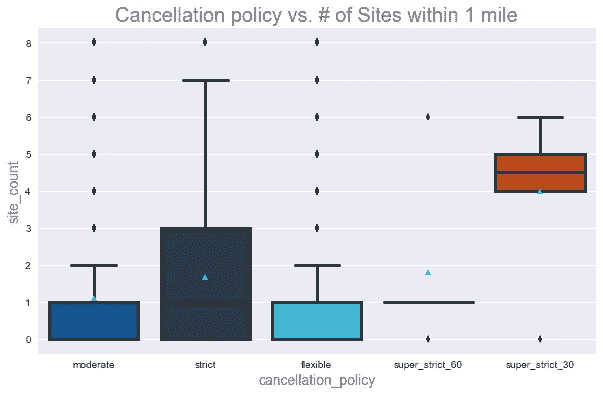

*   *取消政策与到最近景点的距离*

下图显示，与具有“灵活”和“适度”取消政策的酒店相比，具有“严格”取消政策的酒店具有较低的中值价格。

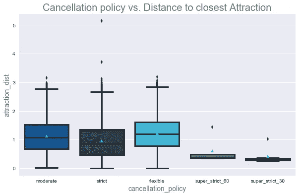

*   *取消政策与审核数量*

下图显示，除了取消政策为“super_strict_60”的酒店外，取消政策为“严格”的酒店比取消政策为“灵活”和“适度”的酒店有更多的点评。

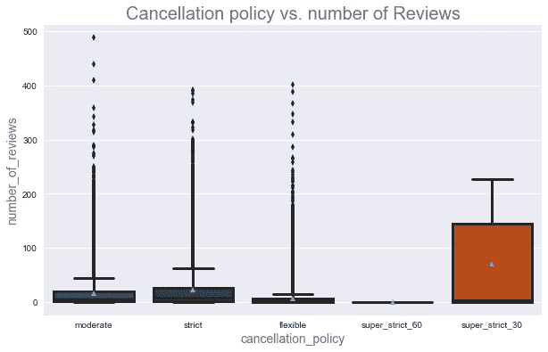

## 郡

*   价格~区:显示负相关。较低的区有较高的平均价格

区价值与价格呈负相关，也就是说，较低区的 Airbnb 房产平均价格高于较高区的房产，如下图所示。虽然 Arr 8——香榭丽舍大街的租金价格最高，Arr 9——歌剧院的租金价格比 1-8 区低。这可能是因为香榭丽舍大街通常是巴黎物价较高的街区，而且是巴黎非常著名的大街。

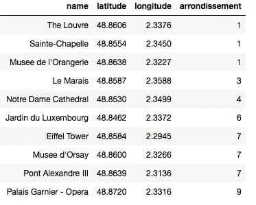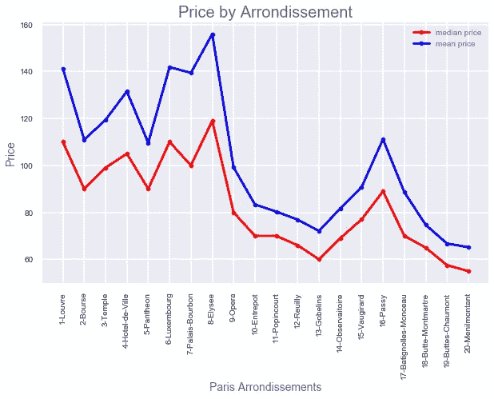

## 站点计数，靠近景点

*   site_count 和 close_to_attraction 与 Airbnb 租赁物业价格正相关。我们可以看到，随着 Airbnb 酒店(site_count)一(1)英里范围内景点数量的增加，酒店的平均成本也会增加。

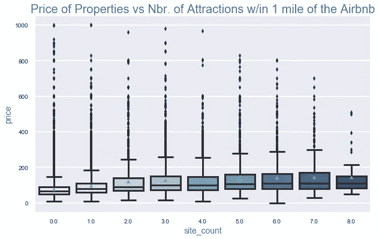

## 景点 _ 距离

*   房产到景点的距离与 Airbnb 租赁房产价格负相关

## 床、卧室、浴室、住宿

*   床、卧室、浴室和住宿的数量都与 Airbnb 租赁价格正相关

## 2)未来 30 天(availability_30)有哪些功能影响 Airbnb 房源的可用性？

下面是 Availability_30 和其他属性特征之间的关联图:

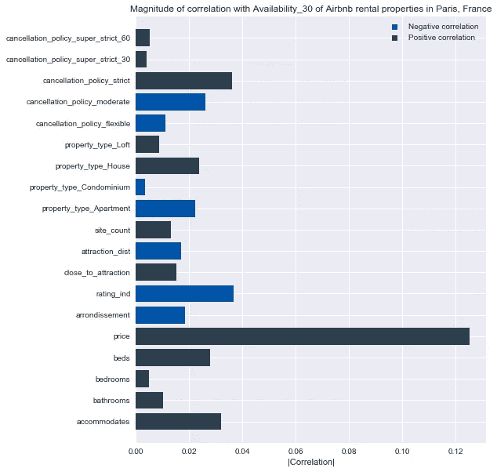

## 价格

上面的相关图显示了价格和房产可用性之间的正相关关系。

关于可用性，下图显示价格确实对巴黎 Airbnb 租赁物业的可用性有一些影响。与未来 30 天内可供使用 5 天或更长时间的物业相比，可供使用少于 5 天的物业具有较低的平均价格。

如果我们按价格范围来看 Airbnb 租赁物业的可用性，我们可以看到，对于预算在 100 美元/晚以内的物业，1 区至 8 区的可用物业的选择要少得多，增加预算会给你更好的机会获得靠近景点的物业(在 1 区至 8 区)，如果这不是一个选项，在 1 区至 8 区以外租赁会给你一个更好的选择，出租预算在 100 美元/晚以内的物业。

## 郡

Availability_30 和各区之间存在负相关关系。

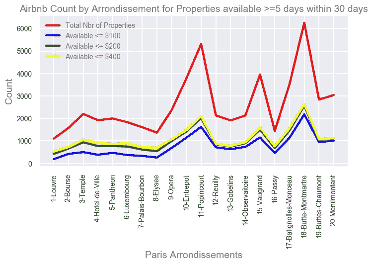

## 评级 _ 行业

上图显示了所有属性，包括已评级属性和未评级属性，未评级属性包括分数不完整的属性。如果我们细分房产的可用性，我们可以看到“未评级”房产的可用性更高，这是我们所期望的，因为人们倾向于住在评级较高的地方，以前的租户在那里有过良好的体验。

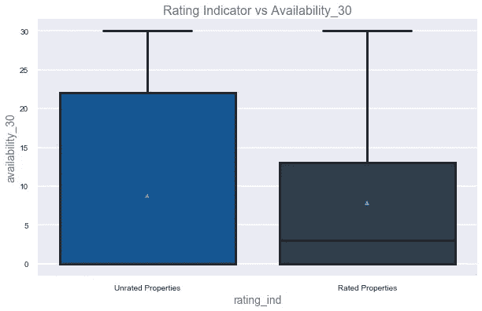

## 景点 _ 距离

*   酒店到景点的距离与 Airbnb 的可用性呈负相关。

## 床、卧室、浴室、住宿

*   床、卧室、浴室和住宿的数量都与 Airbnb 可用性呈正相关 _30。

## 取消 _ 政策

*   我们可以看到，具有“严格”取消政策的酒店与可用性呈正相关，而具有“适度”和“灵活”取消政策的酒店与可用性呈负相关，这表明与具有“严格”取消政策的酒店相比，客户倾向于预订更多具有“适度”和“灵活”取消政策的 Airbnb 酒店

## 站点计数，靠近景点

*   网站数量和接近吸引力与 Airbnb 可用性正相关

## 3)进一步分析…

在进一步过滤数据集以获得更接近的推荐后，数据集被过滤为仅包括位于顶级景点 2 英里范围内以及 RER/地铁站 1 英里范围内的 Airbnb 房产。发现大多数房产都在顶级景点的 2 英里范围内，距离车站 1 英里，然后数据集被进一步分类，以获得 Airbnb 房产 1 英里范围内的景点数量，以及房产 0.2 英里范围内的车站数量。

我们可以看到，不在任何顶级景点一英里范围内的酒店具有最低的中值价格，那些在一英里范围内至少有一个景点(1 到 4 个景点)的酒店，中值价格非常接近，而那些在一英里范围内超过五(5)个景点的酒店，具有较高的中值价格。

这是同样的性质和它的密切程度，一个车站。那些离加油站 0.2 英里以外的房产价格最低。那些在中位数价格 0.2 英里(1-2 个加油站)内至少有一个加油站的酒店彼此非常接近，而那些在 0.2 英里内有 3-4 个加油站的酒店价格更高。

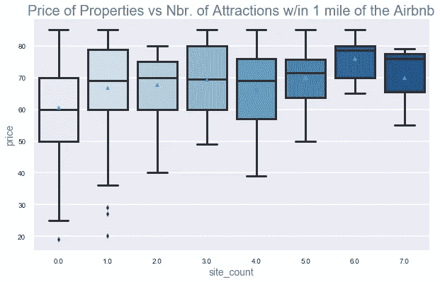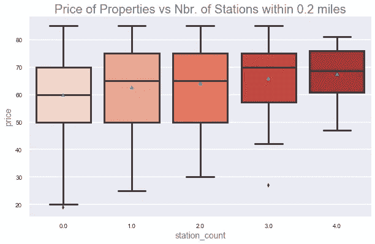

# 总结:

## 1)位置如何影响房产租赁价格？

基于我们的发现，通过查看以下特征，我们确实确认了该位置与 Airbnb 房产价格相关:区、site_count、景点 _dist。

## 2)什么特征影响 Airbnb 房产的可用性？

我们的分析显示，Airbnb 房产的价格与 Airbnb 巴黎房产的可用性高度相关。确定的驱动或影响 Airbnb 房产可用性的其他特征是评级指标(评级或未评级)、位置(即区、站点数量、景点距离、景点附近、住宿、床位、卧室和浴室的数量)以及取消政策。

## 3) Airbnb 巴黎推荐

推荐过滤器 1:

*   距离至少一个顶级景点 1 英里以内的酒店
*   房间类型==整个家庭/公寓
*   酒店距离 2 个车站不到 0.2 英里

推荐过滤器 2:(如果#1 过滤器的结果少于 20 个属性，来自#2 的结果将被添加到推荐列表中)

*   距离至少一个顶级景点 1 英里以内的酒店
*   房间类型==整个家庭/公寓和
*   酒店距离至少 2 个车站 0.2 英里

以下是推荐的 Airbnb 酒店，其基本标准如下，并应用了推荐过滤器 1 和 2 中定义的附加过滤器:

*   床位:> = 1 张
*   住宿> = 2
*   可用天数 30 >= 5 天
*   最高价格:85 美元
*   评级 Ind = 1(仅评级属性)
*   房间类型=整个家庭/公寓
*   审查分数评级= 100.0

**巴黎地图及推荐可在下方查看:**

[Paris_map](https://cdn.rawgit.com/ayeshavm/K2_Project2_EDA/8de36452/images/paris_map.html)