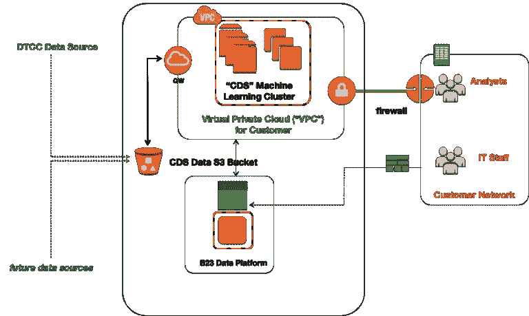
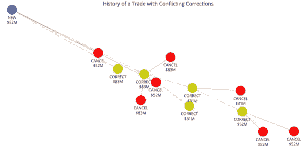
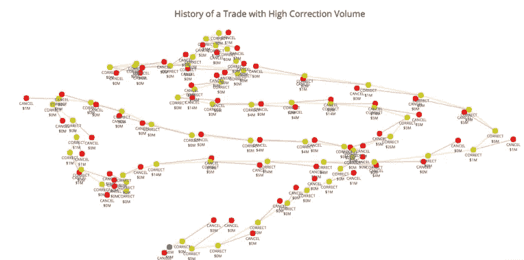
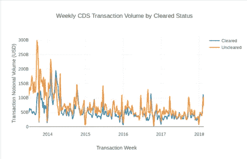
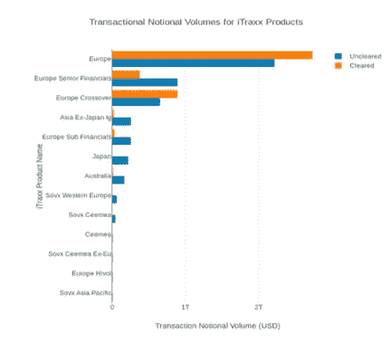
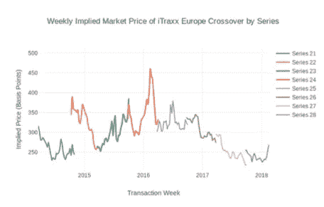
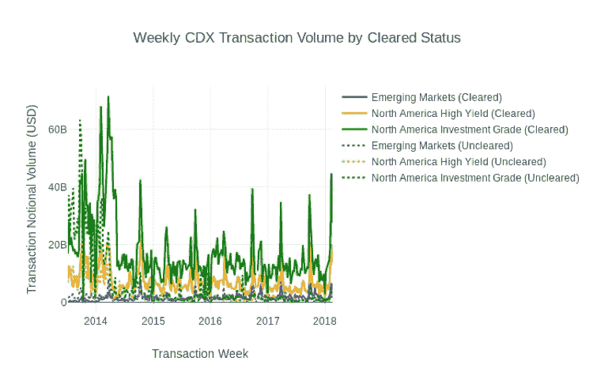
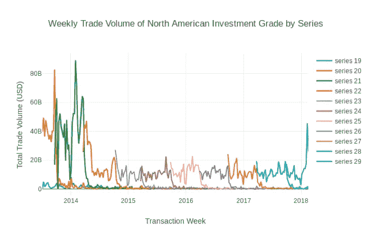

# 使用现代数据科学技术探索信用违约互换(CDS)市场数据

> 原文：<https://medium.datadriveninvestor.com/exploring-credit-default-swap-cds-market-data-using-modern-data-science-techniques-87e5c4beb13b?source=collection_archive---------17----------------------->

**2018 年 10 月 2 日**

《多德-弗兰克华尔街改革和消费者保护法》第七章通过为场外掉期市场的监管提供一个全面的框架，弥补了美国对场外掉期的金融监管的不足。本博客的目的是描述如何使用云计算和先进的机器学习(ML)技术快速、安全地分析信用违约互换(CDS)交易数据。我们从存管信托和结算公司(“DTCC”)获得了 CDS 数据。

为我们的客户提供基础技术支持的是 *B23 数据平台*，这是一个基于云的人工智能(“AI”)引擎，用于发现、转换和合成来自各种来源的数据，以提供独特的预测性见解。 *B23 数据平台*被许多不同行业的以数据为中心的企业使用，包括科技公司、政府机构和金融机构，以安全地使用亚马逊云从非常大的数据集获得洞察力。

我们努力的范围和成就包括:

*   在代表性的*客户私有云*中创建了安全机器学习(“ML”)分析集群
*   在 1 分钟内将 5 年的 CDS 数据纳入 ML analytics 集群
*   复杂市场交易中发现的异常 CDS 交易活动
*   创建了既定的 CDS 合规报告指标
*   确定单个产品和单个系列层面的 CDS 市场特征

**识别市场中的异常交易活动或错误报告**

B23 调查了 DTCC CDS 数据中几笔看起来很奇怪的交易。 ***图-2*** 显示了数据集中由多个行项目组成的相对少量的交易，这些交易表现出异常的市场活动。

在上例中，“黄色”节点是*修正*活动，“红色”节点是*取消*活动。

**Figure 2: Simple Trade with Conflicting Transactions**

遍历每组事务，会发生以下活动:

*   创建了一份价值为 5200 万美元的合同(标有“新”的蓝色节点)
*   5200 万美元的原始 CDS 被修正为 8300 万美元，之前的 5200 万美元被取消
*   8200 万美元的修正 CDS 被修正了两次 3100 万美元，之前的 8300 万美元被取消了两次
*   3100 万美元的修正 CDS 被修正回 5200 万美元，之前的 3100 万美元被取消
*   最后，5200 万美元的修正 CDS 被取消了两次

在上面的示例中，针对 CDS 产品的取消和更正等活动发生了多次，表明存在异常和不规则行为。B23 成功地分析了表现出异常行为的更复杂的交易，如 ***图-3*** 中的交易。

**Figure 3: Complex Trade with Conflicting Transactions**

**CDS 报告能力**

在云中使用 Hadoop 和 Spark 等现代数据处理系统，可以在生成现有合规性报告方面获得立竿见影的成本效益。以下示例展示了 B23 数据科学家如何能够查询 CDS 数据(只需几秒钟的查询)，以提供与 CFTC 网站上的报告类似的基本报告功能。 ***图-4*** 是显示我们从 DTCC 获得的数据的每周 CDS 交易量的报告。

**Figure 4: Replicating Existing Reporting Capabilities**

这些交易量数据使我们能够调查特定版本的产品，如 iTraxx，如图 ***图-5*** 所示。这种洞察力使我们能够根据特定产品的销量进行更深入的研究。

**Figure 5: iTraxx Volume by Product (USD)**

在观察了 ***图-5*** 之后，我们想知道 iTraxx 欧洲产品单个系列的具体市场定价(以基点为单位),该产品的销量显然最大。 ***图-6*** 显示了每 6 个月推出新系列时市场对定价的反应。在这种情况下，查看 8 个不同系列的 4 年隐含价格。

**Figure 6: iTraxx Europe market Price By Series (USD)**

为 CDX 市场交易创建了一组类似的报告，深入分析了五(5)年期间北美投资级系列的交易量。

**Figure 7: Weekly CDX Transaction Volume (USD)**

**Figure 8: Trade Volume North American Investment Grade by Series**

**B23 数据平台**

*B23 数据平台*是 B23 创始人在亚马逊网络服务(AWS)工作的独特经历以及对组织在云中安全处理大量数据时所面临的挑战的第一手观察的结果。B23 数据平台让业务分析师可以轻松地在几分钟内访问大型数据集，只需点击几下鼠标，就可以使用云计算和存储资源开始分析这些数据。

我们的平台已经由世界上几个对安全最敏感的组织从安全角度进行了审查。技术部门、金融服务和政府部门的客户都在使用它。B23 *最后一英里*组件是 *B23 数据平台*的一个组件，允许业务分析师在一个命令中自动连接到不同的数据源，使非技术人员可以使用 R 和 Python 等熟悉的工具轻松分析复杂和大型数据集。

在这种情况下，我们在一(1)分钟内将五(5)年的 CDS 数据输入我们的数据平台。

**如需了解更多信息，请致电**[**info @ B23 . io**](mailto:info@b23.io)联系 B23

*原载于*[*www . b23 . io*](http://www.b23.io/exploring-credit-default-swap-cds-market-data-using-modern-data-science-techniques/)*。*