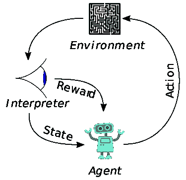

# 探索机器学习

> 原文：<https://medium.datadriveninvestor.com/exploring-machine-learning-f1dc6f3ec902?source=collection_archive---------11----------------------->

[https://cdn-images-1.medium.com/max/1600/1*QOS8cNI-A61sKwLJ8Nf8Iw.png](https://cdn-images-1.medium.com/max/1600/1*QOS8cNI-A61sKwLJ8Nf8Iw.png)

## 什么是机器学习？

它是让计算机在没有明确编程的情况下行动的科学(自我学习)。**机器学习**专注于开发能够访问数据并利用数据为自己学习的计算机程序。

它分为 3 种类型:

1.  监督学习
2.  无监督学习
3.  强化学习

## 什么是监督学习？

这是一种在标记为的**数据集上训练模型的类型，该数据集具有输入和输出参数。**

例如，考虑如下所示的情况:

[https://miro.medium.com/max/908/1*toRnJNryryhKETfBqOcvVg.png](https://miro.medium.com/max/908/1*toRnJNryryhKETfBqOcvVg.png)

这里，我们以水果名称的形式标记数据，这有助于我们在训练后对它们进行分类。这是一个监督学习的例子，因为这里我们使用水果标签来确定测试样本的正确标签。

## 什么是无监督学习？

在这种类型的机器学习中，我们没有可用于样本的标签。在这里，机器的任务是根据相似性、模式和差异对信息进行分组和识别，而无需任何事先的数据训练。

例如，考虑如下所示的情况:

[https://qph.fs.quoracdn.net/main-qimg-e510d5175c56d0b7d78e8c59a7a8c8d5](https://qph.fs.quoracdn.net/main-qimg-e510d5175c56d0b7d78e8c59a7a8c8d5)

考虑到你以前没有见过这些类型的水果，所以这里我们有未标记的数据，也就是说，我们不知道水果的标签，而是根据颜色、形状、大小等不同属性观察到的模式对它们进行分类。

## 什么是强化学习？

这是一种机器学习，它涉及到一个代理的存在，该代理在一个环境中执行某些动作，以使回报最大化。

[https://upload.wikimedia.org/wikipedia/commons/thumb/1/1b/Reinforcement_learning_diagram.svg/250px-Reinforcement_learning_diagram.svg.png](https://upload.wikimedia.org/wikipedia/commons/thumb/1/1b/Reinforcement_learning_diagram.svg/250px-Reinforcement_learning_diagram.svg.png)

输入是模型开始的初始状态的形式。现在有各种各样的动作可以在特定的状态下执行，这导致不同的状态和不同的回报。代理人的作用是使奖励功能最大化。