# 探索金融中的机器学习

> 原文：<https://medium.datadriveninvestor.com/exploring-machine-learning-in-finance-fe1c7ab45ca5?source=collection_archive---------6----------------------->

在这篇文章中，我将探索 4 种不同的机器学习技术来预测未来的股票价格。

[source](https://cdn-images-1.medium.com/max/2000/1*HN7Psu4WPRUjviY4STCG-A.png)

拥有一个干净的、良好表示的数据集的重要性怎么强调都不为过，在这篇文章中，我将介绍如何使用不同的算法为分析准备数据。本文的完整代码可以在 GitHub 上找到。

首先，让我们深入研究用于分析的 4 种算法。

*   随机森林树
*   光梯度增强决策树
*   深度神经网络
*   具有 LSTM 块的递归神经网络

使用 sk-learn 和 light-gbm 等软件包实现许多机器学习算法非常容易，人们不需要知道算法做什么，尽管理解正在发生的事情有助于更好地了解这些模型的工作。

**随机森林决策树**

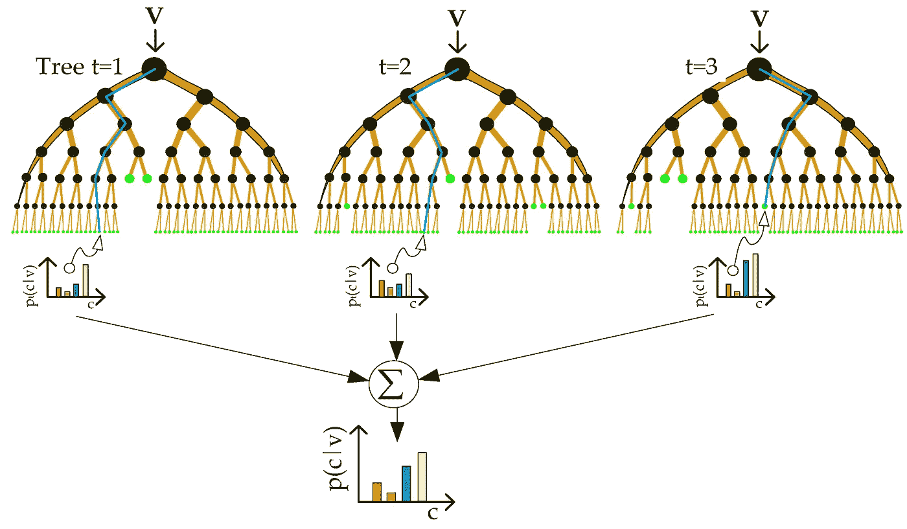

[Source](https://www.google.co.uk/search?q=random+forest&tbm=isch&tbs=rimg:CVrIGyImKw0FIghayBsiJisNBSoSCVrIGyImKw0FESWScp0vj7q0&tbo=u#imgrc=WsgbIiYrDQVrxM:)

随机森林背后的基本思想是一群弱学习者结合在一起形成一个强学习者。随机森林由浅决策树的集合组成，这些决策树对数据集的随机特征子集进行分析和训练。该算法最适合分类类型的问题，但也可用于回归。关于随机森林更详细的解释请点击这个[链接](https://towardsdatascience.com/the-random-forest-algorithm-d457d499ffcd)。

**光梯度增强树**

[Source](https://littleml.files.wordpress.com/2017/03/boosted-trees-process.png)

自 2017 年由微软发布以来，LightGBM 是机器学习从业者使用最多的技术之一。该模型首先根据数据训练一个基本模型，然后使用其误差作为特征来进一步改进后续模型。虽然它被认为是某种黑箱，因为很难解释它是如何得出结论的，但该模型在回归问题中工作得很好，要详细了解，请参考此[链接](https://medium.com/kaggle-nyc/gradient-boosting-decision-trees-xgboost-vs-lightgbm-and-catboost-72df6979e0bb)。

**深度神经网络**

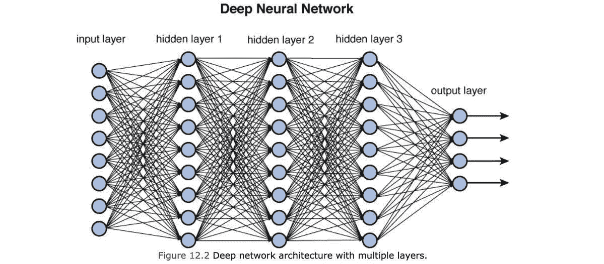

[Source](https://cdn-images-1.medium.com/max/1200/1*N8UXaiUKWurFLdmEhEHiWg.jpeg)

深度神经网络是最流行的机器学习技术之一。近年来，随着计算能力和数据可用性的提高，它已经被证明是非常通用的。尽管它们几乎总是渴求数据，并且只有在数据充足时才能表现良好。如需了解更多详情，请照常参考[链接](https://towardsdatascience.com/introducing-deep-learning-and-neural-networks-deep-learning-for-rookies-1-bd68f9cf5883)。

**具有 LSTM 块的递归神经网络**

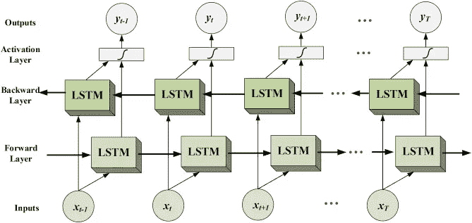

[Source](https://ars.els-cdn.com/content/image/1-s2.0-S0010482518300738-gr3.jpg)

递归神经网络是一种特殊的神经网络，对于涉及序列的任务非常有效，因此通常也称为序列网络。LSTM 是对普通香草 RNN 的改进，因为我解决了它所面临的爆炸/消失梯度问题。如需进一步阅读，请参考此[链接](https://hackernoon.com/understanding-architecture-of-lstm-cell-from-scratch-with-code-8da40f0b71f4)。

既然我们已经介绍了每个模型的基础知识，并对它们的用途有了一些了解，那么让我们开始为我们的用例准备数据。

我使用 Alpha Vantage API 来收集我的数据，它免费提供易于使用的 API 和大量数据。我们的预测将只基于未来 10 天苹果股票的数据，这样做是为了方便使用。下面的代码提取了苹果公司 20 年前的所有历史时间序列数据，并将其组织成一个整洁的 pandas 数据框。

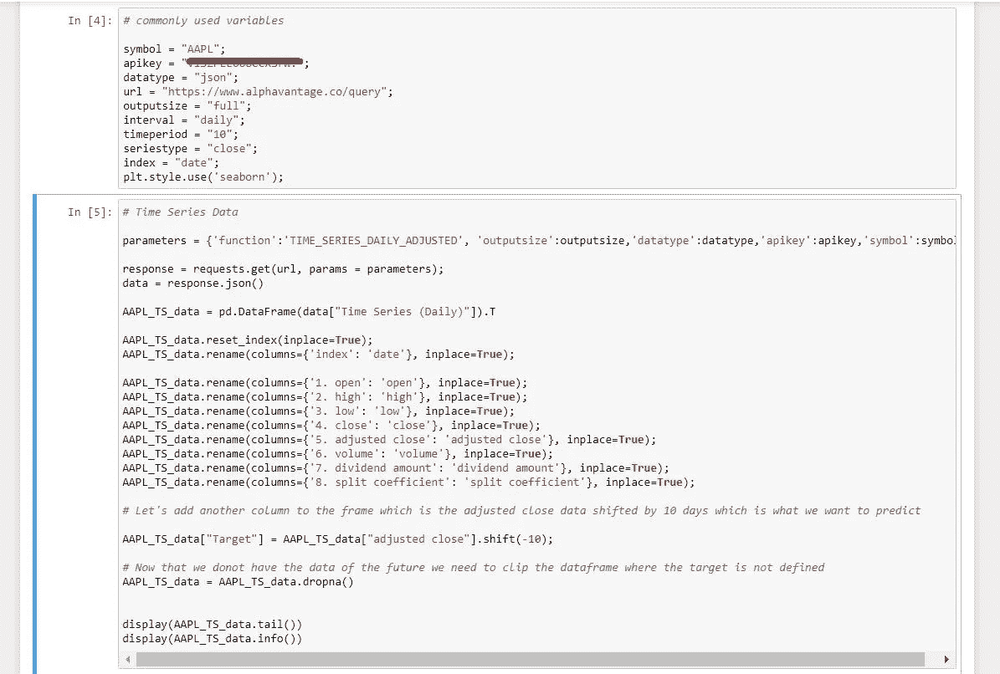

类似地，我们得到其他技术分析参数的数据，如 ADX、RSI、SMA 和 MACD。

**Jr . Welles Wilder 发明的 ADX 或平均方向指数**是一种动量强弱指标。分析师用它来确定趋势的相对强度。当 ADX 高于 25 时，ADX 识别出一个强有力的正趋势，当 ADX 低于 20 时，识别出一个弱趋势。有关此[的更多信息，请阅读](https://www.investopedia.com/terms/a/adx.asp)。

**RSI 或相对强度指标**最初由 J. Welles Wilder 开发，是一种动量指标，衡量最近价格变化的幅度，以评估股票或其他资产价格的超买或超卖情况。RSI 显示为一个振荡器(在两个极端之间移动的线形图),读数可以从 0 到 100。有关此[的更多信息，请阅读](https://www.investopedia.com/terms/r/rsi.asp)。

**SMA 或简单移动平均线指标**，被交易员和市场分析师视为决定整体长期市场趋势的关键指标。[你知道这通向哪里](https://www.investopedia.com/terms/s/sma.asp)。

**MACD 或移动平均线收敛和发散**，是一种趋势跟随动量指标，显示证券价格的两条移动平均线之间的关系。[下面是链接](https://www.investopedia.com/terms/m/macd.asp)。

一旦我们收集了所有我们能想到的用于分析的动量指标，我们就将它们全部组合到一个单一的合并数据框架中。

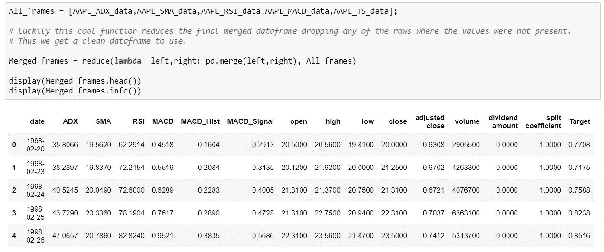

现在，我们已经将所有数据放在一个框架中，然后我们继续将这些数据分为训练集、验证集和测试集，以帮助更好地改进我们的模型。此外，我喜欢保持验证和测试数据集较小，以便在尽可能多的数据上进行训练。分割后，我使用 sklearn 包中的标准标量预处理器来缩放数据，记住这里要分别缩放数据和标签，因为这将有助于稍后我们在计算模型性能时只需要将测试标签转换回来。下面是我如何创建和扩展训练集的示例代码。

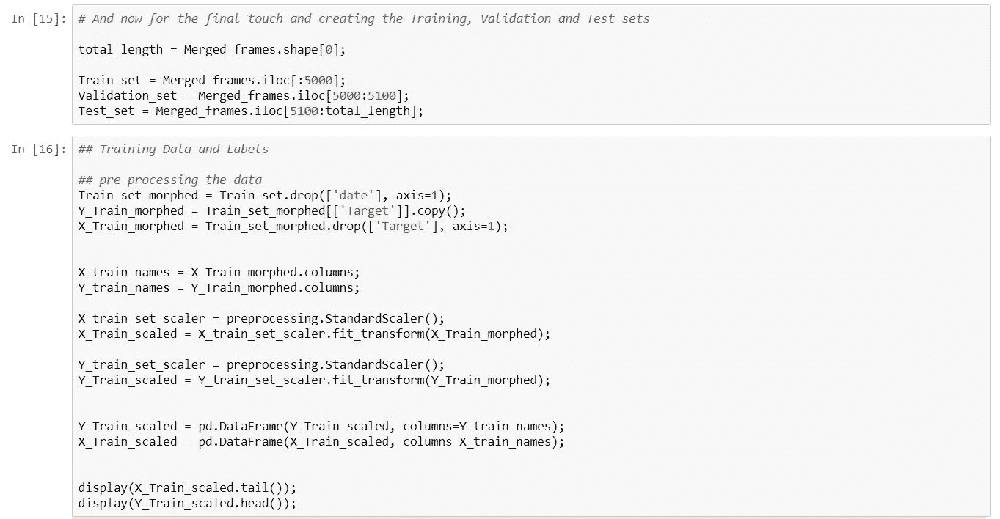

现在我们已经为除 LSTM 模型之外的所有模型创建了数据集，我们可以将它们保存到 csv 文件中。

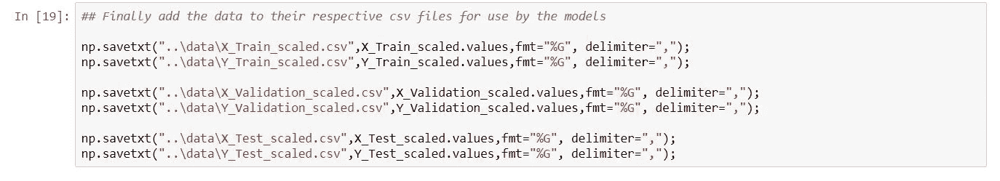

**递归神经网络模型的数据集准备**

为递归神经网络准备数据有点不同，因为它需要一个 3D 数据集，而不是我们刚刚准备的 2D。

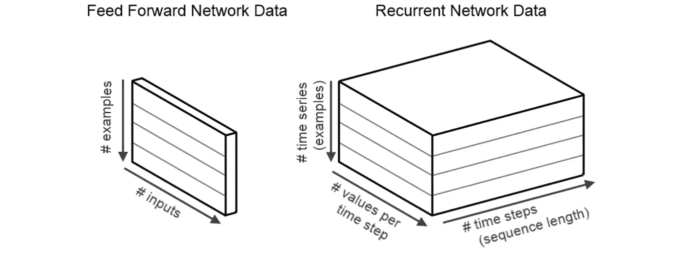

[Source](https://isaacchanghau.github.io/img/deeplearning/stockpredict/rnndata.png)

上述 3 个维度是样本/示例、时间步长和特征/值。我们可以这样理解，所有的特征仍然是数据集中的各种输入，如 open、close、adx 等。时间步长现在是这些值的新行。这仍然代表我们的原始数据集，它有多行特征，但现在我们每隔 10 个时间步长对其进行裁剪，并将其称为一个数据样本。

为此，我们需要将数据容易地分成 10 个时间步长的相等样本，每个样本在我们为 LSTM 重新整形它们之前，我们剪切测试数据集以得到前 100 行。

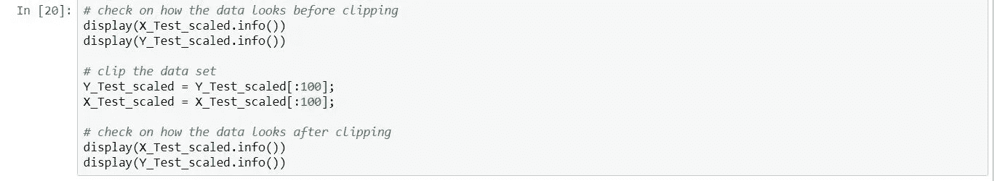

一旦我们有了这些，我们就可以将我们的数据集整形为所需的形状(样本、时间步长、要素)，如下所示。

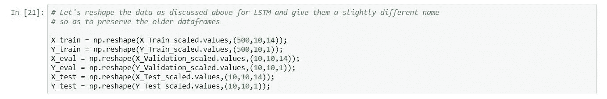

任务的数据准备工作到此结束。在我看来，这是这个项目中最有趣也是最重要的部分。

**预测**

一旦我们准备好数据，并使用这些数据训练我们的模型，我们就可以使用训练好的模型为我们做一些预测。我们为测试数据集加载未缩放的标签，并使用 StandardScalar 预处理器中的 inverse_transform 方法来缩放我们的预测，现在，由于我们分别为标签和数据使用了标量，因此我们可以将仅用于标签的标量用于我们当前的目的。然后，我们添加回日期列，并将所有预测合并到一个数据框中，以便能够绘制它。

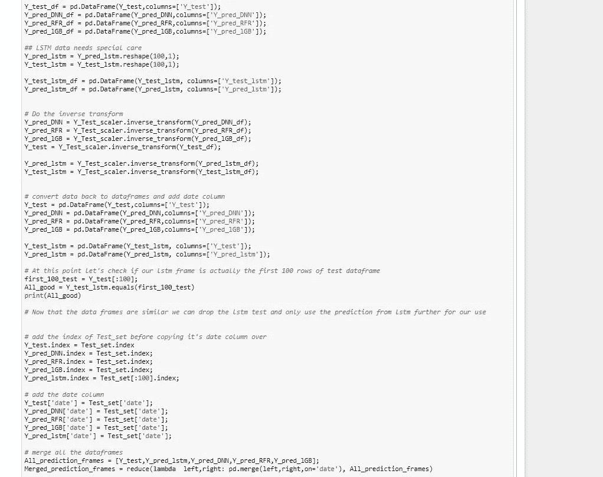

鉴于我们的数据非常少，结果反映了我们的使用案例。最佳预测来自随机森林和轻型 gbm 模型，其次是 LSTM，最后是深度神经网络。尽管一旦我们加入更多的数据，神经网络就会发挥作用，表现得比现在好得多。

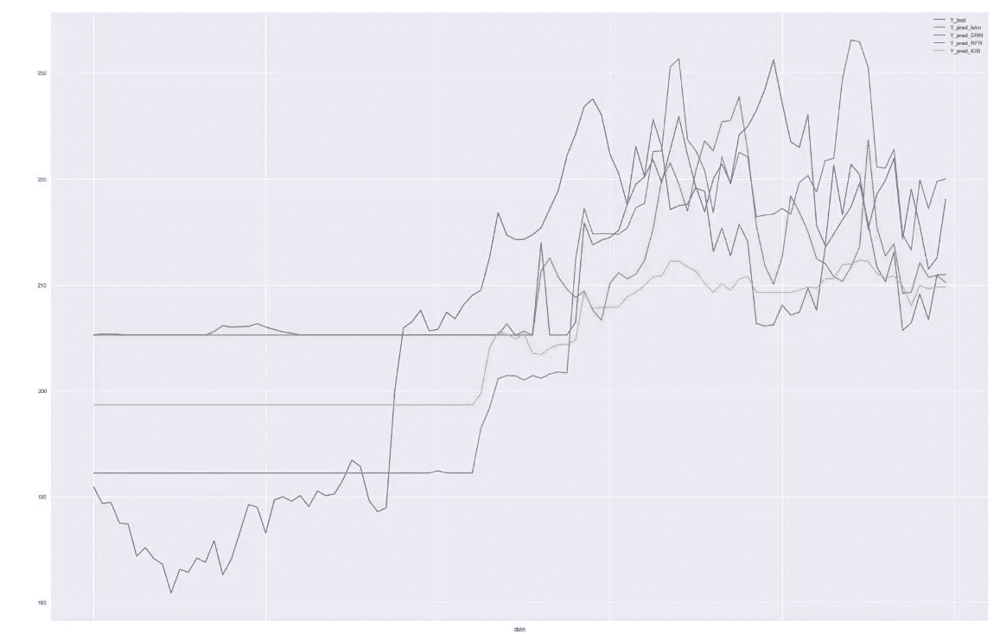

**结论**

数据准备是最被低估的，但也是任何机器学习项目中最重要的部分。在机器学习中有多种算法可以使用，但哪种算法产生的结果最好对手头的数据最重要。了解机器学习模型的内部工作也很重要，这样才能更好地理解它们是如何得出特定解决方案的。

如果你喜欢这篇文章或者在下面的评论中发现了错误，请告诉我。