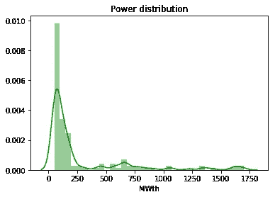
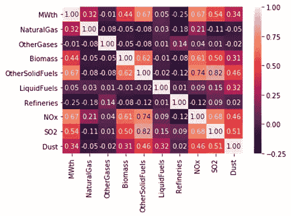
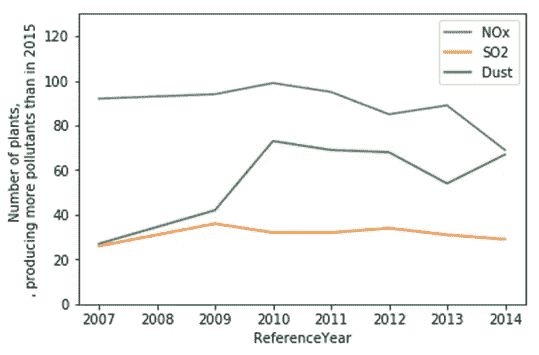
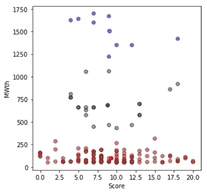
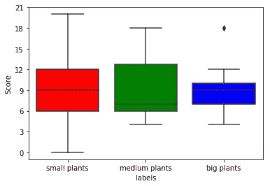
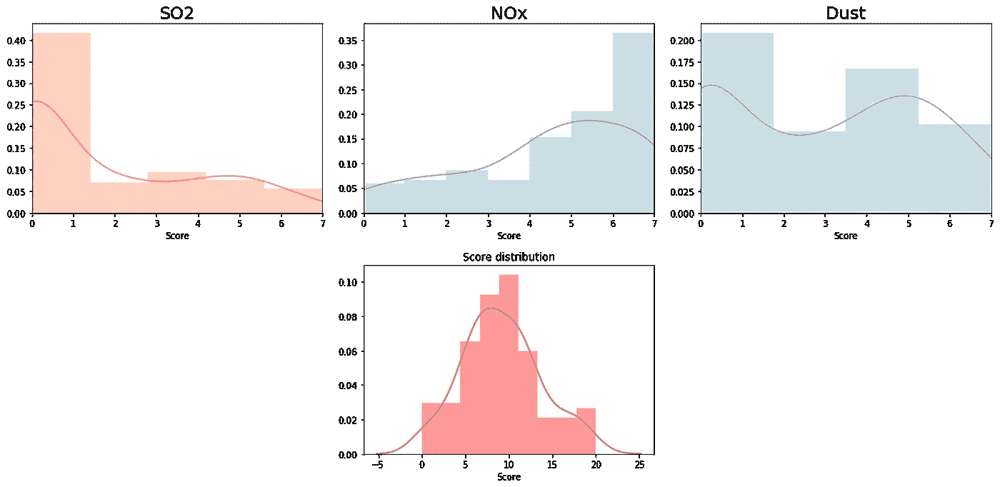

# 探索荷兰燃烧发电厂的近期历史。

> 原文：<https://medium.datadriveninvestor.com/exploring-recent-history-of-combustion-power-plants-in-the-netherlands-with-multi-index-dataframes-a45a74eb3217?source=collection_archive---------9----------------------->

Vincent van Gogh — The Old Mill (1888)

## 第一部分。环境或规模确实很重要。但不是你想的那样。

*这一部分将侧重于实际的环境调查结果，对于更多的技术方面(以及多指标列的讨论)，请参考第 2 部分。GitHub 回购可以在这里找到***。**

***简介***

*上图描绘了一座风车，这是荷兰著名的发电厂的早期版本。由风力驱动，这种类型的发电当然符合当前的可持续发展理念。然而，今天这个国家的大部分能源(仍然)是通过燃烧产生的。*

*随着北海天然气勘探的负面地质后果，在关于荷兰电网未来的讨论中提出了许多问题。随着该国北部地震风险的增加，一般的想法是从燃烧工厂过渡到更可持续的替代品。*

*在这方面，调查荷兰燃烧发电厂的近期历史是有利的。为了实现这一点，我们可以调用新扩展的多索引数据帧的 pandas 功能。*

*环境发展的常识提供了一些假设来给我们的分析指明方向:*

1.  *我们可以开发一个有用的指标来概括地描述发电厂在不同时间的环境表现。*
2.  *发电厂的环保表现一直在不断改善。*
3.  *大型发电厂比小型发电厂更容易改善环境绩效。*

***分析***

*我们将使用的数据集是来自欧洲环境署(EEA) 的[“工业排放指令(2010/75/EU)涵盖的大型燃烧工厂的报告数据”，该数据于 2018 年 10 月 1 日开始提供。它包含欧盟各成员国大多数发电厂某些污染物(氮氧化物、二氧化硫和粉尘)和燃料来源的年度数据。](https://www.eea.europa.eu/data-and-maps/data/lcp-6)*

*出于我们的目的，我们将只关注荷兰，以及从 2007 年到 2014 年。我们将比较这些年到 2015 年的数据，寻找可能的时间趋势。*

*让我们先来看看荷兰典型的燃烧发电厂规模(图 1)。*

**

*Figure 1\. Distribution of power plants according to their median MWth production between 2007 and 2015.*

*虽然大多数发电厂的发电量不到 250 兆瓦时，但在这场游戏中有更大的参与者，他们提供的发电量是原来的 7 倍。但这是否意味着在他们的环境背景下？*

*简单的相关性分析(图 2)揭示了排放和“其他固体燃料”(煤、褐煤和泥炭)的使用之间的联系。此外，电厂的电力输出也主要依赖于相同的特征，而**不依赖于天然气**(天然气通常被认为是荷兰最重要的燃料)。*

**

*Figure 2\. Correlation matrix of the dataset*

*但到目前为止，发电厂的表现如何？好吧，让我们看看有多少工厂在 2007-2014 年的环境表现比 2015 年更差(图 3):*

**

*Figure 3\. Number of power plants, producing more pollutants than in 2015.*

*显然，有两种相反的趋势在起作用:与 2015 年相比，越来越多的发电厂产生更多的粉尘，越来越少的发电厂产生更多的氮氧化物。[根据欧洲经济区本身](https://www.eea.europa.eu/data-and-maps/indicators/emissions-co2-so2-nox-from-1/assessment-1)，前者可能源于对单位产出排放量更高的现有燃煤电厂的利用增加，而后者可归因于减排技术的改进。因此，根据目前逐步淘汰天然气的趋势，**我们可以预计这些趋势将会继续。***

*为了继续分析，我们需要一个更复杂的指标。我们将称之为污染物年分数(PYS)或简称为“分数”。一个污染物年对应于三种物质中任何一种物质的排放量高于 2015 年的一年；他们的总和将构成分数。因此，一家工厂在一年中可以得到的最高分是 3 分(氮氧化物、二氧化硫和粉尘分别高于 2015 年)，最高总分是 21 分(7 年中每年 3 分)。*

*然而，这个分数本身并不能提供足够的背景，因为并不是所有的发电厂都是一样的:因此，我们在 MWTh 中增加了发电厂的功率输出。为了增加趣味，我们要求计算机对植物进行聚类(图 4)*

**

*Figure 4\. Results of K-means clustering of the power plant score and their production output.*

*图表显示，所有发电厂根据其输出功率可分为 3 类:1) < 300 MWth (red), 2) 300–1100 MWth (green); and 3) > 1100 MWth。规模似乎真的无关紧要:相当多的小发电厂有很高的 PYS。我们可能想仔细看看这个(图 5):*

**

*Figure 5\. Box plots of the score of clustered dataset*

*事实上，虽然所有 3 个类别在 7 到 10 之间具有大致相同的中值，但随着电厂规模的增大，差异会减小。据推测，这可能是由于更大的发电厂具有更优化的性能、更严格的质量控制或发电过程之间更少的差异。此外，大型工厂中的一个异常值值得在未来仔细观察。*

*最后，让我们探讨一下我们讨论过的一些因素的分布情况(图 6):*

**

*Figure 6\. Probability distributions of SO2, NOx, dust, and the PYS score.*

*总的来说，氮氧化物和二氧化硫的泊松分布和粉尘的双峰分布最终形成了总 PYS 得分的正态分布，这可能有助于在未来的研究中将其用作一种良好的标准化工具。*

***结论***

***1。**建议的环境评分系统(PYS)可成功用于进一步的研究。*这符合最初的假设。**

***2。**荷兰发电厂的数量在 2007 年至 2014 年间比 2015 年产生了更多的排放，这一数量并不稳定，而是呈现出明显的趋势。*这与最初的假设相矛盾。**

***3。**荷兰小型发电厂之间的环境绩效差异大于大型发电厂之间的差异。*不太清楚；虽然已经发现了某种相关性，但它并不是开始时理论化的。**