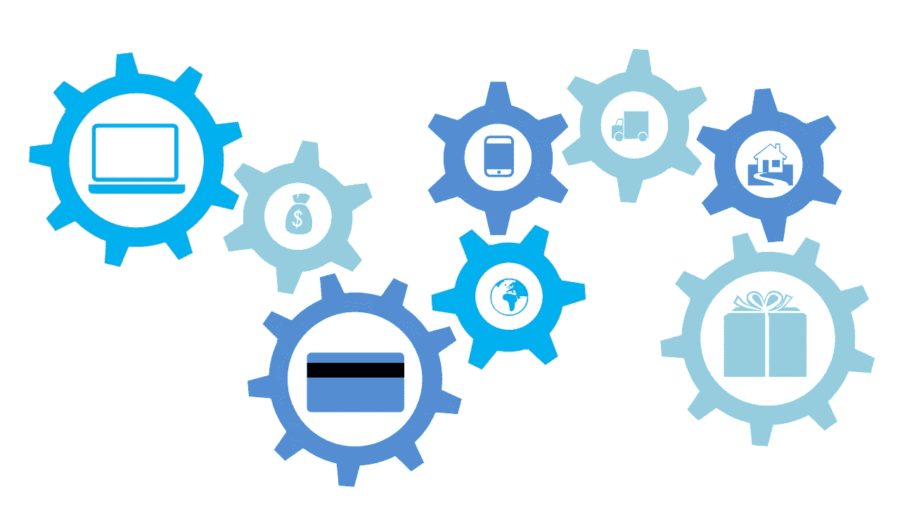
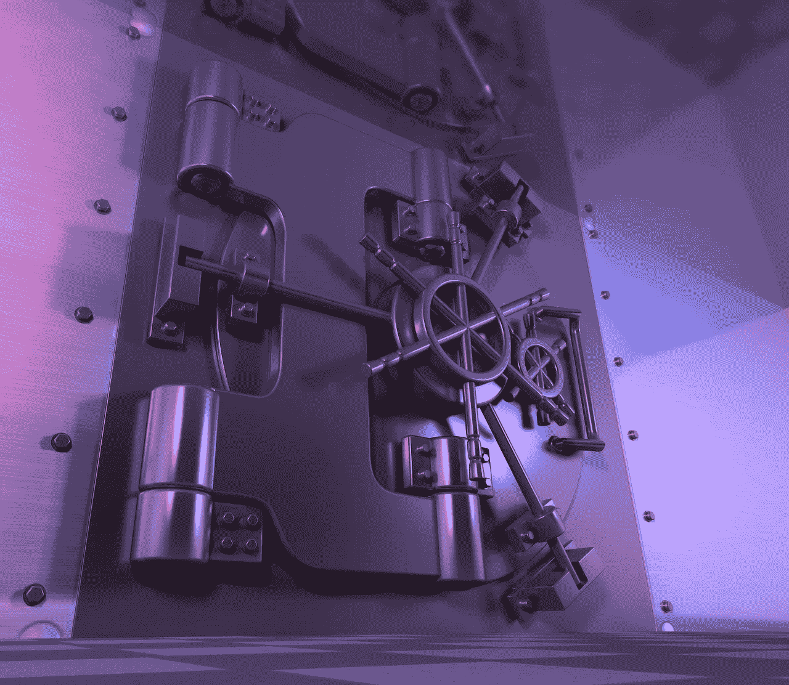

# 探索稳定的或稳定的

> 原文：<https://medium.datadriveninvestor.com/exploring-stablecoins-with-stably-or-stableusd-95d4cafdc259?source=collection_archive---------6----------------------->

稳定地或稳定地(USDS)是越来越拥挤的稳定圈里的又一个新成员。

解释一下，稳定币是一种围绕出售法定货币单位的智能合约建立的加密资产。就 StableUSD 而言，法定货币是美元。

 [## 为什么包容性财富指数比 GDP 更能衡量社会进步？-数据驱动…

### 你不需要成为一个经济奇才或金融大师就能知道 GDP 的定义。即使你从未拿过 ECON 奖…

www.datadriveninvestor.com](https://www.datadriveninvestor.com/2019/03/08/why-inclusive-wealth-index-is-a-better-measure-of-societal-progress-than-gdp/) 

具体来说，每枚 USDS 硬币都包含一份[以太坊智能合约](https://www.ethereum.org/greeter)，他们通过编程释放账户中的一美元。因此，当您进行稳定的交易时，会稳定地释放美元。

# **stable USD 和其他 Stablecoins 有区别吗？**

稳定[声称](https://www.stably.io/) USDS 不同于其他稳定副本，因为他们建立在多个区块链之上。因此，您可以将 USDS 用于多种功能。

例如，您可以将 StableUSD 用于汇款、保证金贷款、智能托管(贷款抵押品)、支付，以及作为避险资产。

此外，理论上你可以用 USDS 来驱动 DApps(分散式应用)。例如，你可以为游戏或电子商务平台建立一个 USDS 支付按钮。

有趣的是，稳定声称 StableUSD 的智能合同创建；或者用美元铸造新 USDS。澄清一下，他们把美元存在一个托管账户中，StableUSD 智能合约可以访问这个账户。

# **会稳定赚钱吗？**

因此，StableUSD 是一个稳定伪装成替代硬币的支付应用程序。因此，将 USDS 视为银行系统和加密经济或以太坊区块链之间的接口是一个好方法。

Stably 的创造者希望通过不收取使用费来推广 StableUSD。例如，稳定团队希望开发 6890 亿美元的汇款市场。

详细地说，汇款是人们汇给其他国家的人的钱。例如，一个住在布鲁克林的阿根廷人给他在布宜诺斯艾利斯的母亲寄钱。

# **能否用 StableUSD (USDS)稳定挖掘汇款？**

汇款市场正在快速增长。事实上，世界银行[估计](https://www.worldbank.org/en/news/press-release/2018/12/08/accelerated-remittances-growth-to-low-and-middle-income-countries-in-2018)流向发展中国家的汇款量在 2018 年增长了 10.8%。

此外，世界银行预计，2018 年所有汇款额增长了 10.3%，达到 6890 亿美元。此外，世界银行预测，2019 年汇款市场将增长至 7150 亿美元。

稳定可以通过其免费模式在汇款方面具有竞争力。值得注意的是，现有的汇款非常昂贵。事实上，世界银行估计，汇出 200 美元汇款需要 13.80 美元，即 6.9%。

# **稳定的业务可能会扰乱**

因此，如果 Stably 能削减 50%或 75%的费用，StableUSDS 汇款将具有竞争力。理论上，布鲁克林的儿子可以通过电子邮件或加密信息应用程序(如 [Telegram](#q-what-is-telegram-what-do-i-do-here) )向他在阿根廷的母亲发送短信。

从而可以稳定地消灭汇款业务，摧毁像 [**【西联】**](https://marketmadhouse.com/western-union-making-money/) **(纽约证券交易所代码:WU)****[**速汇金**](https://marketmadhouse.com/is-moneygram-making-money/) **(纳斯达克代码:MGI)** 这样的电讯服务公司。此外，稳定可能会损害零售商的业务，如沃尔玛、T21、WMT，这些零售商用汇票和电汇服务来吸引顾客。**

****

**稳定地威胁着那些企业，因为它稳定的货币传递法定货币。因此，可以稳定地传输真实的钱，真实的人可以在现实世界中消费。例如，如果通货膨胀摧毁了阿根廷比索，阿根廷的母亲可以用美元来支付房租或购买杂货。**

**此外，美国人可以使用 StableUSD 支付信用卡或无线账单。因此，稳定可能会威胁到美国零售商，如克罗格(纽约证券交易所代码:KR) 在他们的商店提供电子账单支付。**

# ****美国(USDS)如何稳定地扰乱银行业****

**稳定的以太坊平台可以通过收取比电信服务和汇票公司更低的费用从这种破坏中赚钱。此外，稳定将更加方便，因为你可以通过手机上的应用程序访问它。**

**因此，没有人需要专程去沃尔玛、超市或不良街区的破旧酒店汇款。在这种情况下，稳定地加密资产解决方案可能会威胁到实体企业。**

****

**此外，像**美国银行(纽约证券交易所代码:BAC)** 和**纽约梅隆银行(纽约证券交易所代码:BK)** 这样的金融机构也可以采用稳定的技术。为了解释这一点，银行可以将 Stably 的应用添加到他们的应用中。**

**因此，一个美国人可以通过一个应用程序从他的美国银行账户向海外的家人汇款。此外，这位亲戚可以在任何接受美国银行或 Stably Apps 的 ATM 机上将资金兑换成现金。**

**值得注意的是，Ripple 和日本银行正在测试一款在自动取款机上兑换 T2 Ripple(XRP)法定货币的应用程序。此外，**桑坦德银行**正在[测试](https://marketmadhouse.com/santander-offers-cross-border-ripple-xrp-payments-in-the-uk/)英国和西班牙的 Ripple 跨境支付。**

# **StableUSD (USDS)令牌有市场吗？**

**因此，Stably 的技术在大银行可能会有市场，但 StableUSD (USDS)有市场吗？**

**投机者说不，因为 StableUSD 的市值只有 600 万美元，2019 年 4 月 16 日的 24 小时成交量为 494，716 美元。因此，CoinMarketCap 在 2019 年的棕榈周日将 USDS 列为第 428 种最有价值的加密货币。CoinMarketCap 的估计是基于 598.1 万 USDS 的发行量。**

****

**相反，**系绳(USDT)**；最受欢迎的 stablecoin 的市值为 25 亿美元，同日 24 小时交易量为 1106.4 万美元。因此，CoinMarketCap 在 2019 年 4 月 14 日将 Tether 评为第八大最有价值的替代硬币。然而，2019 年 4 月 14 日，Tether 的流通供应量为 24.73 亿 USDT，总供应量为 27.5 亿 USDT。**

**我认为这些数字表明大多数投机者还没有意识到 USDS 的稳定。值得注意的是，stable[报告](https://www.stably.io) StableUSD 只在两个交易所交易；币安和比特雷克斯。然而，这些都是主要的分散加密货币交易所。**

# **USDS 是一个好的稳定币吗？**

**StableUSD 是以太坊联系请求或 ERC20 加密货币。因此，理论上，USDS 可以与大多数基于以太坊的加密货币兑换。**

**有趣的是，StableUSD 比 Tether 更稳定一些。为了解释这一点，USDT 在 2019 年 4 月 16 日的硬币价格为 1.01 美元。与此同时，稳定的硬币价格为 1.00 美元，因此稳定在匹配美元价格方面做得更好。**

****

**此外，理论上你可以在大多数以太坊区块链平台上使用 StableUSD，因为它是一个 ERC20 令牌。实际上，StableUSD 是[稳定区块链平台](https://www.stably.io)的平台令牌。因此，稳定地销售的是对其平台的访问。**

**然而，似乎很难将 StableUSD 与其他 Stablecoins 区分开来。例如，USDS 不属于 Bancor 的流动性网络。此外，StableUSD 不可转换为 **EOS (EOS)** 。**

# ****stable 和 StableUSD 可扩展吗？****

**因此，StableUSD 没有为区块链可伸缩性问题提供解决方案。解释一下，像以太坊这样高度加密的区块链在速度和容量上都受到严重限制。**

**例如，以太坊每秒只能处理 15 到 20 个事务(TPS)。因此，如果试图同时处理 30 个交易，像 Stably 这样的以太坊平台可能会崩溃。因此，Stably 的平台一次只能处理 15 到 20 笔汇款。在这种情况下，很难想象稳定地赚钱。**

**相比之下，EOS 声称其网络能够[处理](https://cryptovest.com/news/eos-transaction-count-soars-while-price-tanks-below-3/)高达 3,996 TPS。因此，EOS 理论上可以一次处理数百笔汇款。然而，[**CarbonUSD**](https://marketmadhouse.com/first-eos-stabelcoin-carbonusd-is-here/)**【CUSD】**是我所知道的唯一的 EOS stablecoin 币。**

**EOS 是可扩展的，因为它利用侧链而不是区块链。解释一下，侧链是一个加密程度较低的数字频道。侧链有更多的空间，因此它可以提供更高的速度和更大的容量，比以太坊这样的区块链。**

****

**另一方面，他们可以很容易地添加侧链解决方案，以稳定和**稳定(USDS)** 。值得注意的是，他们设计的 StableUSD 支持多种区块链。因此，可以容易地将侧链连接到其上，从而可以容易地升级。**

# ****stablesd 的安全性如何？****

**然而，侧链更容易被黑客攻击，因为它们的加密程度较低。稳定的硬币会引起罪犯的兴趣，因为它们包含法定货币。**

**因此，StableUSD 可能并不像某些用户认为的那样安全。然而，USDS 现在看起来很稳定，因为它在 2019 年 4 月 16 日的硬币价格是 1 美元。因此，一个 StableUSD 值 1 美元。相比之下，Tether 当天的硬币价格为 1.01 美元。**

**由于市场波动，稳定的硬币价格不同于法定货币价格。因此，一种稳定的硬币可能比他们与之挂钩的法定货币价值更高或更低。**

****

# ****会稳定成为 Stablecoins 的主要玩家吗？****

**最后，市场上有许多稳定的美元货币；包括 Gemini Dollar、Tether、StrongHold 和 TrusToken 等等。因此，稳定地进入一个拥挤的市场。**

**在这种情况下，提供欧元、英镑、瑞士法郎、日元或人民币加密货币将是稳定的明智之举。我的建议是提供一个稳定的欧元，因为欧元是世界上最受欢迎的美元替代品。没有另一种稳定的法定货币，美国经济和美元价格很容易出现问题。**

**尽管有这些担心，StableUSD 是一个有趣的 StableUSD，背后有一个良好的商业计划。我认为，如果 Stably 的技术像广告宣传的那样有效，它将成为 stablecoin 业务的主要参与者。**