# 探索 Alexa 和 Google Home 语音助手——dash bot 的使用行为

> 原文：<https://medium.datadriveninvestor.com/exploring-usage-behavior-of-alexa-and-google-home-voice-assistants-dashbot-6a124c3ef460?source=collection_archive---------3----------------------->

语音助手是一项热门技术。Alexa 和 Google Assistant 继续通过集成到电器、汽车等领域来扩大覆盖范围。企业、品牌和创业公司继续为各种行业推出语音助手体验，包括媒体、零售、银行、食品配送、CPG 等。

在过去的三年里，在 Dashbot 公司，我们调查了 Alexa 和 Google Home 设备的用户，以更好地了解他们如何使用他们的设备，以及他们对这些设备的看法。

 [## 人工智能与创造力:梦想成真|数据驱动的投资者

### 人工智能总是让我着迷。不仅作为一套有用的工具，不断发展，而且作为一个…

www.datadriveninvestor.com](https://www.datadriveninvestor.com/2019/01/28/ai-creativity-deep-dream-comes-true/) 

## 关键见解

*   这些设备继续在一定程度上改变行为
*   核心的本地功能仍然是最常用的
*   设备内部的购买已经减少
*   第三方应用程序发现仍然是一个问题
*   隐私是一个问题
*   用户对这些设备非常满意，并强烈推荐它们

# 设备使用率持续上升

正如我们在[前两年](https://artemerritt.medium.com/how-consumers-really-use-alexa-and-google-home-voice-assistants-dashbot-4d1f3878a9ad)中看到的那样，用户倾向于频繁使用他们的设备。一天多次使用手机的受访者比例从去年的 57%上升至 65%。总体而言，77%的受访者每天至少使用一次手机，略高于去年的 75%。

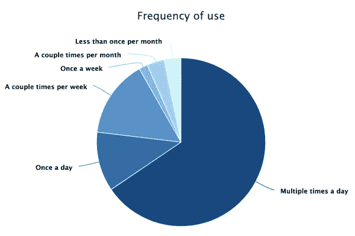

男女使用频率略有不同。与女性相比，男性更有可能一天使用多次设备——68.5%的男性和 61%的女性一天使用多次设备。女性稍微倾向于较少使用该设备——27%的女性每天使用该设备不到一次，而男性为 20.6%。

拥有多台设备的受访者倾向于更频繁地使用他们的设备。只有一台设备的受访者中有 51%的人每天使用设备多次，而拥有三台或更多设备的受访者中有近 81%的人每天使用设备多次。

虽然使用频率持续上升，但表示设备行为改变的受访者比例有所下降。与去年的 65%相比，大约 56%的受访者认为该设备今年改变了他们的行为。最大的不同是那些感觉设备“大大”改变了他们行为的人——今年只有大约 14%的人同意，而去年是 25%。

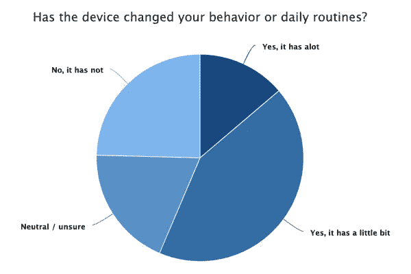

有趣的是，即使那些感觉设备没有改变行为或不确定的人，仍然经常使用设备。事实上，在那些感觉设备没有改变行为的人中，39.1%的人每天使用设备多次，另外 12.9%的人每天至少使用一次设备。虽然他们可能不觉得这是行为改变，但 52%的人每天都在使用这种设备。类似地，在那些不确定的人中，53.1%的人每天使用设备多次，另外 14%的人每天至少使用一次。他们可能不确定，但 67%的人每天都在使用这种设备。

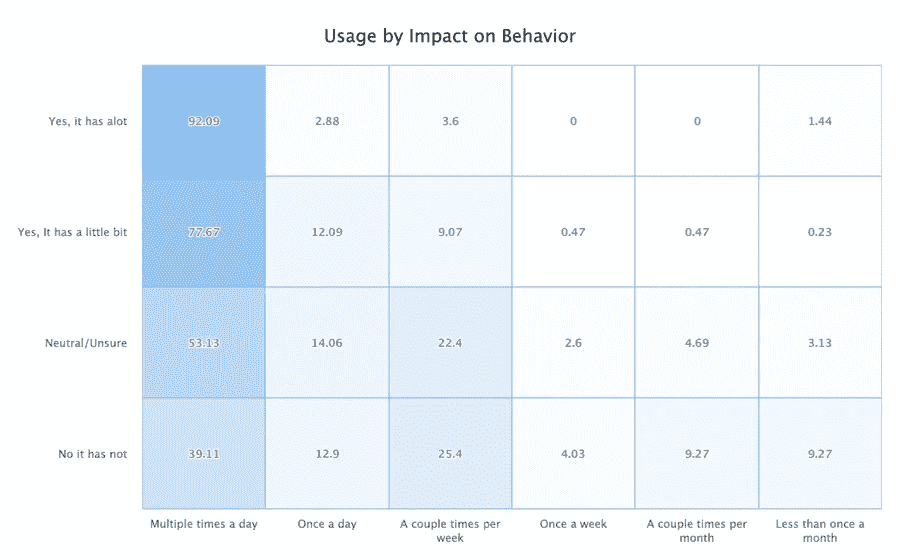

在那些发现该设备“大大”改变了行为的人中，92%的人每天使用该设备多次。即使在那些发现设备“一点点”改变行为的人中，超过 77%的人一天使用设备多次。

# 阿利克夏，你在哪里？

随着使用率的持续上升，用户在哪里与这些设备进行交互？

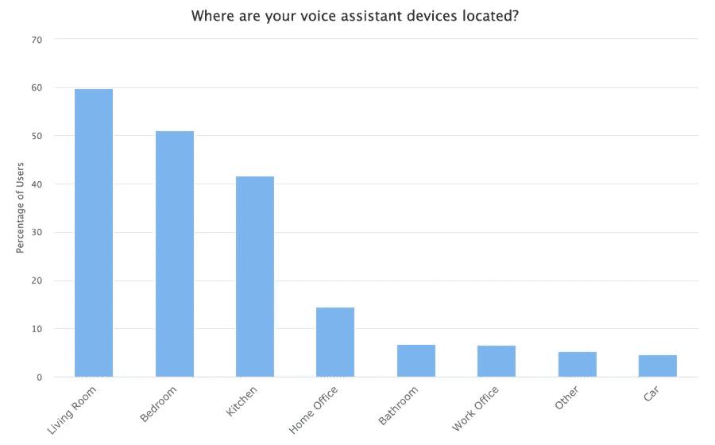

语音助手最受欢迎的位置是在客厅。近 60%的受访者在他们的客厅里有一个设备，其次是 51%的人在卧室里有一个，42%的人在厨房里有一个。此后，这一比例显著下降，其中 14.5%的人在家庭办公室拥有设备，6.7%的人在浴室拥有设备。

用户也倾向于拥有一个以上的设备。大约 58%的受访者拥有两台或更多设备，26%的受访者拥有三台或更多设备。

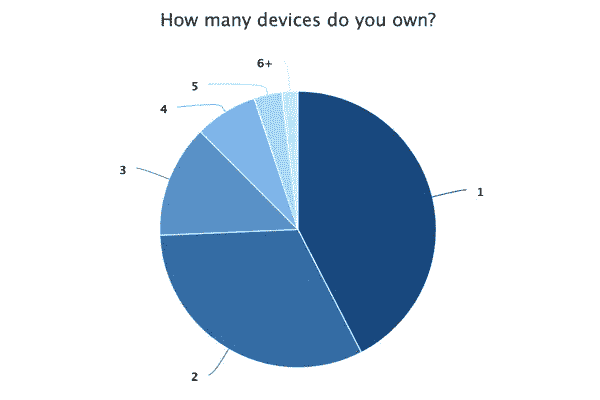

将只有一台设备的用户与拥有多台设备的用户进行比较，会发现一些有趣的现象。对于只有一个设备的用户来说，客厅仍然是最受欢迎的，占 44.4%，其次是厨房，占 29.7%，卧室第三，仅占 21.7%。然而，对于拥有多台设备的用户来说，在卧室中拥有一台设备变得非常受欢迎——事实上，拥有三台或更多设备的用户中有 86%在卧室中拥有一台设备，对于拥有两台设备的用户来说，这也是第二受欢迎的位置，占 62%。

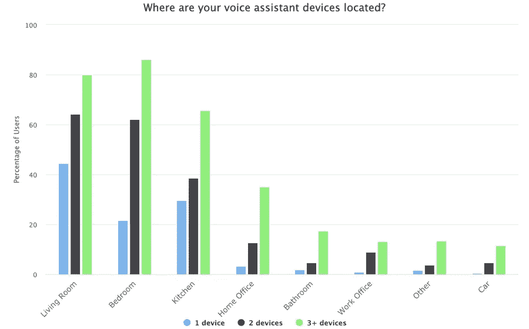

在那些表示他们在没有提到的“其他”房间中有设备的受访者中，最常见的房间是地下室或车库。有趣的是，有人把这个设备列为仍然在盒子里！

# 核心功能是最常用的

设备的核心功能仍然是最常用的功能。受访者最常使用手机听音乐、看天气和获取一般信息，而购物、玩游戏或使用特定技能则不太常见。

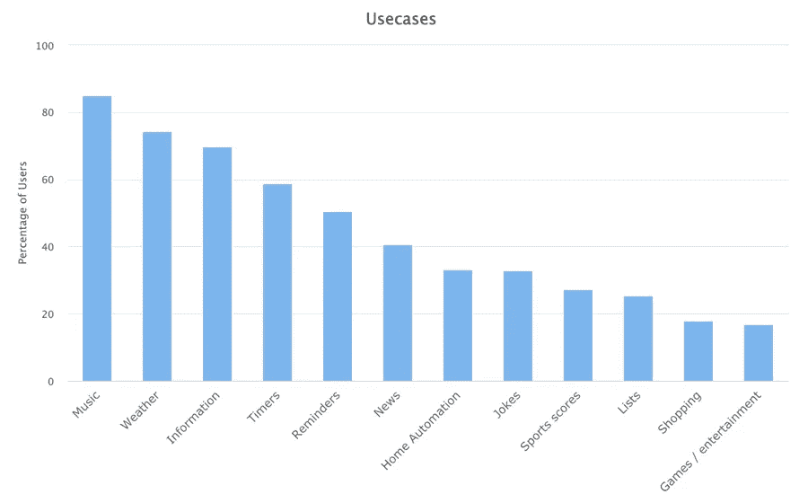

超过 85%的受访者使用他们的设备听音乐，74%的人查看天气，近 70%的人获取信息。

听音乐不仅是最受欢迎的功能，也是使用频率较高的功能之一。将近 43%的人每天听多次音乐，另外 20%的人每天至少听一次。另一方面，46%的人每天查看一次天气，而 24%的人每天查看多次。

一个不太常见但经常使用的功能是家庭自动化。虽然只有三分之一的人使用这一功能，但超过 73%的人每天使用多次。如果人们使用该设备来控制灯和房子的其他区域，这是有意义的。

与去年的[相比，使用该设备实现家庭自动化的人数大幅增加。去年，家庭自动化是最不常见的功能，只有 23%的受访者表示他们使用自己的设备来实现这一功能。今年，超过 33%的人使用他们的设备来使用它，将该功能移到了列表的中间。](https://www.dashbot.io/2018/11/19/how-consumers-really-use-alexa-and-google-home-voice-assistants/)

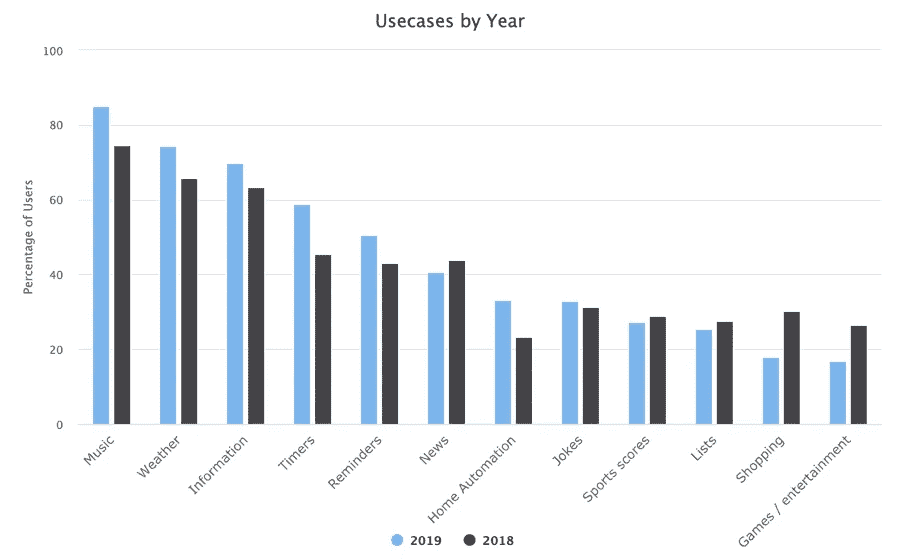

使用率显著下降的用例是购物、游戏和娱乐。购物从 30%下降到 18%，游戏和娱乐从 26%下降到不到 17%。

如果我们根据性别来看使用情况，最主要的特征是相当相似的。男性和女性最常见的用例是音乐、天气、一般信息、定时器和提醒。

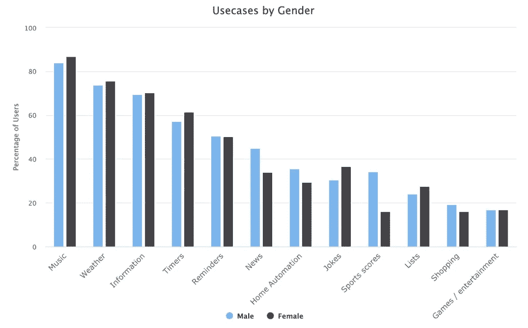

性别差异最大的是新闻和体育比分，其次是家庭自动化和笑话。近 45%的男性使用手机获取新闻信息，而女性只有 34%。大约 36%的男性使用该设备来获得运动成绩，而女性只有 16%。男性和女性在使用家庭自动化或笑话方面的差异接近约 6%——男性更可能使用家庭自动化，女性更可能要求笑话。

# 购物减少了

去年我们深入的一个领域是[通过设备](https://www.dashbot.io/2018/12/19/examining-consumer-purchasing-behavior-through-alexa-and-google-home/)进行购物。虽然我们对积极的信号感到兴奋，但这种行为似乎已经减少了。

与去年的 43%相比，今年只有 24%的受访者通过他们的设备进行了购买。原因可能多种多样——无论是用户体验、商业选择的数量、不同的受众群体，还是其他原因。

此前，同时拥有 Alexa 和 Google Home 的受访者更有可能进行购买，比例为 56%，而只有 Alexa 的受访者为 43%，只有 Google Home 的受访者为 40%。然而今年，这一比例大幅下降——只有 29%的受访者购买了这两款设备。

就性别而言，男性比女性更有可能进行购买。超过 28%的男性和 18%的女性曾经买过东西。这与去年有相当大的差距，去年有 58%的男性和 32%的女性进行了购买。

就受访者购买的商品而言，亚马逊或谷歌商店的商品远远超过 94%。食品订购位居第二，约占 27%。这与去年有很大不同，去年近 53%的受访者购买食品是为了送餐。甚至应用内购买也有所下降，只有不到 7%的受访者进行了购买，而去年这一比例为 15%。

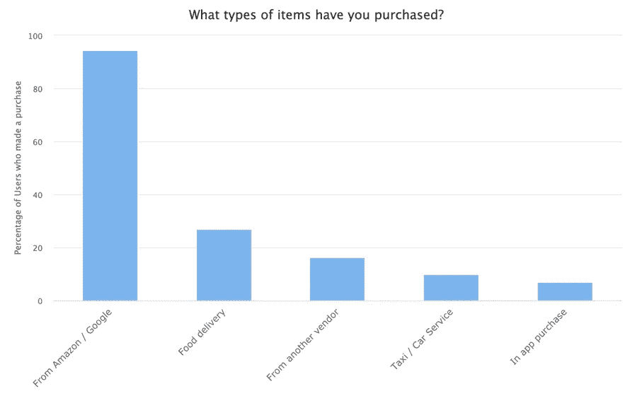

我们还研究了用户未来愿意购买的可能性。虽然受访者对未来购买的可能性持积极态度，但回答明显低于去年。总体而言，超过 43%的受访者可能会在未来购买，24%的受访者非常有可能购买，相比之下，只有 18%的受访者不太可能在未来购买。

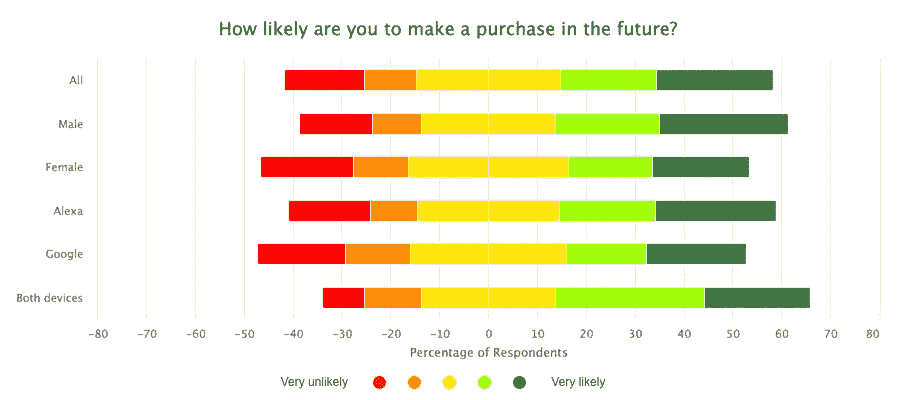

拥有 Alexa 和 Google Home 设备的男性和受访者继续更有可能在未来进行购买。大约 48%的男性和 37%的女性可能会在未来购买。同样，拥有两种设备的受访者中有 52%更有可能在未来购买，相比之下，只有 37%的人拥有 Google Home，44%的人只有 Alexa。

# 发现第三方语音应用仍然是一个挑战

如前所述，受访者主要将他们的设备用于核心原生功能。只有 13.5%的受访者将设备用于第三方技能。然而，那些使用手机的人倾向于频繁使用手机，40%的人一天使用多次，22%的人一天使用一次。

虽然受访者确实使用了第三方技能，但他们倾向于只使用少数技能。超过 54%的受访者仅使用一到三种第三方技能。只有 21%的人根本不使用。

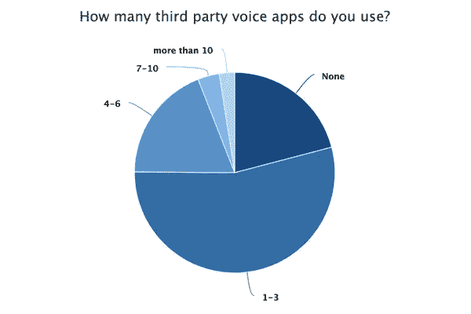

问题似乎是发现和用户获取。正如我们在[之前的报告](https://www.dashbot.io/2017/11/21/the-impact-of-alexa-and-google-home-on-consumer-behavior/)中提到的，一些用户甚至不知道第三方语音应用叫什么。

Alexa 和谷歌都采取了措施来增加发现，包括让开发者指定他们的语音应用程序可以处理的其他意图。Alexa 通过他们的[canfulfillintrequest](https://developer.amazon.com/docs/custom-skills/implement-canfulfillintentrequest-for-name-free-interaction.html)做到了这一点，谷歌通过他们的[隐式调用](https://developers.google.com/assistant/discovery/implicit)做到了这一点。如果用户向设备请求某些东西，而没有引用特定的语音应用程序，该平台可以使用这些信息来查看现有的语音应用程序是否可以处理该意图，并将用户指引到适当的应用程序。

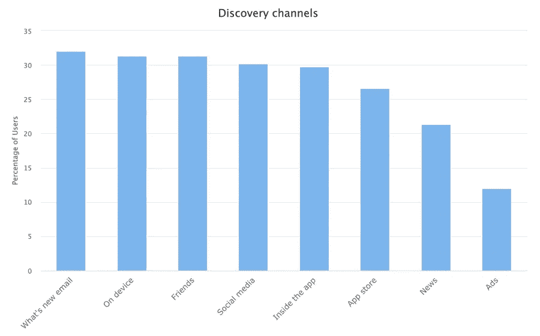

受访者发现语音应用的三个最常见渠道是底层平台。最常见的是 Alexa 和谷歌都发送的“最新消息”邮件，占 32%。受访者还会在手机本身和配套应用中发现新的语音应用，比例分别为 31%和 30%。

受访者继续通过朋友和社交媒体发现新的语音应用。

广告目前似乎没有那么有效，因为只有 12%的受访者通过这一渠道发现了新的语音应用。

# 你好，有人在听吗？

隐私和安全是业主最关心的问题。

我们询问了受访者对安全性和隐私的关注程度。超过 67%的受访者至少有点担心，其中 19%的人非常担心。只有 27%的受访者完全不关心。

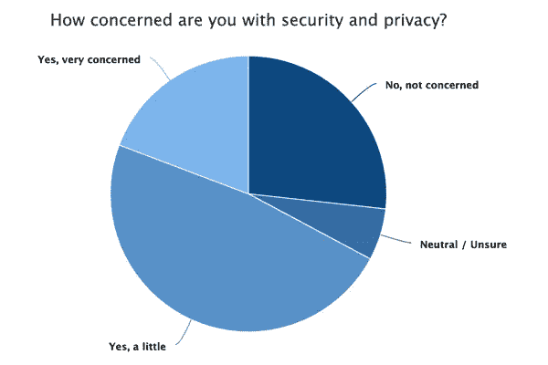

一天使用多次设备的受访者往往不太关心安全性和隐私。其中大约 30%的人根本不关心，只有 17%的人非常关心。同样，在浴室或卧室有设备的受访者也比所有受访者稍微不那么担心，其中 29%的人根本不担心。

# 用户满意度很高

用户继续对他们的设备非常满意。

我们询问了受访者对设备的理解能力、响应和整体体验的满意度。

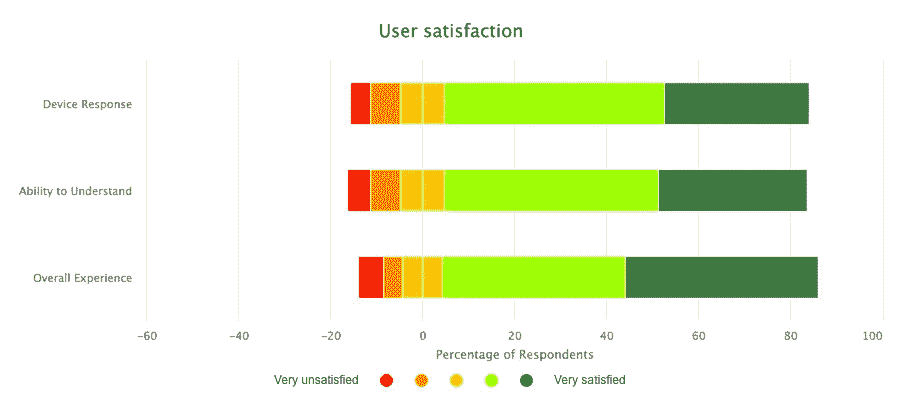

关于设备的理解能力，79%的受访者在一定程度上感到满意，32.5%非常满意。只有 11.5%的人不太满意或非常不满意。

同样，关于设备的响应，近 80%的受访者感到满意，31.7%非常满意。只有 11%的人不太满意或非常不满意。

总体而言，82%的受访者对该设备感到满意，42%非常满意。只有 9%的人不太满意或非常不满意。

当被要求在一到五颗星的范围内给这款设备打分时，受访者平均得分为 4.2 星。那些发现这些设备非常改变行为的受访者，甚至给它们打了更高的 4.7 星。

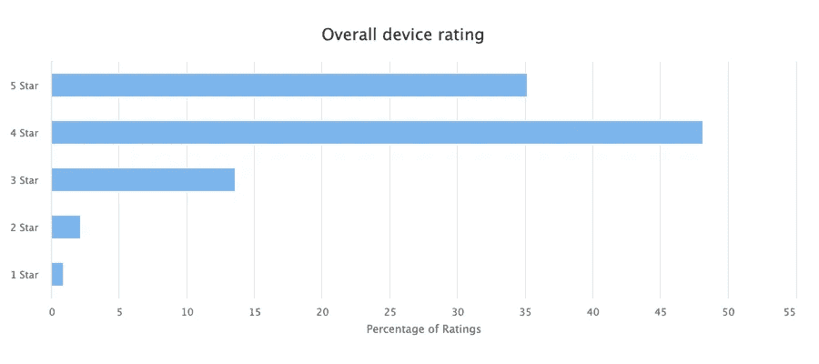

受访者也非常有可能向他们的朋友和家人推荐语音助理设备。当被问及从一到五的尺度来表示他们推荐该设备的可能性时，受访者的平均评分为 4.1。发现该设备非常改变行为的受访者也非常可能推荐该设备，平均评分为 4.8 分。即使那些没有发现该设备改变行为的受访者仍然可能推荐平均评分为 3.6 的设备。

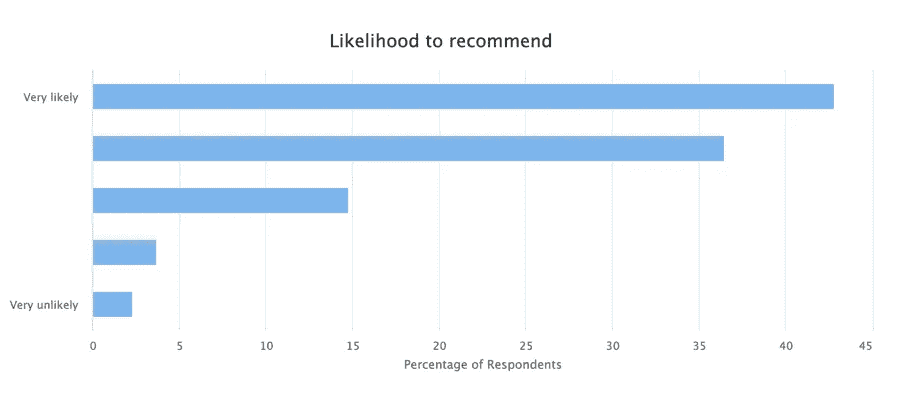

我们还询问受访者，这些设备是否让他们感到惊讶。总的来说，用户对这些设备的功能、智能性和准确性以及易用性印象深刻。

# 结论

用户继续对他们的 Alexa 和 Google Home 设备感到满意。使用频率持续上升。用户倾向于在家中拥有多种设备。用户仍然对该设备的理解和响应能力非常满意，并高度推荐它们。

虽然语音助手很热，但这个空间仍然很早。有机会改善用户获取和发现，以及增加品牌和开发商的盈利机会。

随着设备功能的不断改进和采用的增加，我们很高兴看到未来的发展。

# 关于 Dashbot

[Dashbot](https://www.amerritt.com/dashbot/) 是一个对话界面分析平台，使企业能够通过可操作的见解和工具提高参与度、满意度和转化率。

除了参与度和保留率等传统指标之外，我们还提供特定于 chatbot 的分析，包括 NLP 响应效率、情感分析、对话流和完整的聊天会话记录。

我们也有对数据采取行动的工具，比如我们的真人接管聊天会话，并推送重新参与的通知。

我们支持 Alexa、Google Home、网络聊天、短信、Facebook Messenger、Slack、Twitter、Bixby 和任何其他对话界面。

*原载于 2019 年 11 月 21 日*[*https://www . dash bot . io*](https://www.amerritt.com/dashbot/)*。*